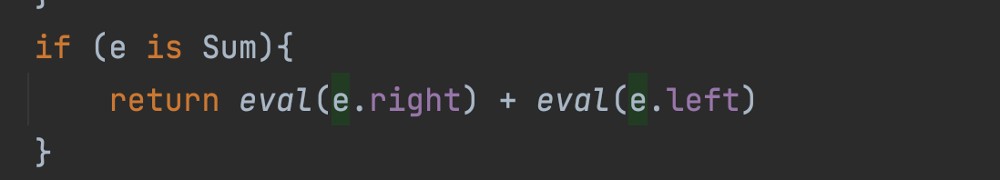

# 2. 코틀린 기초

# 2.1 기본 요소 : 함수와 변수

- 코틀린에서 타입 선언을 생략해도 된다는 사실을 확인
- 변경 가능한 데이터보다 변경할 수 없는 불변 데이터 사용을 장려하는 지 배운다

## 2.1.1 Hello, World!

```kotlin
fun main() {
    println("Hello, World!")
}
```

- 함수를 선언할때 `fun`키워드를 사용한다
- 파라미터 이름 뒤에 타입을 쓴다
- 함수를 최상위 수준에 정의할 수 있다. 자바와 달리 꼭 클래스 안에 함수를 넣어야 할 필요가 없다
- 배열도 일반적인 클래스, 코틀린에는 자바와 달리 배열처리를 위한 문법이 따로 없다
- 코틀린 표준 라이브러리는 자바 표준 라이브러리 함수를 간결하게 사용할 수 있게 감싼 래퍼를 제공한다.
    - System.out.println 대신에 println를 쓴다.
- 줄끝에 세미콜론(`;`)을 붙이지 않아도 된다

## 2.1.2 함수

- 함수 선언은 fun 키워드로 시작한다
- fun 다음에는 함수 이름이 온다
- 함수 이름 뒤에는 괄호 안에 파라미터 목록이 온다
- 반환 타입은 파라미터 목록 닫는 괄호 뒤에 콜론(`:`)을 적고 뒤에 적는다

```kotlin
fun max(a: Int, b: Int) : Int {
		return if (a > b) a else b
}
```

<aside>
📎 **문(statement)과 식(expression)의 구분**
코틀린에서 `if`는 식(expression)이다.  식은 값을 만들어 내며 다른 식의 하위 요소로 계산에 참여할 수 있는 반면, 문(statement)은 가장 안쪽 블록의 최상위 요소로 존재하며 아무런 값을 만들어내지 못한다.
자바는 모든 제어 구조가 문이며, 코틀린에서는 루프를 제외한 대부분의 제어 구조가 식이다.
반면에 대입문은 자바에서는 식이었으나 코틀린에서는 문이 됐다.

</aside>

### 식이 본문인 함수

위의 max 함수를 더 간결하게 만들수 있다.

```kotlin
fun max(a: Int, b: Int): Int = if (a > b) a else b
```

본문이 중괄호로 둘러싸인 함수를 **블록이 본문인 함수**라 부르고, 등호와 식으로 이뤄진 함수를 **식이 본문인 함수**라고 한다

<aside>
📎 **인텔리J 아이디어 팁**
두 방식의 함수를 서로 변환하는 메뉴가 있다.
****>> 식 본문으로 변환(Convert to expression body)
>> 블록 본문으로 변환(Convert to block body)

</aside>


https://user-images.githubusercontent.com/37198141/149966635-126c24e8-428d-4724-8a08-161ef3c813c0.mov


코틀린에서는 식이 본문인 함수가 자주 쓰인다.

- 단순한 산술식이나 함수 호출 식뿐 아니라 `if`, `when`, `try` 등의 더 복잡한 식도 자주 쓰인다.

반환 타입을 생략하면 max 함수를 더 간략하게 만들수 있다.

```kotlin
fun max(a: Int, b: Int) = if (a > b) a else b
```

**식이 본문인 함수의 반환 타입만 생략 가능하다는 점에 유의**

## 2.1.3 변수

- 코틀린에서는 키워드로 변수 선언을 시작하는 대신 변수 이름 뒤에 타입을 명시하거나 생략하게 허용한다
    
    ```kotlin
    val question = "Foo, Bar"
    val answer = 42
    
    // 원한다면 타입을 명시해도 된다.
    val answer : Int = 42
    
    // 부동소수점(floating point) 상수를 사용한다면 변수타입은 Double이 된다
    val yearToCompute = 7.5e6
    ```
    
- 초기화 식을 사용하지 않고 변수를 선언하려면 변수타입을 반드시 명시해야한다
    
    ```kotlin
    val answer : Int
    answer = 42
    ```
    

### 변경 가능한 변수와 변경 불가능한 변수

- `val` - value
    - 변경 불가능한(immutable) 참조를 저장하는 변수다
    - 초기화하고 나면 재대입이 불가능하다
    - 자바로 말하면 final 변수에 해당한다
- `var` - variable
    - 변경 가능한(mutable) 참조다.
    - 변수의 값은 바뀔 수 있다
    - 자바의 일반 변수에 해당한다
- **기본적으로는 모든 변수를 val 키워드를 사용해 불변 변수로 선언하고 나중에 꼭 필요할 때만 var로 변경을 권장한다**
- `val` 변수는 블록을 실행할 때 정확히 한 번만 초기화되야한다
    - 하지만, 어떤 블록이 실행될때 오직 한 초기화 문장만 실행됨을 컴파일러가 확인할 수 있다면 조건에 따라 val 값을 다른 여러 값으로 초기화 가능하다.
        
        ```kotlin
        val message: String
        
        if (canPerformOperation()) {
        		message = "Success"
        		// ... 연산을 수행
        }
        else {
        		message = "Failed"
        }
        ```
        
    - `val` 참조 자체는 불변이라도 그 참조가 가리키는 객체의 내부 값은 변경될 수 있다.
        
        ```kotlin
        // languages는 불변 변수이지만 그 참조가 가리키는 객체의 내부는 변경가능
        val languages = arrayListOf("Java")
        languages.add("Kotlin")
        ```
        
    - var 키워드를 사용하면 변수의 값을 변경할 수 있지만 변수의 타입은 고정된다
        
        ```kotlin
        // 아래의 코드는 컴파일 오류 발생
        var answer = 42
        answer = "no answer"
        ```
        
- 어떤 타입의 변수를 다른 타입의 값을 저장하고 싶다면?
    - 변환 함수를 써서 값을 변수의 타입으로 변환
    - 강제 형 변환(coerce)

## 2.1.4 더 쉽게 문자열 형식 지정: 문자열 템플릿

```kotlin
fun main(args: Array<String>){
    val name = if (args.isNotEmpty()) args[0] else "Kotlin"
    println("Hello, $name!")
}
```

- 문자열안에 변수를 사용할 수 있게 해주는 **문자열 템플릿 기능**을 지원한다.
- 변수앞에 `$`를 사용한다
- 자바보다 좀더 간결하며 효율적이다
- 컴파일러는 각 식을 정적으로 검사하기 때문에 존재하지 않는 변수를 사용하면 컴파일 오류가 발생한다
- $를 문자열에 넣고 싶으면 이스케이프 시켜야한다
    
    ```kotlin
    println("\$x") -> $x
    ```
    
- 복잡한 식도 중괄호(`{}`)로 둘러싸서 사용할 수 있다
    
    ```kotlin
    println("Hello, ${args[0]}!")
    ```
    

<aside>
📎 한글을 문자열 템플릿에서 사용할 경우 주의할 점
문자열 템플릿 안에 $로 변수를 지정할 때 변수명 바로 뒤에 한글을 붙여서 사용하면 코틀린 컴파일러는 영문자와 한글을 한꺼번에 식별자로 인식해서 unresolved reference 오류를 발생시킨다.
"$name님 반가워요" —> Error
"${name}님 반가워요" —> Ok

</aside>

- 중괄호로 둘러싼 식안에서 큰 따옴표를 사용할 수도 있다
    
    ```kotlin
    fun main(args: Array<String>){
        println("Hello, ${if (args.isNotEmpty()) args[0] else "someone"}!")
    }
    ```
    

# 2.2 클래스와 프로퍼티

```java
public class Person {
		private final String name;

		public Person(String name){
				this.name = name;
		}

		public String getName(){
				return name;
		}
}
```

위의 클래스를 코틀린 변환하면 다음과 같이 변환된다

```kotlin
class Person(val name: String)
```

- 코드가 없이 데이터만 저장하는 클래스를 값 객체(Value Object)라 부른다
- 코틀린은 기본 가시성은 `public`이므로 가시성 변경자를 생략해도 된다

## 2.2.1 프로퍼티

- 자바에서 필드와 접근자를 한데 묶어 프로퍼티(property)라고 부른다
- 코틀린은 프로퍼티를 언어 기본 기능으로 제공하며, 필드와 접근자 메서드를 완전히 대신한다
- 클래스에서 프로퍼티를 선언할 때는 `val`이나 `var`를 사용한다
    - `val` : 읽기 전용
    - `var` : 변경 가능

```kotlin
class Person(
		// 읽기전용 프로퍼티 : (비공개)필드, 필드를 읽는 단순한 (공개)Getter
		val name: String,
		// 변경가능 프로퍼티 : (비공개)필드, (공개)Getter, (공개)Setter
		var isMarried: Boolean
)
```

- 코틀린에서 프로퍼티를 선언하는 방식은 프로퍼티와 관련 있는 접근자를 선언하는 것이다

```java
// 자바에서 Person 클래스를 사용하는 방법
Person person = new Person("Bob", true);
System.out.println(person.getName());
>> Bob
System.out.println(person.isMarried());
>> true
```

```kotlin
// 코틀린에서 Person 클래스 사용하는 방법
val person = Person("Bob", true)
println(person.name)
>> Bob
println(person.isMarried)
>> true
```

```kotlin
// 자바및 코틀린에서 변경가능한 프로퍼티 사용방법
// Java
person.setMarried(false);
// Kotlin
person.isMarried = false
```

- 자바에서 선언한 클래스에 대해 코틀린 문법을 사용해도 된다
- 대부분의 프로퍼티에는 값을 저장하기 위한 필드가 있다.
- 뒷받침하는 필드(backing field)라고 부른다
- 커스텀 게터를 작성하면 프로퍼티 값을 그때그때 계산 할 수도 있다

## 2.2.2 커스텀 접근자

```kotlin
class Rectangle(val height:Int, val width:Int){
    val isSquare: Boolean
				// 프로퍼티 게터 선언
        get() {
            return height == width
        }
} 
```

클래스 `Rectangle`을 정의하면서 정사각형인지 판단하는 기능을 만들었다. `isSquare` 프로퍼티에는 자체 값을 저장하는 필드가 필요 없다. 자체구현을 제공하는 게터만 존재한다. 클라이언트가 프로퍼티에 접근할 때마다 게터가 프로퍼티 값을 매번 다시 계산한다.

블록을 본문으로 하는 복잡한 구문을 사용하지 않고 다음과 같이 사용해도 된다

```kotlin
class Rectangle(val height: Int, val width: Int){
    val isSquare: Boolean
        **get() = height == width**
}
```

## 2.2.3 코틀린 소스코드 구조: 디렉터리와 패키지

- 코틀린에서는 클래스 임포트와 함수 임포트에 차이가 없다
- 모든 선언을 `import` 키워드로 가져올 수 있다. 최상위 함수는 그 이름을 써서 임포트할 수 있다

```kotlin
package geometry.example

// 이름으로 함수 임포트하기
import geometry.shapes.createRandomRectangle

fun main(args: Array<String>){
		println(createRandomRectangle().isSquare)
}
```

- 패키지 이름 뒤에 .*을 추가하면 패키지 안의 모든 선언을 임포트 할 수 있다
- 코틀린에서는 여러 클래스를 한 파일에 넣을 수 있고, 파일의 이름도 마음대로 정할 수 있다.
- **하지만 대부분의 경우 자바와 같이 패키지별로 디렉터리를 구성하는 편이 좋다!**
    - 각 클래스를 정의하는 소스코드 크기가 아주 작을 경우에는 한 파일에 넣는것을 권장한다

# 2.3 선택 표현과 처리: enum과 when

- Java(`switch`) - Kotlin(`when`)

## 2.3.1 enum 클래스 정의

```kotlin
enum class Color {
    RED, ORANGE, YELLOW, GREEN, BLUE, INDIGO, VIOLET
}
```

- 코틀린에서 `enum`은 소프트 키워드(Soft keyword)라고 부른다.
    - enum은 class 앞에 있을 때는 특별한 의미를 지닌다
    - 다른곳에서는 이름에 사용할 수 있다.

```kotlin
enum class Color(
    val r: Int, val g: Int, val b: Int
) {
    RED(255, 0, 0),
    ORANGE(255,165,0),
    YELLOW(255,255,0),
    GREEN(0,255,0),
    BLUE(0,0,255),
    INDIGO(75, 0, 130),
    VIOLET(238,130, 238);

    fun rgb() = (r*256+g)*256+b
}
```

- enum에서도 생성자와 프로퍼티를 선언한다
- enum 클래스 안에 메소드를 정의하는 경우 반드시 세미콜론(`;`)을 넣어야한다

## 2.3.2 when으로 enum 클래스 다루기

- Java `switch`에 해당하는 코틀린의 구성 요소
- 값을 만들어내는 식(expression)
    
    ```java
    fun getMnomonic(color : Color) =
        when(color){
            Color.RED -> "Richard"
            Color.ORANGE -> "Of"
            Color.YELLOW -> "York"
            Color.GREEN -> "Gave"
            Color.BLUE -> "Battle"
            Color.INDIGO -> "In"
            Color.VIOLET -> "Vain"
        }
    ```
    
- `break`를 넣지 않아도 된다
- 한 분기안에서 여러 값을 매치 패턴으로 사용할 수도 있다(콤마 `,` 사용)
    
    ```java
    fun getWarmth(color: Color) = when(color){
        Color.RED, Color.ORANGE, Color.YELLOW -> "warm"
        Color.GREEN -> "neutral"
        Color.BLUE, Color.INDIGO,Color.VIOLET->"cold"
    }
    ```
    
- enum 상수값을 임포트해서 enum 클래스 수식자 없이 enum 사용하기
    
    ```java
    import com.example.kotlin_in_action.chapter1.code.Color.*
    
    fun getWarmth(color: Color) = when(color){
        RED, ORANGE, YELLOW -> "warm"
        GREEN -> "neutral"
        BLUE, INDIGO,VIOLET->"cold"
    }
    ```
    

## 2.3.3 when과 임의의 객체를 함께 사용

- 분기 조건에 상수(enum 상수나 숫자 리터럴)만 사용할수 있는 자바와 다르게 **코틀린 when 분기조건은 임의의 객체를 허용한다**
    
    ```java
    fun mix(c1:Color, c2:Color) =
        when (setOf(c1, c2)){
            setOf(RED, YELLOW) -> ORANGE
            setOf(YELLOW, BLUE) -> GREEN
            setOf(BLUE, VIOLET) -> INDIGO
            else -> throw Exception("Dirty Color")
        }
    
    >>> println(mix(BLUE, YELLOW))
    GREEN
    ```
    

## 2.3.4 인자 없는 when 사용

- 위의 mix 함수는 자주 호출되면 Set 객체를 자주 만들기 때문에 비효율적이다
- 인자가 없는 when 식을 사용하면 불필요한 객체 생성을 막을 수 있다
    - 코드는 약간 읽기 어려워지지만 성능을 더 향상시키기 위해 그정도 비용을 감수해야하는 경우도 자주 있다
    
    ```java
    fun mixOptimized(c1:Color, c2:Color) =
      when {
          (c1 == RED && c2 == YELLOW) || (c1 == YELLOW && c2 == RED) -> ORANGE
          (c1 == BLUE && c2 == YELLOW) || (c1 == YELLOW && c2 == BLUE) -> GREEN
          (c1 == BLUE && c2 == VIOLET) || (c1 == VIOLET && c2 == BLUE) -> INDIGO
          else -> throw Exception("Dirty Color")
      }
    ```
    
- 추가 객체를 만들지 않는다는 장점이 있지만 가독성은 더 떨어진다.

## 2.3.5 스마트 캐스트 : 타입 검사와 타입 캐스트를 조합

- 예제 : `(1 + 2) + 4` 산술식을 계산하는 함수

```java
interface Expr
class Num(val value : Int):Expr
class Sum(val left:Expr, val right:Expr):Expr
```

- 위의 산술식을 저장하면 Sum(Sum(Num(1), Num(2)),Num(4)) 구조의 객체가 생긴다
- Expr 인터페이스에는 두 가지 구현 클래스가 존재한다
- 식을 평가하기 위해서는 두가지 경우를 고려해야한다
    - 어떤 식이 수라면 그 값을 반환한다
    - 어떤 식이 합계라면 좌항과 우항의 값을 계산한 다음에 그 두 값을 합한 값을 반환한다
- 자바 스타일 함수
    
    ```kotlin
    fun eval(e: Expr): Int{
        if (e is Num){
            val n = e as Num 
            return n.value
        }
        if (e is Sum){
            return eval(e.right) + eval(e.left)
        }
        throw IllegalArgumentException("Unknown expression")
    }
    
    >>> println(eval(Sum(Sum(Num(1), Num(2)), Num(4))))
    7
    ```
    
- 코틀린에서는 프로그래머 대신 컴파일러가 캐스팅을 해준다.
- 어떤 변수가 원하는 타입인지 일단 `is`로 검사하고 나면 굳이 변수를 원하는 타입으로 캐스팅 하지 않아도 마치 처음부터 그 변수가 원하는 타입으로 선언된것처럼 사용할 수 있다
- 하지만 실제로는 컴파일러가 캐스팅을 수행해준다 → 이를 스마스 캐스트(`smart cast`)라고 부른다
    
    
    
    IDE는 배경색으로 스마트 캐스트를 표시해 준다
    
- 스마트 캐스트는 `is`로 변수에 든 값의 타입을 검사한 다음에 그 값이 바뀔 수 없는 경우에만 작동한다
    - 프로퍼티는 반드시 `val` 이어야 하며 커스텀 접근자를 사용한 것이어도 안된다.
- 원하는 타입으로 명시적으로 타입 캐스팅에는 `as` 사용
    
    ```java
    val n = e as Num
    ```
    

## 2.3.6 리팩토링: if를 when으로 변경

```kotlin
fun eval(e : Expr): Int =
    if(e is Num){
        e.value
    } else if (e is Sum){
        eval(e.right) + eval(e.left)
    } else {
        throw IllegalArgumentException("Unknown expression")
    }
```

`when`을 사용해 더 다듬어 보자

```kotlin
fun eval(e : Expr): Int =
    when (e){
        is Num -> e.value
        is Sum -> eval(e.right) + eval(e.left)
        else -> throw IllegalArgumentException("Unknown expression")
    }
```

## 2.3.7 if와 when의 분기에서 블록 사용

- `if`나 `when` 모두 분기에 블록을 사용할 수 있다.
- 블록의 마지막 문장이 블록 전체의 결과가 된다.
    
    ```kotlin
    fun evalWithLogging(e: Expr): Int =
        when (e){
            is Num -> {
                println("num : ${e.value}")
                e.value
            }
            is Sum -> {
                val left = evalWithLogging(e.left)
                val right = evalWithLogging(e.right)
                println("sum: $left + $right")
                left + right
            }
            else -> throw IllegalArgumentException("Unknown expression")
        }
    
    >>> println(evalWithLogging(Sum(Sum(Num(1), Num(2)), Num(4))))
    num : 1
    num : 2
    sum: 1 + 2
    num : 4
    sum: 3 + 4
    7
    ```
    

# 2.4 대상을 이터레이션: while과 for 루프

- 코틀린 특성중 자바와 가장 비슷한것이 이터레이션이다

## 2.4.1 while 루프

- 코틀린에는 `while`과 `do-while` 루프가 있다
    
    ```kotlin
    // 조건이 참인 동안 본문을 반복 실행한다
    while (조건) {
    	/*...*/
    }
    
    // 맨 처음에 무조건 본문을 한 번 실행한 다음,
    // 조건이 참인 동안 본문을 반복 실행한다
    do {
    	/*...*/
    } while(조건)
    ```
    

## 2.4.2 수에 대한 이터레이션: 범위와 수열

- 초깃값, 증가값, 최종값을 사용한 루프를 대신하기 위해 코틀린에서는 범위(`range`)를 사용한다.
- 범위는 두 값으로 이뤄진 구간이다
- `..` 연산자로 시작 값과 끝 값을 연결해서 범위를 만든다
    
    ```kotlin
    val oneToTen = 1..10
    ```
    
- 코틀린의 범위는 폐구간(닫힌 구간) 또는 양끝을 포함하는 구간이다
    - 이는 두 번째 값(위의 예제에서는 10)이 항상 범위에 포함된다는 뜻이다.
- 어떤 범위에 속한 값을 일정한 순서로 이터레이션하는 경우를 **수열(progression)**라고 부른다
    
    ```kotlin
    fun fizzBuzz(i: Int) = when{
        i % 15 == 0 -> "FizzBuzz "
        i % 3 == 0 -> "Fizz "
        i % 5 == 0 -> "Buzz "
        else -> "$i "
    }
    
    for (i in 1..100){
    		print(fizzBuzz(i))
    }
    ```
    
    ```kotlin
    for (i in 100 downTo 1 step 2){
        print(fizzBuzz(i))
    }
    ```
    
- 끝 값을 포함하지 않는 닫힌 범위에 대해 이터레이션은 `until` 함수를 사용한다
    
    ```kotlin
    (x in 0 until size)은 (x in 0..size-1)과 같다
    ```
    

## 2.4.3 맵에 대한 이터레이션

```kotlin
val binaryReps = TreeMap<Char, String>()

for (c in 'A'..'F'){
    val binary = Integer.toBinaryString(c.code)
    binaryReps[c] = binary
}

for ((letter, binary) in binaryReps) {
    println("$letter = $binary")
}

A = 1000001
B = 1000010
C = 1000011
D = 1000100
E = 1000101
F = 1000110
```

- 맵에 사용했던 구조분해 구문을 맵이 아닌 컬렉션에도 활용할수 있다
    
    ```kotlin
    val list = arrayListOf("10", "11", "1001")
    // 인덱스와 함께 컬렉션을 이터레이션 한다
    for ((index, element) in list.withIndex()){
        println("$index = $element")
    }
    
    0 = 10
    1 = 11
    2 = 1001
    ```
    

## 2.4.4 in으로 컬렉션이나 범위의 원소 검사

- `in` 연산자를 사용해 어떤 값이 범위에 속하는지 검사할 수 있다
- `!in`을 사용하면 어떤값이 범위에 속하지 않는지 검사할 수 있다
    
    ```kotlin
    fun isLetter(c: Char) = c in 'a'..'z' || c in 'A'..'Z'
    fun isNotDigit(c: Char) = c !in '0'..'9'
    ```
    
- 비교 로직은 표준 라이브러리 범위 클래스 구현 안에 깔끔하게 감춰져 있다
- when 식에서 사용해도 된다
    
    ```kotlin
    fun recognize(c: Char) = when(c){
        in '0'..'9' -> "It's a digit!"
        in 'a'..'z', in 'A'..'Z' -> "It's a letter!"
        else -> "I don't know"
    }
    ```
    
- 범위는 문자에만 국한되지 않고 비교가 가능한 클래스라면(`java.lang.Comparable` 인터페이스를 구현한 클래스라면) 그 클래스의 인스턴스 객체를 사용해 범위를 만들 수 있다.
    
    ```kotlin
    // String에 있는 Comparable 구현이 두 문자열을 알파벳 순서로 비교하기 때문에 
    // in 검사에서도 문자열을 알파벳 순서로 비교한다
    >>> println("Kotlin" in "Java".."Scala")
    true
    ```
    
- 컬렉션에도 마찬가지로 in 연산을 사용할 수 있다
    
    ```kotlin
    // 이 집합에는 "Kotlin"이 들어있지 않다
    >>> println("Kotlin" in setOf("Java", "Scala"))
    false
    ```
    

# 2.5 코틀린 예외처리

- 기본 예외 처리 구문은 자바와 비슷하다

```kotlin
val percentage = 101
  
if (percentage !in 0..100){
    throw IllegalArgumentException(
        "A percentage value must be between 0 and 100: $percentage"
    )
}
```

- 자바와 달리 코틀린의 `throw`는 식이므로 다른 식에 포함될 수 있다.

```kotlin
val number = 101    
    
val percentage = 
	if (number in 0..100)
		number
	else
      throw IllegalArgumentException(
          "A percentage value must be between 0 and 100: $number"
      )
```

## 2.5.1 try, catch, finally

- 예외처리를 하려면 try, catch, finally를 함께 사용한다

```kotlin
fun readNumber(reader: BufferedReader) : Int?{
    try{
        val line = reader.readLine()
        return Integer.parseInt(line)
    }
    catch (e: NumberFormatException) {
        return null
    }
    finally {
        reader.close()
    }
}

val reader = BufferedReader(StringReader("239"))
println(readNumber(reader))
>>> 239
```

## 2.5.2 try를 식으로 사용

```kotlin
fun readNumber(reader: BufferedReader) {
    val number = try {
				// 이 식의 값이 "try"식의 값이 된다
        Integer.parseInt(reader.readLine())
    } catch (e:NumberFormatException){
        return
    }
    println(number)
}

val reader = BufferedReader(StringReader("a not number"))
readNumber(reader)
>>> // 아무것도 출력되지 않는다
```

- catch 블록 안에서 return을 사용하기 때문에 예외가 발생한 경우 catch 블록 다음의 코드는 실행되지 않는다. 계속 진행하고 싶다면 catch 블록도 값으로 만들어야한다.

```kotlin
fun readNumber(reader: BufferedReader) {
    val number = try {
				// 예외가 발생하지 않으면 이 값을 사용한다
        Integer.parseInt(reader.readLine())
    } catch (e:NumberFormatException){
				// 예외가 발생하면 null 값을 사용한다
        null
    }
    println(number)
}

val reader = BufferedReader(StringReader("a not number"))
readNumber(reader)
>>> null
```

# 2.6 요약

- 함수 정의할때는 `fun` 키워드를 사용한다. `val`는 읽기전용 변수이며 `var`는 변경 가능한 변수를 선언할때 사용한다
- 문자열 템플릿을 사용하면 코드가 간결해진다.
    - 변수 이름 앞에 `$`를 붙이거나, 식을 `${식}`같이 둘러싸면 변수나 식의 값을 문자열에 넣을 수 있다
- 값 객체 클래스를 아주 간결하게 표현할 수 있다
- `if`는 코틀린에서 식이며 , 값을 만들어낸다.
- 코틀린의 `when`은 자바와 `switch`와 비슷하지만 더 강력하다
- 어떤 변수의 타입을 검사하고 나면 컴파일러가 스마트 캐스트를 활용하여 검사한 타입의 변수처럼 사용할 수 있다.
- for, while, do-while 루프는 자바가 제공하는 같은 키워드의 기능과 비슷하다. 하지만 코틀린의 for는 맵을 이터레이션하거나 이터레이션하면서 컬렉션의 원소와 인덱스를 함께 사용해야 하는 경우 코틀린 for가 더 편리하다.
- 1..5와 같이 범위를 만들어낸다
    - 어떤 값이 범위 안에 포함되어있는지는 `in`이나 `!in`을 사용한다
- 예외처리는 자바와 비슷하다. 다만 코틀린에서는 함수가 던질 수 있는 예외를 선언하지 않아도 된다.
