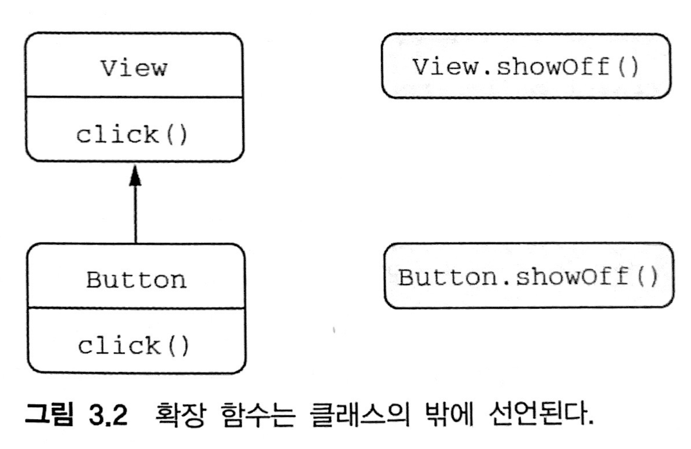
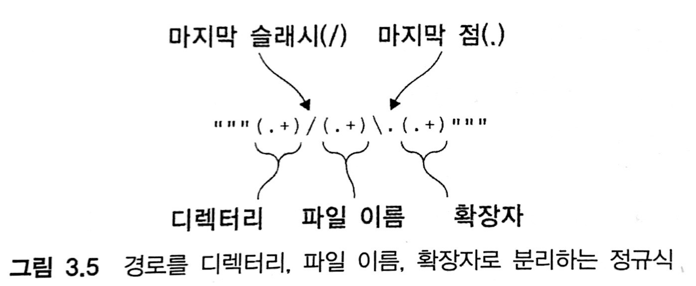

# 3. 함수 정의와 호출

> - 컬렉션, 문자열 정규식을 다루기 위한 함수
- 이름 붙인 인자, 디폴트 파라미터 값, 중위 호출 문법 사용
- 확장 함수와 확장 프로퍼티를 사용해 자바 라이브러리 적용
- 최상위 및 로컬 함수와 프로퍼티를 사용해 코드 구조화
> 

**목차**

# 3.1 코틀린에서 컬렉션 만들기

```kotlin
val set = hashSetOf(1, 7, 53)

val list = arrayListOf(1, 7, 53)

val map = hashMapOf(1 to "one", 7 to "seven", 53 to "fifty-hree")
// to가 언어가 제공하는 특별한 키워드가 아니라 일반 함수라는 점에 유의
```

```kotlin
// javaClass는 자바 getClass()에 해당하는 코틀린 코드다
println(set.javaClass)
println(list.javaClass)
println(map.javaClass)

>>>
class java.util.HashSet
class java.util.ArrayList
class java.util.HashMap
```

- 코틀린은 자바의 컬렉션과 똑같은 클래스이다
- 하지만 자바보다 더 많은 기능을 사용할 수 있다

```kotlin
val strings = listOf("frist", "second", "fourteenth")
println(strings.last())
>>>
fourteenth

val numbers = setOf(1, 14, 2)
println(numbers.maxOrNull())
>>>
14
```

# 3.2 함수를 호출하기 쉽게 만들기

- 자바 컬렉션에는 디폴트 toString 구현이 들어있다.
    - 디폴트 출력 형식은 고정되어 있고 우리에게 필요한 형식이 아닐 수도 있다

```kotlin
val list = listOf(1, 2, 3)
println(list)

>>> [1, 2, 3]
```

- 디폴트 구현을 다르게 변경하려면 코틀린 표준 라이브러리를 사용한다

```kotlin
fun <T> joinToString(
        collection: Collection<T>,
        separator : String,
        prefix: String,
        postfix : String
):String{
    val result = StringBuilder(prefix),
    for ((index, element) in collection.withIndex()){
        if (index > 0) result.append(separator)
        result.append(element)
    }
    
    result.append(postfix)
    return result.toString()
}

>>> val list = listOf(1, 2, 3)
>>> println(joinToString(list, "; ", "(", ")"))
(1; 2; 3;)
```

**위의 함수를 호출하는 문장을 덜 번잡하게 만들수 있는 방법은 없을까?**

## 3.2.1 이름 붙인 인자

파라미터의 이름을 명시하여 넣어줄 수 있다

```kotlin
joinToString(collection, separator=" ", prefix = " ", postfix = ".")
```

호출 시 인자 중 어느 하나라도 이름을 명시하고 나면 혼동을 막기 위해 모든 인자의 이름을 명시해야한다

## 3.2.2 디폴트 파라미터 값

- 함수 선언에서 파라미터의 디폴트 값을 지정할 수 있다

```kotlin
fun <T> joinToString(
        collection: Collection<T>,
        separator : String = ", ",
        prefix: String = "",
        postfix : String = ""
)
...
```

## 3.2.3 정적인 유틸리티 클래스 없애기: 최상위 함수와 파라미터

- 자바에서는 모든 코드를 클래스의 메소드로 작성해야 한다
- 코틀린에서는 함수를 직접 소스 파일의 최상위 수준, 모든 다른 클래스의 밖에 위치시키면 된다

```kotlin
package strings

fun joinToString(...):String {...}
```

```java
/* 자바 */
package strings;
public class JoinKt{
	public static String joinToString(...) {...}
}
```

**파일에 대응하는 클래스의 이름 변경하기**

```kotlin
// 코틀린 최상위 함수가 포함되는 클래스의 이름을 바꾸고 싶다면 파일에 @JvmName 어노테이션을 추가한다.
// @JvmName 어노테이션은 파일의 맨 앞, 패키지 이름 선언 이전에 위치해야한다
@file:JvmName("StringFuntions")

package strings
fun joinToString(...):{...}

/* 자바 */
import strings.StringFunctions;
StringFunctions.joinToString(list, ", ", "", "");
```

### 최상위 프로퍼티

- 프로퍼티도 파일의 최상위 수준에 놓을 수 있다.
- 최상위 프로퍼티를 활용해 코드에 상수를 추가할 수 있다

```kotlin
val UNIX_LINE_SEPARATOR = "\n"
```

- 기본적으로 최상위 프로퍼티도 다른 모든 프로퍼티처럼 접근자 메소드를 통해 자바 코드에 노출된다
    - `val`의 경우 `Getter`, `var`의 경우 `Getter`, `Setter`가 생긴다
- 겉으론 상수처럼 보이는데 실제로는 게터를 사용해야 한다면 자연스럽지 못하다
- `const` 변경자를 추가하면 프로퍼티를 public static final 필드로 컴파일하게 만들 수 있다
    - 단, 원시 타입과 `String` 타입의 프로퍼티만 `const`로 지정할 수 있다

```kotlin
const val UNIX_LINE_SEPARATOR = "\n"

/* 자바 */
public static final String UNIX_LINE_SEPARATOR = "\n"
```

# 3.3 메소드를 다른 클래스에 추가: 확장 함수와 확장 프로퍼티

- 확장함수는 어떤 클래스의 멤버 메소드인 것처럼 호출할 수 있지만 그 클래스의 밖에 선언된 함수다.

```kotlin
package strings

fun String.lastChar() : Char = this.get(this.length-1)

>>> "abcde".lastChar()
>>> e
```

- 추가하려는 함수 이름 앞에 그 함수가 확장할 클래스의 이름을 덧붙이면 된다
- 클래스 이름을 **수신 객체 타입(String)**, 확장함수가 호출되는 대상이 되는값(객체)을 **수신 객체(this)**라고 한다
- 확장 함수 본문에도 this를 쓸수 있으며 생략할 수 있다

```kotlin
fun String.lastChar() : Char = get(length-1)
```

- **확장 함수 안에서는 클래스 내부에서만 사용할 수 있는 private 멤버나 protected 멤버를 사용할 수 없다**

## 3.3.1 임포트와 확장 함수

- 확장 함수를 사용하기 위해서는  다른 클래스나 함수와 마찬가지로 **임포트** 해야한다

```kotlin
import strings.lastChar
val c = "kotlin".lastChar()

// 물론 *을 사용한 임포트도 잘 작동한다
import strings.*
val c = "kotlin".lastChar()

// as 키워드를 사용하면 다른 이름으로 부를 수 있다
import strings.lastChar as last
val c = "kotlin".last()
```

- 한 파일 안에서 여러 패키지에 속해있는 이름이 같은 함수는 as를 사용하여 이름을 바꾸면 충돌을 막을 수 있다
- 일반적인 클래스나 함수라면 전체이름(FQN, Full Qualified Name)을 써도 된다

## 3.3.2 자바에서 확장 함수 호출

- 확장 함수가 들어있는 자바 클래스 이름도 확장 함수가 들어있는 파일 이름에 따라 결정된다

```kotlin
/* 자바 */
char c = StringUtilKt.lastChar("Java");
```

## 3.3.3 확장 함수로 유틸리티 함수 정의

```kotlin
fun <T> Collection<T>.joinToString(
    separator : String = ", ",
    prefix: String = "",
    postfix : String = ""
) : String{
    val result = StringBuilder(prefix)

    for ((index, element) in this.withIndex()){
        if (index > 0) result.append(separator)
        result.append(element)
    }

    result.append(postfix)
    return result.toString()
}
```

- 클래스가 아닌 더 구체적인 타입을 수신 객체로 지정 할수 도 있다.

```kotlin
fun Collection<String>.join(
		separator : String = ", ",
    prefix: String = "",
    postfix : String = ""
) = joinToString(separator, prefix, postfix)
```

## 3.3.4 확장 함수는 오버라이드할 수 없다

- 코틀린의 메소드 오버라이드도 일반적인 객체지향의 메소드 오버라이드와 마찬가지지만, 확장 함수의 오버라이드는 할 수 없다.
- 확장 함수는 클래스의 일부가 아니며, 클래스 밖에 선언된다.
- 이름과 파라미터가 완전히 같은 확장 함수를 기반 클래스와 하위 클래스에 대해 정의해도 실제로는 확장 함수를 호출할 때 수신 객체로 지정한 변수의 정적 타입에 의해 어떤 확장 함수가 호출될지 결정되는 것이지, 그 변수에 저장된 객체의 동적인 타입에 의해 확장 함수가 결정되는 것이 아니다.

```kotlin
open class View {
    open fun click() = println("View clicked")
}

// Button은 View를 확장한다
class Button : View(){
    override fun click() = println("Button clicked")
}

val view:View = Button()
view.click()  // "view"에 저장된 값의 실제 타입에 따라 호출할 메소드가 결정된다
>>> Button clicked
```



```kotlin
// 확장 함수 정의
fun View.showOff() = println("I'm a view!")
fun Button.showOff() = println("I'm a button!")

val view: View = Button()
view.showOff() // 확장 함수는 정적으로 결정된다. 
>>> I'm a view!
```

- 확장 함수를 첫 번째 인자가 수신 객체인 정적 자바 메소드로 컴파일한다는 사실을 기억한다면 이런 동작을 쉽게 이해 할 수 있다

```kotlin
/* 자바 */
>>> View view = new Button()
>>> ExtensionsKt.showOff(view);  // showOff 함수를 extensions.kt 파일에서 정의
I'm a view!
```

- 코틀린은 호출될 확장 함수를 정적으로 결정하기 때문에 오버라이드 할 수 없다

## 3.3.5 확장 프로퍼티

- 확장 프로퍼티를 사용하면 기존 클래스 객체에 대한 프로퍼티 형식의 구문으로 사용할 수 있는 API를 추가할 수 있다.
- 실제로 확장 프로퍼티는 아무 상태도 가질 수 없다.

```kotlin
val String.lastChar: Char
	get() = get(length-1)
```

- **[뒷받침하는 필드](https://www.notion.so/2-fe81d12e51574f03934ad6bd2656af50)**가 없어서 최소한 게터는 꼭 정의를 해야한다.
- 초기화코드에서 계산한 값을 담을 장소가 전혀 없으므로 초기화 코드도 쓸 수 없다

```kotlin
// StringBuilder에 같은 프로퍼티를 정의한다면 StringBuilder의 맨 마지막 문자는 변경 가능하므로
// 프로퍼티를 var로 만들 수 있다

var StringBuilder.lastChar: Char
		// 프로퍼티 게터
    get() = get(length-1)
		// 프로퍼티 세터
    set(value: Char){
        this.setCharAt(length-1, value)
    }

val sb = StringBuilder("Kotlin")
println(sb.lastChar)

sb.lastChar = 'k'
println(sb)

>>> n
>>> Kotlik 
```

# 3.4 컬렉션 처리 : 가변 길이 인자, 중위 함수 호출, 라이브러리 지원

- `vararg` 키워드를 사용하면 가변 길이 인자를 받는 파라미터를 만들 수 있다
- 중위(`infix`)함수 호출 구문을 사용하면 인자가 하나 뿐인 메소드를 간편하게 호출할 수 있다
- 구조 분해 선언(destructuring declaration)을 사용하면 복합적인 값을 분해해서 여러 변수에 나눠 담을 수 있다

## 3.4.1 자바 컬렉션 API 확장

- 코틀린 컬렉션에 있는 확장된 API들은 모두 확장 함수다.
- 코틀린 표준 라이브러리는 수많은 확장함수를 포함하고 있다
- IDE가 표시해주는 자동완성을 보고 무엇인지 궁금할 때마다 확인해 보라

## 3.4.2 가변 인자 함수: 인자의 개수가 달라질 수 있는 함수정의

- 원하는 만큼의 파라미터를 전달할 수 있다.
- 코틀린은 파라미터 앞에 `vararg` 변경자를 붙인다
    - 자바는 타입뒤에 `...`을 붙인다
- 자바에서는 배열을 그냥 넘기면 되지만 코틀린에서는 배열을 명시적으로 풀어서 배열의 각 원소가 인자로 전달되게 해야한다
    - 스프레드(spread) 연산자가 그런 작업을 해준다
    - 배열 앞에 *를 붙이기만 하면된다
    
    ```kotlin
    fun main(args: Array<String>){
    		// 스프레드 연산자가 배열의 내용을 펼쳐준다
    		val list = listOf("args: ", *args)
    		println(list)
    }
    ```
    

## 3.4.3 값의 쌍 다루기: 중위 호출과 구조 분해 선언

- 맵을 만들려면 mapOf 함수를 사용한다

```kotlin
val map = mapOf(1 to "one", 7 to "seven", 53 to "fifty-three")
```

- `to`라는 단어는 코틀린 키워드가 아니며 **중위 호출**(`infix call`)이라는 특별한 방식으로 to라는 일반 메서드를 호출한 것이다
- 중위 호출 시에는 수신 객체와 유일한 메소드 인자 사이에 메소드 이름을 넣는다
    - 이때 객체, 메소드 이름, 유일한 인자 사이에는 공백이 들어가야 한다

```kotlin
// to메소드를 일반적인 방식으로 호출함
1.to("one")
// to 메소드를 중위 호출 방식으로 호출함
1 to "one"
```

- *인자가 하나뿐인 일반 메소드*나 *일자가 하나뿐인 확장 함수*에 중위 호출을 사용할 수 있다
- `infix` 변경자를 함수 선언 앞에 추가해야한다

```kotlin
infix fun Any.to(other: Any) = Pair(this, other)

// Pair는 코틀린 표준 라이브러리 클래스로, 두 원소로 이뤄진 순서쌍을 표현한다
```

- Pair의 내용으로 두 변수를 즉시 초기화할 수 있다

```kotlin
val (number, nmae) = 1 to "one"
```

- 이런 기능을 구조 분해 선언이라고 한다
- 루프에서도 구조 분해 선언을 활용할 수 있다

```kotlin
for ((index, element) in collection.withIndex()){
		println("$index: $element")
}
```

# 3.5 문자열과 정규식 다루기

- 코틀린 문자열과 자바 문자열은 같다
- 코틀린은 다양한 확장 함수를 제공함으로써 표준 자바 문자열을 더 다루기 쉽게 해준다

## 3.5.1 문자열 나누기

- 코틀린에서는 자바의 `split`대신에 여러 가지 다른 조합의 파라미터를 받는 `split 확장함수`를 제공한다

```kotlin
// 정규식을 명시적으로 만든다
println("12.345-6.A".split("\\.|-".toRegex()))
>>>
[12, 345, 6, A]

// 간단한 경우는 split 확장함수중 하나를 쓰면된다
println("12.345-6.A".split(".","-"))
```

## 3.5.2 정규식과 3중 따옴표로 묶은 문자열

1. 첫번째 구현은 String을 확장한 함수를 사용한다
2. 두번째 구현은 정규식을 사용한다

**String 확장 함수를 사용해 경로 파싱하기**

```kotlin
fun parsePath(path: String){
    val directory = path.substringBeforeLast("/")
    val fullName = path.substringAfter("/")
    val fileName = fullName.substringBeforeLast(".")
    val extension = fullName.substringAfterLast(".")

    println("Dir: $directory, name: $fileName, ext: $extension")
}

val path = "/Users/yole/kotlin-book/chapter.adoc"
parsePath(path)

>>>
Dir: /Users/yole/kotlin-book, name: Users/yole/kotlin-book/chapter, ext: adoc
```

- 정규식을 사용하지 않고도 문자열을 쉽게 파싱할 수 있다.
- 정규식이 필요할때는 코틀린 라이브러리를 사용하면 더 편하다

**경로 파싱에 정규식 사용하기**

```kotlin
fun parsePathRegex(path: String){
    val regex = """(.+)/(.+)\.(.+)""".toRegex()
    val matchResult = regex.matchEntire(path)
    if (matchResult != null){
        val (directory, filename, extension) = matchResult.destructured
        println("Dir: $directory, name: $filename, ext: $extension")
    }
}
```

- 3중 따옴표 문자열에서는 역슬래쉬를 포함한 어떤 문자도 이스케이프할 필요가 없다



## 3.5.3 여러 줄 3중 따옴표 문자열

- 줄 바꿈을 표현하는 아무 문자열이나 그대로 들어간다

```kotlin
val kotlinLogo = """| //
		   .|//
		   .|/\"""

println(kotlinLogo.trimMargin("."))
```

- 파일경로를 3중 따옴표 문자열로 쓸수도 있다

```kotlin
"C:\\Users\\Yole\\kotlin-book"
은
"""C:\Users\Yole\kotlin-book"""
로 표현할 수 있다
```

- 3중 문자열 안에 문자`$`를 넣어야한다면 `'$'`로 넣어야한다

```kotlin
val price = """${'$'}99.9""" 
```

# 3.6 코드 다듬기: 로컬 함수와 확장

- 좋은 코드의 중요한 특징 중 하나가 중복이 없는 것이지만, 코드를 작성하다보면 DRY(Don't Repeat Yourself)원칙을 피하기가 쉽지 않다.
- 코틀린에서는 함수에서 추출한 함수를 원 함수 내부에 중첩시킬 수 있다.

```kotlin
class User(
    val id: Int,
    val name: String,
    val address: String
)

fun saveUser(user:User){
		// 필드 검증이 중복된다
    if (user.name.isEmpty()){
        throw IllegalArgumentException(
            "Can't save user ${user.id}: empty Name"
        )
    }
		// 필드 검증이 중복된다    
    if (user.address.isEmpty()){
        throw IllegalArgumentException(
            "Can't save user ${user.id}: empty Address"
        )
    }
    // 이하 데이터베이스 저장 로직
    ...
}
```

- 이럴 경우 검증 코드를 로컬 함수로 분리하면 중복을 없애는 동시에 코드 구조를 깔끔하게 유지할 수 있다.

```kotlin
fun saveUser(user:User){
    fun validate(user:User, value:String, fieldName: String){
        if (value.isEmpty()){
            throw IllegalArgumentException(
                "Can't save user ${user.id}: empty $fieldName"
            )
        }
    }
    
		// 로컬 함수를 호출해서 각 필드를 검증한다
    validate(user, user.name, "Name")
    validate(user, user.address, "Address")
}
```

- 검증 중복이 사라졌고 User의 다른 필드 검증도 쉽게 추가할 수 있다
- 로컬 함수는 자신이 속한 바깥 함수의 모든 파라미터와 변수를 사용할 수 있다.

```kotlin
fun saveUser(user:User){
		// User 파라미터가 사라졌다
    fun validate(value:String, fieldName: String){
        if (value.isEmpty()){
            throw IllegalArgumentException(
								// 바깥 함수의 파라미터(user)에 직접 접근할 수 있다
                "Can't save user ${user.id}: empty $fieldName"
            )
        }
    }

    validate(user.name, "Name")
    validate(user.address, "Address")
}
```

- **이 예제를 더 개선하고 싶다면 검증 로직을 User클래스를 확장한 함수로 만들 수도 있다.**

```kotlin
// User클래스의 확장함수
fun User.validateBeforeSave(){
    fun validate(value:String, fieldName: String){
        if (value.isEmpty()){
            throw IllegalArgumentException(
								// User의 프로퍼티를 직접 사용할 수 있다
                "Can't save user ${id}: empty $fieldName"
            )
        }
    }

    validate(name, "Name")
    validate(address, "Address")
    
}

fun saveUser(user:User){
    user.validateBeforeSave()
}
```

- 위에 만들어진 확장함수를 로컬 함수로 정의할 수도 있다.
- 하지만 중첩된 함수의 깊이가 깊어지면 코드를 읽기가 상당히 어려워진다
- **일반적으로는 한 단계만 함수를 중첩시키라고 권장한다**

# 3.7 요약

- 코틀린은 컬렉션 클래스를 정의하지않고 자바 클래스를 확장해서 더 풍부한 API를 제공한다
- 함수 파라미터에 디폴트 값을 정의하면 오버로딩한 함수를 정의할 필요성이 줄어든다. 이름 붙인 인자를 사용하면 인자가 많을 때 함수 호출의 가독성을 향상 시킬 수 있다
- 코틀린 파일에서 클래스멤버가 아닌 최상위 함수와 프로퍼티를 직접 선언할 수 있다
- 확장 함수와 프로퍼티를 사용하면 외부 라이브러리에 정의된 클래스를 포함해 모든 클래스의 API를 그 클래스의 소스코드를 바꿀 필요없이 확장할 수 있다. 확장 함수를 사용해도 실행 시점에 부가 비용이 들지 않는다
- 중위 호출을 통해 인자가 하나 밖에 없는 메소드나 확장 함수를 더 깔끔한 구문으로 호출할 수 있다
- 정규식와 일반문자열을 처리할때 더 유용한 문자열 처리함수를 제공한다
- 3중 따옴표를 사용하면 문자열을 더 깔끔하게 표현할 수 있다(이스케이프문자 한정)
