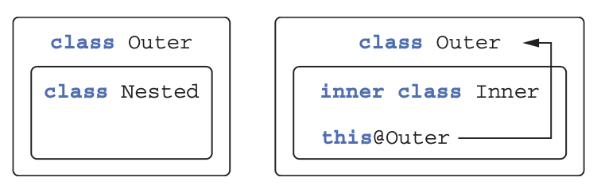
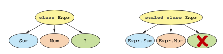

# 4. 클래스, 객체, 인터페이스

## 4장

- 클래스에 대해서 더 자세히 알아보기
- 자바와 차이
    - Class
        - default
            - public final
    - Nested classes(중첩 클래스)
        - default
            - 내부 클래스가 아니다(외부 클래스를 참조하지 않음)
- 생성자
    - 짧은 주 생성자
    - 별도 생성자 문법으로 복잡한 초기화 로직 가능
    - 프로퍼티도 접근자를 직접 정의할 수 있다
- 컴파일러
    - 간결한 코드를 위해 유용한 함수들을 생성해준다
        - 예: data class
    - delegating methods
- object keyword
    - 싱글턴, singleton
    - 동반 객체, companion object
    - 무명 클래스, anonymous class

## 4.1 클래스 계층 정의

### 4.1 클래스 계층 정의

- 코틀린/자바 방식 비교
- 가시성/접근 변경자(자바랑 비슷함, 기본 값은 다르다)
- 크틀린이 새로 소개사는 sealed 변경자(클래스 상속 제한)

### 4.1.1 코틀린 인터페이스

- 자바 8과 비슷하다
    - 구현 있는 메소드 정의 가능(자바 8 디폴트 메소드)
    - 추상 메소드 정의 가능
- 인터페이스에 상태가 들어갈 수 없다(필드)
- 코틀린 인터페이스 정의
    
    ```kotlin
    interface Clickable {
        fun click()
    }
    
    class Button : Clickable {
    		// override는 필수, 잡에서 @Override를 사용함
        override fun click() = println("I was clicked")
    }
    
    >>> Button().click()
    I was clicked
    ```
    
- 디폴드 함수 정의(자바에서는 `default` 키워드 사용 필수, 코틀린은 정의만)
    
    ```kotlin
    interface Clickable {
        fun click()
        fun showOff() = println("I'm clickable!")
    }
    ```
    
- interface메소드가 겹칠 경우
    
    ```kotlin
    interface Clickable {
        fun click()
        fun showOff() = println("I'm clickable!")
    }
    
    interface Focusable {
        fun setFocus(b: Boolean) =
            println("I ${if (b) "got" else "lost"} focus.")
        fun showOff() = println("I'm focusable!")
    }
    
    // Clickable하고 Focusable 둘 다 사용해야할 경우, showOff()가 겹친다
    // 오류
    The class 'Button' must
    override public open fun showOff() because it inherits
    many implementations of it.
    
    // 직접 override해야한다
    class Button : Clickable, Focusable {
        override fun click() = println("I was clicked")
    		override fun showOff() {
    			// 상위 클래스/인터페이스 메소드 호출
    	    super<Clickable>.showOff()
    	    super<Focusable>.showOff()
    
    			// 자바 문법
    			// Clickable.super.showOff()
    		} 
    }
    // 또 다른 문법
    // override fun showOff() = super<Clickable>.showOff()
    
    // 예제
    fun main(args: Array<String>) {
        val button = Button()
        button.showOff()
        button.setFocus(true)
        button.click()
    
    		// I'm clickable
    		// I'm focusable
    		// I got focus
    		// I was clicked
    }
    ```
    
- 코틀린 1.0은 자바 6하고 호환되게 설계 되 있음
    
    <aside>
    💡 자바 6에서 인터페이스에 디폴트 메소드 사용을 지원 안함
    코틀린 기본 메소드는 자바로 컴파일 될 때 인터페이스랑 클래스에 정적 메소드를 사용한다
    자바에서 인터페이스를 사용하고 싶다면 모든 메소드를 정의해야한다
    
    </aside>
    

### 4.1.2 open, final, abstract 변경자: 기본적으로 final

- 취약한 기반 클래스(fragile base class)
    - 기반 클래스를 상속 받으면 자식 클래스에서 오버라이드를 어떻게 할지 알 수 없으니깐 동작을 예측하기 어렵고 깨진다. 상속을 통해 동작 변경을 원하지 않은 부분은 제한시켜야한다. 이런 맥락으로 코틀린은 final class를 기본으로 사용한다.
- 코틀린에서 오버라이드를 허용하기위해서 명시적으로 정의해야한다(`open`)
    
    ```kotlin
    open class RichButton : Clickable {
    	fun disable() {}
    	open fun animate() {}
    	override fun click() {}
    }
    
    open class RichButton : Clickable {
    	// prevent further override
    	final override fun click() {}
    }
    ```
    
- Open class, smart cast
    
    <aside>
    💡 프로퍼티가 final이면 smart cast가 가능
    한번 타입을 확인했고 변경이 불가능 하면 자동으로 cast된것으로 
    취급 가능
    
    </aside>
    
- abstract class
    
    ```kotlin
    // abstract members are always open, open not necessary
    
    abstract class Animated {
    	abstract fun animate()
    	
    	open fun stopAnimating() {
    	}
    	
    	fun animateTwice() {
    	}
    }
    ```
    
- 코틀린의 상속 제어 변경자. interface에서는 final, open, abstract를 사용하지 않는다. interface에서는 멤버는 항상 open이다.
    
    
    | 변경자 | 이 변경자가 붙은 멤버는... | 설명 |
    | --- | --- | --- |
    | final | 오버라이드 할 수 없음 | 클래스 멤버의 기본 변경자다 |
    | open | 오버라이드 할 수 있음 | 반드시 open을 명시해야 오버라이드할 수 있다 |
    | abstract | 반드시 오버라이드 해야 함 | 추상 클래스의 멤버에만 이 변경자를 붙일 수 있다. 추상 멤버에는 구현이 있으면 안 된다 |
    | override | 상위 클래스나 상위 인스턴스의 멤버를 오버라이드 하는 중 | 오버라이드하는 멤버는 기본적으로 열려있다. 하위 클래스의 오버라이드를 금지하려면 final을 면시해야 한다. |

### 4.1.3 가시성 변경자: 기본적으로 공개

- 가시성 변경자: visibility modifier
- 코틀린에서 가사성 변경자를 명시하지 않으면 public이다
- 코틀린은 페키지를 namespace처럼 사용하고 있다
    - 자바처럼 package-private이라는 개념이 없다
- 코틀린에서 새로운 가시성 변경자 제공: internal
    - visible in module(한 묶음으로 컴파일 된 코틀린 파일들)
        - internal키워드를 통해 캡슐화를 제대로 지원한다
    - module: intellij, eclipse, maven, gradle, ant task
    - 자바
        
        > 자바에서는 패키지가 같은 클래스를 선언하기만 하면 어떤 프로젝트의 외부에 있는 코드라도 패키지 내부에 있는 패키지 전용 선언에 쉽게 접근할 수 있다.
        > 
- 코틀린: 최상위 선언에 private으로 가시성 변경자 지정 가능
    - 사용할 경우 선언 된 파일 내부에서만 접근 가능
        - class, function, property
    
    | Modifier | Class member | Top-level declaration |
    | --- | --- | --- |
    | public(default) | visible everywhere | visible everywhere |
    | internal | visible in a module | visible in a module |
    | protected | visible in subclasses | - |
    | private | visible in a class | visible in a file |
- 가시성 규칙 위반 예시
    
    ```kotlin
    internal open class TalkativeButton : Focusable {
    	private fun yell() = println("Hey!")
    	protected fun whisper() = println("Let's talk!")
    }
    
    fun TalkativeButton.giveSpeech() { // internal open class
    	yell() // private function
    	whisper() // protected function
    }
    
    // 해결 방법
    // - function을 internal로 만들던지 클래스를 public하게 만들어야함
    ```
    
- 자바랑 코틀린의 차이
    - 코틀린
        - protected를 같은 패키지에서 사용 할 수 없음
        - protected멤버는 클래스랑 subclass만 접근 가능
        - 확장함수는 private이랑 protected멤버에 접근할 수 없다
        - 코틀린 > 자바 컴파일: 가시성 변경자 유지
            - 예외: private class, 자바에서 불가능, package-private으로 컴파일
            - internal(코틀린)과 package-private(자바)는 다르다
            - module: module은 여러 패키지를 갖고 있을 수 있다, 여러module들이 같은 페키지를 선언할 수 있다, internal은 public으로 컴파일 된다
                - 자바에서 코틀린 코드에서 접근할 수 있는 부분들이 있다
                    - 코틀린 protected 가시성 변경자
                    - internal
            - outer class는 inner class의 private member을 접근 할 수 없다

### 4.1.4 내부 클래스와 중첩된 클래스: 기본적으로 중첩 클래스

- 코틀린: 중첩(nested) 클래스는 같은 클래스를 접근할 수 없음
    - 명시적으로 허용해야한다
    - 예제: Serializable을 통해 상태 저장/복구
    
    ```jsx
    interface State: Serializable
    interface View {
        fun getCurrentState(): State
        fun restoreState(state: State) {}
    }
    
    /* Java */
    public class Button implements View {
        @Override
        public State getCurrentState() {
            return new ButtonState();
        }
    
        @Override
        public void restoreState(State state) { /*...*/ }
    	
        public class ButtonState implements State { /*...*/ }
    }
    
    // Java에서 Serialize하려고 하면
    Java.io.NotSerializable- Exception: Button
    state이 Button을 참조하고 있음
    
    // 해결책: static으로 변경
    public static class ButtonState implements State { /*...*/ }
    
    // Kotlin에서는 문제 없음. 기본이 static
    class Button : View {
        override fun getCurrentState(): State = ButtonState()
        override fun restoreState(state: State) { /*...*/ }
        class ButtonState : State { /*...*/ }
    }
    ```
    
    | Class B { Class A} | Java | Kotlin |
    | --- | --- | --- |
    | 중첩
    Nested class (doesn’t store a reference to an outer class) | static class A | class A
     |
    | 내부
    Inner class (stores a reference to an outer class) | class A | inner class A |
    
    

- 코틀린: 내부 클래스에서 외부 클래스 참조
    
    ```jsx
    class Outer {
        inner class Inner {
            fun getOuterReference(): Outer = this@Outer
        }
    }
    ```
    

### 4.1.5 봉인된 클래스: 클래스 계층 정의 시 계층 확장 제한

- Sealed Classes
    
    ```kotlin
    // when식은 필수적으로 else case가 필요하다
    // - 불필요하게 throw를 해야한다
    
    interface Expr
    class Num(val value: Int) : Expr
    class Sum(val left: Expr, val right: Expr) : Expr
    
    fun eval(e: Expr): Int =
        when (e) {
            is Num -> e.value
            is Sum -> eval(e.right) + eval(e.left)
            else -> throw IllegalArgumentException("Unknown expression")
    }
    
    // super class를 sealed로 지정하면 subclass를 만들 수 없다
    // - 새로운 자식 클래스가 생겼을 경우 throw를 방지할 수 있다
    // sealed class를 직접 상속 받으려면 sealed class의 중첩 클래스로 만들어져야한다
    // - else를 생략해도 된다
    // sealed class는 기본적으로 open이다, open을 지정안해도 된다
    sealed class Expr {
        class Num(val value: Int) : Expr()
        class Sum(val left: Expr, val right: Expr) : Expr()
    }
    fun eval(e: Expr): Int =
        when (e) {
            is Expr.Num -> e.value
            is Expr.Sum -> eval(e.right) + eval(e.left)
        }
    ```
    
- sealed class를 통해 예상하지 못한 경우를 막을 수 있다
  
- 
- sealed class에 subclass를 추가할 경우 sealed class를 사용하는 when식은 모든 케이스를 지원하지 않으면 컴파일이 안된다
- sealed interface는 만들 수 없다. 자바에서 interface를 implement하는 행위를 코틀린 컴파일러가 막을 수 없다
- Expr클래스는 실제로 private constructor을 갖게 된다. 클래스 내부에서만 사용할 수 있게 된다.
- 코틀린 1.1부터는 sealed class의 subclass들을 같은 파일에 정의 할 수 있다. 중첩 클래스로 정의되는 제한이 조금 느슨하다

## 4.2 뻔하지 않은 생성자와 프로퍼티를 갖는 클래스 선언

### 4.2 뻔하지 않은 생성자와 프로퍼티를 갖는 클래스 선언

- constructor(primary/주, secondary/부)
- initializer block

### 4.2.1 클래스 초기화: 주 생성자와 초기화 블록

- 간단하게 클래스 정의
    
    ```kotlin
    // primary constructor
    class User(val nickname: String)
    // ()는 constructor parameter을 정의하고 property를 정의한다
    
    // ()를 사용 안하고 같은 동작을 하는 명시적인 코드
    class User constructor(_nickname: String) {
        val nickname: String
        init {
            nickname = _nickname
    	} 
    }
    ```
    
- initializer block을 통해 초기 로직 추가 가능
- 여러 initializer block사용 가능
- nickname = _nickname대신 this.nickname = nickname사용 가능
- 어노테이션이나 가시성 변경자가 primary constructor에 없을 경우 다음 처럼 클래스를 구현 할 수 있다
    
    ```kotlin
    class User (_nickname: String) {
    	val nickname = _nickname
    }
    
    // val키워드를 통해 프로퍼티가 생성 된다
    class User(val nickname: String)
    ```
    
- 생성자 파라미터에 기본 값을 정의 할 수 있다
    
    ```kotlin
    // 머든 파라미터가 기본 값을 갖고 있다면 파라미터 없는 생성자가 자동으로 만들어진다(기본 값을 사용하는 생성자)
    class User(val nickname: String,
               val isSubscribed: Boolean = true)
    
    >>> val alice = User("Alice")
    >>> println(alice.isSubscribed)
    true
    
    >>> val bob = User("Bob", false)
    >>> println(bob.isSubscribed)
    false
    
    >>> val carol = User("Carol", isSubscribed = false)
    >>> println(carol.isSubscribed)
    false
    ```
    
- Super Class한테 파라미터 넘겨주기(초기값)
    
    ```kotlin
    open class User(val nickname: String) { ... }
    class TwitterUser(nickname: String) : User(nickname) { ... }
    ```
    
- 생성자를 정의 안하면, 기본 생성자가 자동으로 만들어진다
    
    ```kotlin
    open class Button
    ```
    
- Button클래스를 상속 받고 따로 생성자를 정의안하면 Button클래스의 생성자를 호출 해줘야한다
    
    ```kotlin
    class RadioButton: Button()
    ```
    
- private constructor, 클래스 밖에서 생성할 수 없음
    
    ```kotlin
    class Secretive private constructor() {}
    ```
    
    <aside>
    💡 Java: private constructor for util class, for singletons
    
    </aside>
    

### 4.2.2 부 생성자: 상위 클래스를 다른 방식으로 초기화

- 자바에 비해서 코틀린에서는 생성자를 많이 정의할 필요가 없다
- 생성자에서 기본 값을 사용하면 overload할 필요가 많이 없어진다
- 생성자가 여러개 필요한 경우도 있다(framework/library class상속)
    
    ```kotlin
    open class View {
      constructor(ctx: Context) {
    		// some code 
    	}
    
      constructor(ctx: Context, attr: AttributeSet) {
          // some code
    	} 
    }
    
    class MyButton : View {
    	constructor(ctx: Context) : super(ctx) {
    		// ... 
    	}
    
      constructor(ctx: Context, attr: AttributeSet) : super(ctx, attr) {
        // ...
    	} 
    }
    ```
    
    
- Constructor위임
    
    ```kotlin
    class MyButton : View {
      constructor(ctx: Context): this(ctx, MY_STYLE) {
    		// ... 
    	}
    
    	constructor(ctx: Context, attr: AttributeSet): super(ctx, attr) {
        // ...
    	} 
    }
    ```

     

### 4.2.3 인터페이스에 선언된 프로퍼티 구현

- 코틀린: 인터페이스에 프로퍼티를 정의할 수 있음
    
    ```kotlin
    interface User {
    	// backing field, getter, 방식은 상관 없음, 값만 가져올 수 있으면 됨
    	val nickname: String
    }
    
    // Example 1
    // Primary constructor property
    class PrivateUser(override val nickname: String) : User
    
    // Example 2
    class SubscribingUser(val email: String) : User {
    		// Custom getter
        override val nickname: String
            get() = email.substringBefore('@') )
    }
    
    // Example 3
    class FacebookUser(val accountId: Int) : User {
    		// Property initializer
        override val nickname = getFacebookName(accountId)
    }
    
    >>> println(PrivateUser("test@kotlinlang.org").nickname)
    test@kotlinlang.org
    >>> println(SubscribingUser("test@kotlinlang.org").nickname)
    test
    ```
    
- 인터페이스는 상태를 들고 있지 않다
    
    ```kotlin
    interface User {
    		// 필수적으로 override가 필요함
        val email: String
    		// default implemenation사용 가능
        val nickname: String
            get() = email.substringBefore('@')
    }
    ```
    

### 4.2.4 게터와 세터에서 뒷받침하는 필드에 접근

```kotlin
// log value on setter called
class User(val name: String) {
    var address: String = "unspecified"
			set(value: String) {
				// backing field: field
		    println("""
	        Address was changed for $name:
	        "$field" -> "$value".""".trimIndent())
				// update field
		    field = value
	}
}

>>> val user = User("Alice")
>>> user.address = "Elsenheimerstrasse 47, 80687 Muenchen"
Address was changed for Alice:
"unspecified" -> "Elsenheimerstrasse 47, 80687 Muenchen".
```

- 프로퍼티를 직접 참조하면 컴파일러가 backing field생성해준다
- custom accessor을 구현하고 field를 사용하지 않으면 컴파일러가 backing field를 생성하지 않는다

### 4.2.5 접근자의 가시성 변경

```kotlin
class LengthCounter {

	// 접근자의 가시성 변경, 직접 값을 지정할 수 없음
  var counter: Int = 0
	private set
    
	fun addWord(word: String) {
    counter += word.length
	} 
}

>>> val lengthCounter = LengthCounter()
>>> lengthCounter.addWord("Hi!")
>>> println(lengthCounter.counter)
3
```

<aside>
💡 lateinit: non null property, initialized after constructor
lazy init: delegated properties, @JvmField
const: working with annotations easier

</aside>

## 4.3 컴파일러가 생성한 메소드: 데이터 클래스와 클래스 위임

### 4.3 컴파일러가 생성한 메소드: 데이터 클래스와 클래스 위임

- 자바에서 사용되는 boilerplate코드: equals, hashCode, toString

### 4.3.1 모든 클래스가 정의해야 하는 메소드

- toString, used for debugging and logging
    
    ```kotlin
    class Client(val name: String, val postalCode: Int)
    
    // System.out.println(new Client("", ""));
    >>> Client@5e9f23b4
    
    class Client(val name: String, val postalCode: Int) {
      override fun toString() = "Client(name=$name, postalCode=$postalCode)"
    }
    >>> val client1 = Client("Alice", 342562)
    >>> println(client1)
    Client(name=Alice, postalCode=342562)
    ```
    
- equals
    
    ```kotlin
    // java ==, primitive values, object references(memory ref, 객체 비교)
    // 1 == 1, a.equals(b)
    
    // kotlin ==, equals()
    // equals()를 override했다면 ==을 사용해도 된다
    // object reference: ===
    >>> val client1 = Client("Alice", 342562)
    >>> val client2 = Client("Alice", 342562)
    >>> println(client1 == client2)
    false
    
    class Client(val name: String, val postalCode: Int) {
    	// override is required, instance of is "is"
    
    	// equals
    	override fun equals(other: Any?): Boolean {
    		if (other == null || other !is Client)
    			return false
    		
    		return name == other.name && 
    					 postalCode == other.postalCode
    
    	// toString
    	override fun toString() = "Client(name=$name, postalCode=$postalCode)"
    }
    ```
    
- hashCode
    
    ```kotlin
    >>> val processed = hashSetOf(Client("Alice", 342562))
    >>> println(processed.contains(Client("Alice", 342562)))
    false
    
    // hashCode를 override해줘야한다
    class Client(val name: String, val postalCode: Int) {
    	...
    	override fun hashCode(): Int = name.hashCode() * 31 + postalCode
    }
    ```
    

### 4.3.2 데이터 클래스: 모든 클래스가 정의해야 하는 메소드 자동 생성

- data class: equals, toString, hashCode
    
    ```kotlin
    data class Client(val name: String, val postalCode: Int)
    ```
    
    - equals: 객체 비교
        - properties in primary constructor
    - hashCode: hash를 사용하는 컨테이너
        - hash codes of all properties
    - toString: 필드들 보여주기
- val/var 사용 가능. val권장.
    - 불변. HashMap. object를 키로 사용했을 경우 키가 바뀔 수 있음. 문제.
- copy method
    
    ```kotlin
    class Client(val name: string, val postalCode: Int) {
    	...
    	fun copy(name: String = this.name, postalCode: Int = this.postalCode) =
    		Client(name, postalCode)
    }
    
    >>> val bob = Client("Bob", 973293)
    >>> println(bob.copy(postalCode = 382555))
    Client(name=Bob, postalCode=382555)
    ```
    

### 4.3.3 클래스 위임: by 키워드 사용

- Decorator Pattern(상속의 단점들을 보완, composition, 위임 + 커스텀)
    
    ```kotlin
    class DelegatingCollection<T> : Collection<T> {
      private val innerList = arrayListOf<T>()
    
      override val size: Int get() = innerList.size
      override fun isEmpty(): Boolean = innerList.isEmpty()
      override fun contains(element: T): Boolean = innerList.contains(element)
      override fun iterator(): Iterator<T> = innerList.iterator()
      override fun containsAll(elements: Collection<T>): Boolean = innerList.containsAll(elements)
    }
    
    class DelegatingCollection<T>(
    	innerList: Collection<T> = ArrayList<T>()
    ) : Collection<T> by innerList {}
    
    class CountingSet<T>(
    	val innerSet: MutableCollection<T> = HashSet<T>()
    ) : MutableCollection<T> by innerSet {
      var objectsAdded = 0
    
      override fun add(element: T): Boolean {
        objectsAdded++
    	  return innerSet.add(element)
      }
    
      override fun addAll(c: Collection<T>): Boolean {
        objectsAdded += c.size
        return innerSet.addAll(c)
    	} 
    }
    >>> val cset = CountingSet<Int>()
    >>> cset.addAll(listOf(1, 1, 2))
    >>> println("${cset.objectsAdded} objects were added, ${cset.size} remain") 
    3 objects were added, 2 remain
    ```
    

## 4.4 object 키워드: 클래스 선언과 인스턴스 생성

### 4.4 object 키워드: 클래스 선언과 인스턴스 생성

- object: singleton
- companion object: singleton
- object expression: 자바 무명 클래스 대신 사용

### 4.4.1 객체 선언: 싱글턴을 쉽게 만들기

- Java Singleton: private constructor, static field references instance
- Kotlin Singleton
    
    ```kotlin
    object Payroll {
    	val allEmployees = arrayListOf<Person>()
    	fun calculateSalary() {
    		for (person in allEmployees) {
    			... 
    		}
    	} 
    }
    ```
    
- object: 프로퍼티 사용 가능, 메소드, init block, 허용
    - 생성자: 불가능
    - 선언할 때 생성 됨(클래스하고는 다르게)
        
        ```kotlin
        Payroll.allEmployees.add(Person(...))
        Payroll.calculateSalary()
        ```
        
- interface를 갖고 객체 만들어야할 때
    
    ```kotlin
    object CaseInsensitiveFileComparator : Comparator<File> {
    	override fun compare(file1: File, file2: File): Int {
    		return file1.path.compareTo(file2.path, ignoreCase = true)
    	} 
    }
    
    >>> println(CaseInsensitiveFileComparator.compare(File("/User"), File("/user")))
    0
    ```
    
- Singleton, DI사용하는 이유: 크고 무겁고 공용으로 사용하는 객체들을 직접 필요할 때 생성할 수 없다
- Comparator오브제트를 해당 클래스에 넣기
    
    ```kotlin
    data class Person(val name: String) {
    	object NameComparator : Comparator<Person> {
    		override fun compare(p1: Person, p2: Person): Int =
    			p1.name.compareTo(p2.name)
    	} 
    }
    
    >>> val persons = listOf(Person("Bob"), Person("Alice"))
    >>> println(persons.sortedWith(Person.NameComparator))
    [Person(name=Alice), Person(name=Bob)]
    ```
    
- Java에서 Kotlin object사용하기(static 변수가 생긴다)
    
    ```kotlin
    CaseInsensitiveFileComparator.INSTANCE.compare(file1, file2);
    ```
    

### 4.4.2 동반 객체: 팩토리 메소드와 정적 멤버가 들어갈 장소

- java static대신 package-level function
- 코틀린에서 top-level function사용 권장
    - private멤버를 접근 할 수 없을 경우에는 class안에 object를 만들기


- companion키워드 사용(static처럼 호출 가능)
    
    ```kotlin
    class A {
    	companion object {
    		// good place for: private constructor/ factor method
    
    		fun bar() {
    			println("Companion object called")
    		} 
    	}
    }
    
    >>> A.bar()
    Companion object called
    ```
    
- factory methods
    
    ```kotlin
    class User {
    	val nickname: String
    
    	constructor(email: String) {
    		nickname = email.substringBefore('@')
    	}
     
      constructor(facebookAccountId: Int) {
    		nickname = getFacebookName(facebookAccountId)
    	} 
    }
    
    class User private constructor(val nickname: String) {
    	companion object {
    		fun newSubscribingUser(email: String) =
                User(email.substringBefore('@'))
    
    		fun newFacebookUser(accountId: Int) =
                User(getFacebookName(accountId))
    	}
    }
    
    >>> val subscribingUser = User.newSubscribingUser("bob@gmail.com")
    >>> val facebookUser = User.newFacebookUser(4)
    >>> println(subscribingUser.nickname)
    bob
    ```
    

### 4.4.3 동반 객체를 일반 객체처럼 사용

- Companion object: named, implement interface, extension function, properties
    
    ```kotlin
    class Person(val name: String) {
        companion object Loader {
            fun fromJSON(jsonText: String): Person = ...
        }
    }
    
    >>> person = Person.Loader.fromJSON("{name: 'Dmitry'}")
    >>> person.name
    Dmitry
    
    // Loader없이도 가능
    >>> person2 = Person.fromJSON("{name: 'Brent'}")
    >>> person2.name
    Brent
    ```
    
- Companion Object: implement interface
    
    ```kotlin
    interface JSONFactory<T> {
        fun fromJSON(jsonText: String): T
    }
    
    class Person(val name: String) {
    	companion object : JSONFactory<Person> {
    		override fun fromJSON(jsonText: String): Person = ...
    	}
    }
    
    fun loadFromJSON<T>(factory: JSONFactory<T>): T {
        ...
    }
    // Companion Object를 넘겨준다
    loadFromJSON(Person)
    ```
    
- Java에서 사용하기
    
    ```kotlin
    /* Java */
    Person.Companion.fromJSON("...");
    
    /* with name */
    Person.NameOfCompanion.fromJSON("...");
    ```
    
    - static이 꼭 필요하면(자바에서 코틀린을 호출): @JvmStatic사용
        - java interop을 위해 있는 어노테이션
            
            ```kotlin
            // business logic module
            class Person(val firstName: String, val lastName: String) {
                companion object {
            		} 
            }
            
            // Extension function on companion object
            // Companion object(빈것을 만들어야함)
            fun Person.Companion.fromJSON(json: String): Person {
            	... 
            }
            val p = Person.fromJSON(json)
            ```
            
        - 코틀린에서 자바 static호출 가능

### 4.4.4 객체 식: 무명 내부 클래스를 다른 방식으로 작성

- Anonymous Inner Class (create interface instance)
    
    ```kotlin
    // singleton아님, 자바하고 달리 여러 interface구현 가능
    
    window.addMouseListener(
      object : MouseAdapter() {
    		override fun mouseClicked(e: MouseEvent) {
    			// ...
    		}
    
    		override fun mouseEntered(e: MouseEvent) {
    			// ...
    		}
    	}
    )
    
    // or
    val listener = object : MouseAdapter() {
        override fun mouseClicked(e: MouseEvent) { ... }
        override fun mouseEntered(e: MouseEvent) { ... }
    }
    ```
    
- 함수 하나면 SAM(Single Abstract Method)사용 가능
    
    ```kotlin
    interface Runnable {
    	fun run()
    }
    
    object : Runnable {
    	override fun run() {}
    }
    
    object : Runnable {
    }
    ```
    

## 4.5 요약

### 4.5 요약

- 코틀린 인터페이스
    - 자바랑 비슷함. 기본 구현 로직 사용 가능
- 모든 선언은 기본적으로 final public
- final이 아니게 변경하고 싶으면 open사용
- internal keyword를 사용하면 module내에서 접근 가능
- 중첩 클래스는 기본적으로 inner아님
- sealed class는 같은 파일/중첩 클래스로만 사용 가능
- 주/부 생성자 + init블록
- field식별자를 통해 backing field접근 가능
- data class를 통해 equals, hashcode, toString, copy자동으로 사용 가능
- by: class delegation
- object: kotlin에서 singleton만들기
- companion object: static(extension functions, interfaces, properties)
- object expression: anonymous inner class(multiple interface, access private members of class)