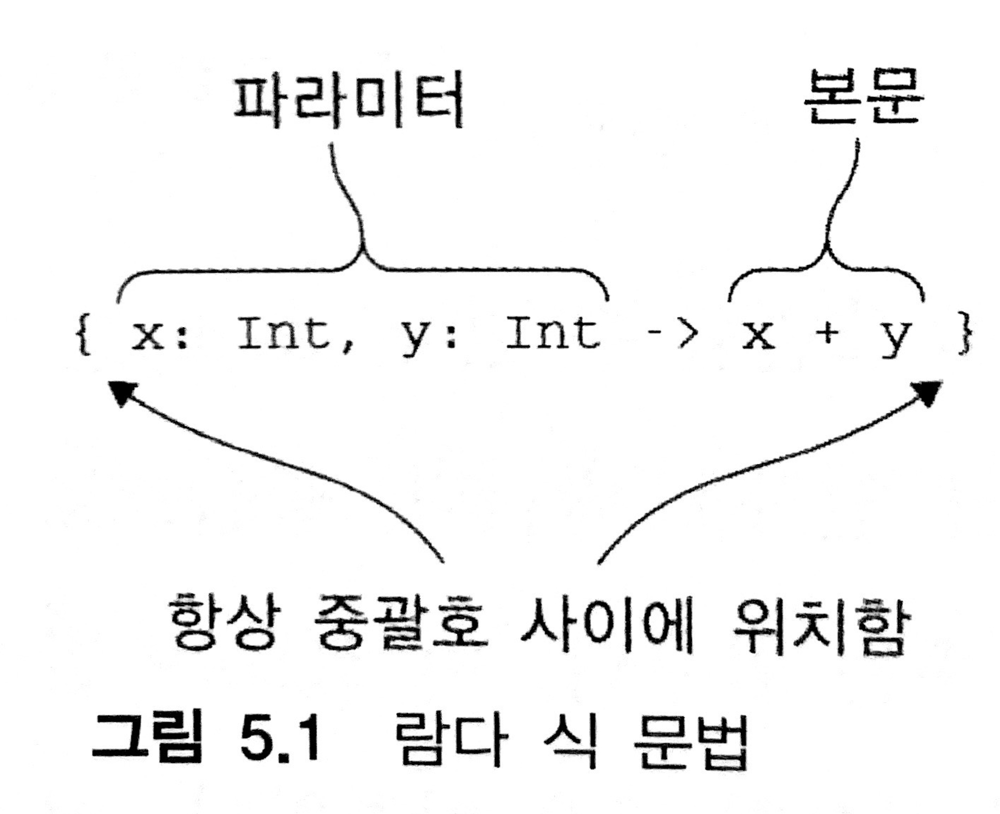
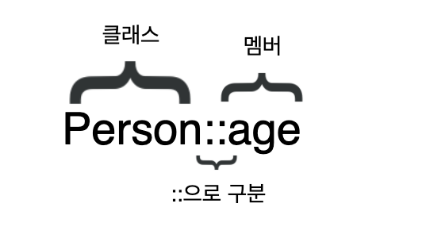
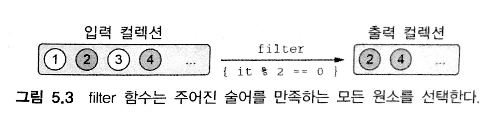
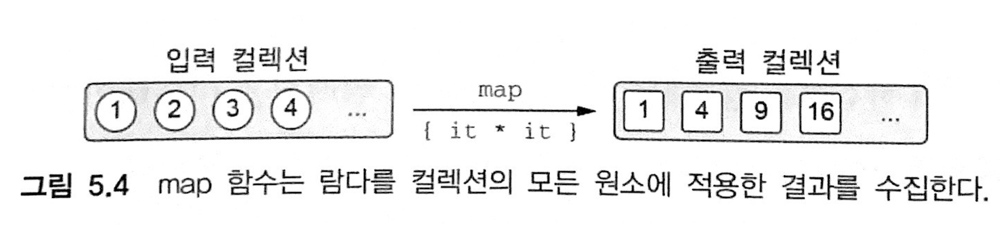
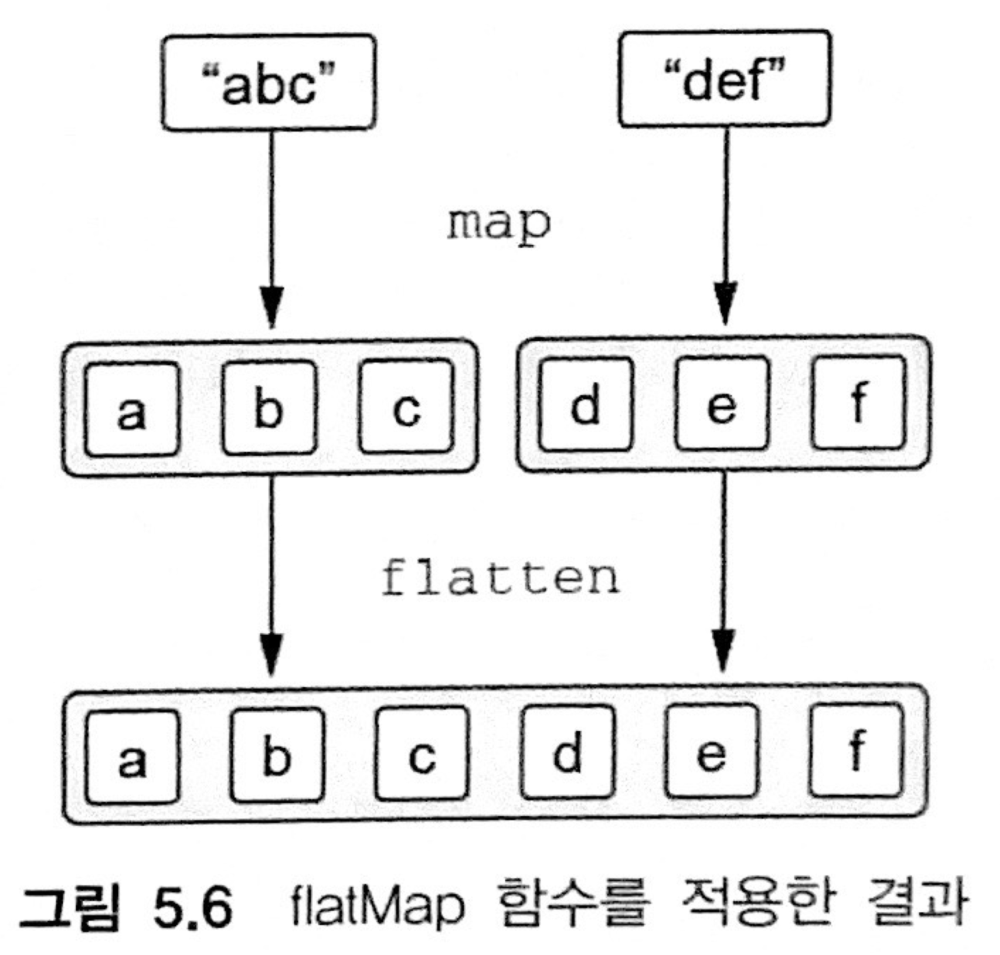
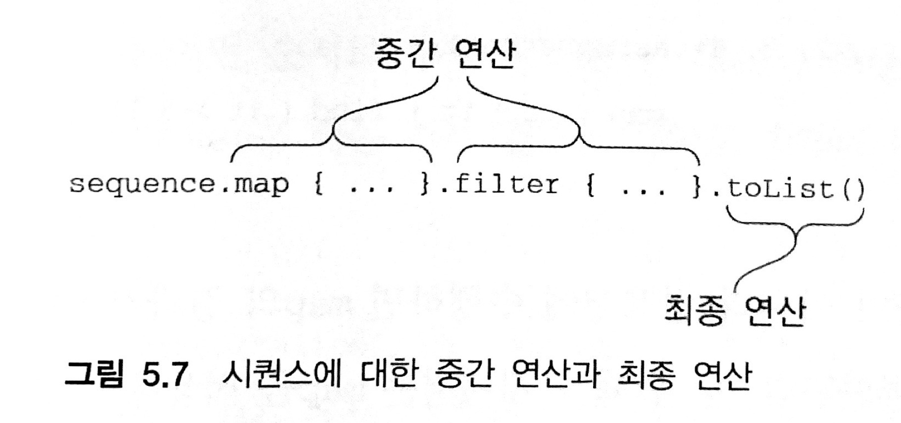
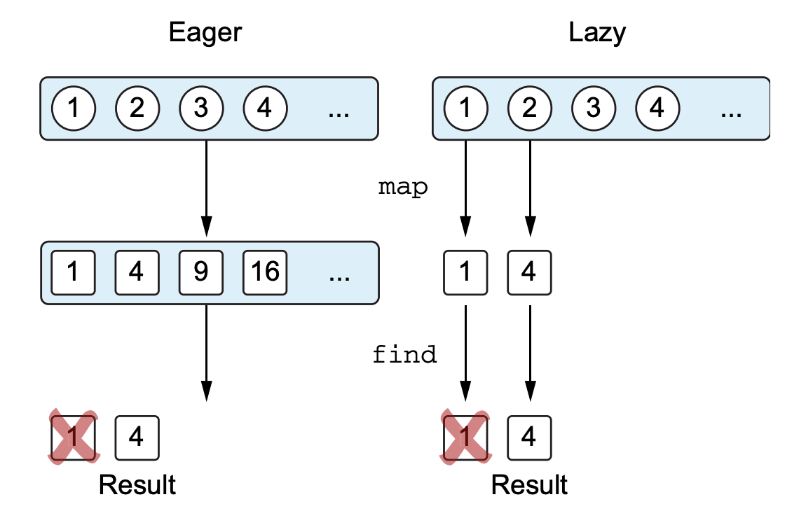
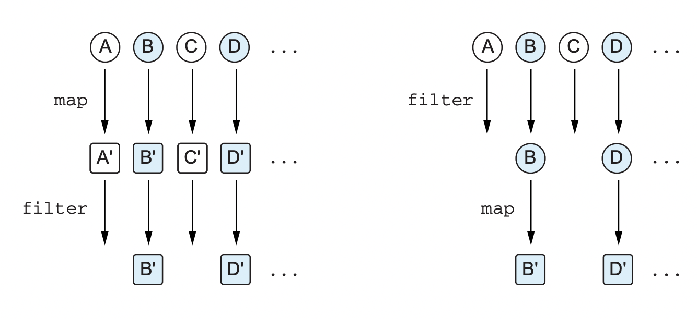
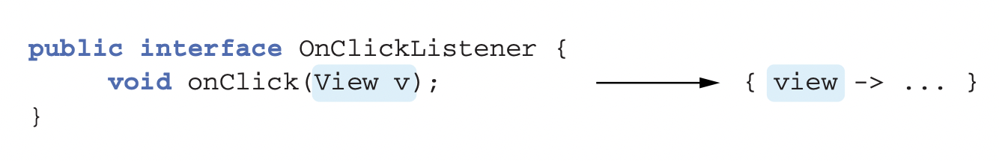

# 5. 람다로 프로그래밍

> - 람다 식과 멤버참조
- 함수형 스타일로 컬렉션 다루기
- 시퀀스: 지연 컬렉션 연산
- 자바 함수형 인터페이스를 코틀린에서 사용
- 수신 객체 지정 람다 사용
> 

람다 식(`lambda expression`) 또는 람다는 다른 함수에 넘길 수 있는 작은 코드 조각을 뜻한다

- 람다를 사용하면 공통 코드 구조를 라이브러리 함수로 쉽게 뽑아낼 수 있다.
- 코틀린 표준 라이브러리는 람다를 아주 많이 사용한다

# 5.1 람다 식과 멤버 참조

람다의 유용성을 보여주고 코틀린 람다식 구문이 어떻게 생겼는지 확인해보자

## 5.1.1 람다 소개: 코드 블록을 함수 인자로 넘기기

- 예전에 자바에서는 무명 내부 클래스를 사용하면 코드를 함수에 넘기거나 변수에 저장할 수 있기는 하지만 상당히 번거롭다.
- 함수형 프로그래밍에서는 함수를 값처럼 다루는 접근 방법을 택함으로써 이 문제를 해결한다.
    - 함수를 직접 다른 함수에 전달할 수 있다.
- `람다 식`을 사용하면 코드가 더욱 더 간결해진다.
- `람다 식`을 사용하면 함수를 선언할 필요가 없고 코드 블록을 직접 함수의 파라미터로 전달할 수 있다

```java
/* 자바 */
button.setOnClickListener(new OnClickListener(){
	@Override
	public void onClick(View view){
		/* 클릭 시 수행할 동작 */
	}
})
```

- 코틀린에서는 자바 8과 마찬가지로 람다를 쓸 수 있다

```kotlin
button.setOnClickListener{ /* 클릭 시 수행할 동작 */ }
```

이 코틀린 코드는 더 간결하고 읽기 쉽다.

## 5.1.2 람다와 컬렉션

- 자바 개발자들은 필요한 컬렉션 기능을 직접 작성하곤 했다

```kotlin
data class Person(val name: String, val age: Int)

fun findTheOldest(people: List<Person>){
    var maxAge = 0
    var theOldest : Person? = null
    for (person in people) {
        if(person.age > maxAge){
            maxAge = person.age
            theOldest = person
        }
    }
    println(theOldest)
}

>>> val people = listOf(Person("Alice",29), Person("Bob",31))
>>> findTheOldest(people)
Person(name=Bob, age=31)
```

- 사람으로 이뤄진 리스트중에 가장 연장자를 찾는 함수다
    - 이 루프에는 상당히 많은 코드가 들어가 있으며, 잘못 작성할 가능성도 있다
- **코틀린에서는 라이브러리 함수를 사용하면 된다**

```kotlin
>>> val people = listOf(Person("Alice",29), Person("Bob",31))
>>> println(people.maxByOrNull { it.age })
Person(name=Bob, age=31)
```

모든 컬렉션에 대해 ~~maxBy~~(Deprecated), maxByOrNull 함수를 호출할 수 있다. 가장 큰 원소를 찾기 위해 비교에 사용할 값을 돌려주는 함수를 인자로 받는다.

중괄호로 둘러싸인 코드 `{ it.age }`는 바로 비교에 사용할 값을 돌려주는 함수다

위의 코드는 **컬렉션의 원소를 인자로 받아서(it이 그 인자를 가리킨다) 비교에 사용할 값을 반환**한다

- 컬렉션의 원소가 Person 객체였으므로 이 함수가 반환하는 값은 Person 객체의 age필드에 저장된 나이 정보다

이런 식으로 **단지 함수나 프로퍼티를 반환하는 역할을 수행하는 람다**는 ***멤버참조***로 대치할 수 있다

```kotlin
people.maxByOrNull(Person::age)
```

람다나 멤버 참조를 인자로 받는 함수를 통해 개선한 코드는 더 짧고 더 이해하기 쉽다.

## 5.1.3 람다 식의 문법

람다는 값처럼 여기저기 전달할 수 있는 동작의 모음이다

- 람다를 따로 선언해서 변수에 저장할 수도 있다. 하지만 인자로 넘기면서 바로 람다를 정의하는 경우가 대부분이다



- 코틀린 람다 식은 항상 중괄호로 둘러싸여 있다.
- 화살표(->)가 인자 목록과 람다 본문을 구분해 준다.

람다 식을 변수에 저장할 수 있다. 람다가 저장된 변수를 다른 일반 함수와 마찬가지로 다룰 수 있다

```kotlin
>>> val sum = {x:Int, y:Int -> x+y}
>>> println(sum(1, 2))  // 변수에 저장된 람다를 호출한다.
3
```

원한다면 람다 식을 직접 호출해도 된다

```kotlin
>>> { println(42) }()
42
```

- 이와 같은 구문은 읽기 어렵고 그다지 쓸모도 없다. 람다 본문을 직접 실행하는 편이 낫다
- 이렇게 코드의 일부분을 블록으로 둘러싸 실행할 필요가 있다면 run을 사용한다.
- run은 인자로 받은 람다를 실행해주는 라이브러리 함수다.

```kotlin
// 람다 본문에 있는 코드를 실행한다
>>> run { println(42) }
42
```

실행 시점에 코틀린 람다 호출에는 아무 부가 비용이 들지 않으며, 프로그램의 기본 구성요소와 비슷한 성능을 낸다.

아래의 예제를 코틀린이 코드를 줄여 쓸수 있게 제공했던 기능을 제거하고 정식으로 람다를 작성하면 다음과 같다

```kotlin
>>> val people = listOf(Person("Alice",29), Person("Bob",31))
people.maxByOrNull { it.age }
```

```kotlin
people.maxByOrNull({p:Person -> p.age})
```

- 중괄호 안에 있는 코드는 람다 식이고 그 람다 식을 maxByorNull 함수에 넘긴다
- 람다 식은 Person 타입의 값을 인자로 받아서 인자의 age를 반환한다

번잡하고 가독성이 떨어지는, 그리고 파라미터가 단 하나뿐이라 이름을 붙일 필요가 없는 코드를 개선해보자

- 코틀린에는 함수 호출 시 맨 뒤에 있는 인자가 람다 식이라면 그 람다는 괄호 밖으로 빼내는 문법이 있다
- 이 예제는 람다가 유일한 파라미터, 마지막 파라미터 이기 때문에 괄호 뒤에 람다를 둘수 있다.
- 람다가 유일한 파라미터이고 괄호 뒤에 람다를 썼다면 호출 시 빈괄호를 없애도 된다.

```kotlin
1. people.maxByOrNull({p:Person -> p.age})

2. people.maxByOrNull() { p: Person -> p.age }

3. people.maxByOrNull { p: Person -> p.age }
```

세가지 유형 모두 같은 뜻이지만 마지막 문장이 가장 읽기 쉽다.

아래 예제는 joinToString을 사용하여 각 사람의 이름만 출력한다. 소괄호와 중괄호의 위치만 확인해 보면 된다.

```kotlin
>>> val people = listOf(Person("이몽룡", 29), Person("성춘향",31))
>>> val names = people.joinToString(separator = " ", transform = { p: Person -> p.name} )
>>> println(names)
이몽룡 성춘향
```

```kotlin
people.joinToString(" "){ p:Person -> p.name }
```

위의 예제를 더 간단하게 다듬고 파라미터 타입을 없애자

```kotlin
people.maxByOrNull { p: Person -> p.age } // 파라미터 타입을 명시
people.maxByOrNull { p -> p.age }  // 파라미터 타입을 생략(컴파일러가 추론)
```

- 컴파일러는 람다 파라미터의 타입도 추론할 수 있다 → 파라미터 타입을 명시할 필요가 없다
- 타입을 추론하지 못하는 경우도 있다(언제인지는 책에서 다루지 않았다...)
- 람다 파라미터의 디폴트 이름은 `it`이다(이름을 따로 지정하지 않은 경우 자동으로 it로 만들어진다)

```kotlin
people.maxByOrNull { it.age }
```

- **람다안에서 파라미터이름이 중복된다면 각 람다의 파라미터를 명시하는 편이 좋다**

람다를 변수에 저장할 때는 파라미터의 타입을 추론할 문맥이 없기때문에 타입을 명시해야한다

```kotlin
val getAge = { p: Person -> p.age }
people.maxByOrNull(getAge)
```

본문이 여러 줄로 이뤄진 람다의 경우 본문의 맨 마지막에 있는 식이 람다의 결과 값이 된다.

```kotlin
>>> val sum = {x:Int, y:Int ->
    println("Computing the sum of $x and $y...")
    x+y
}
>>> println(sum(1, 2))

Computing the sum of 1 and 2...
3
```

## 5.1.4 현재 영역에 있는 변수에 접근

람다를 함수 안에서 정의하면 함수의 파라미터뿐 아니라 람다 정의 앞에 선언된 로컬 변수까지 람다에서 모두 사용할 수 있다.

다음 예제는 메세지의 목록을 받아 모든 메세지에 똑같은 접두사를 붙여서 출력한다

```kotlin
fun printMessageWithPrefix(message: Collection<String>, prefix: String){
    // 각 원소에 대해 수행할 작업을 람다로 받는다
    message.forEach{
        println("$prefix $it")  // 람다 안에서 함수의 "prefix" 파라미터를 사용한다
    }
}

>>> val errors = listOf("403 Forbidden", "404 Not Found")
>>> printMessageWithPrefix(errors, "Error:")
Error: 403 Forbidden
Error: 404 Not Found
```

코틀린 람다 안에서는 파이널 변수가 아닌 변수에 접근할 수 있다

람다 안에서 바깥의 변수를 변경해도 된다

```kotlin
fun printProblemCounts(responses: Collection<String>){
    var clientErrors = 0  // 람다에서 사용할 
    var serverErrors = 0  // 변수를 정의한다
    responses.forEach{
        if (it.startsWith("4")){
            clientErrors++  // 람다 안에서 람다 밖의 변수를 변경한다(1)
        } else if (it.startsWith("5")){
            serverErrors++  // 람다 안에서 람다 밖의 변수를 변경한다(2)
        }
    }
    println("$clientErrors client errors, $serverErrors server errors")
}

>>> val responses = listOf("200 OK", "418 I'm a teapot", 
"500 Internal Server Error")
>>> printProblemCounts(responses)
1 client errors, 1 server errors
```

이 예제의 `prefix`, `clientErrors`, `serverErrors`와 같이 **람다안에서 사용하는 외부 변수**를  ‘람다가 포획한 변수'라고 부른다.

- 기본적으로 함수 안에 정의된 로컬 변수의 생명주기는 함수가 반환되면 끝난다
- 하지만, 어떤 함수가 자신의 로컬 변수를 포획한 람다를 반환하거나 다른 변수에 저장한다면 로컬 변수의 생명주기와 함수의 생명주기가 달라질 수 있다.
- 포획한 변수가 있는 람다를 저장해서 함수가 끝난 뒤에 실행해도 람다의 본문 코드는 여전히 포획한 변수를 읽거나 쓸수 있다. → **클로저(closure)**
- 이런 동작이 가능한 이유
    - 파이널 변수를 포획한 경우에는 람다코드를 변수 값과 함께 저장한다
    - 파이널이 아닌 변수를 포획한 경우에는 변수를 특별한 래퍼로 감싸서 나중에 변경하거나 읽을 수 있게 한 다음에 래퍼에 대한 참조를 람다 코드와 함께 저장한다

---

### **변경 가능한 변수 포획하기: 자세한 구현 방법**

- 자바에서는 파이널 변수만 포획할 수 있다
- 하지만, 교묘한 속임수를 통해 변경 가능한 변수를 포획할 수 있다.
    1. 변경 가능한 변수를 저장하는 원소가 단 하나뿐인 배열을 선언하거나
    2. 변경 가능한 변수를 필드로 하는 클래스를 선언하는 것

```kotlin
// 변경 가능한 변수를 포획하는 방법을 보여주기 위한 클래스
class Ref<T>(var value:T)

>>> val counter = Ref(0)
>>> val inc = { counter.value++ }
// 공식 적으로는 변경 불가능한 변수를 포획했지만 그 변수가 가리키는 객체의 필드 값을 바꿀 수 있다
```

실제 코드에서는 이런 래퍼를 만들지 않아도 되는 대신, 변수를 직접 바꾼다

```kotlin
var counter = 0
val inc = { counter++ }
```

첫 번째 예제는 두 번째 예제가 작동하는 내부 모습을 보여준다

- 람다가 파이널 변수(`val`)를 포획하면 자바와 마찬가지로 그 변수의 값이 복사된다
- 변경 가능한 변수(`var`)를 포획하면 변수를 Ref 클래스 인스턴스에 넣는다.
    - Ref 인스턴스에 대한 참조를 파이널로 만들면 쉽게 람다로 포획할 수 있고, 람다 안에서는 Ref 인스턴스의 필드를 변경할 수 있다.

---

### 한 가지 꼭 알아둬야 할 함정

람다를 이벤트 핸들러나 다른 비동기적으로 실행되는 코드로 활용하는 경우 함수 호출이 끝난 다음에 로컬 변수가 변경될 수도 있다.

다음 코드는 버튼 클릭 횟수를 제대로 셀 수 없다

```kotlin
fun tryToCountButtonClicks(button: Button): Int {
    var clicks = 0
    button.onCLick { clicks++ }
    return clicks
}
```

이 함수는 항상 0을 반환한다.

onClick 핸들러는 호출될 때마다 clicks의 값을 증가시키지만 그 값의 변경을 관찰할 수는 없다.

핸들러는 `tryToCountButtonClicks`가 clicks를 반환한 다음에 호출되기 때문이다

- 이 함수를 제대로 구현하려면 클릭 횟수를 세는 카운터 변수를 함수의 내부가 아니라 클래스의 프로퍼티나 전역 프로퍼티 등의 위치로 빼내서 나중에 변수 변화를 살펴볼 수 있게 해야 한다.

## 5.1.5 멤버 참조

넘기려는 코드가 이미 함수로 선언된 경우에는 어떻게 해야할까? 물론 그 함수를 호출하는 람다를 만들면되지만 이는 중복이다.

코틀린에서는 자바 8과 마찬가지로 **함수를 값으로 바꿀 수 있다**

**이때 이중 콜론(`::`)을 사용한다**

```kotlin
val getAge = Person::age
```

> 이중 콜론(::)을 사용하는 식을 **멤버 참조(member reference)**라고 부른다
> 

**멤버 참조**는 프로퍼티나 메소드를 단 하나만 호출하는 함수 값을 만들어 준다.



Person::age는 같은 역할을 하는 다음 람다 식을 더 간략하게 표현한 것이다

```kotlin
val getAge = { person:Person -> person.age }
```

참조 대상이 함수인지 프로퍼티인지와는 관계없이 멤버 참조 뒤에는 괄호를 넣으면 안된다

멤버 참조는 그 멤버를 호출하는 람다와 같은 타입이다. 따라서 아래의 예제들 처럼 자유롭게 바꿔 쓸 수 있다.

```kotlin
people.maxBy(Person::age)
people.maxBy { p -> p.age }
people.maxBy { it.age }
```

최상위에 선언된(그리고 다른 클래스의 멤버가 아닌) 함수나 프로퍼티를 참조할 수도 있다.

**참고** : REPL이나 스크립트에서는 ::salute를 쓸 수 없다

```kotlin
fun salute() = println("Salute!")

>>> run(::salute)  //최상위 함수를 참조한다
Salute!
```

클래스 이름을 생략하고 ::로 참조를 바로 시작한다. ::salute라는 멤버 참조를 run 라이브러리 함수에 넘긴다

- run은 파라미터로 받은 람다를 호출한다

람다가 파라미터가 여럿인 다른 함수에게 작업을 위임하는 경우 람다를 정의하지 않고 직접 위임 함수에 대한 참조를 제공하면 편리하다

```kotlin
class Person(val name:String, val age:Int)
val action = { person:Person, message: String 
-> sendEmail(person, message) // 이 람다는 sendEmail 함수에게 작업을 위임한다
}

fun sendEmail(person: Person, message: String) : String {
    return "to ${person.name}, your age ${person.age} and message : $message"
}

val nextAction = ::sendEmail  // 람다 대신 멤버참조를 쓸수 있다
```

생성자 참조(constructor reference)를 사용하면 클래스 생성 작업을 연기하거나 저장해 둘수 있다

```kotlin
data class Person(val name:String, val age:Int)

>>> val createPerson = ::Person  //"Person"의 인스턴스를 만드는 동작을 값으로 저장한다
>>> val p = createPerson("Alice", 29)
>>> println(p)

Person(name=Alice, age=29)
```

확장 함수도 멤버 함수와 똑같은 방식으로 참조할 수 있다

```kotlin
fun Person.isAdult() = age >= 21
val predicate = Person::isAdult
```

`isAdult`는 Person의 확장 함수다.  

isAdult를 호출할 때 person.isAdult()로 인스턴스 멤버 호출 구문을 쓸 수 있는 것처럼 Person::isAdult로 멤버 참조 구문을 사용해 이 확장 함수에 대한 참조를 얻을 수 있다

---

### 바운드 멤버 참조

코틀린 1.0에서는 클래스의 메소드나 프로퍼티에 대한 참조를 얻은 다음에 그 참조를 호출할때 항상 인스턴스 객체를 제공해야 했다.

코틀린 1.1부터는 바운드 멤버 참조(bound member reference)를 지원한다

- 멤버 참조를 생성할 때 클래스 인스턴스를 함께 저장한 다음 나중에 그 인스턴스에 대해 멤버를 호출해준다
- 따라서, 호출 시 수신 대상 객체를 별도로 지정해 줄 필요가 없다

```kotlin
>>> val p = Person("Dmitry", 34)
>>> val personAgeFunction = Person::age
>>> println(personAgeFunction(p))
34
>>> val dmitryAgeFunction = p::age  // 코틀린 1.1부터 사용할 수 있는 바운드 멤버 참조
>>> println(dmitryAgeFunction())
34
```

`personAgeFunction`은 파라미터가 하나(파라미터로 받은 사람의 나이를 반환)이지만

`dmitryAgeFunction`은 참조를 만들때 p가 가리키던 사람의 나이만 반환한다

---

# 5.2 컬렉션 함수형 API

함수형 프로그래밍 스타일을 사용하면 컬렉션을 다룰 때 편리하다

설명하는 함수 중에 코틀린을 설계한 사람이 발명한 함수는 전혀 없다. 이와 같거나 비슷한 함수를 C#, 그루비, 스칼라 등 람다를 지원하는 대부분의 언어에서 찾아볼 수 있다.

## 5.2.1 필수적인 함수: `filter`와 `map`

- `filter`와 `map`은 컬렉션을 활용할 때 기반이 되는 함수다.
- 대부분의 컬렉션 연산을 이 두 함수를 통해 표현할 수 있다

### `filter`

`filter` 함수는 컬렉션을 이터레이션하면서 주어진 람다에 각 원소를 넘겨서 람다가 true를 반환하는 원소만 모은다

```kotlin
>>> val list = listOf(1,2,3,4)
>>> println(list.filter{it % 2 == 0})
[2, 4]
```

결과는 입력 컬렉션의 원소 중에서 주어진 술어(참/거짓을 반환하는 함수, Predicate)를 만족하는 원소만으로 이뤄진 새로운 컬렉션이다



30살 이상인 사람만 필요하다면 filter를 사용한다

```kotlin
>>> val people = listOf(Person("Alice", 29), Person("Bob",31))
>>> println(people.filter { it.age > 30 })
[Person(name=Bob, age=31)]
```

filter 함수는 컬렉션에서 원치 않는 원소를 제거한다. 하지만 원소를 변환할 수는 없다.

원소를 변환하려면 `map` 함수를 사용해야 한다

### `map`

`map` 함수는 주어진 람다를 컬렉션의 각 원소에 적용한 결과를 모아서 새 컬렉션을 만든다.

```kotlin
>>> val list = listOf(1,2,3,4)
>>> println(list.map { it * it })
[1, 4, 9, 16]
```

결과는 원본 리스트와 원소의 개수는 같지만, 각 원소는 주어진 함수에 따라 변환된 새로운 컬렉션이다



사람의 리스트가 아닌 이름의 리스트를 출력하고 싶다면 map으로 사람의 리스트를 이름의 리스트로 변환하면 된다

```kotlin
>>> val people = listOf(Person("Alice", 29), Person("Bob",31))
>>> println(people.map { it.name })
[Alice, Bob]
```

이 예제를 멤버 참조를 사용해 더 멋지게 작성 할수도 있다

```kotlin
people.map(Person::name)
```

이런 호출은 쉽게 연쇄시킬 수 있다. 아래 예제는 30살 이상인 사람의 이름을 호출한다

```kotlin
>>> println(people.filter { it.age > 30 }.map(Person::name))
[Bob]
```

가장 나이 많은 사람의 이름을 알고 싶다면 람다를 사용해 쉽게 구할 수 있다

```kotlin
people.filter { it.age == people.maxByOrNull(Person::age)!!.age }
```

하지만 이 코드는 단점이 있다

- 목록에서 최댓값을 구하는 작업을 계속 반복한다
- 만약 100명의 사람이 있다면 100번 최댓값 연산(maxByOrNull)을 100번 수행한다

아래와 같이 좀 더 개선해야한다

```kotlin
val maxAge = people.maxByOrNull { it.age }!!.age
people.filter { it.age == maxAge }
```

**꼭 필요하지 않은 경우 굳이 계산을 반복하지 말아야 한다**

- 람다를 인자로 받는 함수에 람다를 넘기면 겉으로 보기에는 단순해 보이는 식이 내부 로직의 복잡도로 인하여 실제로는 엄청나게 불합리한 계산식이 될 때가 있다
- 항상 작업하는 코드로 인해 어떤 일이 돌아가는지 명확히 이해하고 사용해야 한다

필터와 변환 함수를 맵에 적용할 수도 있다.

```kotlin
>>> val numbers = mapOf(0 to "zero", 1 to "one")
>>> println(numbers.mapValues { it.value.uppercase() })
{0=ZERO, 1=ONE}
```

맵의 경우 키와 값을 처리하는 함수가 따로 존재한다.

- `filterKeys`와 `mapKeys`는 `키`를 걸러내거나 변환한다
- `filterValues`와 `mapValues`는 `값`을 걸러내거나 변환한다

## 5.2.2 all, any, count, find : 컬렉션에 술어 적용

컬렉션에 대해 자주 수행하는 연산으로 컬렉션의 모든 원소가 어떤 조건을 만족하는지 판단하는 연산이 있다.

- 코틀린에서는 `all`과 `any`가 있다
- `count` 함수는 조건을 만족하는 원소의 개수를 반환한다
- `find` 함수는 조건을 만족하는 첫 번째 원소를 반환한다

어떤 사람의 나이가 27살 이하인지 판단하는 술어 함수는 다음과 같다

```kotlin
val canBeInClub27 = { p:Person -> p.age <= 27 }
```

- 모든 원소가 이 술어를 만족하는지 확인하려면 `all`을 사용한다

```kotlin
>>> val people = listOf(Person("Alice", 27), Person("Bob",31))
>>> println(people.all(canBeInClub27))
false
```

- 술어를 만족하는 원소가 하나라도 있는지 확인하려면 `any`를 쓴다

```kotlin
>>> println(people.any(canBeInClub27))
true
```

어떤 조건에 대해 `!all`을 수행한 결과와 그 조건에 부정에 대해 `any`를 수행한 결과는 같다

또 어떤 조건에 대해 `!any`를 수행한 결과와 그 조건의 부정에 대해 `all`을 수행한 결과는 같다

가독성을 높이려면 `any`와 `all` 앞에 `!`를 붙이지 않는 편이 낫다

→ 조건에 붙이는게 좋다

```kotlin
>>> val list = listOf(1, 2, 3)
>>> println(!list.all { it == 3 })
true
>>> println(list.any { it != 3 })
true
```

술어를 만족하는 원소의 개수를 구하려면 `count`를 사용한다

```kotlin
>>> val people = listOf(Person("Alice", 27), Person("Bob",31))
>>> println(people.count(canBeInClub27))
1
```

---

### 함수를 적재적소에 사용하라 : `count`와 `size`

`count`가 있다는 사실을 잊어버리고, 컬렉션을 필터링한 결과의 크기를 가져오는 경우가 있다

```kotlin
>>> people.filter(canBeInClub27).size
1
```

하지만 이렇게 처리하면 `filter`에 의해 중간 컬렉션이 생긴다.

반면 `count`는 조건을 만족하는 원소의 개수만을 추적하기 때문에 `count`가 훨씬 더 효율 적이다

***필요에 따라 가장 적합한 연산을 선택하기 위해 최대한 노력해라***

---

술어를 만족하는 원소를 하나 찾고 싶으면 `find` 함수를 사용한다

```kotlin
>>> println(people.find(canBeInClub27))
Person(name=Alice, age=27)
```

조건을 만족하는 원소가 하나라도 있는 경우 가장 먼저 조건을 만족한다고 확인된 원소를 반환한다

- 만족하는 원소가 전혀 없으면 null을 반환한다
- `firstOrNull`과 같다
- 조건을 만족하는 원소가 없으면 null이 나온다는 사실을 더 명확히 하고 싶으면 `firstOrNull`을 쓸수 있다

## 5.2.3 `groupBy`: 리스트를 여러 그룹으로 이뤄진 맵으로 변경

컬렉션의 모든 원소를 어떤 특성에 따라 여러 그룹으로 나누고 싶다고 할때 사용한다

```kotlin
>>> val people = listOf(
			Person("Alice", 31), 
			Person("Bob",29), 
			Person("Carol",31))
>>> println(people.groupBy { it.age })

{
	31=[Person(name=Alice, age=31), Person(name=Carol, age=31)], 
	29=[Person(name=Bob, age=29)]
}
```

각 그룹은 리스트이기 때문에 groupBy의 결과 타입은 Map<Int, List<Person>>이다

- 필요하다면 이 맵을 mapKeys나 mapValues 등을 사용해 변경할 수 있다

아래는 멤버 참조를 활용해 문자열을 첫글자에 따라 분류하는 예제이다

```kotlin
>>> val list = listOf("a", "ab", "b")
>>> println(list.groupBy(String::first))
{a=[a, ab], b=[b]}
```

## 5.2.4 `flatMap`과 `flatten` : 중첩된 컬렉션 안의 원소 처리

Book으로 표현한 책에 대한 정보를 저장하는 도서관이 있다고 가정하자

```kotlin
class Book(val title: String, val authors: List<String>)
```

- 책마다 저자가 한 명 또는 여러명 있다

도서관에 있는 **책의 저자를 모두 모은 집합**을 다음과 같이 가져올 수 있다

```kotlin
books.flatMap { it.authors }.toSet()
```

flatMap 함수는 먼저 인자로 주어진 람다를 컬렉션의 모든 객체에 적용하고 람다를 적용한 결과, 얻어지는 여러 리스트를 한 리스트로 모은다

```kotlin
>>> val strings = listOf("abc", "def")
>>> println(strings.flatMap { it.toList() })
[a, b, c, d, e, f]
```



```kotlin
>>> val books = listOf( 
			Book("Thursday Next", listOf("Jasper Fforde")),
	    Book("Mort", listOf("Terry Pratchett")),
	    Book("Good Omens", listOf("Terry Pratchett", "Neil Gaiman"))
)
>>> println(books.flatMap { it.authors }.toSet())
[Jasper Fforde, Terry Pratchett, Neil Gaiman]
```

- flatMap 함수는 모든 책의 작가를 평평한(문자열만으로 이뤄진) 리스트 하나로 모든다.
- toSet은 flatMap의 결과 리스트에서 중복을 없애고 집합으로 만든다
- 최종출력에서는 Terry Pratchett를 한번만 볼 수 있다

특별히 변환해야 할 내용이 없다면 리스트의 리스트를 평평하게 펼치기만 하면 된다

이러한 경우 listOfList.flatten() 처럼 `flatten` 함수를 사용할 수 있다

```kotlin
>>> val list = listOf(listOf(1, 2, 3), listOf(3, 4, 5))
>>> println(list.flatten().toSet())
[1, 2, 3, 4, 5]
```

***코틀린에는 더 많은 컬렉션 함수가 있다. 찾아보자***

# 5.3 지연 계산(lazy) 컬렉션 연산

앞서 알아본 `map`이나 `filter` 함수는 결과 **컬렉션을 즉시 생성**한다.

- 이는 컬렉션 함수를 연쇄하면 매 단계마다 계산 중간 결과를 새로운 컬렉션에 **임시**로 담는다

시퀀스(`sequence`)를 사용하면 중간 임시 컬렉션을 사용하지 않고 연산을 연쇄할 수 있다

```kotlin
people.map(Person::name).filter { it.startsWith("A") }
```

- 코틀린 표준 라이브러리 참조 문서에는 `filter`와 `map`이 리스트를 반환한다고 한다
- 위 예제의 연쇄 호출이 각각의 임시 리스트를 만든다는 뜻이다.
- 원소가 적다면 리스트가 더 생겨도 문제가 되지 않겠지만 **원소가 수백만 개가 되면 훨씬 효율이 떨어진다**

이를 효율적으로 만들기 위해서는 각 연산이 컬렉션을 직접 사용하는 대신 시퀀스를 사용하게 만들어야한다

```kotlin
people.asSequence()  // 원본 컬렉션을 시퀀스로 변환한다
    .map(Person::name)  
    .filter { it.startsWith("A") }
    .toList()  // 결과 시퀀스를 다시 리스트로 변환한다
```

이 예제는 중간 결과를 저장하는 컬렉션이 생기지 않기 때문에 원소가 많은 경우 성능이 눈에 띄게 좋아진다

코틀린 지연 계산 시퀀스는 Sequence 인터페이스에서 시작한다

- 이 인터페이스는 단지 한 번에 하나씩 열거될 수 있는 원소의 시퀀스를 표현할 뿐이다
- Sequence 안에는 iterator라는 단 하나의 메소드가 있다
- 이 메소드를 통해 시퀀스로부터 원소 값을 얻을 수 있다

Sequence 인터페이스의 강점은 그 인터페이스 위에 구현된 연산이 계산을 수행하는 방법에 있다

- 시퀀스의 원소는 필요할 때 비로소 계산된다
- 따라서 중간에 처리결과를 저장하지 않고도 연산을 연쇄적으로 적용해서 효율적으로 계산을 수행할 수 있다

`asSequence` 확장 함수를 호출하면 어떤 컬렉션이든 시퀀스로 바꿀 수 있다

- 시퀀스를 리스트로 만들 때는 `toList`를 사용한다

---

### 컬렉션보다 시퀀스?

컬렉션보다 시퀀스가 훨씬 더 낫다면 그냥 시퀀스를 쓰는 편이 좋은거 아닌가?

→ 항상 그렇지 않다

시퀀스의 원소를 차례로 이터레이션해야 한다면 시퀀스를 직접 써도 되지만, **인덱스를 사용해 접근하는 등의 다른 API 메소드가 필요**하다면 시퀀스를 컬렉션으로 변환해야 한다

***큰 컬렉션을 대해서 연산을 연쇄시킬 때는 시퀀스를 사용하는것을 규칙으로 삼아라***

---

## 5.3.1 시퀀스 연산 실행: 중간 연산과 최종 연산

시퀀스에 대한 연산은 **중간(`intermediate`) 연산**과 **최종(`terminal`) 연산**으로 나뉜다

- **중간 연산**은 다른 시퀀스를 반환한다. 이 시퀀스는 최초 시퀀스의 원소를 변환하는 방법을 알고 있다
- **최종 연산**은 결과를 반환한다. 결과는 최초 컬렉션에 대해 변환을 적용한 시퀀스로 부터 일련의 계산을 수행해 얻을 수 있는 컬렉션이나 원소, 숫자 또는 객체다



중간 연산은 항상 지연 계산된다

```kotlin
listOf(1,2,3,4).asSequence()
        .map { print("map($it) "); it * it}
        .filter { print("filter($it) "); it % 2 == 0}
```

위의 예제는 아무 내용도 출력되지 않는다.  결과를 얻을 필요가 있을 때 적용된다는 뜻이다

```kotlin
>>> listOf(1,2,3,4).asSequence()
>>>        .map { print("map($it) "); it * it}
>>>        .filter { print("filter($it) "); it % 2 == 0}
>>>        .toList()

map(1) filter(1) map(2) filter(4) map(3) filter(9) map(4) filter(16)
```

최종 연산(toList)를 호출하면 연기 됐던 모든 계산이 수행된다

시퀀스의 경우 모든 연산은 각 원소에 대해 순차적으로 적용된다.

- 첫 번째 원소가 변환된 다음에 걸러지면서 처리 되고, 두 번째 원소가 처리되고, 이런 처리가 모든 원소에 대해 적용된다.
- 원소에 대해 연산을 차례대로 처리하다가 결과가 얻어지면 그 이후의 원소에 대해서는 변환이 이뤄지지 않을 수 있다.

```kotlin
>>> println(listOf(1, 2, 3, 4).asSequence()
>>>        .map { it * it }
>>>        .find { it > 3 })

4
```

각 숫자를 제곱하고 제곱한 숫자중에 find로 3보다 큰 첫 번째 원소를 찾는 예제이다

같은 연산을 **컬렉션으로 수행**한다면 

- `map`의 결과가 먼저 평가되어 최초 컬렉션의 모든 원소가 반환된다
- 위의 중간 컬렉션으로 부터 `find` 조건에 해당하는 원소를 찾는다

**시퀀스로 수행**한다면

- 지연계산으로 인하여 원소 중 일부의 계산은 이뤄지지 않는다



**컬렉션 (*horizontal*** processing (→))

- map 연산은 3과 4를 포함해 모든 원소를 반환한다
- find의 조건에 만족하는 첫 번째 원소인 4를 찾고 끝난다

```kotlin
map(1) map(2) map(3) map(4) filter(1) filter(4)
```

**시퀀스 (*vertical*** processing (↓))

- find 호출이 원소를 하나씩 처리하기 시작한다.
- 최초 시퀀스로 부터 수를 하나 가져와서 map에 지정된 변환을 수행하고 find의 조건에 만족하는지 검사한다

```kotlin
map(1) filter(1) map(2) filter(4)
```

컬렉션에 대해 수행하는 연산의 순서도 성능에 영향을 끼친다.

```kotlin
>>> val people = listOf(
        Person("Alice", 29),
        Person("Bob",31),
        Person("Charles", 31),
        Person("Dan",21)
    )

>>> println(people.asSequence()
        .map(Person::name)
        .filter { it.length < 4 }
        .toList())
[Bob, Dan]
map filter(Alice) map filter(Bob) map filter(Charles) map filter(Dan)

>>> println(people.asSequence()
        .filter { it.name.length < 4 }
        .map(Person::name)
        .toList())
filter(Alice) filter(Bob) map filter(Charles) filter(Dan) map
[Bob, Dan]
```

동일한 결과이지만 처리 과정 횟수가 다르다



map을 먼저하면 모든 원소를 변환한다. 하지만 filter를 먼저하면 부적절한 원소를 먼저 제외하기 때문에 그런 원소는 변환되지 않는다.

## 5.3.2 시퀀스 만들기

앞서 살펴본 시퀀스 예제는 모두 컬렉션에 대해 `asSequence()`를 호출하여 시퀀스를 만들었다

`generateSequence`함수를 사용하면 다른 방법으로 시퀀스를 만들 수 있다

- 이 함수는 이전의 원소를 인자로 받아 다음 원소를 계산한다

아래 예제는 `generateSequence`로 0부터 100까지 자연수의 합을 구한다

```kotlin
>>> val naturalNumbers = generateSequence(0){ it + 1 }
>>> val numbersTo100 = naturalNumbers.takeWhile { it <= 100 }
>>> println(numbersTo100.sum())  // 모든 지연 연산은 "sum"의 결과를 계산할 때 수행된다 
5050
```

- naturalNumbers와 numbersTo100은 모두 시퀀스이며, 지연 계산 한다
- 최종 연산을 수행하기 전까지는 시퀀스의 각 숫자는 계산되지 않는다

시퀀스를 사용하는 일반적인 용례 중 하나는 객체의 조상으로 이뤄진 시퀀스를 만들어내는 것이다

아래 예제는 어떤 파일의 상위 디렉터리를 뒤지면서 숨김(hidden) 속성을 가진 디렉터리가 있는지 검사함으로써 파일이 감춰진 디렉터리 안에 들어있는지 알아본다

```kotlin
fun File.isInsideHiddenDirectory() =
    generateSequence(this){it.parentFile}.any{it.isHidden}

>>> val file = File("/Users/ideogsu/.HiddenDir/a.txt")
>>> println(file.isInsideHiddenDirectory())
true
```

- 여기서도 첫 번째 원소를 지정하고, 시퀀스의 한 원소로부터 다음 원소를 계산하는 방법을 제공함으로써 시퀀스를 만든다.
- any를 find로 바꾸면 원하는 디렉터리를 찾을 수도 있다.
- 이렇게 시퀀스를 사용하면 조건을 만족하는 디렉터리를 찾은 뒤에는 더 이상 상위 디렉터리를 뒤지지 않는다

# 5.4 자바 함수형 인터페이스 활용

코틀린 람다를 자바 API에 사용해도 아무 문제가 없다

```kotlin
button.setOnClickListener { /* 클릭 시 수행할 동작*/ } // 람다를 파라미터로 넘김
```

`Button` 클래스는 `setOnClickListener` 메소드를 사용해 버튼의 리스너를 설정하며, 파라미터 타입은 `OnClickListener`다

```kotlin
/* 자바 */
public class Button {
	public void setOnClickListener(OnClickListener l) { ... }
}
```

`OnClickListener` 인터페이스는 onClick이라는 메소드만 선언된 인터페이스이다.

```kotlin
/* 자바 */
public interface OnClickListener {
	void onClick(View v);
}
```

- 자바 8 이전의 자바에서는 파라미터로 넘기기 위해 무명 클래스의 인스턴스를 만들어야 했다

```kotlin
button.setOnClickListener(new OnClickListener() {
	@Override
	public void onClick(View v){
		...
	}
}
```

- 코틀린에서는 무명 클래스 인스턴스 대신 람다를 넘길 수 있다

```kotlin
button.setOnClick { view -> ... }
```

OnClickListener를 구현하기 위해 사용한 람다에는 view라는 파라미터가 있다

- view의 타입은 View다
- 이것은 onClick 메소드의 파라미터 타입과 같다



이런 코드가 작동하는 이유는 OnClickListener에 추상 메소드가 단 하나만 있기 때문이다

- 이런 인터페이스를 ***함수형 인터페이스*** 또는 ***SAM 인터페이스***라고 한다.
- SAM은 단일 추상 메소드(Single abstract method)라는 뜻이다
- 자바 API에는 Runnable이나 Callabe과 같은 함수형 인터페이스와 그런 함수형 인터페이스를 활용하는 메소드가 많다

코틀린은 함수형 인터페이스를 파라미터로 취하는 자바 메소드를 호출할 때 람다를 넘길 수 있게 해준다.

## 5.4.1 자바 메소드에 람다를 파라미터로 전달

함수형 인터페이스를 파라미터로 원하는 자바 메소드에 코틀린 람다를 전달할 수 있다

```java
/* 자바 */
void postponeComputation(int delay, Runnable computation);
```

코틀린에서 람다를 이 함수에 넘길 수 있다. 컴파일러는 자동으로 람다를 `Runnable` 인스턴스로 변환해준다

```java
postponeComputation(1000) { println(42) }
```

여기서 ‘Runnable 인스턴스'라는 말은 실제로는 ‘Runnable을 구현한 무명 클래스의 인스턴스'라는 뜻이다

- 컴파일러는 자동으로 그런 무명 클래스와 인스턴스를 만들어준다
- 이때, 그 무명 클래스에 있는 유일한 추상 메소드를 구현할 때 람다 본문을 메소드 본문으로 사용한다
- 여기서는 Runnable의 run이 그런 추상 메소드이다

무명객체를 명시적으로 만들어서 사용할 수도 있다

```kotlin
postponeComputation(1000, object : Runnable {  // 객체식을 함수형 인터페이스 구현으로넘김
		override fun run(){
			println(42)
		}
	}
)
```

하지만 람다와 무명 객체 사이에는 차이가 있다.

- 객체를 명시적으로 선언하는 경우 메소드를 호출할 때마다 **새로운 객체가 생성**된다
- 람다의 경우는 다르다. 정의된 함수의 변수에 액세스하지 않으며 해당 익명 클래스 인스턴스는 호출 할때마다 재사용됩니다.

```kotlin
// 프로그램 전체에서 Runnable의 인스턴스는 단 하나만 만들어진다
postponeComputation(1000) { println(42) }
```

따라서 명시적인 object 선언을 사용하면서 람다와 동일한 코드는 아래와 같다

```kotlin
// Runnable은 SAM 생성자
// 전역 변수로 컴파일되므로 프로그램 안에 단 하나의 인스턴스만 존재한다
val runnable = Runnable { println(42) }
fun handleComputation(){
	// 모든 handleComputation 호출에 같은 객체를 사용한다
	postponeComputation(1000, runnable)
}
```

람다가 주변 범위에서 변수를 포획한다면 더 이상 모든 호출에 대해 동일한 인스턴스를 사용할 수 없다.

이 경우에는 컴파일러가 모든 호출에 대해 새로운 객체를 만들고 포획한 변수의 값을 인스턴스에 저장한다.

```kotlin
fun handleComputation(id: String) {
	postponeComputation(1000) { println(id) }
}
```

위의 예제의 경우 `id`를 필드로 저장하는 새로운 `Runnable` 인스턴스를 매번 새로 만들어 사용한다

---

### 람다의 자세한 구현

람다가 변수를 포획하면 무명 클래스 안에 포획한 변수를 저장하는 필드가 생기며, 매 호출마다 그 무명 클래스의 인스턴스를 새로 만든다.

하지만 포획하는 변수가 없는 람다에 대해서는 인스턴스가 하나만 생긴다

아래는 앞서 살펴본 포획이 있는 람다 식의 바이트 코드를 디컴파일하면 볼수 있는 코드다

```kotlin
class HandleComputation$1(val id: String) : Runnable {
	override fun run() {
		println(id)
	}
}

fun handleComputation(id: String) {
	// 내부적으로는 람다 대신 특별한 클래스의 인스턴스가 만들어진다
	postponeComputation(1000, HandleComputation$1(id))
}
```

코드를 보면 알 수 있듯이, 컴파일러는 포획한 변수마다 그 값을 저장하기 위한 필드를 만든다.

---

람다에 대해 무명 클래스를 만들고 그 클래스의 인스턴스를 만들어서 메소드에 넘긴다는 설명은, 함수형 인터페이스를 받는 자바 메소드를 코틀린에서 호출할 때 쓰는 방식을 설명해 주지만, 컬렉션을 확장한 메소드에 람다를 넘기는 경우 코틀린은 그런 방식을 사용하지 않는다.

코틀린 inline으로 표시된 코틀린 함수에게 람다를 넘기면 아무런 무명 클래스도 만들어지지 않는다. 대부분의 코틀린 확장 함수들은 inline 표시가 붙어있다.

대부분의 경우 람다와 자바 함수형 인터페이스 사이의 변환은 자동으로 이뤄진다. 컴파일러가 그 둘을 자동으로 변환할 수 있는 경우 개발자는 할일이 전혀 없다

하지만 어쩔 수 없이 수동으로 변환해야 하는 경우가 있다.

## 5.4.2 SAM 생성자: 람다를 함수형 인터페이스로 명시적 변경

SAM 생성자는 람다를 함수형 인터페이스의 인스턴스로 변환할 수 있게 컴파일러가 자동으로 생성한 함수다

컴파일러가 자동으로 람다를 함수형 인터페이스 무명 클래스로 바꾸지 못하는 경우 SAM 생성자를 사용할 수 있다.

함수형 인터페이스의 인스턴스를 반환하는 메소드가 있다면 람다를 직접 반환할 수 없고, 반환하고픈 람다를 SAM 생성자로 감싸야 한다

```kotlin
fun createAllDoneRunnable() : Runnable {
    return Runnable { println("All done!")}
}

>>> createAllDoneRunnable().run()
All done!
```

SAM 생성자의 이름은 사용하려는 함수형 인터페이스의 이름과 같다.

SAM 생성자는 그 함수형 인터페이스의 유일한 추상 메소드의 본문에 사용할 람다만을 인자로 받아서 함수형 인터페이스를 구현하는 클래스의 인스턴스를 반환한다.

람다로 생성한 함수형 인터페이스 인스턴스를 변수에 저장해야 하는 경우에도 SAM 생성자를 사용할 수 있다. 여러 버튼에 같은 리스너를 적용하고 싶다면 아래와 같이 SAM 생성자를 통해 람다를 함수형 인터페이스 인스턴스로 만들어서 변수에 저장해 활용할 수 있다

```kotlin
val listener = OnClickListener { view ->
    val text = when (view.id){
        R.id.button1 -> "First button"
        R.id.button2 -> "Second button"
        else -> "Unknown button"
    }
    toast(text)
}
button1.setOnClickListener(listener)
button2.setOnClickListener(listener)
```

---

### 람다와 리스너 등록/해제하기

람다에는 무명 객체와 달리 인스턴스 자신을 가리키는 `this`가 없다. 따라서 람다를 변환한 무명 클래스의 인스턴스를 참조할 방법이 없다. **람다 안에서 `this`는 그 람다를 둘러싼 클래스의 인스턴스를 가리킨다**

이벤트 리스너가 이벤트를 처리하다가 자기 자신의 리스너 등록을 해제해야 한다면 람다를 사용 할 수 없다. 이런 경우 람다 대신 무명 객체를 사용해 리스너를 구현하라. 무명 객체 안에서는 this가 그 무명 객체 인스턴스 자신을 가리킨다. 따라서 리스너를 해제하는 API 함수에게 this을 넘길 수 있다.

---

또한 함수형 인터페이스를 요구하는 메소드를 호출할 때 대부분의 SAM 변환을 컴파일러가 자동으로 수행할 수 있지만, 가끔 오버로드한 메소드 중에서 어떤 타입의 메소드를 선택해 람다를 변환해 넘겨줘야 할지 애매한 때가 있다.

이런 경우 명시적으로 SAM 생성자를 적용하면 컴파일 오류를 피할 수 있다.

# 5.5 수신 객체 지정 람다: with와 apply

자바 람다에는 없는 코틀린 람다의 독특한 기능을 이해할 수 있게 설명한다

그 기능이란 수신 객체를 명시하지 않고 람다의 본문 안에서 다른 객체의 메소드를 호출할 수 있게 하는 것이다.

→ 이런 람다를 **수신 객체 지정 람다**(lambda with receiver)라고 부른다

## 5.5.1 `with` 함수

```kotlin
fun alphabet (): String{
    val result = StringBuilder()
    for (letter in 'A'..'Z'){
        result.append(letter)
    }
    result.append("\nNow I Know the alphabet!")
    return result.toString()
}

>>> println(alphabet())
ABCDEFGHIJKLMNOPQRSTUVWXYZ
Now I Know the alphabet!
```

이 예제에서 result에 대해 다른 여러 메소드를 호출하면서 매번 result를 반복 사용했다. result를 더 자주 반복해야 했다면 어땠을까?

```kotlin
fun alphabet (): String{
    val stringBuilder = StringBuilder()
    
    // 메소드를 호출하려는 수신객체의 메소드를 호출한다
    return with (stringBuilder){
        for (letter in 'A'..'Z'){  
            // this를 명시해서 앞에서 지정한 수신 객체의
            // 메소드를 호출한다
            this.append(letter)
        }
        // this를 생략하고 메소드를 호출
        append("\nNow I Know the alphabet!")
        // 람다에서 값을 반환
        this.toString()
    }
}
```

with문은 언어가 제공하는 특별한 구문처럼 보이지만, 실제로는 파라미터가 2개 있는 함수다.

- 첫 번째 파라미터는 stringBuilder이고
- 두 번째 파라미터는 람다다

with 함수는 첫번째 파라미터로 받은 객체를 두번째 인자로 받은 람다의 수신 객체로 만든다

- 인자로 받은 람다 본문에서는 this를 사용해 그 수신 객체에 접근할 수 있다
- 일반적인 this와 마찬가지로 this와 점(.)을 사용하지 않고 프로퍼티나 메소드 이름만 사용해도 수신 객체의 멤버에 접근 할 수있다

불필요한 변수와 식의 결과를 바로 반환하게 하면 더 간결하게 만들 수 있다

```kotlin
fun alphabet () = with (StringBuilder()){
    for (letter in 'A'..'Z'){
        append(letter)
    }
    append("\nNow I Know the alphabet!")
    toString()
}
```

---

### 메소드 이름 충돌

with에게 파라미터로 넘긴 객체의 클래스와 with을 사용하는 코드가 들어있는 클래스안에 이름이 같은 메소드가 있으면 `this` 참조 앞에 레이블을 붙이면 호출하고 싶은 메소드를 명확하게 정할 수 있다

alphabet함수가 OuterClass의 메소드라고 할때 StringBuilder가 아닌 바깥쪽 클래스(OuterClass)에 정의된 toString을 호출하고 싶다면 아래와 같은 구문을 사용한다

```kotlin
this@OuterClass.toString()
```

---

with가 반환하는 값은 람다 코드를 실행한 결과이며, 그 결과는 람다 식의 본문에 있는 마지막 식의 값이다.

하지만 때로는 람다의 결과 대신 수신 객체가 필요한 경우도 있다. 그럴 때는 apply 라이브러리 함수를 사용할 수 있다.

## 5.5.2 `apply` 함수

`apply` 함수는 거의 `with`과 같다. 유일한 차이란 `apply`는 항상 자신에게 전달된 객체를 반환한다는 점이다

`apply`를 써서 `alphabet` 함수를 다시 리팩터링 해보자

```kotlin
fun alphabet () = StringBuilder().apply { 
    for (letter in 'A'..'Z'){
        append(letter)
    }
    append("\nNow I Know the alphabet!")
}.toString()
```

apply는 확장함수로 정의되어 있다.

apply는 수신 객체가 전달받은 람다의 수신 객체가 된다. 위의 예제에서 apply를 실행한 결과는 StringBuilder객체다. 따라서 그 객체의 toString을 호출해서 String 객체를 얻을 수 있다.

apply 함수는 객체의 인스턴스를 만들면서 즉시 프로퍼티중 일부를 초기화해야하는 경우 유용하다.

```kotlin
fun createViewWithCustomAttributes(contenxt : Context) =
    TextView(context).apply {
        text = "Sample Text"
        textSize = 20.0
        setPadding(10, 0, 0, 0)
    }
```

with와 apply는 수신 객체 지정 람다를 사용하는 일반적인 예제중 하나다. 더 구체적인 함수를 비슷한 패턴으로 활용할 수 있다.

예를 들어 표준 라이브러리의 buildString 함수를 사용하면 alphabet 함수를 더 단순화할 수 있다.

```kotlin
fun alphabet() = buildString {
    for (letter in 'A'..'Z'){
        append(letter)
    }
    append("\nNow I Know the alphabet!")
}
```