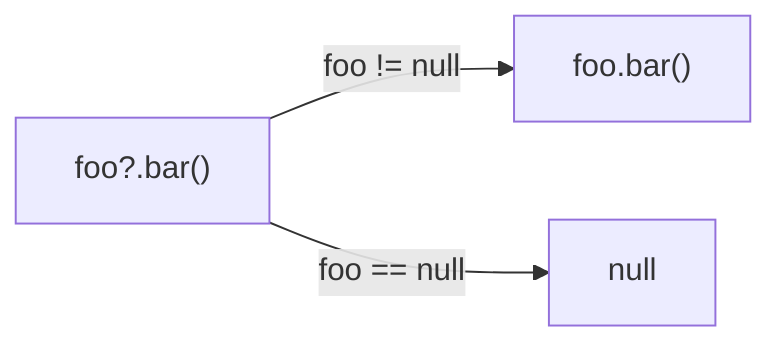
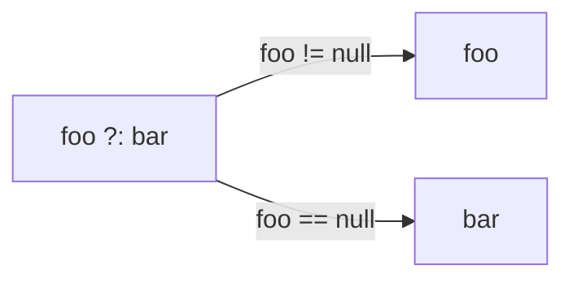
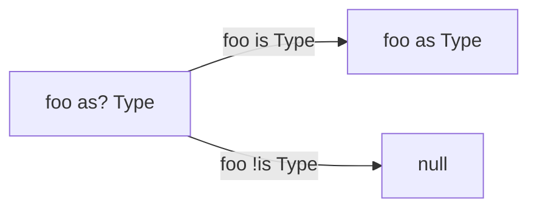
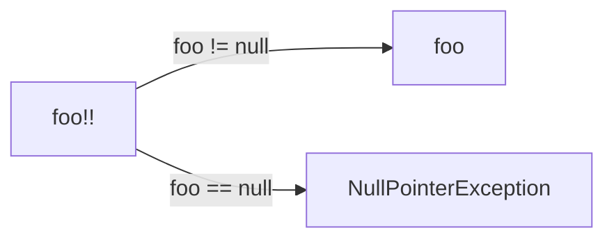
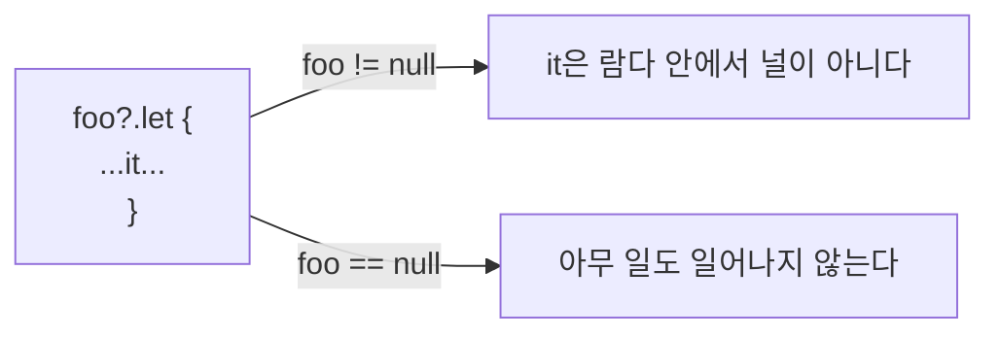
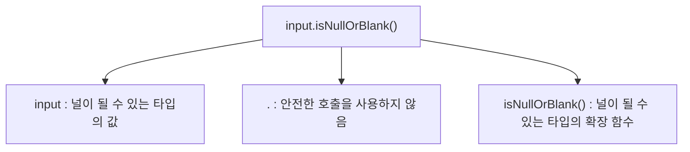
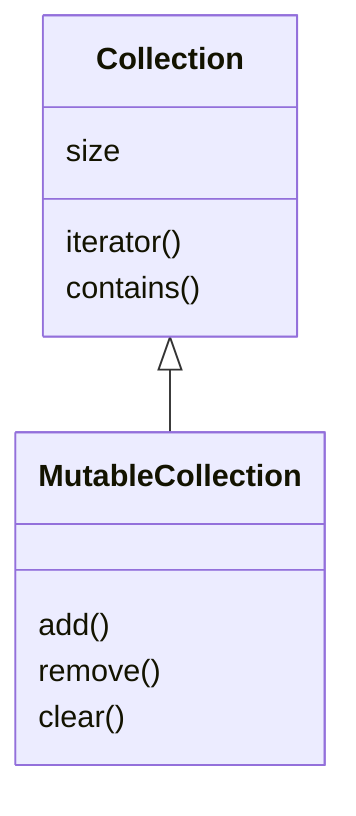
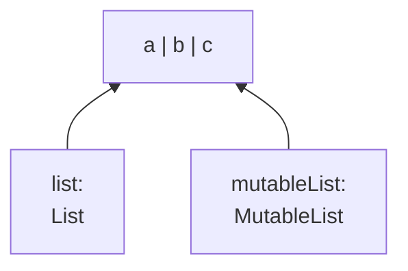

# 6장. 코틀린 타입 시스템 

## 입구
- 널이 될 수 있는 타입과 널을 처리하는 구문의 문법
- 코틀린 원시 타입 소개와 자바 타입과 코틀린 원시 타입의 관계
- 코틀린 컬렉션 소개와 자바 컬렉션과 코틀린 컬렉션의 관계

<br/>


## 6.1. 널 가능성

- NullPointerException 오류(NPE)를 피할 수 있게 돕기 위한 코틀린 타입 시스템의 특성
- 코틀린을 비롯한 최신 언어에서 null에 대한 접근 방법
  - 가능한 이 문제를 실행 시점에서 컴파일 시점으로 옮기는 것이다.

널이 될 수 있는지 여부를 타입 시스템에 추가함으로써 
컴파일러가 여러 가지 오류를 컴파일 시 미리 감지해서 실행 시점에 발생할 수 있는 예외의 가능성을 줄일 수 있다.


<br/>


## 6.1.1. 널이 될 수 있는 타입

- 코틀린과 자바의 첫 번째이자 가장 중요한 차이
  - 코틀린 타입 시스템이 널이 될 수 있는 타입을 명시적으로 지원한다는 점이다.

널이 될 수 있는 타입은 프로그램 안의 프로퍼티나 변수에 null을 허용하게 만드는 방법이다.
어떤 변수가 널이 될 수 있다면 그 변수에 대해 메소드를 호출하면 
NullPointerException이 발생할 수 있으므로 안전하지 않다.
코틀린은 그런 메소드 호출을 금지함으로써 많은 오류를 방지한다.

```java
/* 자바 */
int strLen(String s) {
    return s.length();
}
```

이 함수에 null을 넘기면 NullPointerException이 발생한다.

코틀린에서 이런 함수를 작성할 때 가장 먼저 답을 알아야 할 질문은 
"이 함수가 널을 인자로 받을 수 있는가?"이다.
여기서 널을 인자로 받을 수 있다는 말은 strLen(null)처럼 
직접 null 리터럴을 사용하는 경우뿐 아니라 변수나 식의 값이 실행 시점에 null이 될 수 있는 경우를 모두 포함한다.

널이 인자로 들어올 수 없다면 코틀린에서는 다음과 같이 함수를 정의할 수 있다.

```kotlin
fun strLen(s: String) = s.length
```

strLen에 null이거나 널이 될 수 있는 인자를 넘기는 것은 금지되며, 
혹시 그런 값을 넘기면 컴파일 시 오류가 발생한다.

```
>>> strLen(null)
ERROR: Null can not be a value of a non-null type String
```

strLen 함수에서 파라미터 s의 타입은 String인데 
코틀린에서 이는 s가 항상 String의 인스턴스여야 한다는 뜻이다.
이때 컴파일러는 널이 될 수 있는 값을 strLen에게 인자로 넘기지 못하게 막는다.
따라서 strLen 함수가 결코 실행 시점에 NullPointerException을 발생시키지 않으리라 장담할 수 있다.

이 함수가 널과 문자열을 인자로 받을 수 있게 하려면 타입 이름 뒤에 물음표(?)를 명시해야 한다.

```kotlin
fun strLenSafe(s: String?) = ...
```

타입 이름 뒤에 물음표를 붙이면 그 타입의 변수나 프로퍼티에 null 참조를 저장할 수 있다는 뜻이다.

```
Type? = Type 또는 null
```

<span style="color:orange">[제약사항 1]</span>
널이 될 수 있는 타입의 변수가 있다면 그에 대해 수행할 수 있는 연산이 제한된다.
널이 될 수 있는 타입인 변수에 대해 변수.메소드()처럼 직접 호출할 수 없다.

```kotlin
>>> fun strLenSafe(s: String?) = s.length()
ERROR: only safe (?.) or non-null asserted (!!.) calls are allowed on a nullable receiver of type kotlin.String?
```

<span style="color:orange">[제약사항 2]</span>
널이 될 수 있는 값을 널이 될 수 없는 타입의 변수에 대입할 수 없다.

```kotlin
>>> val x: String? = null
>>> var y: String = x
ERROR: Type mismatch: inferred type is String? but String was expected
```

<span style="color:orange">[제약사항 3]</span>
널이 될 수 있는 타입의 값을 널이 될 수 없는 타입의 파라미터를 받는 함수에 전달할 수 없다.

```kotlin
>>> strLen(x)
ERROR: Type mismatch: inferred type is String? but String was expected
```

null과 비교하고 나면 컴파일러는 그 사실을 기억하고 
null이 아님이 확실한 영역에서는 해당 값을 널이 될 수 없는 타입의 값처럼 사용할 수 있다.

```kotlin
fun strLenSafe(s: String?): Int =
    if (s != null) s.length else 0  // null 검사를 추가하면 코드가 컴파일된다.

>>> val x: String? = null
>>> println(strLenSafe(x))
0
>>> println(strLenSafe("abc"))
3
```

<br/>


## 6.1.2. 타입의 의미

`타입은 분류로... 타입은 어떤 값들이 가능한지와 그 타입에 대해 수행할 수 있는 연산의 종류를 결정한다.`

자바 타입 중 double은 64비트 부동소수점 수다.
double 타입의 값에 대해 일반 수학 연산을 사용할 수 있다.
따라서 double 타입의 변수가 있고 그 변수에 대한 연산을 컴파일러가 통과시킨 경우 
그 연산이 성공적으로 실행되리란 사실을 확신할 수 있다.

자바에서 String 타입의 변수에는 String이나 null이라는 두 가지 종류의 값이 들어갈 수 있다.
이 두 종류의 값은 서로 완전히 다르다.
자바 instanceof 연산자도 null이 String이 아니라고 답한다.
두 종류의 값에 대해 실행할 수 있는 연산도 완전히 다르다.
실제 String이 들어있는 변수에 대해서는 String 클래스에 정의된 모든 메소드를 호출할 수 있다.
하지만 null이 들어있는 경우에는 사용할 수 있는 연산이 많지 않다.

<span style="color:orange">이는 자바의 타입 시스템이 널을 제대로 다루지 못한다는 뜻이다.</span>
변수에 선언된 타입이 있지만 널 여부를 추가로 검사하기 전에는 그 변수에 대해 어떤 연산을 수행할 수 있을지 알 수 없다.

> ### ✅NullPointerException 오류를 다루는 다른 방법
> 자바에도 NullPointerException 문제를 해결하는 데 도움을 주는 도구가 있다. 
> 예를 들어 `애노테이션`을 사용해 값이 널이 될 수 있는지 여부를 표시(@Nullable 이나 @NotNull)하기도 한다. 
> 이런 애노테이션을 활용해 NullPointerException이 발생할 수 있는 위치를 찾아주는 도구가 있다.
> 
> 하지만 [1] 그런 도구는 표준 자바 컴파일 절차의 일부가 아니기 때문에 일관성 있게 적용된다는 보장을 할 수 없다. 
> [2] 또한 오류가 발생할 위치를 정확하게 찾기 위해 
> 라이브러리를 포함하는 모든 코드베이스에 애노테이션을 추가하는 일도 쉽지는 않다. 
> 젯브레인스에서 우리가 경험한 바로는 자바에서 가장 널리 쓰이는 
> 널 가능성 관련 애노테이션으로도 모든 NPE 문제를 해결할 수는 없었다.
> 
> 이 문제를 해결하는 다른 방법은 **null 값을 코드에서 절대로 쓰지 않는 것**이다. 
> null 대신 자바8에 새로 도입된 Optional 타입 등의 null을 감싸는 특별한 래퍼 타입을 활용할 수 있다. 
> Optional은 어떤 값이 정의되거나 정의되지 않을 수 있음을 표현하는 타입이다.
> 
> 이런 해법에는 몇 가지 **단점**이 있다. 
> [1] 코드가 더 지저분해지고 [2]래퍼가 추가됨에 따라 실행 시점에 성능이 저하되며 
> [3]전체 에코시스템에서 일관성 있게 활용하기 어렵다. 
> 여러분이 작성한 코드에서는 Optional을 사용하더라도 
> 여전히 JDK 메소드나 안드로이드 프레임워크, 다른 서드파티 라이브러리 등에서 반환되는 null을 처리해야 한다.

**코틀린의 널이 될 수 있는 타입은 이런 문제에 대해 종합적인 해법을 제공한다.**
널이 될 수 있는 타입과 널이 될 수 없는 타입을 구분하면 
각 타입의 값에 대해 어떤 연산이 가능할지 명확히 이해할 수 있고, 
실행 시점에 예외를 발생시킬 수 있는 연산을 판단할 수 있다.
따라서 그런 연산을 아예 금지시킬 수 있다.

> 실행 시점에 널이 될 수 있는 타입이나 널이 될 수 없는 타입의 객체는 같다. 
> 널이 될 수 있는 타입은 널이 될 수 없는 타입을 감싼 래퍼 타입이 아니다. 
> 모든 검사는 컴파일 시점에 수행된다. 
> 따라서 코틀린에서는 널이 될 수 있는 타입을 처리하는 데 별도의 실행 시점 부가 비용이 들지 않는다.

<br/>


## 6.1.3. 안전한 호출 연산자: ?.
코틀린이 제공하는 가장 유용한 도구 중 하나가 안전한 호출 연산자인 `?.`이다.
<span style="color:orange">`?.`은 null 검사와 메소드 호출을 한 번의 연산으로 수행한다.</span>
예를 들어 s?.toUpperCase()는 훨씬 더 복잡한 if (s != null) s.toUpperCase() else null과 같다.

호출하려는 값이 null이 아니라면 ?.은 일반 메소드 호출처럼 작동한다.
호출하려는 값이 null이면 이 호출은 무시되고 null이 결과 값이 된다.



String.toUpperCase는 String 타입의 값을 반환하지만 
s가 널이 될 수 있는 타입인 경우 s?.toUpperCase() 식의 결과 타입은 String?이다.

```kotlin
fun printAllCaps(s: String?) {
    val allCaps: String? = s?.toUpperCase() // allCaps는 널일 수도 있다.
    println(allCaps)
}

>>> printAllCaps("abc")
ABC
>>> printAllCaps(null)
null
```

메소드 호출뿐 아니라 프로퍼티를 읽거나 쓸 때도 안전한 호출을 사용할 수 있다.

```kotlin
class Employee(val name: String, val manager: Employee?)
fun managerName(employee: Employee): String? = employee.manager?.name

>>> val ceo = Employee("Da Boss", null)
>>> val developer = Employee("Bob Smith", ceo)
>>> println(managerName(developer))
Da Boss
>>> println(managerName(ceo))
null
```

객체 그래프에서 널이 될 수 있는 중간 객체가 여럿있다면 
한 식 안에서 안전한 호출을 연쇄해서 함께 사용하면 편할 때가 자주 있다.

예를 들어 어떤 사람에 대한 정보와 그 사람이 다니는 회사에 대한 정보, 
그리고 그 회사의 주소에 대한 정보를 각각 다른 클래스로 표현한다고 가정하자.
회사나 주소는 모두 생략 가능하다.
?. 연산자를 사용하면 다른 추가 검사 없이 Person의 회사 주소에서 country 프로퍼티를 단 한줄로 가져올 수 있다.

```kotlin
class Address(val streetAddress: String, val zipCode: Int, val city: String, val country: String)
class Company(val name: String, val address: Address?)
class Person(val name: String, val company: Company?)

fun Person.countryName(): String {
    // 여러 안전한 호출 연산자를 연쇄해 사용한다.
    val country = this.company?.address?.country
    return if (country != null) country else "Unknown"
}

>>> val person = Person("Dmitry", null)
>>> println(person.countryName())
Unknown
```

위 코드에는 불필요한 동작이 들어있다.
맨 마지막을 보면 country가 null인지 검사해서 정상적으로 얻은 country 값을 반환하거나 
null인 경우에 대응하는 "Unknown"을 반환한다.
코틀린을 사용하면 이런 if문도 없앨 수 있다.

<br/>


## 6.1.4. 엘비스 연산자: ?:
코틀린은 null 대신 사용할 디폴트 값을 지정할 때 편리하게 사용할 수 있는 연산자를 제공한다.
그 연산자는 엘비스(elvis) 연산자라고 한다
(널 복합(null coalescing) 연산자라는 이름도 있음).
엘비스 연산자는 `?:` 처럼 생겼다.

```kotlin
fun foo(s: String?) {
    val t: String = s ?: ""  // "s"가 null이면 결과는 빈 문자열("")이다.
}
```

이 연산자는 **이항 연산자로 좌항을 계산한 값이 널인지 검사**한다.
좌항 값이 널이 아니면 좌항 값을 결과로 하고, 좌항 값이 널이면 우항 값을 결과로 한다.




엘비스 연산자를 객체가 널인 경우 널을 반환하는 안전한 호출 연산자와 함께 사용해서 
객체가 널인 경우에 대비한 값을 지정하는 경우도 많다.

```kotlin
fun strLenSafe(s: String?): Int = s?.length ?: 0

>>> println(strLenSafe("abc"))
3
>>> println(strLenSafe(null))
0
```

전 단락의 countryName 함수도 한 줄로 표현 가능하다.

```kotlin
fun Person.countryName() = company?.address?.country ?: "Unknown"
```

코틀린에서는 return이나 throw 등의 연산도 식이다.
따라서 엘비스 연산자의 우항에 return, throw 등의 연산을 넣을 수 있고, 
엘비스 연산자를 더욱 편하게 사용할 수 있다.
그런 경우 엘비스 연산자의 좌항이 널이면 함수가 즉시 어떤 값을 반환하거나 예외를 던진다.
이런 패턴은 함수의 전제 조건을 검사하는 경우 특히 유용하다.

```kotlin
class Address(val streetAddress: String, val zipCode: Int, val city: String, val country: String)
class Company(val name: String, val address: Address?)
class Person(val name: String, val company: Company?)
fun printShippingLabel(person: Person) {
    val address = person.company?.address
        ?: throw IllegalArgumentException("No address") // 주소가 없으면 예외를 발생시킨다.
    with (address) {
        println(streetAddress)
        println("$zipCode $city, $country")
    }
}

>>> val address = Address("Elsestr. 47", 80687, "Munich", "Germany")
>>> val jetbrains = Company("JetBrains", address)
>>> val person = Person("Dmitry", jetbrains)

>>> printShippingLabel(person)
Elsestr. 47
80687 Munich, Germany

>>> printShippingLabel(Person("Alexey", null))
java.lang.IllegalArgumentException: No address
```

printShippingLabel 함수는 모든 정보가 제대로 있으면 주소를 출력한다.
`with` 함수를 사용했기 때문에 address를 한 줄에서 네 번이나 반복하지 않아도 됐다.
```kotlin
// 네 번 반복의 의미
address.streetAddress
address.zipCode
address.city
address.country
```

<br/>


## 6.1.5. 안전한 캐스트: as?
자바 타입 캐스트와 마찬가지로 대상 값을 as로 지정한 타입으로 바꿀 수 없으면 `ClassCastException`이 발생한다.
`as?` 연산자는 어떤 값을 지정한 타입으로 캐스트한다.
`as?`는 값을 대상 타입으로 변환할 수 없으면 null을 반환한다.



안전한 캐스트를 사용할 때 일반적인 패턴은 캐스트를 수행한 뒤에 엘비스 연산자를 사용하는 것이다.

```kotlin
class Person(val firstName: String, val lastName: String) {
  override fun equals(o: Any?): Boolean {
    // 타입이 서로 일치하지 않으면 false를 반환
    val otherPerson = o as? Person ?: return false
    // 안전한 캐스트를 하고나면 otherPerson이 Person 타입으로 스마트 캐스트된다.
    return otherPerson.firstName == firstName && otherPerson.lastName == lastName
  }
  
  override fun hashCode(): Int = firstName.hashCode() * 37 + lastName.hashCode()
}

>>> val p1 = Person("Dmitry", "Jemerov")
>>> val p2 = Person("Dmitry", "Jemerov")
>>> println(p1 == p2)   // == 연산자는 "equals" 메소드를 호출한다.
true
>>> println(p1.equals(42))
false
```

<br/>


## 6.1.6. 널 아님 단언: !!
널 아님 단언(not-null assertion)은 코틀린에서 널이 될 수 있는 타입의 값을 다룰 때 사용할 수 있는 도구 중에서 
가장 단순하면서도 무딘 도구다.
느낌표를 이중으로 사용하면 어떤 값이든 널이 될 수 없는 타입으로 바꿀 수 있다.
실제 널에 대해 !!를 적용하면 NPE가 발생한다.



```kotlin
fun ignoreNulls(s: String?) {
    val sNotNull: String = s!!  // 예외는 이 지점을 가리킨다.
    println(sNotNull.length)
}

>>> ignoreNulls(null)
Exception in thread "main" kotlin.KotlinNullPointerException at <...>.ignoreNulls(07_NotnullAssertions.kt:2)
```

발생한 예외는 null값을 사용하는 코드가 아니라 단언문이 위치한 곳을 가리킨다는 점에 유의하라.


> 아마도 !!가 약간 무례해 보인다는 사실(필자: ㅋㅋㅋㅋ)
> !! 기호는 마치 컴파일러에게 소리를 지르는 것 같은 느낌이 든다. 
> 사실 이는 의도한 것이다. 
> 코틀린 설계자들은 컴파일러가 검증할 수 없는 단언을 사용하기보다는 
> 더 나은 방법을 찾아보라는 의도를 넌지시 표현하려고 !!라는 못생긴 기호를 택했다.

하지만 널 아님 단언문이 더 나은 해법인 경우도 있다.
어떤 함수의 값이 널인지 검사한 다음에 다른 함수를 호출한다고 해도 
컴파일러는 호출된 함수 안에서 안전하게 그 값을 사용할 수 있음을 인식할 수 없다.
하지만 이런 경우 호출된 함수가 언제나 다른 함수에서 널이 아닌 값을 전달받는다는 사실이 분명하다면 
굳이 널 검사를 다시 수행하고 싶지는 않을 것이다.
이럴 때 널 아님 단언문을 쓸 수 있다.

```kotlin
class CopyRowAction(val list: JList<String>) : AbstractAction() {
  override fun isEnabled(): Boolean = list.selectedValue != null

  // actionPerformed는 isEnabled가 "true"인 경우에만 호출된다.
  override fun actionPerformed(e: ActionEvent) {
    val value = list.selectedValue!!
    // value를 클립보드로 복사
  }
}
```

이 경우 !!를 사용하지 않으려면 `val value = list.selectedValue ?: return`처럼 
널이 될 수 없는 타입의 값을 얻어야 한다.
이런 패턴을 사용하면 list.selectedValue가 null이면 함수가 조기 종료되므로 
함수의 나머지 본문에서는 value가 항상 널이 아니게 된다.
이 식에서 엘비스 연산자는 중복이라 할 수 있지만 나중에 isEnabled가 더 복잡해질 가능성에 대비해 
미리 보호 장치를 마련해 둔다고 생각할 수도 있다.

!!를 널에 대해 사용해서 발생하는 예외의 스택 트레이스에는 어떤 파일의 몇 번째 줄인지에 대한 정보는 들어있지만 
어떤 식에서 예외가 발생했는지에 대한 정보는 들어있지 않다.
어떤 값이 널이었는지 확실히 하기 위해 여러 !! 단언문을 한 줄에 함께 쓰는 일을 피하라.

```kotlin
person.company!!.address!!.country // 이런 식으로 코드 작성하지 말라
```

<br/>


## 6.1.7. let 함수
`let` 함수를 사용하면 널이 될 수 있는 식을 더 쉽게 다룰 수 있다.
`let` 함수를 안전한 호출 연산자와 함께 사용하면 **원하는 식을 평가해서 결과가 널인지 검사한 다음**에 
**그 결과를 변수에 넣는 작업을 간단한 식을 사용해 한꺼번에 처리**할 수 있다.
(Function selection :  https://kotlinlang.org/docs/scope-functions.html)

let을 사용하는 가장 흔한 용례는
<span style="color:orange">널이 될 수 있는 값을 널이 아닌 값만 인자로 받는 함수에 넘기는 경우</span>다.

```kotlin
fun sendEmailTo(email: String) { /*...*/ }

>>> val email: String? = ...
>>> sendEmailTo(email)
ERROR: Type mismatch: inferred type is String? but String was expected
```

인자를 넘기기 전에 주어진 값이 널인지 검사해야 한다.

```kotlin
if(email != null) sendEmailTo(email)
```

하지만 `let` 함수를 통해 인자를 전달할 수도 있다.
let 함수는 자신의 수신 객체를 인자로 전달받은 람다에게 넘긴다.
널이 될 수 있는 값에 대해 안전한 호출 구문을 사용해 let을 호출하되 
널이 될 수 없는 타입을 인자로 받는 람다를 let에 전달한다.
이렇게 하면 널이 될 수 있는 타입의 값을 널이 될 수 없는 타입의 값으로 바꿔서 람다에 전달하게 된다.



let 함수는 이메일 주소 값이 널이 아닌 경우에만 호출된다.

```kotlin
fun sendEmailTo(email: String) {
    println("Sending email to $email")
}

>>> var email: String? = "yole@example.com"
>>> email?.let { sendEmailTo(it) }
Sending email to yole@example.com

>>> email = null
>>> email?.let { sendEmailTo(it) }
```

아주 긴 식이 있고 그 값이 널이 아닐 때 수행해야 하는 로직이 있을 때 let을 쓰면 훨씬 더 편하다.
let을 쓰면 긴 식의 결과를 저장하는 변수를 따로 만들 필요가 없다.

```kotlin
val person: Person? = getTheBestPersonInTheWorld()
if (person != null) sendEmailTo(person.email)
getTheBestPersonInTheWorld()?.let { sendEmailTo(it.email) }
```

다음 getTheBestPersonInTheWorld() 함수는 null을 반환한다.
따라서 위의 람다 식은 결코 실행되지 않는다.

```kotlin
fun getTheBestPersonInTheWorld(): Person? = null
```

여러 값이 널인지 검사해야 한다면 let 호출을 중첩시켜서 처리할 수 있지만 
코드가 복잡해져서 알아보기 어려워진다.
그런 경우 일반적인 if를 사용해 모든 값을 한꺼번에 검사하는 편이 낫다.

<br/>


## 6.1.8. 나중에 초기화할 프로퍼티
객체 인스턴스를 일단 생성한 다음에 나중에 초기화하는 프레임워크가 많다.
- 예를 들어 안드로이드에서는 onCreate에서 액티비티를 초기화한다.
- 제이유닛에서는 @Before로 애노테이션된 메소드 안에서 초기화 로직을 수행해야만 한다.

하지만 코틀린에서 클래스 안의 널이 될 수 없는 프로퍼티를 생성자 안에서 초기화하지 않고 
특별한 메소드 안에서 초기화할 수는 없다.
**코틀린에서는 일반적으로 생성자에서 모든 프로퍼티를 초기화해야 한다.**
게다가 프로퍼티 타입이 널이 될 수 없는 타입이라면 반드시 널이 아닌 값으로 그 프로퍼티를 초기화해야 한다.
그런 초기화 값을 제공할 수 없으면 널이 될 수 있는 타입을 사용할 수밖에 없다.
하지만 널이 될 수 있는 타입을 사용하면 모든 프로퍼티 접근에 널 검사를 넣거나 !! 연산자를 써야 한다.

```kotlin
class MyService {
    fun performAction(): String = "foo"
}

class MyTest {
  // null로 초기화하기 위해 널이 될 수 있는 타입인 프로퍼티를 선언한다.
  private var myService: MyService ?= null
  
  @Before fun setUp() {
    myService = MyService() // setUp 메소드 안에서 진짜 초기값을 지정한다.
  }
  
  @Test fun testAction() {
    // 반드시 널 가능성에 신경 써야 한다. !!나 ?을 꼭 써야 한다.
    Assert.assertEquals("foo", myService!!.performAction())
  }
}
```

myService 프로퍼티를 나중에 초기화할 수 있다.
`lateinit` 변경자를 붙이면 프로퍼티를 나중에 초기화할 수 있다.

```kotlin
class MyService {
    fun performAction(): String = "foo"
}

class MyTest {
  // 초기화하지 않고 널이 될 수 없는 프로퍼티를 선언한다. 
  private lateinit var myService: MyService

  @Before fun setUp() {
      myService = MyService()
  }
  
  @Test fun testAction() {
    // 널 검사를 수행하지 않고 프로퍼티를 사용한다.
    Assert.assertEquals("foo", myService.performAction())
  }
}
```

나중에 초기화하는 프로퍼티는 항상 `var` 이어야 한다.
val 프로퍼티는 final 필드로 컴파일되며, 생성자 안에서 반드시 초기화해야 한다.
나중에 초기화하는 프로퍼티는 널이 될 수 없는 타입이라 해도 
더 이상 생성자 안에서 초기화할 필요가 없다.
그 프로퍼티를 초기화하기 전에 프로퍼티에 접근하면 
"lateinit property myService has not been initialized"이라는 예외가 발생한다.

> lateinit 프로퍼티를 **의존관계 주입(DI) 프레임워크**와 함께 사용하는 경우가 많다. 
> 그런 시나리오는 lateinit 프로퍼티의 값을 DI 프레임워크가 외부에서 설정해준다. 
> 다양한 자바 프레임워크와의 호환성을 위해 코틀린은 lateinit가 지정된 프로퍼티와 가시성이 똑같은 필드를 생성해준다. 
> 어떤 프로퍼티가 public이라면 코틀린이 생성한 필드도 public이다.

<br/>


## 6.1.9. 널이 될 수 있는 타입 확장
널이 될 수 있는 타입에 대한 <span style="color:orange">확장 함수</span>를 정의하면 
null 값을 다루는 강력한 도구로 활용할 수 있다.
어떤 메소드를 호출하기 전에 수신 객체 역할을 하는 변수가 널이 될 수 없다고 보장하는 대신, 
직접 변수에 대해 메소드를 호출해도 확장 함수인 메소드가 알아서 널을 처리해준다.
이런 처리는 확장 함수에서만 가능하다.
일반 멤버 호출은 객체 인스턴스를 통해 디스패치되므로 그 인스턴스가 널인지 여부를 검사하지 않는다.

```kotlin
fun verifyUserInput(input: String?) {
  // 안전한 호출을 하지 않아도 된다.
  if (input.isNullOrBlank()) {
    println("Please fill in the required fields")
  }
}

>>> verifyUserInput(" ")
Please fill in the required fields
>>> verifyUserInput(null) // isNullOrBlank에 "null"을 수신객체로 전달해도 아무런 예외가 발생하지 않는다.
Please fill in the required fields
```

안전한 호출 없이도 널이 될 수 있는 수신 객체 타입에 대해 선언된 확장 함수를 호출 가능하다.



isNullOrBlank는 널을 명시적으로 검사해서 널인 경우 true를 반환하고, 
널이 아닌 경우 isBlank를 호출한다.
isBlank는 널이 아닌 문자열 타입의 값에 대해서만 호출할 수 있다.

```kotlin
fun String?.isNullOfBlank(): Boolean =  // 널이 될 수 있는 String의 확장
    this == null || this.isBlank()  // 두 번째 "this"에는 스마트 캐스트가 적용된다.
```

널이 될 수 있는 타입에 대한 확장을 정의하면 널이 될 수 있는 값에 대해 그 확장 함수를 호출할 수 있다.
그 함수 내부에서 this는 널이 될 수 있다. 따라서 명시적으로 널 여부를 검사해야 한다.
자바에서는 메소드 안의 this는 그 메소드가 호출된 수신 객체를 가리키므로 항상 널이 아니다.
(수신 객체가 널이었다면 NPE가 발생해서 메소드 안으로 들어가지도 못한다. 
따라서 자바에서 메소드가 정상 실행된다면 그 메소드의 this는 항상 널이 아니다.) 
**코틀린에서는 널이 될 수 있는 타입의 확장 함수 안에서는 this가 널이 될 수 있다는 점이 자바와 다르다.**

앞에서 살펴본 let 함수도 널이 될 수 있는 타입의 값에 대해 호출할 수 있지만 
let은 this가 널인지 검사하지 않는다.
널이 될 수 있는 타입의 값에 대해 안전한 호출을 사용하지 않고 let을 호출하면 
람다의 인자는 널이 될 수 있는 타입으로 추론된다.

```kotlin
>>> val person: Person? = ...

// 안전한 호출을 하지 않음. 따라서 "it"은 널이 될 수 있는 타입으로 취급됨
>>> person.let { sendEmailTo(it) }
ERROR: Type mismatch: inferred type is Person? but Person was expected
```

따라서 let을 사용할 때 수신 객체가 널이 아닌지 검사하고 싶다면 예전에 살펴본
person?.let { sendEmailTo(it) } 처럼 반드시 안전한 호출 연산인 ?.을 사용해야 한다.

> 여러분이 직접 확장 함수를 작성한다면 
> 그 확장 함수를 널이 될 수 있는 타입에 대해 정의할지 여부를 고민할 필요가 있다. 
> 처음에는 널이 될 수 없는 타입에 대한 확장 함수를 정의하라. 
> 나중에 대부분 널이 될 수 있는 타입에 대해 그 함수를 호출했다는 사실을 깨닫게 되면 
> 확장 함수 안에서 널을 제대로 처리하게 되면(그 확장 함수를 사용하는 코드가 깨지지 않으므로) 
> 안전하게 그 확장 함수를 널이 될 수 있는 타입에 대한 확장 함수로 바꿀 수 있다.

<br/>


## 6.1.10. 타입 파라미터의 널 가능성
코틀린에서 함수나 클래스의 모든 타입 파라미터는 기본적으로 널이 될 수 있다.
널이 될 수 있는 타입을 포함하는 어떤 타입이라도 타입 파라미터를 대신할 수 있다.
따라서 <span style="color:orange">타입 파라미터 T</span>를 클래스나 함수 안에서 타입 이름으로 사용하면 
이름 끝에 물음표가 없더라도 T가 널이 될 수 있는 타입이다.

```kotlin
fun <T> printHashCode(t: T) {
    println(t?.hashCode())  // "t"가 널이 될 수 있으므로 안전한 호출을 써야만 한다.
}

>>> printHashCode(null) // "T"의 타입은 "Any?"로 추론된다.
null
```

printHashCode 호출에서 타입 파라미터 T에 대해 추론한 타입은 널이 될 수 있는 Any? 타입이다.
t 파라미터의 타입 이름 T에는 물음표가 붙어있지 않지만 t는 null을 반환할 수 있다.

타입 파라미터가 널이 아님을 확실히 하려면 널이 될 수 없는 **타입 상한(upper bound)**을 지정해야 한다.

```kotlin
fun <T: Any> printHashCode(t: T) {  // 이제 "T"는 널이 될 수 없는 타입이다.
    println(t.hashCode())
}

>>> printHashCode(null)
Error: Type parameter bound for `T` is not satisfied
>>> printHashCode(42)
42
```


<br/>


## 6.1.11. 널 가능성과 자바
자바 타입 시스템은 널 가능성을 지원하지 않는다. 자바와 코틀린을 조합한다면??

자바 코드에도 애노테이션으로 표시된 널 가능성 정보가 있다.
이런 정보가 코드에 있으면 코틀린도 그 정보를 활용한다.
자바의 @Nullable String은 코틀린의 String?과 같고, 
자바의 @NotNull String은 코틀린의 String과 같다.

```
@Nullable + Type = Type? 
@NotNull  + Type = Type
----------------   -----
        자바         코틀린
```

하지만 이런 널 가능성 애노테이션이 소스코드에 없는 경우 자바의 타입은 코틀린의 플랫폼 타입이 된다.

### 플랫폼 타입
플랫폼 타입은 **코틀린이 널 관련 정보를 알 수 없는 타입**을 말한다.
그 타입을 널이 될 수 있는 타입으로 처리해도 되고 널이 될 수 없는 타입으로 처리해도 된다.

코틀린은 보통 널이 될 수 없는 타입의 값에 대해 널 안전성을 검사하는 연산을 수행하면 경고를 표시하지만 
플랫폼 타입에 대해서는 아무런 경고도 표시하지 않는다.
어떤 플랫폼 타입의 값이 널이 될 수도 있음을 알고 있다면 그 값을 사용하기 전에 널인지 검사할 수 있다.
어떤 플랫폼 타입의 값이 널이 아님을 알고 있다면 널 검사 없이 그 값을 직접 사용해도 된다.
자바와 마찬가지로 당신이 틀렸다면 NPE가 발생한다.

```
Type = Type? 또는 Type 
----   --------------
 자바         코틀린
```

```java
/* 자바 */
public class Person {
private final String name;

    public Person(String name) {
        this.name = name;
    }

    public String getName() {
        return name;
    }
}
```

코틀린 컴파일러는 이 경우 getName()의 String 타입의 널 가능성에 대해 전혀 알지 못한다.

```kotlin
fun yellAt(person: Person) {
  // toUpperCase()의 수신 객체 person.name이 널이어서 예외 발생
  println(person.name.toUpperCase() + "!!!")
}

>>> yellAt(Person(null))
java.lang.IllegalArgumentException: Parameter specified as non-null is null: method toUpperCase, parameter $receiver
```

여기서 NullPointerException이 아니라 toUpperCase()가 수신 객체($receiver)로 
널을 받을 수 없다는 더 자세한 예외가 발생함에 유의하라.

실제로 코틀린 컴파일러는 public 가시성인 코틀린 함수의 널이 아닌 타입인 파리미터와 
수신 객체에 대한 널 검사를 추가해준다.
따라서 public 가시성 함수에 널 값을 사용하면 즉시 예외가 발생한다.

getName()의 반환 타입을 널이 될 수 있는 타입으로 해석해서 널 안전성 연산을 활용해도 된다.

```kotlin
fun yellAtSafe(person: Person) {
    println((person.name ?: "Anyone").toUpperCase() + "!!!")
}

>>> yellAtSafe(Person(null))
ANYONE!!!
```

> ### ✅코틀린이 왜 플랫폼 타입을 도입했는가?
> 모든 자바 타입을 널이 될 수 있는 타입으로 다루면 더 안전하지 않을까? 
> 물론 그래도 되지만 모든 타입을 널이 될 수 있는 타입으로 다루면 
> 결코 널이 될 수 없는 값에 대해서도 불필요한 널 검사가 들어간다.
> 
> 특히 제네릭을 다룰 때 상황이 더 나빠진다. 
> 예를 들어 모든 자바 ArrayList을 코틀린에서 ArrayList<String?>?처럼 다루면 
> 이 배열의 원소에 접근할 때마다 널 검사를 수행하거나 안전한 캐스트를 수행해야 한다. 
> 하지만 이런 식으로 처리하면 **널 안전성으로 얻는 이익보다 검사에 드는 비용이 훨씬 커진다.** 
> 또한 모든 타입의 값에 대해 항상 널 검사를 작성하는 것은 너무 성가신 일이다. 
> 그래서 코틀린 설계자들은 자바의 타입을 가져온 경우 
> 프로그래머에게 그 타입을 제대로 처리할 책임을 부여하는 실용적인 접근 방법을 택했다.

코틀린에서 플랫폼 타입을 선언할 수는 없다. **자바 코드에서 가져온 타입만 플랫폼 타입이 된다.**
하지만 IDE나 컴파일러 오류 메시지에는 플랫폼 타입을 볼 수 있다.

```kotlin
// null이 될 수 없는 int값을 세팅할 경우
>>> val i: Int = person.name
ERROR: Type mismatch: inferred type is String! but Int was expected
```

여기서 코틀린 컴파일러가 표시한 String!이라는 타입은 자바에서 온 타입이다.
! 표기는 String! 타입의 널 가능성에 대해 아무 정보도 없다는 뜻이다.

플랫폼 타입을 널이 될 수 있는 타입이나 널이 될 수 없는 타입 어느 쪽으로든 사용할 수 있다.

```kotlin
>>> val s: String? = person.name    // 자바 프로퍼티를 널이 될 수 있는 타입으로 볼 수 있다.
>>> val s1: String = person.name    // 자바 프로퍼티를 널이 될 수 없는 타입으로 볼 수 있다.
```

자바에서 가져온 널 값을 널이 될 수 없는 코틀린 변수에 대입하면 실행 시점에 대입이 이뤄질 때 예외가 발생한다.

### 상속
코틀린에서 자바 메소드를 오버라이드할 때 그 메소드의 파라미터와 반환 타입을 널이 될 수 있는 타입으로 선언할지 
널이 될 수 없는 타입으로 선언할지 결정해야 한다.

```java
/* 자바 */
interface StringProcessor {
    void process(String value);
}
```

코틀린 컴파일러는 다음과 같은 두 구현을 다 받아들인다.

```kotlin
class StringPrinter : StringProcessor {
  override fun process(value: String) {
    println(value)
  }
}

class NullableStringPrinter : StringProcessor {
  override fun process(value: String?) {
    if (value != null) {
        println(value)
    }
  }
}

```
자바 클래스나 인터페이스를 코틀린에서 구현할 경우 널 가능성 검사를 제대로 처리하는 일이 중요하다.

<br/>


## 6.2. 코틀린의 원시 타입

코틀린은 원시 타입과 래퍼 타입을 구분하지 않는다.

<br/>


## 6.2.1. 원시 타입: Int, Boolean 등
자바는 원시 타입과 참조 타입을 구분한다.
<span style="color:orange">원시 타입</span>의 변수에는 그 값이 직접 들어가지만,
<span style="color:orange">참조 타입</span>의 변수에는 메모리상의 객체 위치가 들어간다.
자바는 참조 타입이 필요한 경우 특별한 래퍼 타입으로 원시 타입 값을 감싸서 사용한다.
예를 들어 정수의 컬렉션을 정의하려면 Collection<int>가 아니라 Collection<Integer>를 사용해야 한다.

코틀린은 원시 타입과 래퍼 타입을 구분하지 않으므로 항상 같은 타입을 사용한다.

```kotlin
val i: Int = 1
val list: List<Int> = listOf(1, 2, 3)
```

더 나아가 코틀린에서는 숫자 타입 등 원시 타입의 값에 대해 메소드를 호출할 수 있다.

```kotlin
fun showProgress(progress: Int) {
  val percent = progress.coerceIn(0, 100)
  println("We're ${percent}% done!")
}

>>> showProgress(146)
We're 100% done!
```

실행 시점에 숫자 타입은 가능한 한 가장 효율적인 방식으로 표현된다.
대부분의 경우 코틀린의 Int 타입은 자바 int 타입으로 컴파일된다.
이런 컴파일이 불가능한 경우는 컬렉션과 제네릭 클래스를 사용하는 경우뿐이다.
예를 들어 Int 타입을 컬렉션의 타입 파라미터로 넘기면 
그 컬렉션에는 Int의 래퍼 타입에 해당하는 java.lang.Integer 객체가 들어간다.

자바 원시 타입에 해당하는 타입은 다음과 같다.

- 정수 타입: Byte, Short, Int, Long 
- 부동소수점 수 타입: Float, Double
- 문자 타입: Char
- 불리언 타입: Boolean

Int와 같은 코틀린 타입에는 널 참조가 들어갈 수 없기 때문에 
쉽게 그에 상응하는 자바 원시 타입으로 컴파일할 수 있다.
반대로 자바 원시 타입의 값은 결코 널이 될 수 없으므로 
자바 원시 타입을 코틀린에서 사용할 때도 (플랫폼 타입이 아니라) 널이 될 수 없는 타입으로 취급할 수 있다.

<br/>


## 6.2.2. 널이 될 수 있는 원시 타입: Int?, Boolean? 등
null 참조를 자바의 참조 타입의 변수에만 대입할 수 있기 때문에 
널이 될 수 있는 코틀린 타입은 자바 원시 타입으로 표현할 수 없다.
따라서 코틀린에서 널이 될 수 있는 원시 타입을 사용하면 그 타입은 자바의 래퍼 타입으로 컴파일된다.

```kotlin
data class Person(val name: String, val age: Int? = null) {
  fun isOlderThan(other: Person): Boolean? {
    if (age == null || other.age == null) return null
    return age > other.age
  }
}

>>> println(Person("Sam", 35).isOlderThan(Person("Amy", 42)))
false
>>> println(Person("Sam", 35).isOlderThan(Person("Jane")))
null
```

널이 될 가능성이 있으므로 Int? 타입의 두 값을 직접 비교할 수는 없다.

Person 클래스에 선언된 age 프로퍼티의 값은 java.lang.Integer로 저장된다.

제네릭 클래스의 경우 래퍼 타입을 사용한다.
어떤 클래스의 타입 인자로 원시 타입을 넘기면 
코틀린은 그 타입에 대한 **박스 타입**(필자: 래퍼 클래스라고도 부른다)을 사용한다.
예를 들어 다음 문장에서는 null 값이나 널이 될 수 있는 타입을 전혀 사용하지 않았지만 
만들어지는 리스트는 래퍼인 Integer 타입으로 이뤄진 리스트다.

```kotlin
val listOfInts = listOf(1, 2, 3)
```

자바 가상머신에서는 타입 인자로 원시 타입을 허용하지 않는다.
따라서 자바나 코틀린 모두에서 제네릭 클래스는 항상 박스 타입을 사용해야 한다.

<br/>


## 6.2.3. 숫자 변환
코틀린은 한 타입의 숫자를 다른 타입의 숫자로 자동 변환하지 않는다.

```kotlin
val i = 1
val l: Long = i // "Error: type mismatch" 컴파일 오류 발생
```

대신 직접 메소드를 호출해야 한다.

```kotlin
val i = 1
val l: Long = i.toLong()
```

코틀린은 Boolean을 제외한 모든 원시 타입에 대한 변환 함수를 제공한다.
양방향 변환 함수가 모두 제공된다.
표현 범위가 더 넓은 타입으로 변환하는 함수도 있고(Int.toLong()),
표현 범위가 더 좁은 타입으로 변환하면서 값을 벗어나는 경우에는 일부를 잘라내는 함수도 있다(Long.toInt()).

코틀린은 개발자의 혼란을 피하기 위해 타입 변환을 명시하기로 결정했다.
타입을 비교하는 경우 두 박스 타입 간의 equals 메소드는 그 안에 들어있는 값이 아니라 박스 타입 객체를 비교한다.
따라서 자바에서 new Integer(42).equals(new Long(42))는 false다.

```kotlin
val x = 1   // Int 타입인 변수
val list = listOf(1L, 2L, 3L)   // Long 값으로 이뤄진 리스트
x in list   // 묵시적 타입 변환으로 인해 false임
```

코틀린에서는 타입을 명시적으로 변환해서 같은 타입의 값으로 만든 후 비교해야 한다.

```kotlin
>>> val x = 1
>>> println(x.toLong() in listOf(1L, 2L, 3L))
true
```

> ### ✅원시 타입 리터럴
> 코틀린은 소스코드에서 단순한 10진수(정수) 외에 다음과 같은 숫자 리터럴을 허용한다.
>
> - L 접미사가 붙은 Long 타입 리터럴: 123L
> - 표준 부동소수점 표기법을 사용한 Double 타입 리터럴: 0.12, 2.0, 1.2e10, 1.2e-10
> - f나 F 접미사가 붙은 Float 타입 리터럴: 123.4f, .456F, 1e3f
> - 0x나 0X 접두사가 붙은 16진수 리터럴: 0xCAFEBABE, 0xbcdL
> - 0b나 0B 접두사가 붙은 2진수 리터럴: 0b000000101
>
> 코틀린 1.1부터는 숫자 리터럴 중간이 밑줄(_)을 넣울 수 있다
> (1_234, 1_0000_0000_0000L, 1_000.123_456, 0b0100_0001 등)
> 
> 문자 리터럴의 경우 자바와 마찬가지 구문을 사용한다.
> 작은따옴표 안에 문자를 넣으면 되며 이스케이프 시퀀스를 사용할 수도 있다.
> '1', '\t'(이스케이프 시퀀스로 정의한 탭 문자), '\u0009'(유니코드 이스케이프 시퀀스로 정의한 탭 문자) 등은
> 모두 코틀린 문자 리터럴이다.

숫자 리터럴을 사용할 때는 보통 변환 함수를 호출할 필요가 없다.
추가로 산술 연산자는 적당한 타입의 값을 받아들일 수 있게 이미 오버로드돼 있다.

```kotlin
fun foo(l: Long) = println(l)

>>> val b: Byte = 1 // 상수 값은 적절한 타입으로 해석된다.
>>> val l = b + 1L // + 는 Byte와 Long을 인자로 받을 수 있다.
>>> foo(42) // 컴파일러는 42를 Long 값으로 해석한다.
42
```

코틀린은 오버플로우를 검사하느라 추가 비용을 들이지 않는다.

> ### ✅문자열을 숫자로 변환하기
> 코틀린 표준 라이브러리는 문자열을 원시 타입으로 변환하는 여러 함수를 제공한다
> (toInt, toByte, toBoolean 등).
> ```kotlin
> >>> println("42".toInt())
> 42
> ```
> 이런 함수는 문자열의 내용을 각 원시 타입을 표기하는 문자열로 파싱한다.
> 파싱에 실패하면 NumberFormatException이 발생한다.

<br/>


## 6.2.4. Any, Any?: 최상위 타입
자바에서 클래스 계층의 최상위 타입은 Object. 
코틀린에서 모든 널이 될 수 없는 타입의 조상 타입은 `Any` 다.
하지만 자바에서는 원시 타입은 Object 계층에 들어있지 않다.
코틀린에서는 Any가 원시 타입을 포함한 모든 타입의 조상 타입이다.

```kotlin
val answer: Any = 42 // Any가 참조 타입이기 때문에 42가 박싱된다.
```

Any는 널이 될 수 없는 타입이므로 `Any` 타입의 변수에는 null이 들어갈 수 없다.
널을 포함하려면 `Any?` 타입을 사용해야 한다.

내부에서 Any 타입은 java.lang.Object에 대응한다.
더 정확히 말하면 널이 될 수 있는지 여부를 알 수 없으므로 플랫폼 타입인 Any!로 취급한다.
코틀린 함수가 Any를 사용하면 자바 바이트코드의 Object로 컴파일 된다.

모든 코틀린 클래스에는 toString, equals, hachCode라는 세 메소드가 들어있다.
이 세 메소드는 Any에 정의된 메소드를 상속한 것이다.
하지만 java.lang.Object에 있는 다른 메소드(wait나 notify 등)는 Any에서 사용할 수 없다.
그런 메소드를 호출하고 싶다면 Object 타입으로 값을 캐스트 해야한다.

<br/>


## 6.2.5. Unit 타입: 코틀린의 void

```kotlin
fun f(): Unit { ... }
```

이는 **반환 타입 선언 없이 정의한 블록이 본문인 함수와 같다.**

```kotlin
fun f() { ... } // 반환 타입을 명시하지 않았다.
```

`Unit`은 모든 기능을 갖는 일반적인 타입이며, void와 달리 Unit을 타입 인자로 쓸 수 있다.
Unit 타입에 속한 값은 단 하나뿐이며, 그 이름도 Unit이다.
Unit 타입의 함수는 Unit 값을 묵시적으로 반환한다.

```kotlin
interface Processor<T> {
    fun process(): T
}

class NoResultProcessor : Processor<Unit> {
  override fun process() { // Unit을 반환하지만 타입을 지정할 필요는 없다.
    // 업무 처리 코드
  } // 여기서 return을 명시할 필요가 없다.
}
```

NoResultProcessor에서 명시적으로 Unit을 반환할 필요는 없다.
컴파일러가 묵시적으로 return Unit을 넣어준다.

<br/>


## 6.2.6. Nothing 타입: 이 함수는 결코 정상적으로 끝나지 않는다
'반환 값'이라는 개념 자체가 의미 없는 함수가 일부 존재한다.
예를 들어 무한 루프를 도는 함수도 결코 값을 반환하며, 정상적으로 끝나지 않는다.
이런 경우를 표현하기 위해 코틀린에는 `Nothing`이라는 특별한 반환 타입이 있다.

```kotlin
fun fail(message: String): Nothing {
    throw IllegalStateException(message)
}

>>> fail("Error occurred")
java.lang.IllegalStateException: Error occurred
```

Nothing 타입은 아무 값도 포함하지 않는다.
Nothing을 반환하는 함수를 엘비스 연산자의 우항에 사용해서 전제 조건을 검사할 수 있다.

```kotlin
val address = company.address ?: fail("No address")
println(address.city)
```

컴파일러는 Nothing이 반환 타입인 함수가 결코 정상 종료되지 않음을 알고 
그 함수를 호출하는 코드를 분석할 때 사용한다.
위의 예제에서 컴파일러는 company.address가 널인 경우 
엘비스 연산자의 우항에서 예외가 발생한다는 사실을 파악하고 address의 값이 널이 아님을 추론할 수 있다.

<br/>


## 6.3. 컬렉션과 배열

우리는 코틀린 컬렉션이 자바 라이브러리를 바탕으로 만들어졌고 
확장 함수를 통해 기능을 추가할 수 있다는 사실을 배웠다. 
이제 코틀린의 컬렉션 지원과 자바와 코틀린 컬렉션 간에 관계에 대해 살펴보자.

<br/>

## 6.3.1. 널 가능성과 컬렉션

컬렉션 안에 널 값을 넣을 수 있는지의 여부는 
어떤 변수의 값이 널이 될 수 있는지 여부와 같이 중요하다.
컬렉션 타입 인자 뒤에 ?를 붙이면 널이 될 수 있는 값으로 이루어진 컬렉션을 만들 수 있다.

```kotlin
fun readNumbers(reader: BufferedReader): List<Int?> {
  val result = ArrayList<Int?>()  // 널이 될 수 있는 Int 값으로 이뤄진 리스트를 만든다.
  for (line in reader.lineSequence()) {
    try {
      val number = line.toInt()
      result.add(number)  // 정수(널이 아닌 값)를 리스트에 추가한다.
    } catch(e: NumberFormatException) {
      result.add(null)    // 현재 줄을 파싱할 수 없으므로 리스트에 널을 추가한다.
    }
  }
  return result
}
```

List<Int?>는 Int? 타입의 값을 저장할 수 있다.
코틀린 1.1부터는 파싱에 실패하면 null을 반환하는 String.toIntOrNull을 사용해 이 예제를 더 줄일 수 있다.

```
리스트 안의 각 값이 널이 될 수 있다.
List<Int?>
-------------------------
[Int | null]
[Int | null]
[Int | null]


전체 리스트가 널이 될 수 있다.
List<Int>?
-------------------------
[Int, Int, Int | null]
```

경우에 따라 널이 될 수 있는 값으로 이뤄진 널이 될 수 있는 리스트를 정의해야 한다면 
물음표를 2개 사용해 List<Int?>?로 표현한다.
이런 리스트를 처리할 때는 변수에 대해 널 검사를 수행한 다음에 
그 리스트에 속한 모든 원소에 대해 다시 널 검사를 수행해야 한다.

```kotlin
fun addValidNumbers(numbers: List<Int?>) {
    var sumOfValidNumbers = 0
    var invalidNumbers = 0
    // 리스트에서 널이 될 수 있는 값을 읽는다.
    for (number in numbers) {
        // 널에 대한 값을 확인한다.
        if (number != null) {
            sumOfValidNumbers += number
        } else {
            invalidNumbers++
        }
    }
    println("Sum of valid numbers: $sumOfValidNumbers")
    println("Invalid numbers: $invalidNumbers")
}

>>> val reader = BufferedReader(StringReader("1\nabc\n42"))
>>> val numbers = readNumbers(reader)
>>> addValidNumbers(numbers)
Sum of valid numbers: 43
Invalid numbers: 1
```

코틀린 표준 라이브러리 함수 `filterNotNull` 사용해 더 단순하게 만든 코드다.

```kotlin
fun addValidNumbers(numbers: List<Int?>) {
    val validNumbers = numbers.filterNotNull()
    println("Sum of valid numbers: ${validNumbers.sum()}")
    println("Invalid numbers: ${numbers.size - validNumbers.size}")
}
```
filterNotNull이 컬렉션 안에 널이 들어있지 않음을 보장해주므로 validNumbers는 List 타입이다.

<br/>


## 6.3.2. 읽기 전용과 변경 가능한 컬렉션
코틀린 컬렉션과 자바 컬렉션을 나누는 가장 중요한 특성 하나는 
코틀린에서는 컬렉션 안의 데이터에 접근하는 인터페이스와 컬렉션 안의 데이터를 변경하는 인터페이스를 분리했다는 점이다.



`MutableCollection`은 Collection을 확장하면서 컬렉션 내용을 변경하는 메소드를 더 제공한다.
어떤 컴포넌트의 내부 상태에 컬렉션이 포함된다면 
그 컬렉션을 MutableCollection을 인자로 받는 함수에 전달할 때는 
어쩌면 원본의 변경을 막기 위해 컬렉션을 복사해야할 수도 있다
(이런 패턴을 <span style="color:orange">방어적 복사</span>(defensive copy)라고 부른다).

```kotlin
fun <T> copyElement(source: Collection<T>,
                    target: MutableCollection<T>) {
  for (item in source) {  // source 컬렉션의 모든 원소에 대해 루프를 돈다.
    target.add(item)    // 변경 가능한 target 컬렉션에 원소를 추가한다.
  }
}

>>> val source: Collection<Int> = arrayListOf(3, 5, 7)
>>> val target: MutableCollection<Int> = arrayListOf(1)
>>> copyElement(source, target)
>>> println(target)
[1, 3, 5, 7]
```

target에 해당하는 인자로 읽기 전용 컬렉션을 넘길 수 없다.
(위 코드는 target에 MutableCollection을 받는다.)

```kotlin
>>> val source: Collection<Int> = arrayListOf(3, 5, 7)
>>> val target: Collection<Int> = arrayListOf(1)
>>> copyElement(source, target)    // "target" 인자에서 컴파일 오류 발생
Error: Type mismatch: inferred type is Collection<Int> but MutableCollection<Int> was expected
```

컬렉션 인터페이스를 사용할 때 항상 염두에 둬야 할 핵심은 
**읽기 전용 컬렉션이라고 해서 꼭 변경 불가능한 컬렉션일 필요는 없다.**
읽기 전용 인터페이스 타입인 변수를 사용할 때 
그 인터페이스는 실제로는 어떤 컬렉션 인스턴스를 가리키는 수많은 참조 중 하나일 수 있다.



따라서 읽기 전용 컬렉션이 항상 스레드 안전(thread safe)하지 않다는 점을 명심해야 한다.
다중 스레드 환경에서 데이터를 다루는 경우 
그 데이터를 적절히 동기화하거나 동시 접근을 허용하는 데이터 구조를 활용해야 한다.

<br/>


## 6.3.3. 코틀린 컬렉션과 자바
모든 코틀린 컬렉션은 그에 상응하는 자바 컬렉션 인터페이스의 인스턴스라는 점은 사실이다. 
따라서 코틀린과 자바를 오갈 때 아무 변환도 필요 없다. 
하지만 코틀린은 모든 자바 컬렉션 인터페이스마다 읽기 전용 인터페이스와 변경 가능한 인터페이스라는 
두 가지 표현을 제공한다.


코틀린의 읽기 전용과 변경 가능한 인터페이스의 기본 구조는 
java.util 패키지에 있는 자바 컬렉션 인터페이스의 구조를 그대로 사용하며, 
변경 가능한 각 인터페이스는 읽기 전용의 인터페이스를 확장(상속)하여 만들었다.

코틀린은 자바의 ArrayList와 HashSet이 
마치 코틀린의 MutableList, MutableSet을 상속한 것처럼 취급하여 
이런 방식을 통해 자바 호환성을 제공하며 읽기 전용과 변경 가능 인터페이스를 분리하는 모습을 보여준다.

```
컬렉션 타입 | 읽기 전용 타입 | 변경 가능 타입
List     | listOf     | mutableListOf, arrayListOf
Set      | setOf      | mutableSetOf, hashSetOf, linkedSetOf, sortedSetOf
Map      | mapOf      | mutableMapOf, hashMapOf, linkedMapOf, sortedMapOf
```

자바 메서드를 호출하되 컬렉션을 인자로 넘겨야 한다면 따로 변환하거나 
복사하는 등의 추가 작업 없이 직접 컬렉션을 넘기면 된다. 
예를 들어 java.util.Collection을 파라미터로 받는 자바 메소드가 있다면 
Collection, MutableCollection 값을 인자로 넘길 수 있다. 
이런 성질로 인해 자바는 읽기 전용 컬렉션과 변경 가능 컬렉션을 구분하지 않으므로, 
코틀린에서 읽기 전용 Collection으로 선언된 객체라도 자바 코드에서는 그 컬렉션 객체의 내용을 변경할 수 있다.

```java
/* Java */
// CollectionUtils.java
public class CollectionUtils {
    public static List<String> uppercaseAll(List<String> items) {
        for (int i = 0; i < items.size(); i++) {
            items.set(i, items.get(i).toUpperCase());
        }
        return items;
    }
}
```
```kotlin
// Kotlin
// collections.kt
// 읽기 전용 파라미터를 선언한다
fun printInUppercase(list: List<String>) {
    // 컬렉션을 변경하는 자바 함수를 호출한다
    println(CollectionUtils.uppercaseAll(list))
    // 컬렉션이 변경됐는지 살펴본다
    println(list.first())
}

>>> val list = listOf("a", "b", "c")  //읽기 전용 컬렉션
>>> println(printInUppercase(list))  //자바 메소드에 파라미터로 코틀린 읽기 전용 컬렉션 전달
[A, b, c]
A
```

코틀린에서 이를 금지할 방법이 없고, 성능을 포기하지 않고는 컬렉션에 널 값이 들어왔는지 감지할 방법도 없다. 
따라서 컬렉션을 자바 코드에게 넘길 때는 특별히 주의를 기울여야 하며, 
코틀린 쪽 타입이 적절히 자바 쪽에서 컬렉션에게 가할 수 있는 변경의 내용을 반영하게 해야 한다.

<br/>


## 6.3.4. 컬렉션을 플랫폼 타입으로 다루기
자바 코드에서 정의한 타입을 코틀린에서는 플랫폼 타입으로 본다는 사실을 알 것이다. 
코틀린 코드는 그 타입을 읽기 전용 컬렉션이나 변경 가능한 컬렉션 어느 쪽으로든 다룰 수 있다. 
보통은 동작이 잘 수행될 가능성이 높으므로 실제 문제가 되지는 않는다. 

하지만 컬렉션 타입이 시그니처에 들어간 자바 메소드 구현을 오버라이드 하려는 경우 
읽기 전용 컬렉션과 변경 가능 컬렉션의 차이가 문제가 된다.
이런 상황에서는 아래 내용을 고려하여 코틀린에서 사용할 컬렉션 타입에 반영해야 한다.

- 컬렉션이 널이 될 수 있는가?
- 컬렉션의 원소가 널이 될 수 있는가?
- 오버라이드 하는 메서드가 컬렉션을 변경할 수 있는가?

```java
/* 자바 */
interface FileContentProcessor {
    void processContents(
            File path, 
            byte[] binaryContents, 
            List<String> textContents
    );
}
```

자바 코드의 인터페이스를 코틀린으로 구현하려면 아래의 것들을 선택해야 한다.

- 일부 파일은 이진 파일이며 이진 파일 안의 내용은 텍스트로 표현할 수 없는 경우가 있으므로 리스트는 널이 될 수 있다.
- 파일의 각 줄은 널일 수 없으므로 이 리스트의 원소는 널이 될 수 없다.
- 이 리스트는 파일의 내용을 표현하며 그 내용을 바꿀 필요는 없으므로 읽기 전용이다.

(결론 : 리스트는 널이 될 수 있지만 원소는 널이 될 수 없다. 읽기 전용)

```kotlin
class FileIndexer : FileContentProcessor {
    override fun processContents(
        path: File, 
        binaryContents: ByteArray?, 
        textContents: List<String>? 
    )
}
```

다른 인터페이스와 비교해보자.
텍스트폼에서 읽은 데이터를 파싱해서 객체 리스트를 만들고, 그 리스트의 객체들을 출력 리스트 뒤에 추가하고,
데이터를 파싱하는 과정에서 발생한 오류 베시지를 별도의 리스트에 넣어서 오류를 보고한다.

```java
/* 자바 */
interface DataParser<T> {
    void parseData(String input, List<T> output, List<String> errors);
}
```

- 호출하는 쪽에서 항상 오류 메세지를 받아야 하므로 List은 널이 되면 안 된다.
- errors의 원소는 널이 될 수도 있다. 
  output에 들어가는 정보를 파싱하는 과정에서 오류가 발생하지 않으면 그 정보와 연관된 오류 메세지는 널이다.

```kotlin
class PersonParser : DataParser<Person> {
    override fun parseData(
      input: String?,
      output: MutableList<Person>,
      errors: MutableList<String?>
    )
}
```

자바에서는 같았던 List<String> 타입이 코틀린에서는 상황에 따라
List<String>?, MutableList<String?>와 같이 사용될 수 있다.
이런 선택을 제대로 하려면 자바 인테퍼이스나 클래스가 어떤 맥락에서 사용되는지 정확히 알아야 한다.

<br/>


## 6.3.5. 객체의 배열과 원시 타입의 배열

```kotlin
fun main(args: Array<String>) {
    // 배열의 인덱스 값의 범위에 대해 이터레이션하기 위해 array.indices 확장 함수를 사용한다.
    for (i in args.indices) {
        // array[index]로 인덱스를 사용해 배열 원소에 접근한다.
        println("Argument $i is: ${args[i]}")
    }
}
```

코틀린 배열은 타입 파라미터를 받는 클래스. 배열의 원소 타입은 바로 그 타입 파라미터에 의해 정해진다.
만드는 방법은 다양하다.

- arrayOf 함수에 원소를 넘기면 배열을 만들 수 있다.
- arrayOfNulls 함수에 정수 값을 인자로 넘기면 모든 원소가 null이고 
  인자로 넘긴 값과 크기가 같은 배열을 만들 수 있다.
- Array 생성자는 배열 크기와 람다를 인자로 받아서 람다를 호출해서 각 배열 원소를 초기화 해준다.

```kotlin
val letters = Array<String>(26) { i -> ('a' + i).toString() }
println(letters.joinToString(""))

abcdefghijklmnopqrstuvwxyz
```

람다는 배열 원소의 인덱스를 인자로 받아서 배열의 해당 위치에 들어갈 원소를 반환한다.
데이터가 이미 컬렉션에 들어있다면, 배열로 변환해야 한다. toTypedArray() 사용한다.

```kotlin
>>> val strings = listOf("a", "b", "c")
// vararg 인자를 넘기기 위해 스프레드 연산자(*)를 써야 한다
>>> println("%s/%s/%s".format(*strings.toTypedArray()))
output: a/b/c
```

다른 제네릭 타입에서처럼 배열 타입의 타입 인자도 항상 객체 타입이 된다.
객체 타입으로 박싱하지 않은 원시 타입의 배열이 필요하다면 그런 타입을 위한 특별한 배열 클래스를 사용해야 한다.
코틀린은 **원시 타입의 배열을 표현하는 별도 클래스를 각 원시 타입마다 하나씩 제공**한다.
예를 들어, Int 타입의 배열은 IntArray다.
ByteArray, CharArray, BooleanArray 등 제공한다.
이 모든 타입은 자바 원시 타입 배열인 int [], byte[], char[] 등으로 컴파일된다.
따라서 그런 배열의 값은 박싱 하지 않고 가장 효율적인 방식으로 지정된다.

원시 타입의 배열을 만드는 방법은 다음과 같다.
- 각 배열 타입의 생성자는 size 인자를 받아서 해당 원시 타입의 디폴트 값으로 초기화된 size 크기의 배열을 반환한다.
- 팩토리 함수는 여러 값을 가변 인자로 받아서 그런 값이 들어간 배열을 반환한다.
- (일반 배열과 마찬가지로) 크기와 람다를 인자로 받는 생성자를 사용한다.

```kotlin
// 위의 첫번째와 두번째 방법으로 배열 만들기
val fiveZeros = IntArray(5)
val fiveZerosToo = intArrayOf(0, 0, 0, 0, 0)
```
```kotlin
// 람다를 인자로 받는 생성자를 사용하는 방법
val squares = IntArray(5) { i -> (i+1) * (i+1) }
println(squares.joinToString())
```

원시 타입인 원소로 이뤄진 배열에도 확장 함수(filter, map)를 똑같이 사용할 수 있다.
다만 이런 함수가 반환하는 값은 배열이 아니라 리스트이다.

```kotlin
// 배열에 forEachIndexed 사용하기 
fun main(args: Array<String>) {
  args.forEachIndexed { index, element ->
    println("Argument $index is: $element")
  }
}
```

<br/>


<br/>
<br/>
<br/>
<br/>
<br/>
<br/>
<br/>
<br/>
<br/>