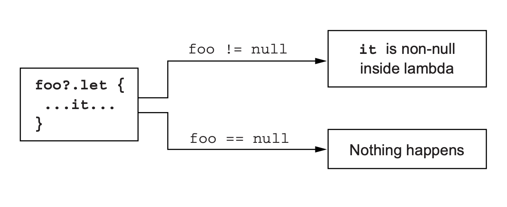
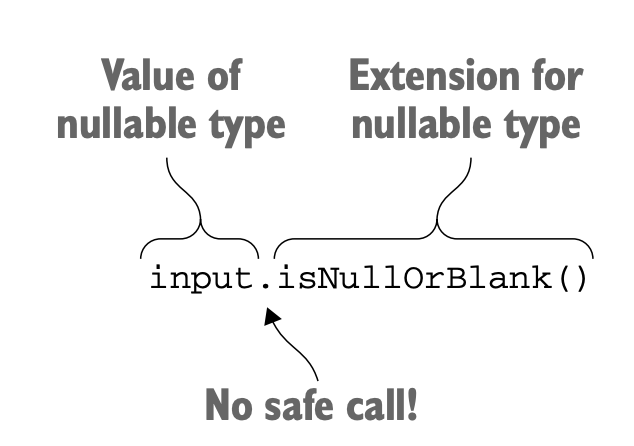
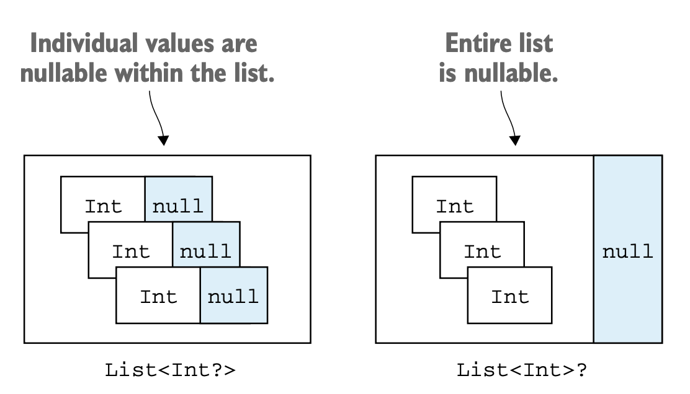
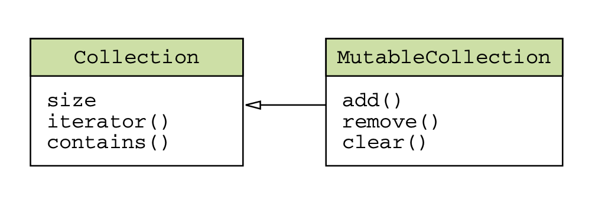
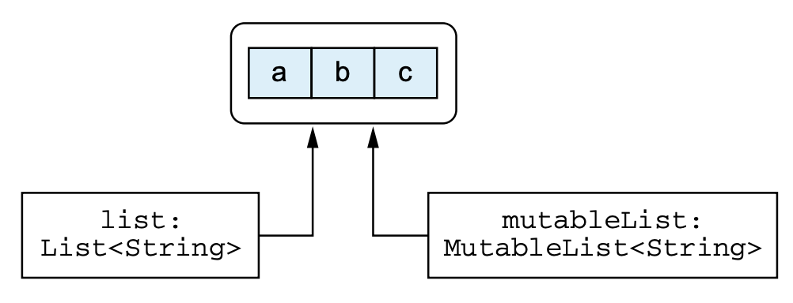
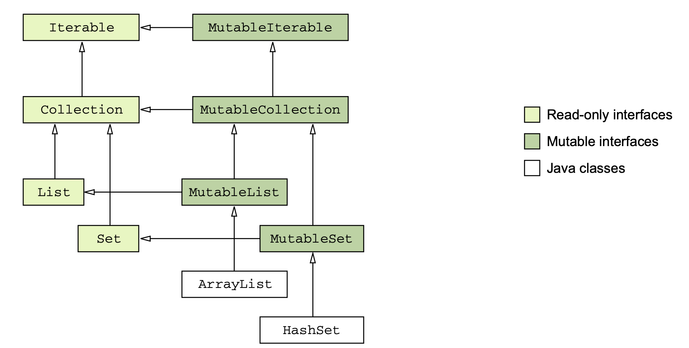
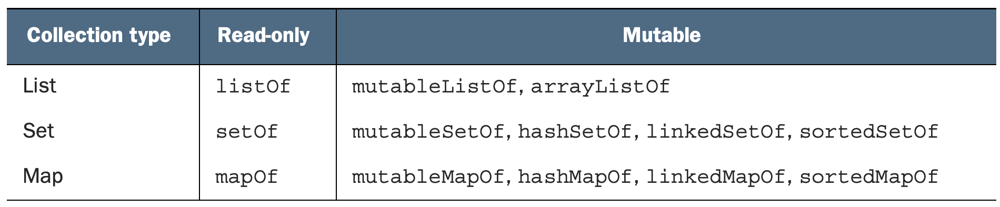

# 6. 코틀린 타입 시스템

> - 널이 될 수 있는 타입과 널을 처리하는 구문의 문법
- 코틀린 원시 타입 소개와 자바 타입과 코틀린 원시 타입의 관계
- 코틀린 컬렉션 소개와 자바 컬렉션과 코틀린 컬렉션의 관계
> 

# 6.1 널 가능성

널 가능성(nullablility)은 NullPointerException 오류(간단히 NPE라고도 쓴다)를 피할 수 있게 돕기 위한 코틀린 타입 시스템의 특성이다.

코틀린을 비롯한 최신 언어에서 null에 대한 접근 방법은 가능한 한 이문제를 실행시점에서 컴파일 시점으로 옮기는 것이다. 널이 될 수 있는지 여부를 타입 시스템에 추가함으로써 컴파일러가 여러 가지 오류를 컴파일 시 미리 감지해서 실행 시점에 발생할 수 있는 예외의 가능성을 줄일 수 있다.

## 6.1.1 널이 될 수 있는 타입

코틀린과 자바의 첫 번째이자 가장 중요한 차이는 코틀린 타입 시스템이 널이 될 수 있는 타입을 명시적으로 지원한다는 점이다.

널이 될 수 있는 타입은 프로그램 안의 프로퍼티나 변수에 null을 허용하게 만드는 방법이다. 어떤 변수가 널이 될 수 있다면 그 변수에 대해 메소드를 호출하면 NPE가 발생할 수 있으므로 안전치 않다.

코틀린은 그런 메소드 호출을 금지함으로써 많은 오류를 방지한다.

```kotlin
/* 자바 */
int setLen(String s) {
		return s.length();
}
```

이 함수에 null을 넘기면 NPE가 발생한다. 그렇다면 이 함수에서 s가 null인지 꼭 검사해야 할까? 검사가 필요할지 여부는 이 함수를 사용하는 의도에 따라 달라진다.

이 함수를 코틀린으로 다시 작성해보자. 코틀린에서 이런 함수를 작성할 때 가장 먼저 답을 알아야 할 질문은 “이 함수가 널을 인자로 받을 수 있는가?”이다.

여기서 널을 인자로 받을 수 있다는 말은 strLen(null) 처럼 직접 `null` 리터럴을 사용하는 경우뿐 아니라 변수나 식의 값이 실행 시점에 `null`이 될 수 있는 경우를 모두 포함한다.

널이 인자로 들어올 수 없다면 코틀린에서는 다음과 같이 함수를 정의할 수 있다.

```kotlin
fun strLen(s : String) = s.length
```

strLen에 null이거나 널이 될 수 있는 인자를 넘기는 것은 금지되며, 혹시 그런 값을 넘기면 컴파일 시 오류가 발생한다

```kotlin
>>> strLen(null)
Kotlin: Null can not be a value of a non-null type String
```

이 함수가 널과 문자열을 인자로 받을 수 있게 하려면 타입 이름 뒤에 물음표(`?`)를 명시해야 한다

```kotlin
fun strLenSafe(s: String?) = ...
```

어떤 타입이든 타입 이름 뒤에 물음표를 붙이면 그 타입의 변수나 프로퍼티에 null 참조를 저장할 수 있다는 뜻이다

널이 될 수 있는 타입의 변수가 있다면, 그에 대해 수행할 수 있는 연산이 제한된다

- 널이 될 수 있는 타입인 변수에 대해 변수.메소드()처럼 메소드를 직접 호출할 수는 없다

```kotlin
>>> fun strLenSafe(s: String?) = s.length()
Only safe (?.) or non-null asserted (!!.) calls are allowed on a nullable receiver of type String?
```

- 널이 될수 있는 값을 널이 될 수 없는 타입의 변수에 대입할 수 없다.

```kotlin
>>> val x : String? = null
>>> var y: String = x
Kotlin: Type mismatch: inferred type is String? but String was expected
```

- 널이 될 수 있는 타입의 값을 널이 될 수 없는 타입의 파라미터를 받는 함수에 전달할 수 없다

```kotlin
fun strLen(s:String) = s.length

val x: String? = null    
strLen(x)
Kotlin: Type mismatch: inferred type is String? but String was expected
```

이렇게 제약이 많다면 널이 될 수 있는 타입의 값으로 대체 뭘 할 수 있을까? 가장 중요한 일은 바로 null과 비교하는 것이다.

일단 null과 비교하고 나면 컴파일러는 그 사실을 기억하고 null이 아님이 확실한 영역에서는 해당 값을 널이 될 수 없는 타입의 값처럼 사용할 수 있다

```kotlin
fun strLenSafe(s: String?): Int =
    if (s != null) s.length else 0

>>> val x: String? = null
>>> println(strLenSafe(x))
0
>>> println(strLenSafe("abc"))
3
```

코틀린은 널이 될 수 있는 값을 다룰 때 도움이 되는 여러 도구를 제공한다

## 6.1.2 타입의 의미

타입이란 무엇이고 왜 변수에 타입을 지정해야하는 걸까?

> 타입은 분류로 ... 타입은 어떤 값들이 가능한지와 그 타입에 대해 수행할 수 있는 연산의 종류를 결정한다
> 

이런 정의를 자바 타입 중 몇가지에 대해 적용해보자

**Double 타입**

- 64비트 부동소수점 수
- double 타입의 값에 대해 일반 수학 연산을 수행할 수 있다
- dobule 타입에 속한 값이라면 어떤 값이든 관계없이 모든 일반 수학 연산 함수를 적용할 수 있다
- 따라서 dobule 타입의 변수가 있다면 이에 대한 연산을 컴파일러가 통과시킨 경우 연산이 성공적으로 실행될 수 있다는 사실을 확신할 수 있다.

**String 타입**

- 자바에서 String 타입의 변수에는 String이나 null이라는 두가지 종류의 값이 들어갈 수 있다.
- String과 null은 서로 완전히 다르다. 심지어 instanceof 연산자도 null이 String이 아니라고 답한다.
- 두 종류의 값에 대해 실행할 수 있는 연산도 완전히 다르다
- String인 변수는 String 클래스에 정의된 모든 메소드를 호출할 수 있지만, null인 들어있는 경우에는 사용할 수 있는 연산이 많지 않다

자바의 타입 시스템이 Null을 제대로 다루지 못한다는 뜻이다.

- 변수에 선언된 타입이 있지만 널 여부를 추가로 검사하기 전에는 그 변수에 대해 어떤 연산을 수행할 수 있을지 알 수 없다.
- 프로그램의 데이터 흐름 속에서 특정 위치에 특정 변수가 절대로 널일 수 없다는 사실을 확신하고 이런 검사를 생략하는 경우가 자주 있다. 하지만 생각대로 되지 않아 널이 들어오게 된다면 프로그램이 NPE 예외를 발생시키며 오류로 중단된다

코틀린의 널이 될 수 있는 타입은 이런 문제에 대해 종합적인 해법을 제공한다.

- 널이 될 수 있는 타입과 널이 될 수 없는 타입을 구분하면 각 타입의 값에 대해 어떤 연산이 가능할지 명확히 이해할 수 있다
- 실핼 시점에 예외를 발생시킬 수 있는 연산을 판단할 수 있다

## 6.1.3 안전한 호출 연산자: `?.`

`?.`은 `null` 검사와 메소드 호출을 한 번의 연산으로 수행한다

```kotlin
s?.toUpperCase()
는
if ( s != null) s.toUpperCase() else null
과 같은 기능을 한다
```

호출하려는 값이 null이면 메소드 호출은 무시되고 null이 결과 값이 된다.

**안전한 호출의 결과 타입도 널이 될 수 있는 타입이다**

메소드 호출 뿐 아니라 프로퍼티를 읽거나 쓸 때도 안전한 호출을 사용할 수 있다

```kotlin
class Employee(val name: String, val manager: Employee?)

fun managerName(employee: Employee) : String? = employee.manager?.name

>>> val ceo = Employee("Da Boss", null)
>>> val developer = Employee("Bob Smith", ceo)
>>> println(managerName(developer))
Da Boss
>>> println(managerName(ceo))
null
```

객체 그래프에서 널이 될 수 있는 중간 객체가 여럿 있다면 하나의 식 안에서 안전한 호출을 연쇄해서 사용하면 편할 떄가 있다

```kotlin
class Address(
	val streetAddress: String, 
	val zipCode: Int,
	val city: String,
	val country: String
)

class Company(
	val name: String,
	val address: Address?
)

class Person(
	val name: String,
	val company: Company?
)

fun Person.countryName() : String {
    val country = this.company?.address?.country
    return if ( country != null) country else "Unknown"
}

>>> val person = Person("Dmitry", null)
>>> println(person.countryName())
Unknown
```

## 6.1.4 엘비스 연산자: `?:`

코틀린은 null 대신 사용할 디폴트 값을 지정할 때 편리하게 사용할 수 있는 **엘비스 연산자(`?:`)**를 제공한다

- ~~더 심각한 이름을 좋아하는 사람을 위해~~ **널 복합(null coalescing) 연산자**라는 이름도 있다

```kotlin
fun foo(s: String?){
	val t: String = s ?: ""
}
```

이 연산자는 이항 연산자로 좌항의 계산한 값이 널인지 검사하고, 널이 아니라면 좌항 값을, 널이라면 우항 값을 결과로 한다

앞 예제 [리스트 6.1](https://www.notion.so/6-04ae897b47404393acc4902403da8e5a)을 줄여 쓰면 아래 예제와 같다

```kotlin
fun strLenSafe(s: String?): Int = s?.length ?: 0
>>> println(strLenSafe("abc"))
3
>>> println(strLenSafe(null))
0
```

코틀린에서는 return이나 throw 등의 연산도 식이다

- 따라서 엘비스 연산자의 우항에 return, throw등의 연산을 넣을 수 있다
- 이런 경우 엘비스 연산자의 좌항이 널이면 함수가 즉시 어떤 값을 반환하거나 예외를 던질 수 있다
- 이러한 패턴은 함수의 전제 조건을 검사하는 경우 특히 유용하다

```kotlin
class Address(val streetAddress: String, val zipCode: Int, val city: String, val country: String)
class Company(val name: String, val address: Address?)
class Person(val name: String, val company: Company?)

fun printShippingLabel(person: Person){
    val address = person.company?.address ?: 
				throw IllegalArgumentException("No address")

    with (address){
        println(streetAddress)
        println("$zipCode $city, $country")
    }
}

>>> val address = Address("Elsestr. 47", 80687, "Munich", "Germany")
>>> val jetbrains = Company("JetBrains", address)
>>> val person = Person("Dmitry", jetbrains)

>>> printShippingLabel(person)
Elsestr. 47
80687 Munich, Germany

>>> printShippingLabel(Person("Alexey", null))
Exception in thread "main" java.lang.IllegalArgumentException: No address
```

## 6.1.5 안전한 캐스트: `as?`

`as?` 연산자는 어떤 값을 지정한 타입으로 캐스트한다.

`as?`는 값을 대상 타입으로 변환할 수 없으면 null을 반환한다.

- 안전한 캐스트를 사용할 때 일반적인 패턴은 캐스트를 수행한 뒤에 엘비스 연산하를 사용하는 것이다

```kotlin
class Person(val firstName: String, val lastName: String){
    override fun equals(o: Any?): Boolean {
       val otherPerson = o as? Person ?: return false
        return otherPerson.firstName == firstName &&
                otherPerson.lastName == lastName
    }

    override fun hashCode(): Int =
        firstName.hashCode() * 37 + lastName.hashCode()
}

>>> val p1 = Person("Dmitry", "Jemerov")
>>> val p2 = Person("Dmitry", "Jemerov")
>>> println(p1 == p2)
true
>>> println(p1.equals(42))
false
```

이 패턴을 사용하면 파라미터로 받은 값이 원하는 타입인지 쉽게 검사하고 캐스트 할 수 있고, 타입이 맞지 않으면 쉽게 `false`를 반환할 수 있다.

안전한 호출, 안전한 캐스트, 엘비스 연산자는 유용하기 때문에 코틀린 코드에 자주 나타난다

하지만, 때로는 코틀린의 널 처리 지원을 활용하는 대신 직접 컴파일러에게 어떤 값이 널이 아니라는 사실을 알려주고 싶은 경우가 있다. 아래에서 계속 된다

## 6.1.6 널 아님 단언: `!!`

널 아님 단언(not-null assertion)은 코틀린에서 널이 될 수 있는 타입의 값을 다룰 때 사용할 수 있는 도구 중에서 가장 단순하면서도 무딘 도구다.

느낌표를 이중(`!!`)으로 사용하면 어떤 값이든 널이 될 수 없는 타입으로 강제로 바꿀 수 있다

→ 실제 널에 대해 !!를 적용하면 `NPE`가 발생한다

```kotlin
fun ignoreNulls(s: String?){
    val sNotNull: String = s!!
    println(sNotNull.length)
}

>>> ignoreNulls(null)
Exception in thread "main" java.lang.NullPointerException
```

근본적으로 !!는 컴파일러에게 “이 값이 `null`이 아님을 잘 알고 있다. 내가 잘못 생각했다면 예외가 발생해도 감수하겠다"라고 말하는 것이다

`!!`를 널에 대해 사용해서 발생하는 예외의 스택 트레이스에는 어떤 파일의 몇 번째 줄인지에 대한 정보는 들어있지만 어떤 식에서 예외가 발생했는지에 대한 정보는 들어있지 않다.

**어떤 값이 널이었는지 확실하게 하기 위해 여러 !! 단언문을 한 줄에 함께 쓰는 일을 피해라**

```kotlin
person.company!!.address!!.country // 이런 식으로 코드를 작성하지 말아라
```

## 6.1.7 let 함수

`let`함수를 사용하면 널이 될 수 있는 식을 더 쉽게 다룰 수 있다

- let함수를 안전한 호출 연산자와 함께 사용하면 원하는 식을 평가해서 결과가 널인지 검사한 다음에 결과를 변수에 넣는 작업을 간단한 식을 사용해 한꺼번에 처리할 수 있다

`let`을 사용하는 가장 흔한 용례는 널이 될 수 있는 값을 널이 아닌 값만 인자로 받는 함수에 넘기는 경우다.

```kotlin
fun sendEmailTo(email: String) { /*...*/ }

>>> val email: String? = ...
>>> sendEmailTo(email)
Kotlin: Type mismatch: inferred type is String? but String was expected

// 인자를 넘기기 전에 주어진 값이 널인지 검사해야한다
if (email != null) sendEmailTo(email)
```

let 함수를 통해 인자를 전달할 수도 있다.

- 자신의 수신 객체를 인자로 전달받은 람다에게 넘긴다
- 널이 될 수 있는 값에 대해 안전한 호출 구문을 사용해 let을 호출하되 널이 될 수 없는 타입을 인자로 받는 람다를 `let`에 전달한다
- 이렇게 하면 *널이 될수 있는타입의 값*을 *널이 될 수 없는 타입의 값*으로 바꿔서 람다에 전달하게 된다



```kotlin
fun sendEmailTo(email: String){
    println("Sending email to $email")
}

>>> var email: String? = "yole@example.com"
>>> email?.let { sendEmailTo(it) }
Sending email to yole@example.com

>>> email = null
>>> email?.let { sendEmailTo(it) }
```

아주 긴 식이 있고 그 값이 널이 아닐 때 수행해야하는 로직이 있을 때 let을 쓰면 훨씬 편리하다

let을 쓰면 긴 식의 결과를 저장하는 변수를 따로 만들 필요가 없다

```kotlin
val person: Person? = getTheBestPersonInTheWorld()
if (person != null) sendEmailTo(person.email)

// 굳이 person 변수를 추가할 필요 없이 다음과 같이 쓸 수 있다

getTheBestPersonInTheWorld()?.let { sendEmailTo(it.name) }
```

여러 값이 널인지 검사해야 한다면 `let` 호출을 중첩시켜서 처리할 수 있다.

- `let`을 중첩시켜 처리하면 코드가 복잡해져서 알아보기 어려워진다
- 일반적인 `if`를 사용해 모든 값을 한꺼번에 검사하는 편이 낫다

## 6.1.8 나중에 초기화할 프로퍼티

실제로는 널이 될 수 없는 프로퍼티인데 생성자 안에서 널이 아닌 값으로 초기화할 방법이 없는 경우가 있다.

- 안드로이드 - `onCreate`에서 `Activity`를 초기화한다
- JUnit - `@Before`로 애노테이션된 메소드 안에서 초기화 로직을 수행해야만 한다

코틀린에서 클래스 안의 널이 될 수 없는 프로퍼티를 생성자 안에서 초기화하지 않고 특별한 메소드 안에서 초기화할 수는 없다

- 일반적으로 생성자에서 모든 프로퍼티를 초기화해야한다
- 프로퍼티 타입이 널이 될 수 없는 타입이라면 반드시 널이 아닌 값으로 프로퍼티를 초기화해야한다

초기화 값을 제공할 수 없으면 **널이 될 수 있는 타입**을 사용할 수 밖에 없다

- 널이 될 수 있는 타입을 사용하면 모든 프로퍼티 접근에 `null` 검사를 넣거나 `!!` 연산자를 써야한다

```kotlin
class MyService {
	fun performAction() : String = "foo"
}

class MyTest {
	// null로 초기화하기 위해 널이 될 수 있는 타입인 프로퍼티를 선언한다
  private var myService: MyService? = null
  
  @Before fun setUp(){
		// setUp 메소드 안에서 진짜 초기값을 지정한다
    myService = MyService()
  }
  
  @Test fun testAction(){
		// 반드시 널 가능성에 신경 써야 한다.
    Assert.assertEquals("foo", myService!!.performAction())
  }
}
```

프로퍼티를 여러 번 사용해야 하면 코드에 `!!`나 `?`가 많아져 보기 나빠진다

이를 해결하기 위해 myService 프로퍼티를 **나중에 초기화(late-initialized)**할 수 있다

- lateinit 변경자를 붙이면 프로퍼티를 나중에 초기화할 수 있다

```kotlin
class MyService {
    fun performAction() : String = "foo"
}
class MyTest {
    // 초기화하지 않고 널이 될 수 없는 프로퍼티를 선언한다
    private lateinit var myService: MyService

    @Before fun setUp(){
        myService = MyService()
    }

    @Test fun testAction(){
        // 널 검사를 수행하지 않고 프로퍼티를 사용한다
        Assert.assertEquals("foo", myService.performAction())
    }
}
```

- 나중에 초기화하는 프로퍼티는 항상 var여야한다
    
    → val 프로퍼티는 final 필드로 컴파일되며, 생성자 안에서 반드시 초기화해야한다
    
- 따라서 생성자 밖에서 초기화해야하는 lateinit 프로퍼티는 항상 var여야 한다
- lateinit 프로퍼티는 널이 될 수 없는 타입이라 해도 더 이상 생성자 안에서 초기화할 필요가 없다
- 프로퍼티를 초기화하기 전에 프로퍼티에 접근하면 “lateinit property myService has not been initialized” 예외가 발생한다.
    
    → 단순한 NPE보다 어디가 잘못됐는지 확실히 알 수 있다.
    

## 6.1.9 널이 될 수 있는 타입 확장

널이 될 수 있는 타입에 대한 확장 함수를 정의하면 `null` 값을 다루는 강력한 도구로 활용할 수 있다.

- 어떤 메소드를 호출하기 전에 수신 객체 역할을 하는 변수가 널이 될 수 없다고 보장하는 대신, 직접 변수에 대해 메소드를 호출해도 확장 함수인 메소드가 알아서 널을 처리해 준다.
- 이런 처리는 확장함수에서만 가능하다
- 일반 멤버 호출은 객체 인스턴스를 통해 디스패치 되므로 그 인스턴스가 널인지 여부를 검사하지 않는다

```kotlin
fun verifyUserInput(input: String?){
    if (input.isNullOrBlank()){
        println("Please fill in the required fields")
    }
}

>>> verifyUserInput(" ")
Please fill in the required fields

>>> verifyUserInput(null) // "null"을 수신 객체로 전달해도 아무런 예외가 발생하지 않는다
Please fill in the required fields
```

안전한 호출 없이도 널이 될 수 있는 수신 객체 타입에 대해 선언된 확장 함수를 호출 가능하다

- 함수는 `null` 값이 들어오는 경우 이를 적절히 처리한다
    
    
    
- isNullOrBlank는 널을 명시적으로 검사해서 널인 경우 true를 반환하고, 널이 아닌 경우 isBlank를 호출한다. isBlank는 널이 아닌 문자열 타입의 값에 대해서만 호출할 수 있다.

```kotlin
fun String?.isNullOrBlank(): Boolean = this == null || this.isBlank()
```

널이 될 수 있는 타입(그런 타입은 ?로 끝난다)에 대한 확장을 정의하면 널이 될 수 있는 값에 대해 그 확장 함수를 호출할 수 있다.

그 함수의 내부에서 this는 널이 될 수 있다. 따라서 명시적으로 널 여부를 검사해야한다.

- 자바에서는 메소드 안의 this는 그 메소드가 호출된 수신 객체를 가리키므로 항상 널이 아니다.
- 코틀린에서는 널이 될 수 있는 타입의 확장 함수 안에서는 this가 널이 될 수 있다.

`let` 함수도 널이 될 수 있는 타입의 값에 대해 호출할 수 있지만 `let`은 `this`가 널인지 검사하지 않는다

- 널이 될 수 있는 타입의 값에 대해 안전한 호출을 사용하지 않고 let을 호출하면 람다의 인자는 널이 될 수 있는 타입으로 추론된다.

```kotlin
>>> val person: Person? = ...
// 안전한 호출을 하지 않음. 따라서 "it"은 널이 될 수 있는 타입으로 취급됨
>>> person.let { sendEmailTo(it) }
Kotlin: Type mismatch: inferred type is Person? but String was expected
```

따라서 let을 사용할 때 수신 객체가 널이 아닌지 검사하고 싶다면 예전에 살펴본 person?.let { sendEmailTo(it) }처럼 반드시 안전한 호출 연산인 `?.`을 사용해야 한다

## 6.1.10 타입 파라미터의 널 가능성

코틀린에서는 함수나 클래스의 모든 타입 파라미터는 기본적으로 널이 될 수 있다.

- 널이 될 수 있는 타입을 포함하는 어떤 타입이라도 타입 파라미터를 대신할 수 있다
- 타입 파라미터 T를 클래스나 함수 안에서 타입 이름으로 사용하면 **이름 끝에 물음표가 없더라도 T가 널이 될 수 있는 타입**이다

```kotlin
fun <T> printlnHashCode(t: T){
    println(t?.hashCode())
}
>>> printlnHashCode(null)
null
```

`printHashCode` 호출에서 타입 파라미터 `T`에 대한 추론한 타입은 널이 될 수 있는 `Any?` 타입이다.

- `t` 파라미터의 타입 이름 `T`에는 물음표가 붙어있지 않지만 `t`는 `null`을 받을 수 있다

타입 파라미터가 널이 아님을 확실히 하려면 널이 될 수 없는 타입 상한(upper bound)를 지정해야한다

```kotlin
fun <T: Any> printlnHashCode(t: T){
    println(t.hashCode())
}
>>> printlnHashCode(null)
Kotlin: Null can not be a value of a non-null type TypeVariable(T)
>>> printlnHashCode(42)
42
```

## 6.1.11 널 가능성과 자바

자바 타입 시스템은 널 가능성을 지원하지 않는다

- 자바코드에도 애노테이션으로 표시된 널 가능성 정보가 있다

이런 정보가 코드에 있으면 코틀린도 그 정보를 활용한다

코틀린은 여러 널 가능성 애노테이션을 알아본다.

- JSR-305 표준
- 안드로이드
- JetBrains 도구들이 지원하는 애노테이션

등등 코틀린이 이해할 수 있는 널 가능성 애노테이션들이다

이런 널 가능성 애노테이션이 소스코드에 없는 경우, 자바의 타입은 코틀린의 **플랫폼 타입**이 된다

### 플랫폼 타입

플랫폼 타입은 코틀린이 널 관련 정보를 알 수 없는 타입을 말한다

- 널이 될 수 있는 타입으로 처리해도 되고, 널이 될 수 없는 타입으로 처리해도 된다
- 자바와 마찬가지로 플랫폼 타입에 대해 수행하는 모든 연산에 대한 책임은 온전히 개발자에게 있다는 뜻이다

컴파일러는 모든 연산을 허용한다

- 코틀린은 보통 널이 될 수 없는 타입의 값에 대해 널 안전성을 검사하는 연산을 수행하면 경고를 표시한다
- 플랫폼 타입의 값에 대해 널 안전성 검사를 중복 수행해도 아무 경고도 표시하지 않는다.

자바로 선언된 Person 클래스가 있다

```kotlin
public class Person {
    private final String name;

    public Person(String name) {
        this.name = name;
    }

    public String getName() {
        return name;
    }
}
```

getName은 null을 리턴할까 아닐까? 코틀린 컴파일러는 String 타입의 널 가능성에 대해 전혀 알지 못한다. 널 가능성은 개발자가 직접 처리해야만한다.

- 이 변수가 널이 아님을 확실할 수 있다면 자바와 마찬가지로 추가 검사 없이 이를 참조할 수 있다
- 하지만, 추가 검사를 하지 않으면 예외가 발생할 수도 있음을 염두해야한다

```kotlin
fun yellAt(person: Person){
    println(person.name.uppercase() + "!!!")
}

>>> yellAt(Person(null))
Exception in thread "main" java.lang.NullPointerException: person.name must not be null

~~왜 난 NullPointerException이 뜨는가?~~
```

실제로 코틀린 컴파일러는 public 가시성인 코틀린 함수의 널이 아닌 타입인 파라미터와 수신 객체에 대한 널 검사를 추가해준다.

- 공개 가시성 함수에 널 값을 사용하면 즉시 예외가 발생한다
- 파라미터 값 검사는 함수 내부에서 파라미터 사용시점이 아닌, 함수 호출 시점에 이뤄진다.

getName()의 반환 타입을 널이 될 수 있는 타입으로 해석해서 널 안전성 연산을 활용해도 된다

```kotlin
fun yellAt(person: Person){
    println((person.name ?: "Anyone").toUpperCase() + "!!!")
}

>>> yellAt(Person(null))
ANYONE!!!
```

위의 예제는 널 값을 제대로 처리하므로 실행 시점에 예외가 발생하지 않는다

대부분의 라이브러리는 널 관련 애노테이션을 쓰지 않기 때문에 자바 API를 다룰  때 조심해야한다.

모든 타입을 널이 아닌 것처럼 다루면 쉽겠지만 이렇게 하면 오류가 발생할 수 있다.

오류를 피하려면 사용하려는 자바 메소드의 문서를 자세히 살펴봐서 그 메소드가 널을 반환할지 알아내고 널을 반환하는 메소드에 대한 널 검사를 추가해야한다

코틀린에서 플랫폼 타입을 선언할 수는 없고, 자바코드에서 가져온 타입만 플랫폼 타입이 된다.

- 하지만 IDE나 컴파일러 오류 메세지에서는 플래폼 타입을 볼 수 있다
    
    ```kotlin
    >>> val i: Int = person.name
    Kotlin: Type mismatch: inferred type is String! but Int was expected
    ```
    
- `String!`이라는 타입은 자바 코드에서 온 타입이다
- `!` 표기는 `String!` 타입의 널 가능성에 대해 아무 정보도 없다는 뜻이다

플랫폼 타입은 `nullable` 타입과 `non-null` 타입 어느쪽으로든 사용할 수 있다. 따라서 아래의 코드는 모두 올바른 선언이다

```kotlin
>>> val s: String? = person.name
>>> val s1: String = person.name
```

### 상속

코틀린에서 자바 메소드를 오버라이드할 때 그 메소드의 파라미터와 반환 타입을 nullable 타입으로 선언할지 non-null 타입으로 선언할지 결정해야한다.

```java
public interface StringProcessor {
    void process(String value);
}
```

```kotlin
class StringPrinter : StringProcessor{
    override fun process(value: String) {
        println(value)
    }
}

class NullableStringProcessor : StringProcessor{
    override fun process(value: String?) {
        if (value != null){
            println(value)
        }
    }
}
```

자바 클래스나 인터페이스를 코틀린에서 구현할 경우 널 가능성을 제대로 처리하는 일이 중요하다

# 6.2 코틀린의 원시 타입

코틀린은 원시 타입과 래퍼 타입을 구분하지 않는다

## 6.2.1 원시 타입: Int, Boolean 등

자바는 원시 타입과 참조 타입을 구분한다

- 원시 타입(primitive type)의 변수에는 그 값이 직접 들어간다
- 참조 타입(reference type)의 변수에는 메모리상의 객체 위치가 들어간다

코틀린은 원시 타입과 래퍼 타입을 구분하지 않으므로 항상 같은 타입을 사용한다

```kotlin
val i: Int = 1
val list: List<Int> = listOf(1, 2, 3) 
```

코틀린은 숫자 타입 등 원시 타입의 값에 대해 메소드를 호출할 수 있다

```kotlin
fun showProgress(progress:Int) {
		val percent = progress.coerceIn(0, 100)
		println("We're ${precent}% done!")
}
>>> showProgress(146)
We're 100% done!
```

원시 타입과 참조 타입이 같다고 한다면 코틀린은 항상 객체로 표현할까?

- 실행 시점에 숫자 타입은 가능한 한 가장 효율적인 방식으로 표현된다.
- 대부분의 경우(변수, 프로퍼티, 파라미터, 반환 타입 등) 코틀린의 Int 타입은 자바 int 타입으로 컴파일 된다
- 컬렉션과 같은 제네릭 클래스를 사용할때는 래퍼타입 객체가 들어간다

**자바 원시 타입의 종류**

- 정수 타입 : Byte, Short, Int, Long
- 부동소수점 수 타입 : Float, Double
- 문자 타입 : Char
- 불리언 타입 : Boolean

Int와 같은 코틀린 타입에는 널 참조가 들어갈 수 없기 때문에 그에 상응하는 자바 원시 타입으로 컴파일할 수 있다. 반대로 자바 원시 타입의 값은 결코 널이 될 수 없으므로 자바 원시 타입을 코틀린에서 사용할 때도 non-null 타입으로 취급할 수 있다

## 6.2.2 널이 될 수 있는(nullable) 원시 타입 : Int?, Boolean?등

코틀린에서 널이 될 수 있는 원시 타입을 사용하면 그 타입은 자바의 래퍼 타입으로 컴파일 된다

```kotlin
Int? -> Integer
```

```kotlin
data class Person(val name: String, val age: Int? = null){
    fun isOlderThan(other: Person) : Boolean?{
        if (age == null || other.age == null)
            return null
        return age > other.age
    }
}

>>> println(Person("Sam", 35).isOlderThan(Person("Amy", 42)))
false
>>> println(Person("Sam", 35).isOlderThan(Person("Jane")))
null
```

Person 클래스에 선언된 age 프로퍼티의 값은 java.lang.Integer로 저장된다

- 자바에서 가져온 클래스를 다룰 때만 문제가 된다
- 코틀린에서 적절한 타입을 찾으려면 그 변수나 프로퍼티에 널이 들어갈 수 있는지만 고민하면 된다

제네릭 클래스의 경우 래퍼 타입을 사용한다

```kotlin
val listOfInts = listOf(1, 2, 3) // List<Integer>
```

위의 예제는 null 값이나 nullable 타입을 전혀 사용하지 않았지만 만들어지는 리스트는 래퍼인 Integer 타입으로 이루어진 리스트이다

이렇게 컴파일하는 이유는 자바 가상머신에서 제네릭을 구현하는 방법 떄문이다

- JVM은 타입 인자로 원시 타입을 허용하지 않는다
- 자바나 코틀린 모두 제네릭 클래스는 항상 박스 타입을 사용해야한다
- 원문 : so a generic class (both in Java and in Kotlin) must always use a **boxed representation** of the type

## 6.2.3 숫자 변환

코틀린과 자바의 가장 큰 차이점중 하나는 숫자를 변환하는 방식이다

코틀린은 한 타입의 숫자를 다른 타입의 숫자로 자동 변환하지 않는다. **결과 타입이 허용하는 숫자의 범위가 원래 타입의 범위보다 넓은 경우 조차도 자동 변환은 불가능**하다

```kotlin
val i = 1
val l: Long = i  // Error
```

대신 직접 변환 메소드를 호출해야 한다

```kotlin
val i = 1
val l: Long = i.toLong()
```

코틀린의 모든 원시 타입(단, Boolean은 제외)에 대한 변환 함수를 제공한다.

- 양방향 변환 함수가 모두 제공 된다
- toByte(), toShort(), toChar() 등등

코틀린은 개발자의 혼란을 피하기 위해 타입 변환을 명시하기로 했다고 한다.

특히 박스 타입을 비교하는 경우 문제가 많다. 두 박스 타입 간의 equals 메소드는 그 안에 들어있는 값이 아니라 박스 타입 객체를 비교한다.

```kotlin
// 아래의 결과는 false다
new Integer(42).equals(new Long(42))

// 코틀린에서 묵시적 변환을 허용한다면 다음과 같이 쓸수 있을 것이다
val x = 1
val list = listOf(1L, 2L, 3L)
x in list
```

코틀린에서는 타입을 명시적으로 변환해서 같은 타입의 값으로 만든 후 비교해야한다

```kotlin
val x = 1
println(x.toLong() in listOf(1L, 2L,3 L))
true
```

코드에서 동시에 여러 숫자 타입을 사용하려면 예상치 못한 동작을 피하기 위해 각 변수를 명시적으로 변환해야 한다

---

### 원시타입 리터럴

코틀린은 소스코드에서 단순한 10진수(정수) 외에 다음과 같은 숫자 리터럴을 허용한다

- L 접미사가 붙은 Long 타입 리터럴 :  123L
- 표준 부동소수점 표기법을 사용한 Dobule 타입 리터럴 : 0.12, 2.0, 1.2e10, 1.2e-10
- f나 F 접미사가 붙은 Float 타입 리터럴 : 123.4f, .456f, 1e3f
- 0x나 0X 접두사가 붙은 16진 리터럴 : 0xCAFEBABE, 0xbcdL
- 0b나 0B 접두사가 붙은 2진 리터럴 : 0b000000101

코틀린 1.1 부터는 숫자 리터럴 중간에 밑줄(_)을 넣을 수 있다

- 1_1234, 1_0000_0000_0000L, 1_000.123_456, 0b0100_0001 등

문자 리터럴의 경우 자바와 마찬가지로 구문을 사용한다

- 작은 따옴표 안에 문자를 넣으면 된다
- 이스케이프 시퀀스를 사용할 수도 있다
- ‘1’, ‘\t’, ‘\u0009’

---

숫자 리터럴을 사용할 때는 보통 변환 함수를 호출할 필요가 없다

```kotlin
fun foo(l: Long) = println(l)

>>> val b: Byte = 1 // 상수 값은 적절한 타입으로 해석된다
>>> val l = b + 1L  // +는 Byte와 Long을 인자로 받을 수 있다
>>> foo( 42) // 컴파일러는 42를 Long값으로 해석한다
42
```

코틀린 산술 연산자에서도 오버플로우가 발생할 수 있다

- 코틀린은 오버플로우를 검사하기위한 추가 비용을 들지 않는다

## 6.2.4 Any, Any?: 최상위 타입

코틀린에서는 `Any` 타입이 모든 `non-null` 타입의 조상 타입이다

자바는 참조 타입만 `Object`를 정점으로 하는 타입 계층에 포함되며, 원시 타입은 포함되지 않는다

- `int`와 같은 원시 타입을 `java.lang.Integer` 같은 래퍼 타입으로 감싸야만 한다는 뜻이다

코틀린은 `Any`가 `Int`등 원시 타입을 포함한 모든 타입의 조상 타입이다

`Any`가 non-null 타입임을 유의하라. `Any`타입의 변수에는 `null`이 들어 갈 수 없다

- 널을 포함하는 모든 값을 대입할 변수를 선언하려면 `Any?` 타입을 사용해야한다

내부에서 Any 타입은 java.lang.Object에 대응한다. 자바 메소드에서 Object를 파라미터로 받거나 반환하면 코틀린에서는 Any로 그 타입을 취급한다. 반대의 경우는 Any → Object로 컴파일된다

## 6.2.5 Unit 타입: 코틀린의 void

코틀린의 Unit 타입은 자바 void와 같은 기능을 한다. 데이터를 반환하지 않는 함수의 반환타입으로 Unit을 쓸 수 있다

```kotlin
fun f(): Unit {...}
```

이는 반환 타입 선언 없이 정의한 블록이 본문이 함수와 같다

```kotlin
fun f() {...}
```

코틀린의 Unit과 자바의 void의 다른점은 무엇인가?

- Unit은 모든 기능을 갖는 일반적인 타입이며, void와 달리 Unit을 타입 인자로 쓸 수 있다
- Unit 타입에 속한 값은 단 하나뿐이며, 그 이름도 Unit이다
- Unit 타입의 함수는 Unit 값을 묵시적으로 반환한다
- 이 특성은 제네릭 파라미터를 반환하는 함수를 오버라이드 하면서 반환 타입으로 Unit을 쓸 때 유용하다

```kotlin
interface Processor<T> {
    fun process() : T
}

class NoResultProcess : Processor<Unit>{
    // Unit을 반환하지만 타입을 지정할 필요는 없다
    override fun process() {
        // 업무 처리 코드
        // 여기서 return을 명시할 필요가 없다
    }
}
```

코틀린에서 Void가 아니라 Unit이라는 다른 이름을 고른 이유

- 함수형 프로그래밍에서 전통적으로 Unit은 ‘단 하나의 인스턴스만 갖는 타입'을 의미한다
- 관례적으로 사용해온 Void라는 이름을 사용할 수 있겠지만, 코틀린에는 Nothing이라는 전혀 다른 기능을 하는 타입이 존재한다. 이름이 비슷하기에 혼란을 야기하기 쉽다

## 6.2.6 Nothing 타입: 이 함수는 결코 정상적으로 끝나지 않는다

코틀린에는 결코 성공적으로 값을 돌려주는 일이 없으므로 ‘반환 값' 자체가 의미 없는 함수가 일부 존재한다.

- 테스트 라이브러리 들은 fail이라는 함수를 제공하는 경우가 많다
- 무한 루프를 도는 함수도 값을 반환하며, 정상적으로 끝나지 않는다

함수가 정상적으로 끝나지 않는다는 사실을 표현하기 위해 코틀린에는 `Nothing`이라는 특별한 반환 타입이 있다

```kotlin
fun fail(message: String): Nothing{
    throw IllegalStateException(message)
}

>>> fail("Error occurred")
java.lang.IllegalStateException: Error occurred
```

Nothing 타입은 아무 값도 포함하지 않는다

- 따라서 Nothing은 함수의 반환 타입이나 반환 타입으로 쓰일 타입 파라미터로만 쓸 수 있다.
- 그 외의 다른 용도로 사용하는 경우 Nothing 타입의 변수를 선언하더라도 그 변수에 아무 값도 저장할 수 없으므로 아무 의미도 없다
- Nothing을 반환하는 함수를 엘비스 연산자의 우항에 사용해서 전제 조건을 검사할 수 있다
    
    ```kotlin
    val address = company.address ?: fail("No address")
    println(address.city)
    ```
    
    이 예제는 타입 시스템에서 Nothing이 얼마나 유용한지 보여준다. 
    
    컴파일러는 Nothing이 반환 타입인 함수가 결코 정상 종료되지 않음을 알고 그 함수를 호출하는 코드를 분석할 때 사용한다.
    
    앞의 예제에서 컴파일러는 company.address가 null인 경우 엘비스 연산자의 우항에서 예외가 발생한다는 사실을 파악하고 address의 값이 널이 아님을 추론 할 수 있다.
    

# 6.3 컬렉션과 배열

## 6.3.1 널 가능성과 컬렉션

컬렉션 안에 null 값을 넣을 수 있는지 여부는 어떤 변수의 값이 null이 될 수 있는지 여부와 마찬가지로 중요하다.

변수 타입 뒤에 `?`를 붙이면 그 변수에 null을 저장할 수 있다는 뜻인 것처럼 타입 인자로 쓰인 타입에도 같은 표시를 사용할 수 있다

```kotlin
fun readNumbers(reader: BufferedReader) : List<Int?>{
    val result = ArrayList<Int?>()
    for (line in reader.lineSequence()) {
        try {
            val number = line.toInt()
            // 정수(널이 아닌)를 리스트에 추가한다
            result.add(number)
        } catch (e: NumberFormatException){
            // 현재 줄은 파싱이 불가능 하므로 null을 추가한다
            result.add(null)
        }
    }
    return result
}

// 코틀린 1.1부터는 파싱에 실패하면 null을 반환하는 String.toIntOrNull을 사용해 이 예제를 더 줄일 수 있다
```

nullable Int타입로 이루어진 리스트(List<Int?>)와 Int타입로 이루어진 nullable 리스트(List<Int>?)의 차이는 아래와 같다



경우에 따라 널이 될 수 있는 값으로 이루어진 널이 될 수 있는 리스트를 정의해야할 수도 있다

코틀린에서는 물음표 2개를 사용해 List<Int?>?로 이를 표현한다. 이런 리스트를 처리할 때는 변수에 대해 널 검사를 수행한 다음에 그 리스트에 속한 모든 원소에 대해 다시 널 검사를 수행해야한다.

```kotlin
fun addValidNumbers(numbers: List<Int?>){
    var sumOfValidNumbers = 0
    var invalidNumbers = 0
    for (number in numbers) {
        if (number != null){
            sumOfValidNumbers += number
        } else {
            invalidNumbers++
        }
    }

    println("Sum of valid numbers: $sumOfValidNumbers")
    println("Invalid numbers: $invalidNumbers")
}

>>> val reader = BufferedReader(StringReader("1\nabc\n42"))
>>> val numbers = readNumbers(reader)
>>> addValidNumbers(numbers)
Sum of valid numbers: 43
Invalid numbers: 1
```

널이 될 수 있는 값으로 이뤄진 컬렉션으로 널 값을 걸러내는 경우가 자주 있어서 코틀린 표준 라이브러리는 그런 일을 하는 `filterNotNull`이라는 함수를 제공한다.

```kotlin
fun addValidNumbers(numbers: List<Int?>){
    val validNumbers = numbers.filterNotNull()

    println("Sum of valid numbers: ${validNumbers.sum()}")
    println("Invalid numbers: ${numbers.size - validNumbers.size}")
}
```

`filterNotNull` 이 컬렉션 안에 널이 들어있지 않음을 보장해 주므로 validNumbers는 List<Int> 타입이다

## 6.3.2 읽기 전용과 변경 가능한 컬렉션

코틀린에서는 컬렉션안의 데이터에 접근하는 인터페이스와 데이터를 변경하는 인터페이스를 분리했다는 점이 자바와 다르다

코틀린 컬렉션을 다룰 때 사용하는 가장 기초적인 인터페이스인 kotlin.collections.Collection부터 시작한다

- 원소에 대해 이터레이션
- 컬렉션의 크기를 얻기
- 어떤 값이 컬렉션 안에 들어있는지 검사
- 컬렉션에서 데이터를 읽기

하지만 Collection에는 원소를 추가하거나 제거하는 메소드가 없다

데이터를 수정하려면 kotiln.collections.MutableCollection 인터페이스를 사용해야한다.

기존 Collection을 확장하면서 원소를 추가하거나, 삭제, 비우기등의 메소드를 더 제공한다



코드에서 가능하면 항상 읽기 전용 인터페이스를 사용하는 것을 일반적인 규칙으로 삼는것이 좋다.

- 코드가 컬렉션을 변경할 필요가 있을 떄만 변경 가능한 버전을 사용해라

어떤 컴포넌트의 내부 상태에 컬렉션이 포함된다면 그 컬렉션을 MutableCollection을 인자로 받는 함수에 전달할 때는 어쩌면 원본의 변경을 막기 위해 컬렉션을 복사해야 할 수도 있다

→ 이런 패턴을 방어적 복사(defensive copy)라고 부른다

```kotlin
fun <T> copyElements(source: Collection<T>, target: MutableCollection<T>){
    for (item in source) {
        target.add(item)
    }
}

>>> val source : Collection<Int> = arrayListOf(3, 5, 7)
>>> val target : MutableCollection<Int> = arrayListOf(1)
>>> copyElements(source, target)
>>> println(target)
[1, 3, 5, 7]
```

읽기 전용 컬렉션이라고해서 꼭 변경 불가능한 컬렉션일 필요는 없다는 점이다. 읽기 전용 인터페이스 타입인 변수를 사용할때 그 인터페이스는 실제로는 어떤 컬렉션 인스턴스를 가리키는 수많은 참조 중 하나일 수 있다.



이런 상황에서 컬렉션을 참조하는 다른 코드를 호출하거나 병렬 실행한다면 컬렉션을 사용하는 도중에 컬렉션의 내용을 변경하는 상황이 생길수 있고, 이런 상황에서는 ConcurrentModificationException이나 다른 오류가 발생할 수 있다.

**따라서 읽기 전용 컬렉션이 항상 스레드 세이프하지 않다는 점을 명심해야 한다**

- 다중 스레드 환경에서 데이터를 다루는 경우 그 데이터를 적절히 동기화 하거나 동시 접근을 허용하는 데이터 구조를 활용해야한다

## 6.3.3 코틀린 컬렉션과 자바

모든 코틀린 컬렉션은 그에 상응하는 자바 컬렉션 인터페이스의 인스턴스라는 점은 사실이다

- 코틀린과 자바 사이를 오갈 때 아무 변환도 필요 없다
- 또한 래퍼 클래스를 만들거나 데이터를 복사할 필요도 없다

하지만 아래 그림에서 보듯 코틀린은 모든 자바 컬렉션 인터페이스마다 읽기 전용 인터페이스와 변경 가능한 인터페이스라는 두 가지 표현을 제공한다



- 코틀린의 읽기 전용과 변경 가능 인터페이스의 기본 구조는 java.util 패키지에 있는 자바 컬렉션 인터페이스 구조와 동일하다
- 추가로 변경 가능한 각 인터페이스는 자신과 대응하는 읽기 전용 인터페이스를 확장(상속)한다
- 변경 가능한 인터페이스는 java.util 패키지에 있는 인터페이스와 직접적으로 연관되지만 읽기 전용 인터페이스에는 컬렉션을 변경할 수 있는 모든 요소가 빠져있다

자바 표준 클래스를 코틀린에서 어떻게 취급하는지 보여 주기 위한 java.util.ArrayList와 java.util.HashSet 클래스가 들어있다.

- 코틀린은 이들이 마치 각각 코틀린의 MutableList와 MutableSet 인터페이스를 상속한 것처럼 취급한다
- 이런 방식을 통해 코틀린은 자바 호환성을 제공하는 한편 읽기전용 인터페이스와 변경가능 인터페이스를 분리한다

컬렉션과 마찬가지로 Map클래스(Map은 Collection이나 Iterable을 확장하지 않는다)도 코틀린에서 Map과 MutableMap이라는 두 가지 버전으로 나타난다



자바 메소드를 호출하되 컬렉션을 인자로 넘겨야 한다면 따로 변환하거나 복사하는 등의 추가 작업 없이 직접 컬렉션을 넘기면 된다

- java.util.Collection을 파라미터로 받는 자바 메소드가 있다면 코틀린 Collection, MutableCollection값을 인자로 넘길 수 있다

자바는 읽기 전용 컬렉션과 변경가능 컬렉션을 구분하지 않으므로, 코틀린에서 읽기 전용 컬렉션으로 선언된 객체라도 자바 코드에서는 그 컬렉션 객체의 내용을 변경할 수 있다

- 따라서 컬렉션을 변경하는 자바 메소드에 읽기 전용 컬렉션을 넘겨도 코틀린 컴파일러가 이를 막을 수 없다

```kotlin
/* 자바 코드 */
public class CollectionUtils {
    public static List<String> uppercaseAll(List<String> items){
        for (int i = 0; i < items.size(); i++) {
            items.set(i, items.get(i).toUpperCase());
        }
        return items;
    }
}

/* 코틀린 코드*/
fun printInUppercase(list: List<String>){
    println(CollectionUtils.uppercaseAll(list))
    println(list.first())
}

>>> val list = listOf<String>("a", "b", "c")
>>> printInUppercase(list)
[A, B, C]
A
// 원본 내용이 변경됨
```

따라서 개발자가 컬렉션을 자바로 넘기는 코틀린 프로그램을 작성한다면 호출하려는 자바 코드가 컬렉션을 변경할지 여부에 따라 올바른 파라미터 타입을 사용할 책임이 있다.

컬렉션을 자바 코드에게 넘길 때는 특별히 주의를 기울여야 하며, 코틀린 쪽 타입이 적절히 자바 쪽에서 컬렉션에게 가할 수 있는 변경의 내용을 반영하게 해야한다

## 6.3.4 컬렉션을 플랫폼 타입으로 다루기

자바 쪽에서 선언한 컬렉션 타입의 변수를 코틀린에서는 플랫폼 타입으로 본다.

- 플랫폼 타입인 컬렉션은 기본적으로 변경 가능성에 대해 알 수 없다
- 따라서, 코틀린 코드는 그 타입을 읽기 전용 컬렉션이나 변경 가능한 컬렉션 어느 쪽으로든 다룰 수 있다

보통은 원하는 동작이 잘 수행될 가능성이 높으므로 이는 실제 문제가 되지 않는다

하지만 컬렉션 타입이 시그니처에 들어간 자바 메소드 구현을 오버라이드하려는 경우 읽기 전용 컬렉션과 변경 가능 컬렉션의 차이가 문제가 된다

오버라이드하려는 메소드의 자바 컬렉션 타입을 어떤 코틀린 컬렉션 타입으로 표현할지 결정해야한다

- 컬렉션이 널이 될 수 있는가?
- 컬렉션의 원소가 널이 될 수 있는가?
- 오버라이드하는 메소드가 컬렉션을 변경할 수 있는가?

선택에 따라 차이가 생기는 몇가지 경우를 아래에서 확인해보자

**자바 인터페이스가 파일에 들어있는 텍스트를 처리하는 객체를 표현한다**

```java
public interface FileContentProcessor {
    void processContents(File path, 
						byte[] binaryContents, 
						List<String> textContents);
}
```

이 인터페이스를 코틀린으로 구현하려면 다음을 선택해야한다

- 일부 파일은 이진 파일이며 이진 파일안의 내용은 텍스트로 표현할 수 없는 경우가 있으므로 리스트는 **널이 될 수 있다**
- 파일의 각 줄은 널일 수 없으므로 **이 리스트의 원소는 널이 될 수 없다**
- 이 리스트는 파일의 내용을 표현하며 그 내용을 바꿀 필요가 없으므로 **읽기 전용**이다

```kotlin
class FileIndexer: FileContentProcessor{
    override fun processContents(
        path: File,
        binaryContents: ByteArray?,
        textContents: MutableList<String>?
    ) {
        // ...
    }
}
```

위의 내용을 다른 인터페이스와 비교해보자

인터페이스를 구현한 클래스가 텍스트 폼에서 읽은 데이터를 파싱해서 객체 리스트를 만들고, 그 리스트의 객체들을 출력 리스트 뒤에 추가하고, 데이터를 파싱하는 과정에서 발생한 오류 메세지를 별도의 리스트에 넣어서 오류를 보고 한다

```java
/* 자바 */
public interface DataParser<T> {
    void parseData(String input, 
        List<T> output,
        List<String> errors);
}
```

이 예제에서 선택한 내용은 다음과 같다

- 호출하는 쪽에서 항상 오류 메세지를 받아야 하므로 List<String>은 널이 되면 안된다
- errors의 원소는 널이 될 수도 있다. output에 들어가는 정보를 파싱하는 과정에서 오류가 발생하지 않으면 그 정보와 연관된 오류 메세지는 널이다
- 구현 코드에서 원소를 추가할 수 있어야 하므로 List<String>은 변경 가능해야 한다

```kotlin
class PersonParser : DataParser<Person>{
    override fun parseData(
        input: String,
        output: MutableList<Person>,
        errors: MutableList<String?>
    ) {
        // ...
    }
}
```

이런 선택을 제대로 하려면 자바 인터페이스나 클래스가 어떤 맥락에서 사용되는 정확하게 알아야한다

보통 자바에서 가져온 컬렉션에 대해 코틀린 구현에서 어떤 작업을 수행해야할지 검토하면 쉽게 결정을 내릴수 있다.

## 6.3.5 객체의 배열과 원시 타입의 배열

```kotlin
fun main(args: Array<String>) {
    // 배열의 인덱스 값의 범위에 대해 이터레이션 하기 위해
    // array.indices 확장함수를 사용한다
    for (i in args.indices) {
        // array[index]로 인덱스를 사용해 배열 원소에 접근한다
        println("Argument $i is: ${args[i]}")
    }
}
```

코틀린 배열은 타입 파라미터를 받는 클래스다. 배열의 원소 타입은 바로 그 타입 파라미터에 의해 정해진다

코틀린에서 배열을 만드는 방법은 다양하다

- arrayOf 함수에 원소를 넘기면 배열을 만들 수 있다.
- arrayOfNulls 함수에 정수 값을 인자로 넘기면 모든 원소가 null이고 인자로 넘긴 값의 크기의 배열을 만들 수 있다. 물론 원소 타입이 nullable 타입이여야 한다
- Array 생성자는 배열 크기와 람다를 인자로 받아서 람다를 호출해서 각 배열 원소를 초기화 해준다. arrayOf를 쓰지 않고 각 원소가 널이 아닌 배열을 만들어야하는 경우 이 생성자를 사용한다

다음 예제는 Array 생성자를 사용해 a부터 z까지 26개의 알파벳 소문자에 해당하는 문자열이 원소인 배열을 만든다.

```kotlin
>>> val letters = Array(26) { i -> ('a'+i).toString() }
>>> println(letters.joinToString(""))
abcdefghijklmnopqrstuvwxyz
```

컬렉션을 배열로 변환하기 위해서는 toTypedArray 메소드를 사용하면 쉽게 컬렉션을 배열로 바꿀 수 있다

```kotlin
>>>val strings = listOf("a", "b", "c")
// vararg 인자를 넘기기 위해 스프레드 연산자(*)를 써야 한다
>>>println("%s/%s/%s".format(*strings.toTypedArray()))
a/b/c
```

다른 제네릭 타입에서처럼 배열 타입의 타입 인자도 항상 객체 타입이 된다따라서 Array<Int> 같은 타입을 선언하면 그 배열은 박싱된 정수의 배열이다. 박싱되지 않은 원시 타입의 배열이 필요하다면 그런 타입을 위한 특별한 배열 클래스를 사용해야한다

코틀린은 원시 타입의 배열을 표현하는 별도 클래스를 각 원시 타입마다 하나씩 제공한다.

- `Int` 타입의 배열은 `IntArray`다
- `ByteArray`, `CharArray`, `BooleanArray` 등의 원시타입 배열을 제공한다
- 위의 모든 타입은 자바 원시 타입 배열인 `int[]`, `byte[]`, `char[]`등으로 컴파일 된다
- 이런 배열의 값은 박싱하지 않고 가장 효율적이  방식장로저

원시 타입의 배열을 만드는 방법은 아래와 같다

- 각 배열 타입의 생성자는 size 인자를 받아서 해당 원시 타입의 디폴트 값(보통은 0)으로 초기화된 size 크기의 배열을 반환한다
- 팩토리 함수(IntArray를 생성하는 IntArrayOf 등)는 여러 값을 가변 인자로 받아서 그런 값이 들어 간 배열을 반환한다
- (일반 배열과 마찬가지로) 크기와 람다를 인자로 받는 생성자를 사용한다

아래는 첫번째와 두번째 방법으로 5개의 0이 들어있는 대열을 만드는 코드이다

```kotlin
val fiveZeros = IntArray(5)
val fiveZerosToo = intArrayOf(0, 0, 0, 0, 0)
```

다음은 람다를 인자로 받는 생성자를 사용하는 방법이다

```kotlin
>>> val squares = IntArray(5) { i -> (i+1) * (i+1) }
>>> println(squares.joinToString())
1, 4, 9, 16, 25
```

이 밖에 박싱된 값이 들어있는 컬렉션이나 배열이 있다면 `toIntArray` 등의 변환 함수를 사용해 박싱하지 않은 값이 들어있는 배열로 변환할 수 있다

코틀린 표준 라이브러리는 배열 기본 연산

- 배열 길이 구하기
- 원소 설정하기
- 원소 읽기

에 더해 컬렉션에 사용할 수 있는 모든 확장 함수를 배열에도 제공한다

5장에서 살펴본 `filter`, `map`을 배열에 써도 잘 작동한다

원시 타입인 원소로 이뤄진 배열에도 그런 확장 함수를 똑같이 사용할 수 있다

→ 다만 이런 함수가 반환하는 값은 배열이 아니라 리스트다

```kotlin
fun main(args: Array<String>) {
    args.forEachIndexed { index,element ->
        println("Argument $index is: $element")
    }
}
```

코틀린에서 배열을 다루는 일은 컬렉션을 다루는 일만큼이나 쉽다