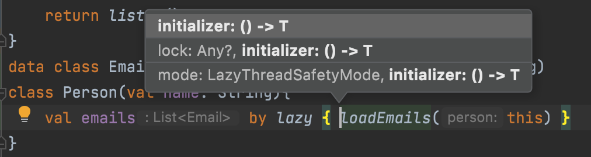
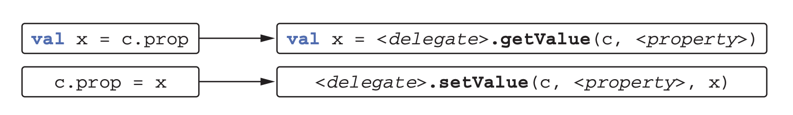

# 7. 연산자 오버로딩과 기타 관례

- 연산자 오버로딩
- 관례 여러 연산을 지원하기 위해 특별한 이름이 붙은 메소드
- 위임 프로퍼티

---

---

어떤 언어 기능과 미리 정해진 이름의 함수를 연결해주는 기법을 코틀린에서는 관례(convention)이라고 부른다

- plus라는 이름의 특별한 메소드를 정의하면 그 클래스 인스턴스에 대해 + 연산자를 사용할 수 있다

언어 기능을 타입에 의존하는 자바와 달리 코틀린은 함수 이름을 통한 관례에 의존한다

이런 관례를 채택한 이유는 기존 자바클래스를 코틀린 언어에 적용하기 위함이다

- 기존 자바 클래스가 구현하는 인터페이스는 이미 고정되어 있다
- 코틀린 쪽에서는 자바 클래스가 새로운 인터페이스를 구현하게 만들 수 없다
- 반면에 확장 함수를 사용하면 기존 클래스에 새로운 메소드를 추가할 수 있다
- **기존 자바 클래스에 대해 확장 함수를 구현하면서 관례에 따라 이름을 붙이면 기존 자바 코드를 바꾸지 않아도 새로운 기능을 쉽게 부여할 수 있다**

아래 코드를 계속 예제로 사용한다

```kotlin
data class Point(val x: Int, val y: Int)
```

# 7.1 산술 연산자 오버로딩

- 클래스에 대해 일반 산술 연산자를 정의할 수 있다

## 7.1.1 이항 산술 연산 오버로딩

```kotlin
data class Point(val x:Int, val y:Int){
    operator fun plus(other: Point) : Point {
        return Point(x + other.x, y + other.y)
    }
}

>>> val p1 = Point(10, 20)
>>> val p2 = Point(30, 40)
>>> println(p1 + p2)
Point(x=40, y=60)
```

- 연산자를 오버로딩 하는 함수 앞에는 꼭 `operator`가 있어야한다
- operator 키워드를 붙임으로써 어떤 함수가 관례를 따르는 함수임을 명확히 알 수 있다
- 실수로 관례에 사용하는 함수 이름을 쓰고 사용한다면 “operator modifier is required ...” 오류를 통해 이름이 겹쳤다는 사실을 알 수 있고 문제를 해결 할 수 있다

연산자를 멤버 함수로 만드는 대신 확장 함수로 정의할 수도 있다

```kotlin
operator fun Point.plus(other : Point): Point {
    return Point(x + other.x, y + other.y)
}
```

코틀린에서는 프로그래머가 직접 연산자를 만들어 사용할 수 없고 언어에서 미리 정해둔 연산자만 오버로딩할 수 있으며, 관계에 따르기 위해 클래스에서 정의해야하는 이름이 연산자 별로 정해져 있다

| 식 | 함수 이름 |
| --- | --- |
| a * b | times |
| a / b | div |
| a % b | mod (1.1부터 rem) |
| a + b | plus |
| a - b | minus |

직접 정의한 함수를 통해 구현하더라도 연산자 우선순위는 언제나 표준 숫자 타입에 대한 연산자 우선순위와 같다

- `*`, `/`, `%` 는 우선 순위가 같고,  이 셋의 우선순위는 `+`와 `-`연산자보다 높다

연산자를 정의할 때 두 피연산자가 같은 타입일 필요는 없다

```kotlin
operator fun Point.times(scale: Double): Point {
    return Point((x * scale).toInt(), (y * scale).toInt())
}

>>> val p = Point(10, 20)
>>> println(p * 1.5)
Point(x=15, y=30)
```

코틀린 연산자는 교환 법칙(commutativity)을 지원하지 않는다

- `p * 1.5` 와 `1.5 * p` 는 다르다
- `1.5 * p` 는 operator fun Dobule.times(p: Point) : Point 를 정의해야한다

연산자 함수의 반환 타입이 꼭 두 피연산자 중 하나의 일치하지 않아도 된다

```kotlin
operator fun Char.times(count: Int): String{
    return toString().repeat(count)
}

>>> println('a' * 3)
aaa
```

일반 함수와 마찬가지로 `operator` 함수도 오버로딩 할 수 있다

- 따라서 이름은 같지만 파라미터 타입이 서로 다른 연산자 함수를 여럿 만들 수 있다

---

### 비트 연산자에 대해 특별한 연산자 함수를 사용하지 않는다

코틀린은 표준 숫자 타입에 대해 비트 연산자를 정의하지 않는다. 따라서 커스텀 타입에서 비트 연산자를 정의할 수도 없다.

대신에 중위 연산자 표기법을 지원하는 일반 함수를 사용해 비트 연산을 수행한다

커스텀 타입에서도 그와 비슷한 함수를 정의해 사용할 수 있다

- `shl` : 왼쪽 시프트(자바 `<<`)
- `shr` : 오른쪽 시프트(부호 비트 유지, 자바 `>>`)
- `ushr` : 오른쪽 시프트(0으로 부호 비트 설정, 자바 `>>`)
- `and` : 비트 곱(자바 `&`)
- `or` : 비트 합(자바 `|`)
- `xor` : 비트 배타 합(자바 `^`)
- `inv` : 비트 반전(자바 `~`)

---

## 7.1.2 복합 대입 연산자 오버로딩

`plus`와 같은 연산자를 오버로딩하면 코틀린은 + 연산자뿐만 아니라 그와 관련 있는 연산자인 `+=`도 자동으로 함께 지원한다

```kotlin
>>> var point = Point(1, 2)
>>> point += Point(3, 4)
>>> println(point)
Point(x=4, y=6)
```

+= 연산이 객체에 대한 참조를 다른 참조로 바꾸기보다 원래 객체의 내부 상태를 변경하게 만들고 싶을 때가 있다

- 변경 가능한 컬렉션에 원소를 추가하는 경우

```kotlin
>>> val numbers = ArrayList<Int>()
>>> numbers += 42
>>> println(numbers[0])
42
```

반환 타입이 `Unit`인 `plusAssign` 함수를 정의하면 코틀린은 `+=` 연산자에 그 함수를 사용한다

- 다른 복합 대입 연산자 함수도 비슷하게 `minusAssign`, `timesAssign` 등의 이름을 사용한다

```kotlin
operator fun <T> MutableCollection<T>.plusAssign(element: T){
    this.add(element)
}
```

이론적으로는 코드에 있는 `+=`를 `plus`와 `plusAssign` 양쪽으로 컴파일 할 수 있다

- 하지만 둘다 정의하고 `+=`에 사용 가능한 경우 컴파일러는 오류를 보고한다
- 빌더와 같이 변경 가능한 클래스를 설계 한다면 `plusAssign`이나 그와 비슷한 연산만 제공하라

코틀린 표준 라이브러리는 컬렉션에 대해 두가지 접근방법을 제공한다

- `+`와 `-`는 항상 새로운 컬렉션을 반환한다
- `+=`와 `-=`는 항상 변경 가능한 컬렉션에 작용해 메모리에 있는 객체 상태를 변화시킨다
- 또한 읽기 전용 컬렉션에서 `+=`와 `-=`는 변경을 적용한 복사본을 반환한다

```kotlin
>>> val list = arrayListOf(1, 2)
>>> list += 3  // +=는 "list"를 변경한다
// +는 두 리스트의 모든 원소를 포함하는 새로운 리스트를 반환한다
>>> val newList = list + listOf(4, 5)
>>> println(list)
[1, 2, 3]
>>> println(newList)
```

## 7.1.3 단한 연산자 오버로딩

```kotlin
operator fun Point.unaryMinus(): Point {
    return Point(-x, -y)
}

>>> val p = Point(10, 20)
>>> println(-p)
Point(x=-10, y=-20)
```

단항 연산자를 오버로딩하기 위해 사용하는 함수는 파라미터가 없다

| 식 | 함수 이름 |
| --- | --- |
| +a | unaryPlus |
| -a | unaryMinus |
| !a | not |
| ++a, a++ | inc |
| —-a, a-- | dec |

`inc`나 `dec` 함수를 정의한 경우 컴파일러는 일반적인 값에 대한 전위와 후위 증가/감소 연산자와 같은 의미를 제공한다

```kotlin
operator fun BigDecimal.inc() = this + BigDecimal.ONE
>>> var bd = BigDecimal.ZERO
>>> println(bd++)
0
>>> println(++bd)
2
```

# 7.2 비교 연산자 오버로딩

## 7.2.1 동등성 연산자: equals

코틀린 `==` 연산자는 `equals` 메소드 호출로 컴파일 된다

- `!=` 연산자를 사용하는 식도 `equals` 호출로 컴파일된다
- `==`와 `!=`는 내부에서 인자가 널인지 검사하므로 다른 연산과 달리 널이 될 수 있는 값도 적용 가능하다
    - `a == b` 경우 a가 널인지 판단해서 널이 아닌 경우에만 a.equals(b)를 호출한다
    - a가 널이고 b도 널이면 결과는 `true`다

equals 메소드를 직접 구현한다면 아래와 같다(data class는 equals을 자동으로 만들어 준다)

```kotlin
class Point(val x:Int, val y:Int){
    override fun equals(obj: Any?): Boolean {
        if (obj == this) return true
        if (obj !is Point) return false
        return obj.x == x && obj.y == y
    }
}
```

식별자 비교 연산자(`===`)를 사용해 equals의 파라미터가 수신 객체와 같은지 살펴본다

- 식별자 비교 연산자는 자바의 `==` 연산자와 같다
- 코틀린의 `===`는 두 피연산자가 서로 같은 객체를 가리키는지(원시 타입의 경우는 값이 같은지) 비교한다
- equals를 구현할 때는 `===`를 사용해 자기 자신과 비교를 최적화 하는 경우가 많다
- `===`는 오버로딩 할 수 없다

`equals`는 `Any`에 정의된 메소드이기 때문에 `override`가 필요하다

- `Any`의 `equals`에는 `operator`가 붙어 있고, 하위 클래스에서 오버라이드하기 떄문에 `operator`가 필요없다

`equals`는 확장 함수보다 우선순위가 높기 때문에 확장 함수로 정의할 수 없다

## 7.2.2 순서 연산자: compareTo

코틀린은 Comparable 인터페이스 안에 있는 compareTo 메소드를 호출하는 관례를 제공한다

- 비교 연산자(`>`, `<`, `<=`, `>=`)는 compareTo 호출로 컴파일 된다

```kotlin
class Person(val firstName:String, val lastName: String) : Comparable<Person>{
    override fun compareTo(other: Person): Int {
        return compareValuesBy(this, other, Person::lastName, Person::firstName)
    }
}

>>> val p1 = Person("Alice", "Smith")
>>> val p2 = Person("Bob", "Johnson")
>>> println(p1 < p2)
false
```

비교 연산자를 자바 클래스에 대해 사용하기 위해 특별히 확장 메소드를 만들거나 할 필요는 없다

# 7.3 컬렉션과 범위에 대해 쓸 수 있는 관례

## 7.3.1 인덱스로 원소에 접근 : get과 set

코틀린의 맵의 원소나 자바에서 배열 원소에 접근할 때 대괄호(`[` `]`)를 사용한다

코틀린에서는 인덱스 연산자도 관례를 따른다

- 인덱스 연산자를 사용해 원소를 읽는 연산은 `get` 연산자 메소드, 쓰는 연산은 `set` 연산자 메소드로 변환된다
- `Map`과 `MutableMap` 인터페이스에는 두 메소드(get, set)이 이미 들어있다

```kotlin
operator fun Point.get(index: Int): Int {
    return when(index){
        0 -> x
        1 -> y
        else ->
            throw IndexOutOfBoundsException("Invalid coordinate $index")
    }
}

>>> val p = Point(10, 20)
>>> println(p[1])
20
```

`get`이라는 메소드를 만들고 operator 변경자를 붙이기만 하면 된다

- `get` 메소드 파라미터로 `Int`가 아닌 타입도 사용할 수 있다
- 또한 여러 파라미터를 사용하는 `get`을 정의할 수 있다

```kotlin
operator fun get(rowIndex: Int, colIndex: Int)
>>> matrix[row, col]
```

- 컬렉션 클래스가 다양한 키 타입을 지원해야 한다면 **다양한 파라미터 타입에 대해 오버로딩한 get 메소드를 여럿 정의**할 수 있다

인덱스에 해당하는 컬렉션 원소를 쓸 때는 `set` 함수를 정의하면 된다

```kotlin
operator fun MutablePoint.set(index: Int, value: Int) {
    when (index) {
        0 -> x = value
        1 -> y = value
        else ->
            throw IndexOutOfBoundsException("Invalid coordinate $index")
    }
}

>>> val p = MutablePoint(10, 20)
>>> p[1] = 42
>>> println(p)
```

## 7.3.2 in 관례

`in`은 객체가 컬렉션에 들어있는지 검사한다

`in`연산자와 대응하는 함수는 `contains`다

```kotlin
data class Rectangle(val upperLeft: Point, val lowerRight: Point)
operator fun Rectangle.contains(p: Point): Boolean {
    return p.x in upperLeft.x until lowerRight.x &&
            p.y in upperLeft.y until lowerRight.y
}

>>> val rect = Rectangle(Point(10, 20), Point(50, 50))
>>> println(Point(20, 30) in rect)
true
>>> println(Point(5, 5) in rect)
false
```

- `10..20`이라는 식을 사용(Range)한다면 20을 포함하는 범위가 생긴다(닫힌 범위)
- `10 until 20`로 식을 사용하면 10 이상 19이하의 범위가 만들어진다(열린 범위)

## 7.3.3 rangeTo 관례

`..` 연산자는 `rangeTo` 함수를 간략하게 표현하는 방법이다

- `rangeTo` 함수는 범위를 반환한다
- 아무 클래스나 정의할 수 있다
    - 하지만 어떤 클래스가 Comparable 인터페이스를 구현하면 rangeTo를 정의할 필요가 없다
    - 코틀린 표준 라이브러리에는 모든 Comparable 객체에 대해 적용 가능한 rangeTo 함수가 들어있다
    
    ```kotlin
    operator fun <T: Comparable<T>> T.rangeTo(that: T): ClosedRange<T>
    ```
    
    - 이 함수는 범위를 반환하며, 어떤 원소가 그 범위 안에 들어있는지 `in`을 통해 검사할 수 있다

```kotlin
>>> val now = LocalDate.now()
// 오늘부터 시작해 10일짜리 범위를 만든다
>>> val vacation = now..now.plusDays(10)
// 특정 날짜가 날짜 범위 안에 들어가는지 검사한다
>>> println(now.plusWeeks(1) in vacation)
true
```

rangeTo 연산자는 다른 산술 연산자보다 우선순위가 낮다

- 혼동을 피하기 위해 괄호로 인자를 감싸주면 좋다

```kotlin
>>> val n = 9
>>> println(0..(n+1))
0..10
```

- 0..n.forEach {} 같은 식은 컴파일 할 수 없다. 범위를 괄호로 둘러 싸야한다

```kotlin
>>> (0..n).forEach { print(it) }
0123456789
```

## 7.3.4 for 루프를 위한 iterator 관례

코틀린의 `for` 루프는 범위 검사와 똑같이 `in` 연산자를 사용한다

- 이 경우 in의 의미는 다르다
- for (x in list) {...}와 같은 문장은 list.iterator()를 호출해서 이터레이터를 얻은 다음 hasNext와 next 호출을 반복하는 식으로 변환된다
- 코틀린에서는 관례이므로 iterator 메소드를 확장 함수로 정의할 수 있다
    
    ```kotlin
    // CharIterator 라이브러리 함수는 문자열을 이터레이션 할 수 있게 해준다
    operator fun CharSequence.iterator() : CharIterator
    >>> for (c in "abc") {}
    ```
    
- 클래스 안에 직접 iterator 메소드를 구현할 수도 있다

```kotlin
operator fun ClosedRange<LocalDate>.iterator(): Iterator<LocalDate> =
    object : Iterator<LocalDate> {
        var current = start
        override fun hasNext() =
            current <= endInclusive
        
        override fun next() = current.apply {
            current = plusDays(1)
        }
    }

>>> val newYear = LocalDate.ofYearDay(2017, 1)
>>> val daysOff = newYear.minusDays(1)..newYear
>>> for (dayOff in daysOff) { println(dayOff) }
2016-12-31
2017-01-01
```

# 7.4 구조 분해 선언과 component 함수

구조 분해를 사용하면 복합적인 값을 분해해서 여러 다른 변수를 한꺼번에 초기화할 수 있다

```kotlin
data class Point(val x: Int, val y: Int)
>>> val p = Point(10, 20)
>>> val (x, y) = p
>>> println(x)
10
>>> println(y)
20
```

- data 클래스 주 생성자에 들어있는 프로퍼티에 대해서는 컴파일러가 자동으로 component***N*** 함수를 만들어 준다
- 데이터 클래스가 아닌 클래스는 다음과 같이 구현해야한다
    
    ```kotlin
    class Point(val x: Int, val y: Int) {
        operator fun component1() = x
        operator fun component2() = y
    }
    ```
    

아래는 파일이름을 이름과 확장자로 나누는 함수다

```kotlin
data class NameComponents(val name: String, val extension: String)
fun splitFileName(fullName: String): NameComponents{
    val result = fullName.split('.', limit = 2)
    return NameComponents(result[0], result[1])
}

>>> val (name, ext) = splitFileName("example.kt")
>>> println(name)
example
>>> println(ext)
kt
```

배열이나 컬렉션에도 componentN 함수가 있음을 안다면 위의 예제를 더 개선할 수 있다

- 크기가 정해진 컬렉션을 다루는 경우 유용하다

```kotlin
data class NameComponents(val name: String, val extension: String)
fun splitFileName(fullName: String): NameComponents{
    **val (name, extension) = fullName.split('.', limit = 2)**
    return NameComponents(name, extension)
}
```

물론 무한히 componentN을 선언할 수는 없으며 이런 구문을 무한정 사용할 수는 없다

## 7.4.1 구조 분해 선언과 루프

함수 본문 내의 선언문 뿐만 아니라 변수 선언이 들어갈 수 있는 장소라면 어디든 구조분해 선언을 사용할 수있다

```kotlin
fun printEntries(map: Map<String, String>){
    for ((key, value) in map){
        println("$key -> $value")
    }
}

>>> val map = mapOf("Oracle" to "Java", "JetBrains" to "Kotlin")
>>> printEntries(map)
Oracle -> Java
JetBrains -> Kotlin
```

앞의 루프는 아래의 확장 함수를 사용하는 코드다

```kotlin
for(entry in map.entires){
	val key = entry.component1()
	val value = entry.component2()
	// ...
}
```

# 7.5 프로퍼티 접근자 로직 재활용: 위임 프로퍼티

위임 프로퍼티를 사용하면 값을 뒷받침하는 필드에 단순히 저장하는 것보다 더 복잡한 방식으로 작동하는 프로퍼티를 쉽게 구현할 수 있다

- 예를 들어 프로퍼티는 위임을 사용해 자신의 값을 필드가 아니라 데이터베이스 테이블이나 브라우저 세션, 맵 등에 저장할 수 있다

이런 특성의 기반에는 위임이 있다

- 객체가 직접 작업을 수행하지 않고 다른 도우미 객체가 그 작업을 처리하게 맡기는 디자인 패턴이다
- 작업을 처리하는 도우미 객체를 **위임 객체(delegate)**라고 부른다

## 7.5.1 위임 프로퍼티 소개

위임 프로퍼티의 일반적인 문법은 다음과 같다

```kotlin
class Foo {
	var p: Type by Delegate()
}
```

- `p` 프로퍼티는 접근자 로직을 다른 객체에게 위임한다. 여기서는 Delegate 클래스의 인스턴스를 위임 객체로 사용한다
- `by` 뒤에 있는 식을 계산해서 위임에 쓰일 객체를 얻는다

컴파일러는 다음과 같이 숨겨진 도우미 프로퍼티를 만들고 그 프로퍼티를 위임 객체의 인스턴스로 초기화한다.

- p 프로퍼티는 바로 그 위임 객체에게 자신의 작업을 위임한다
- 설명을 위해 감춰진 프로퍼티 이름을 delegate라고 정의한다

```kotlin
class Foo{
	private val delegate = Delegate()
	var p: Type
	set(value: Type) = delegate.setValue(..., value)
	get() = delegate.getValue(...)
}
```

프로퍼티 위임 관례를 따르는 Delegate 클래스는 getValue와 setValue 메소드를 제공해야한다.

`Delegate` 클래스를 단순화하면 아래와 같다

```kotlin
class Delegate {
	operator fun getValue(...) {...}
	operator fun setValue(..., value: Type) {...}
}
class Foo {
	var p: Type by Delegate()  // by 키워드는 프로퍼티와 위임 객체를 연결한다
}

>>> val foo = Foo()
// foo.p라는 프로퍼티 호출은 내부에서 delegate.getValue(...)를 호출한다
>>> val oldValue = foo.p
// 프로퍼티 값을 변경하는 문장은 내부에서 delegate.setValue(..., newValue)를 호출한다
>>> foo.p = newValue
```

foo.p는 일반 프로퍼티 처럼 쓸 수 있고, 일반 프로퍼티 같이 보이지만 실제로 p의 게터나 세터는 Delegate 타입의 위임 프로퍼티 객체에 있는 메소드를 호출한다

코틀린 라이브러리는 프로퍼티 위임을 사용해서 프로퍼티 초기화를 지연시켜줄 수 있다

## 7.5.2 위임 프로퍼티 사용: by lazy()를 사용한 프로퍼티 초기화 지연

지연 초기화는 객체의 일부분을 초기화하지 않고 남겨뒀다가 실제로 그 부분의 값이 필요할 경우 초기화하는 패턴이다.

- 초기화 과정에 자원을 많은 사용하는 프로퍼티
- 객체를 사용할 때마다 꼭 초기화하지 않아도 되는 프로퍼티

에 사용할 수 있다

아래 코드는 이메일을 불러오기 전에 null을 저장하고, 불러온 다음에는 이메일 리스트를 저장하는 _emails 프로퍼티를 추가해서 지연 초기화를 구현한다

```kotlin
fun loadEmails(person: Person):List<Email>{
    println("${person.name}의 이메일을 가져옴")
    return listOf()
}

data class Email(val subject: String, val contents: String)

class Person(val name: String){
    private var _emails: List<Email>? = null
    val emails: List<Email>
        get() {
            if (_emails == null){
                _emails = loadEmails(this)
            }
            return _emails!!
        }
}

>>> val p = Person("Alice")
>>> p.emails
Alice의 이메일을 가져옴
>>> p.emails
```

지연 초기화해야하는 프로퍼티가 많아지면 코드가 복잡해지고 이 구현은 쓰레드 세이프 하지 않아서 언제나 제대로 작동한다고 말할 수도 없다

코틀린의 위임 프로퍼티를 사용하면 이 코드가 훨씬 더 간단해진다

위임 프로퍼티는 데이터를 저장할 때 쓰이는 뒷받침하는 프로퍼티와 값이 오직 한번만 초기화됨을 보장하는 게터 로직을 함께 캡슐화 해준다

예제와 같은 경우를 위한 위임 객체를 반환하는 표준 라이브러리 함수가 `lazy` 다

```kotlin
class Person(val name: String){
    val emails by lazy { loadEmails(this) }
}
```

`lazy` 함수는 코틀린 관례에 맞는 시그니처의 `getValue` 메소드가 들어있는 객체를 반환한다

- 따라서 `lazy`를 `by` 키워드와 함께 사용해 위임 프로퍼티를 만들 수 있다
- `lazy` 함수의 파라미터는 값을 초기화할 때 호출할 **람다**다
- `lazy`함수는 기본적으로 스레드 세이프 하다. 하지만 필요에 따라 동기화에 사용할 락을 `lazy`함수에 전달할 수도 있고, 다중 스레드 환경에서 사용하지 않을 프로퍼티를 위해 `lazy`함수가 동기화 하지 못하게 막을 수도 있다
    
    
    

## 7.5.3 위임 프로퍼티 구현

어떤 객체의 프로퍼티가 바뀔 때마다 리스너에게 변경 통지를 보내고 싶다

- 자바에서는 `PropertyChangeSupport`와 `PropertyChangeEvent` 클래스를 사용한다

코틀린에서 먼저 위임 프로퍼티 없이 이런 기능을 구현해보고, 이후 위임 프로퍼티로 리팩토링 해본다

`PropertyChangeSupport` 클래스는 리스너의 목록을 관리하고 `PropertyChangeEvent` 이벤트가 들어오면 목록의 모든 리스너에게 이벤트를 통지한다

필드를 모든 클래스에 추가하고 싶지는 않으므로 `PropertyChangeSupport` 인스턴스를 `changeSupport`라는 필드에 저장하고 프로퍼티 변경 리스너를 추적해주는 도우미 클래스를 만든다. 리스너 지원이 필요한 클래스는 이 도우미 클래스를 확장해서 changeSupport에 접근할 수 있다

```kotlin
open class PropertyChangeAware{
    protected val changeSupport = PropertyChangeSupport(this)
    
    fun addPropertyChangeListener(listener: PropertyChangeListener){
        changeSupport.addPropertyChangeListener(listener)
    }
    
    fun removePropertyChangeListener(listener: PropertyChangeListener){
        changeSupport.removePropertyChangeListener(listener)
    }
}
```

아래 Person 클래스는 나이나 급여가 바뀌면 리스너에게 통지한다

```kotlin
class Person(val name: String, age:Int, salary:Int) : PropertyChangeAware(){
    var age: Int = age
        set(newValue){
            val oldValue = field
            field = newValue
            changeSupport.firePropertyChange("age", oldValue, newValue)
        }
    var salary: Int = salary
        set(newValue){
            val oldValue = field
            field = newValue
            changeSupport.firePropertyChange("salary", oldValue, newValue)
        }
}

>>> val p = Person("Dmitry",  34, 2000)
>>> p.addPropertyChangeListener(
    PropertyChangeListener { evt ->
        println("Property ${evt.propertyName} changed from ${evt.oldValue} to ${evt.newValue}")
    }
)
>>> p.age = 35
Property age changed from 34 to 35
>>> p.salary = 2100
Property salary changed from 2000 to 2100
```

세터 코드를 보면 중복이 많이 보인다. 이제 프로퍼티의 값을 저장하고 필요에 따라 통지를 보내주는 클래스를 만들어 보자

```kotlin
class ObservableProperty(
    val propName: String,
    var propValue: Int,
    val changeSupport: PropertyChangeSupport
){
    fun getValue(): Int = propValue
    fun setValue(newValue: Int){
        val oldValue = propValue
        propValue = newValue
        changeSupport.firePropertyChange(propName, oldValue, newValue)
    }
}
class Person(
    val name: String, age: Int, salary: Int
) : PropertyChangeAware(){
    val _age = ObservableProperty("age", age, changeSupport)
    var age: Int
        get() = _age.getValue()
        set(value) { _age.setValue(value) }

    val _salary = ObservableProperty("salary", salary, changeSupport)
    var salary: Int
        get() = _salary.getValue()
        set(value) {_salary.setValue(value)}
}
// 위와 실행코드 결과 값 동일
```

이 코드는 코틀린의 위임이 실제로 작동하는 방식과 비슷하다

하지만 아직도 각각의 프로퍼티마다 `ObservableProperty`를 만들고 게터와 세터에서 `ObservableProperty`에 작업을 위임하는 준비 코드가 상당 부분 필요하다.

코틀린의 위임 프로퍼티 기능을 활용하면 이런 준비 코드를 없앨 수 있다

- 위임 프로퍼티를 사용하기 전에 ObservableProperty에 있는 두 메소드의 시그니처를 코틀린의 관례에 맞게 수정해야 한다

```kotlin
class ObservableProperty(
    var propValue: Int,
    val changeSupport: PropertyChangeSupport
){
    operator fun getValue(p: Person, prop: KProperty<*>): Int = propValue
    operator fun setValue(p: Person, prop: KProperty<*>, newValue: Int){
        val oldValue = propValue
        propValue = newValue
        changeSupport.firePropertyChange(prop.name, oldValue, newValue)
    }
}
```

- `getValue`와 `setValue`에 `operator` 변경자가 붙는다
- `getValue`와 `setValue`는 프로퍼티가 포함된 객체(Person 타입인 p)와 프로퍼티를 표현하는 객체를 파라미터로 받는다
- `KProperty` 파라미터를 통해 프로퍼티 이름을 전달 받으므로 주 생성자에서는 name 프로퍼티를 없앴다

다음은 위임 프로퍼티를 사용한 코드다

```kotlin
class Person(
    val name: String, age: Int, salary: Int
) : PropertyChangeAware(){
    var age : Int by ObservableProperty(age, changeSupport)
    var salary: Int by ObservableProperty(salary, changeSupport)
}
```

`by` 키워드를 사용해 위임 객체를 지정하면 이전 예제에서 직접 코드를 짜야 했던 여러 작업을 코틀린 컴파일러가 자동으로 처리해준다

`by` 오른쪽에 오는 객체를 위임 객체(delegate)라고 부른다

코틀린은 위임 객체를 감춰진 프로퍼티에 저장하고, 주 객체의 프로퍼티를 읽거나 쓸 때마다 위임 객체의 `getValue`와 `setValue`를 호출해준다

코틀린 표준 라이브러리에는 이미 `ObservableProperty`와 비슷한 클래스가 있다

- 다만 `PropertyChangeSupport`와는 연결되어있지 않다
- 프로퍼티 값의 변경을 통지할 때 `PropertyChangeSupport`를 사용하는 방법을 알려주는 람다를 넘겨줘야한다

```kotlin
class Person(
    val name: String, age: Int, salary: Int
) : PropertyChangeAware(){
    private val observer = {
        prop: KProperty<*>, oldValue:Int, newValue:Int ->
        changeSupport.firePropertyChange(prop.name, oldValue, newValue)
    }
    var age: Int by Delegates.observable(age, observer)
    var salary: Int by Delegates.observable(salary, observer)
}
```

- `by`의 오른쪽에 있는 식이 꼭 새 인스턴스를 만들 필요는 없다
- 함수 호출, 다른 프로퍼티, 다른 식 등이 `by`의 우항에 올 수 있다
- 다만 우항에 있는 식을 계산한 결과인 객체는 컴파일러가 호출할 수 있는 올바른 타입의 `getValue`와 `setValue`를 반드시 제공해야한다
- 다른 관례와 마찬가지로 `getValue`와 `setValue` 모두 객체 안에 정의된 메소드이거나 확장 함수일 수 있다
- 프로퍼티 위임 메커니즘은 모든 타입에 두루두루 사용할 수 있다

## 7.5.4 위임 프로퍼티 컴파일 규칙

다음과 같은 위임 프로퍼티가 있을 때 어떤 방식으로 동작하는지 보자

```kotlin
class C {
	var prop: Type by MyDelegate()
}

val c = C()
```

컴파일러는 MyDelegate 클래스의 인스턴스를 감춰진 프로퍼티에 저장하고, <delegate>라는 이름으로 부른다

또한 프로퍼티를 표현하기 위해 Kproperty 타입의 객체를 사용하고 <property>라고 부른다

```kotlin
class C {
	private val <delegate> = MyDelegate()
	var prop: Type
		get() = <delegate>.getValue(this, <property>)
		set(value: Type) = <delegate>.setValue(this, <property>, value)
}
```

컴파일러는 모든 프로퍼티 접근자 안에 `getValue`와 `setValue` 호출코드를 생성해 준다



상당히 단순한 메커니즘이지만 활용법이 많다

- 프로퍼티 값이 저장될 장소를 바꿀 수도 있고
- 프로퍼티를 읽거나 쓸 때 벌어질 일을 변경할 수도 있다

## 7.5.5 프로퍼티 값을 맵에 저장

자신의 프로퍼티를 동적으로 정의할 수 있는 객체를 만들 때 위임 프로퍼티를 활용하는 경우가 자주 있다

- 그런 객체를 확장 가능한 객체(expando object)라고 부르기도 한다

```kotlin
class Person{
    // 추가 정보
    private val _attributes = hashMapOf<String, String>()
    fun setAttribute(attrName: String, value: String){
        _attributes[attrName] = value
    }

    // 필수 정보
    val name: String
        get() = _attributes["name"]!!
}

>>> val p = Person()
>>> val data = mapOf("name" to "Dmitry", "company" to "JetBrains")
>>> for ((attrName, value) in data) {
    p.setAttribute(attrName, value)
}
>>> println(p.name)
Dmitry
```

위의 코드를 아주 쉽게 위임 프로퍼티를 활용하게 변경할 수 있다

- by 키워드 뒤에 맵을 직접 넣으면 된다

```kotlin
class Person{
    private val _attributes = hashMapOf<String, String>()
    fun setAttribute(attrName: String, value: String){
        _attributes[attrName] = value
    }

		// 위임 프로퍼티로 맵을 사용한다
    val name: String by _attributes
}

val p = Person()
p.name => _attributes.getValue(p, prop) => _attributes[prop.name]
```

이런 코드가 작동하는 이유는 표준 라이브러리가 `Map`과 `MutableMap` 인터페이스에 대해 `getValue`와 `setValue` 확장 함수를 제공하기 떄문이다.

- getValue에서 맵에 프로퍼티 값을 저장할 때는 자동으로 프로퍼티 이름을 키로 활용한다.
- p.name은 _attributes.getValue(p, prop)라는 호출을 대신하고 _attributes.getValue(p, prop)는 다시 _attributes[prop.name]을 통해 구현된다

## 7.5.6 프레임워크에서 위임 프로퍼티 활용

객체 프로퍼티를 저장하거나 변경하는 방법을 바꿀 수 있으면 프레임워크를 개발할 때 유용하다

```kotlin
object Users : IdTable(){   // 객체는 데이터베이스 테이블에 해당한다
    // 프로퍼티는 테이블 칼럼에 해당한다
    val name = varchar("name", length = 50).index()
    val age = integer("age")
}

// 각 User 인스턴스는 테이블에 들어있는 구체적인 엔티티에 해당한다
class User(id: EntityID) : Entity(id){
    // 사용자 이름은 데이터베이스 "name"칼럼에 들어있다
    var name: String by Users.name
    var age: Int by Users.age
}
```

이 예제의 완전한 구현을 Exposed 프레임워크 소스코드에서 볼수 있다.