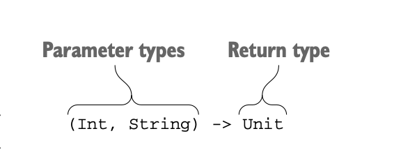
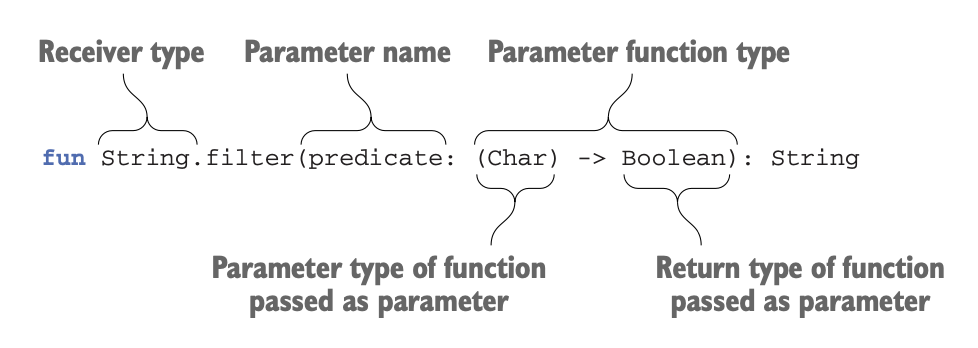
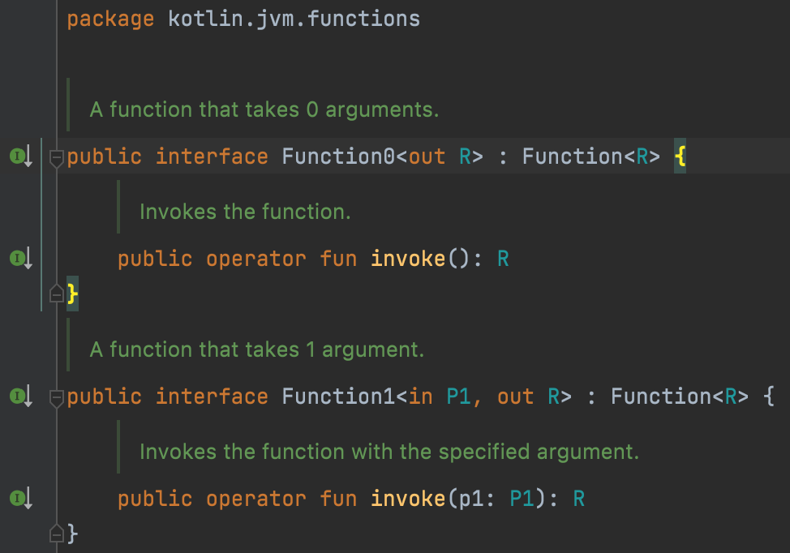
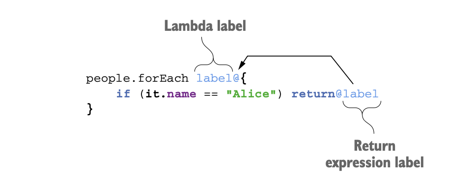
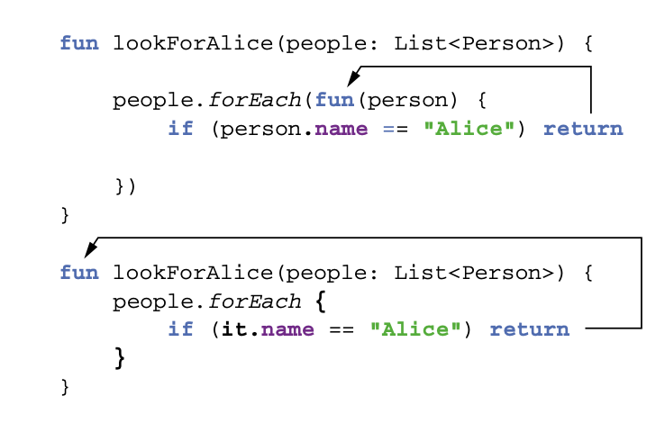

# 8.고차 함수: 파라미터와 반환 값으로 람다 사용

- 함수타입
- 고차 함수와 코드를 구조화할 때 고차 함수를 사용하는 방법
- 인라인 함수
- 비로컬 return과 레이블
- 무명 함수

---

---

# 8.1 고차 함수 정의

고차 함수는 다름 함수를 인자로 받거나 함수를 반환하는 함수다

- 코틀린에서는 람다나 함수 참조를 사용해 함수를 값으로 표현할 수있다
- **고차함수**는 람다나 함수 참조를 인자로 넘길 수 있거나 람다나 함수 참조를 반환하는 함수다
- 표준 라이브러리 함수 `filter`는 술어함수를 인자로 받으므로 고차 함수다
    
    ```kotlin
    list.filter { x > 0 }
    ```
    

고차 함수를 정의하려면 함수타입에 대해 먼저 알아야한다

## 8.1.1 함수 타입

람다를 인자로 받는 함수를 정의하려면 먼저 람다 인자의 타입을 어떻게 선언할 수 있는지 알아야한다

```kotlin
val sum = { x: Int, y: Int -> x+y }
val action = { println(42) }
```

컴파일러는 sum과 action이 함수 타입임을 추론한다

```kotlin
// Int 파라미터를 2개 받아서 Int 값을 반환하는 함수
val sum: (Int, Int) -> Int = { x,y -> x+y }

// 아무 인자로 받지 않고 아무 값도 반환하지 않는 함수
val action: () -> Unit = { println(42) }
```

함수 타입을 정의하려면 함수 파라미터의 타입을 괄호 안에 넣고, 그 뒤에 화살표(→)를 추가한 다음에 함수의 반환 타입을 지정하면 된다



함수 타입을 선언할 때는 반환 타입을 반드시 명시해야 하기 떄문에 `Unit`을 빼서는 안된다

변수 타입을 함수 타입으로 지정하면, 함수 타입에 있는 파라미터로부터 람다의 파라미터 타입을 유추할 수 있다. 따라서 람다 식 안에서 굳이 파라미터 타입을 적을 필요가 없다

- `{ x, y → x + y }`처럼 `x`와 `y`의 타입을 생략해도 된다

다른 함수와 마찬가지로 함수 타입에서도 **반환 타입을 널이 될 수 있는 타입으로 지정**할 수 있다

```kotlin
var canReturnNull: (Int, Int) -> Int? = { x,y -> null }
```

함수 타입 전체가 널이 될 수 있는 타입임을 선언할 수 있다

```kotlin
var funOrNull: ((Int, Int) -> Int)? = null
```

## 8.1.2 인자로 받은 함수 호출

아래 함수는 2와 3에 대해 인자로 받은 연산을 수행하고 그 결과를 화면에 출력한다

```kotlin
fun twoAndThree(operation: (Int, Int) -> Int) {
    val result = operation(2, 3)
    println("The result is $result")
}

>>> twoAndThree { a, b -> a + b }
The result is 5
>>> twoAndThree { a, b -> a * b }
The result is 6
```

표준 라이브러리 함수인 filter를 다시 구현한다



- filter 함수는 술어를 파라미터로 받는다
- predicate 파라미터는 문자(Char 타입)를 파라미터로 받고 Boolean 타입의 결과를 반환한다

```kotlin
fun String.filter(predicate: (Char)->Boolean): String{
    val sb = StringBuilder()
    for(index in 0 until length){
        val element = get(index)
        if (predicate(element)) sb.append(element)
    }
    return sb.toString()
}

>>> println("ab1c".filter { it in 'a'..'z' })
abc
```

## 8.1.3 자바에서 코틀린 함수 타입 사용

컴파일된 코드 안에서 함수 타입은 일반 인터페이스로 바뀐다

- 함수 타입의 변수는 Function***N*** 인터페이스를 구현하는 객체를 저장한다
- 코틀린 표준 라이브러리는 함수 인자의 개수에 따라 Function0<R>, Function1<P1, R> 등의 인터페이스를 제공한다
    
    
    
- 각 인터페이스에는 invoke 메소드 정의가 하나 들어있으며, invoke를 호출하면 함수를 실행할 수 있다

함수 타입을 사용하는 코틀린 함수를 자바에서도 쉽게 호출할 수 있다

```kotlin
/* 코틀린 선언 */
fun processTheAnswer(f: (Int) -> Int){
    println(f(42))
}

/* 자바 */
>>> processTheAnswer(number -> number + 1);
43
```

자바 8 이전의 자바에서는 필요한 FunctionN 인터페이스의 invoke 메소드를 구현하는 무명 클래스를 넘기면 된다

```kotlin
processTheAnswer(
	  new Function1<Integer, Integer>() {
    @Override
    public Integer invoke(Integer number) {
        System.out.println(number);
        return number + 1
    }
});
```

자바에서 코틀린 표준 라이브러리가 제공하는 람다를 인자로 받는 확장 함수를 쉽게 호출할 수 있다

- 하지만 수신 객체를 확장 함수의 첫 번째 인자로 명시적으로 넘겨야 하므로 코드가 깔끔하진 않다

```kotlin
/* 자바 */
>>> List<String> strings = new ArrayList();
>>> strings.add("42");
>>> CollectionsKt.forEach(strings, s -> {  strings는 확장함수의 수신 객체
...    System.out.println(s);
...    return Unit.INSTANCE;  // Unit 타입의 값을 명시적으로 변환해야만 한다
... });
```

## 8.1.4 디폴트 값을 지정한 함수 타입 파라미터나 널이 될 수 있는 함수 타입 파라미터

파라미터를 함수 타입으로 선언할 떄도 디폴트 값을 정할 수 있다.

```kotlin
fun <T> Collection<T>.joinToString(
    spearator: String = ", ",
    prefix: String = "",
    postfix: String = ""
) : String {
    val result = StringBuilder(prefix)
    for ((index, element) in this.withIndex()){
        if (index > 0) result.append(spearator)
        result.append(element)
    }
    result.append(postfix)
    return result.toString()
}
```

이 구현은 유연하지만 컬렉션의 각 원소를 문자열로 변환하는 것을 제어할 수 없다.

이런 경우 원소를 문자열로 바꾸는 방법을 람다로 전달하면 된다. 그리고 함수 타입의 파라미터에 대한 디폴트 값을 지정하면 joinToString을 호출할 때마다 매번 기본동작에 대한 람다를 넘기지 않아도 된다.

```kotlin
fun <T> Collection<T>.joinToString(
    spearator: String = ", ",
    prefix: String = "",
    postfix: String = "",
    ***transform: (T) -> String = { it.toString() }***
) : String {
    val result = StringBuilder(prefix)
    for ((index, element) in this.withIndex()){
        if (index > 0) result.append(spearator)
        result.append(transform(element))
    }
    result.append(postfix)
    return result.toString()
}

>>> val letters = listOf("Alpha", "Beta")
>>> println(letters.joinToString())
Alpha, Beta
>>> println(letters.joinToString { it.lowercase() })
alpha, beta
>>> println(letters.joinToString(spearator = "! ", postfix = "! ", transform = { it.uppercase()}))
ALPHA! BETA!
```

널이 될 수 있는 함수 타입을 사용할 수도 있다

- 널이 될 수 있는 함수 타입으로 함수를 받으면 그 함수를 직접 호출할 수 없다
- 코틀린은 NPE가 발생할 가능성이 있으므로 컴파일을 거부할 것이다
- null 여부를 명시적으로 검사하는 것도 한가지 해결 방법이다

```kotlin
fun foo(callback: (() -> Unit)?){
	// ...
	if (callback != null){
		callback()
	}
}
```

함수 타입이 invoke 메소드를 구현하는 인터페이스라는 사실을 활용하면 더 짧게 만들 수 있다

- callback?.invoke()

```kotlin
fun <T> Collection<T>.joinToString(
    separator: String = ", ",
    prefix: String = "",
    postfix: String = "",
    transform: ((T) -> String)? = null
) : String {
    val result = StringBuilder(prefix)
    for ((index, element) in this.withIndex()){
        if (index > 0) result.append(separator)
        val str = transform?.invoke(element)?:element.toString()
        result.append(str)
    }
    result.append(postfix)
    return result.toString()
}
```

## 8.1.5 함수를 함수에서 반환

함수를 반환하는 함수도 유용할 수 있다

```kotlin
enum class Delivery { STANDARD, EXPEDITED }

class Order(val itemCount: Int)

fun getShippingCostCalculator(delivery: Delivery) : (Order) -> Double {
    if (delivery == Delivery.EXPEDITED){
        ***return { order -> 6 + 2.1 * order.itemCount}***
    }
    ***return { order -> 1.2 * order.itemCount}***
}
>>> val calculator = getShippingCostCalculator(Delivery.EXPEDITED)
>>> println("Shipping costs ${calculator(Order(3))}")
Shipping costs 12.3
```

```kotlin
data class Person(
    val firstName : String,
    val lastName : String,
    val phoneNumber : String?
)

class ContactListFilters{
    var prefix: String = ""
    var onlyWithPhoneNumber: Boolean = false
    fun getPredicate(): (Person) -> Boolean{
        val startsWithPrefix = { p: Person -> p.firstName.startsWith(prefix) || p.lastName.startsWith(prefix)}
        if (!onlyWithPhoneNumber){
            return startsWithPrefix
        }
        return { startsWithPrefix(it) && it.phoneNumber != null}
    }
}

val contacts = listOf(
    Person("Dmitry", "Jemerov", "123-4567"),
    Person("Svetlana", "Isakova", null)
)

val contactListFilters = ContactListFilters()
with(contactListFilters){
    prefix = "Dm"
    onlyWithPhoneNumber = true
}
println(contacts.filter(contactListFilters.getPredicate()))

[Person(firstName=Dmitry, lastName=Jemerov, phoneNumber=123-4567)]
```

고차 함수는 코드 구조를 개선하고 중복을 없앨 때 쓸 수 있는 아주 강력한 도구다

## 8.1.6 람다를 활용한 중복 제거

함수 타입과 람다 식은 재활용하기 좋은 코드를 만들 때 쓸 수 있는 훌륭한 도구다

```kotlin
data class SiteVisit(
    val path: String,
    val duration: Double,
    val os: OS
)
enum class OS { WINDOWS, LINUX, MAC, IOS, ANDROID }

val log = listOf(
    SiteVisit("/", 34.0, OS.WINDOWS),
    SiteVisit("/", 22.0, OS.MAC),
    SiteVisit("/login", 12.0, OS.WINDOWS),
    SiteVisit("/signup", 8.0, OS.IOS),
    SiteVisit("/", 16.3, OS.ANDROID)
)
```

윈도우 사용자의 평균 방문 시간을 `average` 함수를 사용해서 출력한다

```kotlin
val averageWindowsDuration =
    ***log.filter { it.os == OS.WINDOWS }
        .map(SiteVisit::duration)
        .average()***
println(averageWindowsDuration)
```

맥 사용자에 대해 같은 통계를 구하고 싶다. 중복을 피하기 위해 OS를 파라미터로 뽑아 낼 수 있다

```kotlin
fun List<SiteVisit>.averageDurationFor(os: OS) =
    filter { it.os == os }.map(SiteVisit::duration).average()

>>> println(log.averageDurationFor(OS.WINDOWS))
23.0
>>> println(log.averageDurationFor(OS.MAC))
22.0
```

모바일 디바이스 사용자의 평균 방문 시간을 구하고 싶다면 어떻게 해야할까?

```kotlin
val averageWindowsDuration =
    log.filter { it.os in setOf(OS.IOS, OS.ANDROID) }
        .map(SiteVisit::duration)
        .average()
>>> println(averageWindowsDuration)
12.15
```

복잡한 질의를 사용해 방문 기록을 분석하고 싶을 때도 있다. 이럴 때 람다가 유용하다.

```kotlin
fun List<SiteVisit>.averageDurationFor(predicate: (SiteVisit) -> Boolean) =
    filter(predicate).map(SiteVisit::duration).average()

>>> println(log.averageDurationFor { it.os in setOf(OS.ANDROID, OS.IOS) })
12.15
>>> println(log.averageDurationFor { it.os == OS.IOS && it.path == "/signup" })
8.0
```

코드 중복을 줄일 떄 함수 타입이 상당히 도움이 된다.

- 코드의 일부분을 복사해 붙여 넣고 싶은 경우가 있다면 그 코드를 람다로 만들면 중복을 없앨 수 있다

---

### 노트 - 객체지향 디자인 패턴

일부 잘 알려진 디자인 패턴을 함수 타입과 람다식을 사용해 단순화 할 수 있다

- 전략패턴
    
    인터페이스를 선언하고 구현 클래스를 통해 전략을 정의해야한다
    
    함수 타입을 언어가 지원하면 일반 함수 타입을 사용해 전략을 표현할 수 있고, 경우에 따라 다른 람다식을 넘김으로써 여러 전략을 전달할 수 있다
    

---

# 8.2 인라인 함수: 람다의 부가 비용 없애기

람다를 활용한 코드의 성능은 어떨까?

[5장](https://www.notion.so/5-59563b21ad7f482a8360ffa0a65a353d)에서 코틀린이 보통 람다를 무명 클래스로 컴파일하지만 그렇다고 람다식을 사용할 때마다 새로운 클래스가 만들어지지는 않는다는 사실을 설명했고, 람다가 변수를 포획하면 람다가 생성되는 시점마다 새로운 무명 클래스 객체가 생긴다는 사실도 설명했다

이런 경우 실행 시점에 무명 클래스 생성에 따른 부가 비용이 든다. 따라서 람다를 사용하는 구현은 똑같은 작업을 수행하는 일반 함수를 사용한 구현보다 덜 효율적이다.

그렇다면 반복되는 코드를 별도의 라이브러리 함수로 빼내되 컴파일러가 자바의 일반 명령문만큼 효율적인 코드를 생성하게 만들 수 없을까?

- 코틀린 컴파일러에서는 가능하다
- inline 변경자를 어떤 함수에 붙이면 컴파일러는 그 함수를 호출하는 모든 문장을 함수 본문에 해당하는 바이트 코드로 바꿔치기해 준다.

## 8.2.1 인라이닝이 작동하는 방식

어떤 함수를 inline으로 선언하면 그 함수의 본문이 인라인(inline)된다

- 함수를 호출하는 코드를 함수를 호출하는 바이트 코드 대신에 함수 본문을 번역한 바이트 코드로 컴파일 한다

```kotlin
inline fun <T> synchronized(lock: Lock, action: () -> T) : T {
    lock.lock()
    try {
        return action()
    } finally {
        lock.unlock()
    }
}
fun main() {
    val l = Lock()
    synchronized(l){
        // ...
    }
}
```

`synchronized` 함수를 inline으로 선언했으므로, `synchronized`를 호출하느 코드는 모두 자바의 `synchronized`문과 같아진다.

synchronized()를 사용하는 다음 예제를 보자

```kotlin
fun foo(l:Lock){
    println("Before sync")
    synchronized(l){
        println("Action")
    }
    println("After sync")
}
```

아래는 이 코틀린 코드와 동등한 코드를 보여준다. 이 코드는 앞의 코드와 같은 바이트 코드를 만들어낸다

```kotlin
fun __foo__(l: Lock){
    println("Before sync")
    ***l.lock()
    try {
        println("Action") // 람다코드의 본문이 인라이닝된 코드
    } finally {
        l.unlock()
    }***
    println("After sync")
}
```

함수의 본문 뿐만 아니라 전달된 람다의 본문도 함께 인라이닝된다는 점에 유의해라.

람다의 본문에 의해 만들어지는 바이트코드는 그 람다를 호출하는 코드 정의의 일부로 간주되기 때문에 코틀린 컴파일러는 그 람다를 함수 인터페이스를 구현하는 무명 클래스로 감싸지 않는다

인라인 함수를 호출하면서 람다를 넘기는 대신에 함수 타입의 변수를 넘길 수도 있다

```kotlin
class LockOwner(val lock: Lock){
	fun runUnderLock(body:() -> Unit){
		synchronized(lock, body)  //람다 대신에 함수타입의 변수를 인자로 넘긴다
	}
}
```

이런 경우 인인 수 함를호출호드코는 코드드는  서는수변장장 다장다 의다드 코코드수알알  다.따라서 람다 본문은 인라이닝 되지 않고 synchronized 함수의 본문만 인라이닝 된다.

runUnderLock을 컴파일한 바이트코드는 아래와 비슷하다

```kotlin
class LockOwner(val lock: Lock){
	fun __runUnderLock__(body:() -> Unit){
		lock.lock()
		try {
			body()  // synchronized를 호출하는 부분에서 람다를 알 수 없어서 본문(body())는 인라이닝 되지 않는다
		}
		finally {
			lock.unlock
		}
	}
}
```

한 인라인 함수를 두곳에서 각각 다른 람다를 사용해 호출한다면, 그 두 호출은 각각 따로 인라이닝된다.

## 8.2.2 인라인 함수의 한계

파라미터로 받은 람다를 다른 변수에 저장하고 나중에 그 변수를 사용한다면 람다를 표현하는 객체가 어딘가는 존재해야 하기 때문에 람다를 인라이닝 할 수 없다

일반적으로 인라인 함수의 본문에서 람다 식을 바로 호출하거나 람다 식을 인자로 전달받아 바로 호출하는 경우에는 그 람다를 인라이닝 할 수 있다. 그런 경우가 아니라면 컴파일러는 “Illegal usage of inline-parameter”라는 메세지와 함께 인라이닝을 금지 시킨다

예를 들어 시퀀스에 대해 동작하는 메소드 중에는 람다를 받아서 모든 시퀀스 원소에 그 람다를 적용한 새 시퀀스를 반환하는 함수가 많다. 그런 함수는 인자로 받은 람다를 시퀀스 객체 생성자의 인자로 넘기곤 한다.

다음은 Sequence.map을 정의하는 방법을 보여준다

```kotlin
fun <T, R> Sequence<T>.map(transform: (T) -> R) : Sequence<R>{
		return TransformingSequence(this, transform)
}
```

이 map 함수는 transform 파라미터로 전달받은 함수 값을 호출하지 않는 대신, `TrnasformingSequence`라는 클래스의 생성자에게 그 함수 값을 넘긴다

- TrnasformingSequence 생성자는 전달 받은 람다를 프로퍼티에 저장한다
- 이런 기능을 지원하려면 map에 전달되는 transform 인자를 일반적인(인라이닝하지 않는) 함수 표현으로 만들 수 밖에 없다
- 즉, 여기서는 trnasform을 함수 인터페이스를 구현하는 무명 클래스 인스턴스로 만들어야만한다

둘 이상의 람다를 인자로 받는 함수에서 일부 람다만 인라이닝하고 싶을 때도 있다. 인라이닝하면 안되는 람다를 파라미터로 받는다면 noinline 변경자를 파라미터 이름 앞에 붙여서 인라이닝을 금지할 수 있다

## 8.2.3 컬렉션 연산 인라이닝

코틀린 표준 라이브러리의 컬렉션 함수는 대부분 람다를 인자로 받는다. 표준 라이브러리 함수를 사용하지 않고 직접 이런 연산을 구현한다면 더 효율적이지 않을까?

Person의 리스트를 걸러내는 두 가지 방법을 비교해본다

```kotlin
data class Person(val name: String, val age: Int)
val people = listOf(Person("Alice", 29), Person("Bob",31))
>>> println(people.filter { it.age < 30 })
[Person(name=Alice, age=29)]
```

```kotlin
val result = mutableListOf<Person>()
for (person in people) {
    if (person.age < 30) result.add(person)
}
>>> println(result)
[Person(name=Alice, age=29)]
```

코틀린의 filter 함수는 인라인 함수다. 따라서 filter 함수의 바이트코드는 그 함수에 전달된 람다 본문의 바이트 코드와 함께 filter를 호출한 위치에 들어간다.

그 결과 앞 예제에서 filter를 써서 생긴 바이트코드와 뒤 예제에서 생긴 바이트 코드는 거의 같다

filter와 map을 연쇄해서 사용하면 어떻게 될까?

```kotlin
>>> println(people.filter { it.age > 30 }.map(Person::name))
[Bob]
```

람다식와 멤버 참조를 사용하고, filter와 map은 인라인 함수다. 따라서 그 두 함수의 본문은 인라이닝되며, 추가 객체나 클래스 생성은 없다.

하지만 이 코드는 중간 리스트를 만든다. 처리할 원소가 많아지면 중간 리스트를 사용하는 부가 비용도 커진다. asSequence를 통해 리스트 대신 시퀀스를 사용하면 중간 리스트로 인한 부가 비용은 줄어든다.

이때 각 중간 시퀀스는 람다를 필드에 저장하는 객체로 표현되며, 최종 연산은 중간 시퀀스에 있는 여러 람다를 연쇄 호출한다. 따라서 앞 절에서 설명한 대로 시퀀스는(람다를 저장해야하므로) 람다를 인라인하지 않는다. 

지연 계산을 통해 성능을 향상시키려는 이유로 모든 컬렉션 연산에 asSequence를 붙여서는 안된다. 시퀀스 연산에서는 람다가 인라이닝 되지 않기 떄문에 크기가 작은 컬렉션은 오히려 일반 컬렉션 연산이 더 성능이 좋을 수도 있다.

## 8.2.4 함수를 인라인으로 선언해야 하는경우

inline 키워드를 사용해도 람다를 인자로 받는 함수만 성능이 좋아질 가능성이 높다

일반 함수 호출의 경우 JVM은 이미 강력하게 인라이닝을 지원한다. JVM은 코드 실행을 분석해서 가장 이익이 되는 방향으로 호출을 인라이닝한다.

- 이런 과정은 바이트코드를 실제 기계어 코드로 번역하는 과정(JIT)에서 일어난다
- JVM의 최적화를 활용한다면 바이트코드에서는 각 함수 구현이 정확히 한번만 있으면 되고, 그 함수를 호출하는 부분에서 따로 함수 코드를 중복할 필요가 없다.
- 반면에 코틀린 인라인 함수는 바이트 코드에서 각 함수 호출 지점을 함수 본문으로 대치하기 때문에 코드 중복이 생긴다. 게다가 함수를 직접 호출하면 스택 트레이스가 더 깔끔해 진다

람다를 인자로 받는 함수를 인라이닝하면 이익이 더 많다

- 인라이닝을 통해 없앨 수 있는 부가 비용이 상당하다. 함수 호출 비용을 줄일 수 있고, 람다를 표현하는 클래스와 람다 인스턴스에 해당하는 객체를 만들 필요도 없어진다
- 현재의 JVM은 함수 호출과 람다를 인라이닝해 줄 정도로 발전하지 못했다
- 일반 람다에서는 사용할 수 없는 몇 가지 기능을 사용할 수 있다(non-local)

하지만 inline 변경자를 함수에 붙일 때는 코드 크기에 주의를 해야한다.

- 인라이닝하는 함수가 큰 경우 함수의 본문에 해당하는 바이트코드를 모든 호출지점에 복사하기 떄문에 바이트 코드가 전체적으로 커질 수 있다.
- 이런 경우 람다 인자와 무관한 코드를 별도의 비인라인 함수로 빼낼 수도 있다.
- 코틀린 표준 라이브버리가 제공하는 inline함수를 보면 모두 크기가 아주 작다

## 8.2.5 자원 관리를 위해 인라인된 람다 사용

람다로 중복을 없앨 수 있는 일반적인 패턴 중 하나는 어떤 작업을 하기 전에 자원을 획득하고 마친 후 자원을 해제하는 자원관리다.

- 자원은 파일, 락, 데이터베이스 트랜잭션 등 여러 대상을 포함한다

자원 관리 패턴을 만들 때는 보통 try/finally문을 사용하되 try 블록을 시작하기 직전에 자원을 획득하고 finally블록에서 자원을 해제하는 것이다

이런 패턴을 사용할 수 있는 다른 유형의 자원으로 파일이 있다. 자바 7부터는 이를 위한 특별한 구문인 try-with-resource문이 생겼다

```java
static String readFirstLineFormFile(String path) throws IOException {
    try (
        BufferedReader br = new BufferedReader(new FileReader(path))) {
        return br.readLine();
    }
}
```

코틀린에서는 함수 타입의 값을 파라미터로 받는 함수를 통해 아주 매끄럽게 이를 처리할 수 있으므로, 코틀린 언어는 이와 같은 기능을 언어 구성 요소로 제공하지 않는다. 대신 자바의 try-with-resource와 같은 기능을 제공하는 use라는 함수가 코틀린 표준 라이브러리 안에 들어있다.

```java
fun readFirstLineFromFile(path: String): String {
    // BufferedReader 객체를 만들고 "use"함수를 호출하면서 파일에 대한 연산을 실행할 람다를 넘긴다
    BufferedReader(FileReader(path)).use { br ->
        return br.readLine()
    }
}
```

use 함수는 닫을 수 있는(Closeable) 자원에 대한 확장 함수며, 람다를 인자로 받는다. 람다를 호출한 다음에 자원을 닫아 준다. 이때 람다가 정상 종료한 경우는 물론 람다안에서 예외가 발생한 경우에도 자원을 확실히 닫는다.

물론 use 함수도 인라인 함수다. 따라서 성능에는 영향이 없다

람다의 본문 안에서 사용한 return은 넌로컬 return이다. 이 return문은 람다가 아니라 readFirstLineFromFile 함수를 끝내면서 값을 반환한다.

# 8.3 고차 함수 안에서 흐름 제어

루프와 같은 명령형 코드를 람다로 바꾸기 시작할때 곧 return 문제에 직면할 것이다. 루프의 중간의 return문의 의미를 이해하기는 쉽다. 하지만 그 루프를 filter와 같이 람다를 호출하는 함수로 바꾸고 인자로 전달하는 람다 안에서 return을 사용하면 어떤일이 생길까?

## 8.3.1 람다 안의 return문: 람다를 둘러싼 함수로부터 반환

```kotlin
data class Person(val name: String, val age: Int)
val people = listOf(Person("Alice", 29), Person("Bob",31))
fun lookForAlice(people: List<Person>){
    for (person in people) {
        if (person.name == "Alice"){
            println("Found!")
            return
        }
    }
    println("Alice is not found")
}

>>> lookForAlice(people)
Found!
```

이 코드를 forEach 함수를 대신 써도 안전하다

```kotlin
fun lookForAlice(people: List<Person>){
    people.forEach{
        if (it.name == "Alice"){
            println("Found!")
            return
        }
    }
    println("Alice is not Found")
}
```

람다 안에서 return을 사용하면 람다와 그 람다를 호출하는 함수가 실행을 끝내고 반환된다. 그렇게 자신을 둘러 싸고 있는 블록보다 더 바깥에 있는 다른 블록을 반환하게 만드는 return문을 non-local이라 부른다

이렇게 return이 바깥쪽 함수를 반환 시킬 수 있는 때는 람다를 인자로 받는 함수가 인라인 함수인 경우 뿐이다

- forEach는 인라인 함수이므로 람다 본문과 함께 인라이닝 된다.
- 따라서 return 식이 바깥쪽 함수(여기서는 lookForAlice)를 반환 시키도록 쉽게 컴파일 할 수 있다

하지만 인라이닝되지 않는 함수는 람다를 변수에 저장할 수 있고, 바깥쪽 함수로부터 반환된 뒤에 저장해준 람다가 호출될수도 있다. 그런 경우 람다 안의 return이 실행되는 시점이 바깥쪽 함수를 반환시키기엔 너무 늦은 시점일수도 있다

## 8.3.2 람다로부터 반환: 레이블을 사용한 return

람다식에서도 로컬 return을 사용할 수 있다

- 람다 안에서 로컬 return은 for루프의 break와 비슷한 역할을 한다
- 람다의 실행을 끝내고 람다를 호출했던 코드의 실행을 계속 이어간다

로컬 return과 넌로컬 return을 구분하기 위해 레이블을 사용해야한다

- return으로 실행을 끝내고 싶은 람다 식 앞에 레이블을 붙이고 return 키워드 뒤에 그 레이블을 추가한다

```kotlin
fun lookForAlice(people: List<Person>){
    people.forEach **label@**{ // 람다식 앞에 레이블을 붙인다
        if (it.name == "Alice"){
            return@label  // return@label은 앞에서 정의한 레이블을 참조한다
        }
    }
    println("Alice might be somewhere") // 항상 이 줄이 출력된다
}
>>> lookForAlice(people)
Alice might be somewhere
```



람다에 레이블을 붙여서 사용하는 대신 람다를 인자로 받는 인라인 함수의 이름을 return 뒤에 사용해도 된다

```kotlin
people.forEach{ 
    if (it.name == "Alice"){
        return***@forEach*** 
    }
}
```

람다 식의 레이블을 명시하면 함수 이름을 레이블로 사용할 수 없다는 점에 유의하자. 

람다 식에는 레이블이 2개 이상 붙을 수 없다

하지만 넌로컬 반환문은 장황하고, 람다 안의 여러 위치에 return 식이 들어가야하는 경우 사용하기 불편하다. 코틀린은 코드 블록을 여기저기 전달하기 위한 다른 해법을 제공한다

## 8.3.3 무명 함수 : 기본적으로 로컬 return

무명 함수는 코드 블록을 함수에 넘길 때 사용할 수 있는 다른 방법이다

```kotlin
fun lookForAlice(people: List<Person>){
    people.forEach(fun (person){ // 람다 식 대신 무명 함수를 사용한다
        if (person.name == "Alice") return // "return"은 가장 가까운 함수를 가리키는데 이 위치에서 가장 가까운 함수는 무명함수다
        println("${person.name} is not Alice")
    })
}

>>> lookForAlice(people)
Bob is not Alice
```

```kotlin
people.filter(fun (person):Boolean{
    return person.age > 30
})
```

무명 함수도 일반 함수와 같은 반환 타입 지정 규칙을 따른다. 리스트 8.23처럼 블록이 본문인 무명 함수는 반환 타입을 명시해야 하지만 식을 본문으로 하는 무명 함수의 반환 타입은 생략할 수 있다

```kotlin
people.filter(fun (person) = person.age < 30)
```

무명 함수 안에서 레이블이 붙지 않은 return 식은 무명 함수 자체를 반환시킬 뿐 무명 함수를 둘러싼 다른 함수를 반환시키지 않는다



무명 함수는 일반 함수와 비슷해 보이지만 실제로는 람다 식에 대한 무문편적의편일 뿐이다. 람다 식의 구현 방법이나 람다 식을 인라인 함수에 넘길 때 어떻게 본문이 인라이닝 되는지 등의 규칙을 무명 함수에도 모두 적용할 수 있다