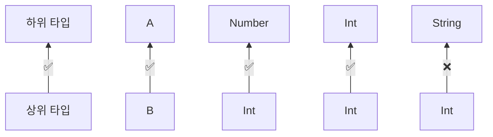

# 9장. 제네릭스 

## 입구
- 제네릭 함수와 클래스를 정의하는 방법
- 타입 소거와 실체화한 타입 파라미터(reified type parameter)
- 선언 지점과 사용 지점 변성(declaration-site variance)

<span style="color:orange">실체화된 타입 파라미터</span>를 사용하면 
인라인 함수 호출에서 타입 인자로 쓰인 구체적인 타입을 실행 시점에 알 수 있다.
(일반 클래스나 함수의 경우 타입 인자 정보가 실행 시점에 사라지기 때문에 이런 일이 불가능하다.)

<span style="color:orange">선언 지점 변성</span>을 사용하면 기저 타입은 같지만 
타입 인자가 다른 두 제네릭 타입 Type< A >와 Type< B >가 있을 때
타입 인자 A와 B의 상위/하위 타입 관계에 따라 
두 제네릭 타입의 상위/하위 타입 관계가 어떻게 되는지 지정할 수 있다.

- 예를 들어 List<Any>를 인자로 받는 함수가 있다고 했을 때 
  - List<Int>타입의 값을 전달할 수 있는지 여부를 선언 지점 변성을 통해 지정할 수 있다

<span style="color:orange">사용 지점 변성</span>은 
같은 목표(제네릭 타입 값 사이의 상위/하위 타입 관계 지정)를 
제네릭 타입 값을 사용하는 위치에서 파라미터 타입에 대한 제약을 표시하는 방식으로 달성한다.


<br/>
<br/>


## 9.1. 제네릭 타입 파라미터

제네릭스를 사용하면 타입 파라미터를 받는 타입을 정의할 수 있다. 
제네릭 타입의 인스턴스를 만들려면 타입 파라미터를 구체적인 타입 인자로 치환해야 한다.

- List 타입이 있다고 했을 때, 명확하게 문자열을 담는 리스트 = List<String>
- Map 타입은 제네릭 타입변수로 Map<K, V>형태로 선언이 되어 있고, 
  이를 인스턴스화 할때 Map<String, Person>처럼 구체적인 타입 인자를 넘겨 인스턴스화 할수 있다.


코틀린 컴파일러는 보통 타입과 마찬가지로 타입 인자도 추론할 수 있다.

```kotlin
val authors = listOf("Dmitry", "Svetlana")
```

listOf에 전달된 두 값이 문자열이기 때문에 컴파일러는 이 리스트가 List<String>이라 추론한다.
반면, 빈 리스트를 만들 때는 타입 인자를 추론할 근거가 없어 직접 타입을 명시해야 한다.

```kotlin
// 두 선언은 동등
val readers: MutableList<String> = mutableListOf()
val readers = mutableListOf<String>()
```

> 자바와 달리 코틀린에서는 제네릭 타입의 타입 인자를 프로그래머가 명시하거나 컴파일러가 추론할 수 있어야 한다. 
> 자바는 맨 처음에 제네릭 지원이 없었고 자바 1.5에 뒤늦게 제네릭을 도입했기 때문에 
> 이전 버전과 호환성을 유지하기 위해 타입 인자가 없는 제네릭 타입(raw 타입)을 허용한다.
> 
> 예를 들어 자바에서는 리스트 원소 타입을 지정하지 않고 List 타입의 변수를 선언할 수도 있다. 
> 코틀린은 처음부터 제네릭을 도입했기 때문에 raw 타입을 지원하지 않고 
> 제네릭 타입의 타입 인자를 (프로그래머가 직접 정의하든 타입 추론에 의해 자동으로 정의되든) 항상 정의해야 한다.

<br/>


## 9.1.1. 제네릭 함수와 프로퍼티

리스트를 다루는 함수를 작성한다면 어떤 특정 타입을 저장하는 리스트뿐 아니라 
모든 리스트를 다룰 수 있는 함수를 원할 것이다. 이럴 때 제네릭 함수를 작성해야 한다.
제네릭 함수를 호출할 때 반드시 구체적 타입으로 타입 인자를 넘겨야 한다. 

컬렉션을 다루는 라이브러리 함수는 대부분 제네릭 함수다.

```
     👇 타입 파라미터 선언
    ----
fun <T> List<T>.slice(indices: IntRange): List<T>
            ----                              ----
            👆타입 파라미터가 수신 객체와 반환 타입에 쓰인다👆
```

함수의 타입 파라미터 T가 수신 객체와 반환 타입에 쓰인다. 
수신 객체와 반환 타입 모두 List<T>다. 
이런 함수를 구체적인 리스트에 대해 호출할 때 타입 인자를 명시적으로 지정할 수 있다. 
하지만 실제로는 대부분 컴파일러가 타입 인자를 추론할 수 있으므로 그럴 필요가 없다.

```kotlin
>>> val letters = ('a'..'z').toList()
>>> println(letters.slice<Char>(0..2)) // 타입 인자를 명시적으로 지정
[a, b, c]
>>> println(letters.slice(10..13)) // 컴파일러는 여기서 T가 Char라는 사실을 추론한다
[k, l, m, n]
```

두 호출의 결과 타입은 모두 List<Char>이다.
컴파일러는 반환 타입 List<T>의 T를 자신이 추론한 Char로 치환한다.

filter 함수의 정의에서 (T) -> Boolean 타입의 함수를 파라미터로 받는다.
이 함수를 앞 예제에서 본 변수에 적용하는 부분을 살펴보자.

```kotlin
val authors = listOf("Dmitry", "Svetlana")
val readers = mutableListOf<String>(/* ... */)
fun <T> List<T>.filter(predicate: (T) -> Boolean): List<T>
>>> readers.filter{ it !in authors }
```

람다 파라미터에 대해 자동으로 만들어진 변수 it의 타입은 T라는 제네릭 타입이다.
컴파일러는 filter가 List<T>타입의 리스트에 대해 호출될 수 있다는 사실과 
filter의 수신 객체인 reader의 타입이 List<String>이라는 것을 알고, 
이를 토대로 T가 String이라고 추론한다.

클래스나 인터페이스 안에 정의된 메소드, 확장 함수 또는 최상위 함수에서 타입 파라미터를 선언할 수 있고,
확장 함수에선 수신 객체나 파라미터 타입에 따라 파라미터를 사용할 수 있다.

제네릭 함수를 정의할 때와 같이 제네릭 확장 프로퍼티를 선언할 수 있다.

```kotlin
val <T> List<T>.penultimate: T // 모든 리스트 타입에 이 제네릭 확장 프로퍼티를 사용할 수 있다
    get() = this[size - 2]
>>> println(listOf(1, 2, 3, 4).penultimate) // 이 호출에서 타입 파라미터 T는 Int로 추론된다
3
```

> ### ✅확장 프로퍼티만 제네릭하게 만들 수 있다. 
> 일반(확장이 아닌) 프로퍼티는 타입 파라미터를 가질 수 없다. 
> 클래스 프로퍼티에 여러 타입의 값을 저장할 수는 없으므로 
> 제네릭한 일반 프로퍼티는 말이 되지 않는다. 
> 일반 프로퍼티를 제네릭하게 정의하면 컴파일러가 다음과 같은 오류를 표시한다.
> 
> ```kotlin
> val <T> x: T = TODO() 
> Error: type parameter of a property must be used in its receiver type
> ```


<br/>


## 9.1.2. 제네릭 클래스 선언

자바와 마찬가지로 코틀린에서도 타입 파라미터를 넣은 꺽쇠 기호 (< >)를 
클래스(인터페이스) 이름 뒤에 붙이면 클래스(인터페이스)를 제네릭하게 만들 수 있다. 
타입 파라미터를 이름 뒤에 붙이고 나면 
클래스 본문 안에서 타입 파라미터를 다른 일반타입처럼 사용할 수 있다.

```kotlin
interface List<T> { // List 인터페이스에 T라는 타입 파라미터를 정의한다.
    operator fun get(index: Int): T // 인터페이스 안에서 T를 일반 타입처럼 사용할 수 있다.
}
```

제네릭 클래스를 확장하는 클래스 또는 제네릭 인터페이스를 구현하는 클래스를 정의하려면 
기반 타입의 제네릭 파라미터에 대해 타입 인자를 지정해야 한다.
이때 구체적인 타입을 넘길 수도 있고 
(하위 클래스도 제네릭 클래스라면) 타입 파라미터로 받은 타입을 넘길 수도 있다.

```kotlin
// 이 클래스는 구체적인 타입 인자로 String을 지정해 List를 구현한다
class StringList: List<String> {
    override fun get(index: Int): String = ... // String을 어떻게 사용하는지 살펴보라
}

// ArrayList의 제네릭 타입 파라미터 T를 List의 타입 인자로 넘긴다
class ArrayList<T>: List<T> {
    override fun get(index: Int): T = ...
}
```

StringList 클래스는 String 타입의 원소만을 포함. 따라서 String을 기반 타입의 타입 인자로 지정.
하위 클래스에서 상위 클래스에 정의된 함수를 오버라이드하거나 사용하려면 
타입 인자 T를 구체적 타입 String으로 치환해야 한다.
따라서 StringList에서 `fun get(Int): T`가 아니라 
`fun get(Int): String`이라는 시그니처를 사용한다.

ArrayList 클래스는 자신만의 타입 파라미터 T를 정의하면서 그 T를 기반 클래스의 타입 인자로 사용한다.
ArrayList<T>의 T와 앞에서 본 List<T>의 T는 같지 않고, 전혀 다른 타입 파라미터이다.
실제로는 T가 아닌 다른 이름을 사용해도 의미에는 아무 차이가 없다.

클래스는 자기 자신을 타입 인자로 참조할 수 있다.
Comparable 인터페이스를 구현하는 클래스가 예이다.

```kotlin
interface Comparable<T> {
    fun compareTo(other: T): Int
}

class String: Comparable<String> {
    override fun compareTo(other: String): Int = /* ... */
}
```

String 클래스는 제네릭 Comparable 인터페이스를 구현하면서 
그 인터페이스의 타입 파라미터 T로 String 자신을 지정한다.


<br/>


## 9.1.3. 타입 파라미터 제약

<span style="color:orange">타입 파라미터 제약</span>은 
클래스나 함수에 사용할 수 있는 타입 인자를 제한하는 기능이다.
어떤 타입을 제네릭 타입의 타입 파라미터에 대한 상한(upper bound)으로 지정하면 
그 제네릭 타입을 인스턴스화할 때 사용하는 타입 인자는 반드시 그 상한 타입이거나 
그 상한 타입의 하위 타입이어야 한다.
제약을 가하려면 타입 파라미터 이름 뒤에 콜론(:)을 표시하고 그 뒤에 상한 타입을 적으면 된다.

```
     👇 타입 파라미터
     --
fun <T : Number> List<T>.sum() : T
        -------
          👆 상한
```

아래는 실제 타입 인자(Int)가 Number를 확장하므로 합법적인 예시

```kotlin
>>> println(listOf(1, 2, 3).sum())
6
```

타입 파라미터 T에 대한 상한을 정하고나면 T 타입의 값을 그 상한 타입의 값으로 취급할 수 있다.

```kotlin
// Number를 타입 파라미터 상한으로 정한다
fun <T: Number> oneHalf(value: T): Double {
    return value.toDouble() / 2.0   // Number 클래스에 정의된 메소드를 호출할 수 있다.
}
>>> println(oneHalf(3))
1.5
```

두 파라미터 사이에서 더 큰 값을 찾는 제네릭 함수. 
비교할 수 있어야 최댓값을 찾을 수 있으므로 
함수 시그니처에도 두 인자를 서로 비교할 수있어야 한다는 사실을 지정해야 한다.

```kotlin
// 이 함수들의 인자들은 비교 가능해야 한다.
fun <T: Comparable<T>> max(first: T, second: T): T {
    return if (first > second) first else second
}
>>> println(max("kotlin", "java")) // 문자열은 알파벳순으로 비교된다
kotlin
```

max를 비교할 수 없는 값 사이에 호출하면 컴파일 오류가 난다.

```kotlin
>>> println(max("kotlin", 42))
Error: Type parameter bound for T is not satisfied
inferred type Any is not a subtype of Comparable<Any>
```

T의 상한 타입은 Comparable<T>다.
String이 Comparable<String>을 확장하므로 String은 max 함수에 적합한 타입 인자다.

`first > second`라는 식은 코틀린 연산자 관례에 따라 
`first.compareTo(second) > 0`이라고 컴파일 된다.
max 함수에서 first의 타입 T는 Comparable<T>를 확장하므로 
first를 다른 T 타입 값인 second와 비교할 수 있다.

드물지만 타입 파라미터에 대해 둘 이상의 제약을 가해야 하는 경우도 있다.

- CharSequence의 맨 끝에 마침표(.)가 있는지 검사하는 제네릭 함수
  - 표준 StringBuilder나 java.nio.CharBuffer 클래스 등에 대해 이 함수를 사용할 수 있다.


```kotlin
fun <T> ensureTrailingPeriod(seq: T) 
    where T: CharSequence, T: Appendable { // 타입 파라미터 제약 목록
    if (!seq.endsWith('.')) { // CharSequence 인터페이스의 확장함수를 호출
        seq.append('.') // Appendable 인터페이스의 메소드를 호출
    }
}

>>> val helloWorld = StringBuilder("Hello World")
>>> ensureTrailingPeriod(helloWorld)
>>> println(helloWorld)
Hello World.
```

예제는 타입 인자가 CharSequence와 Appendable 인터페이스를 반드시 구현해야 한다는 사실을 표현한다.
이는 데이터에 접근하는 연산(endsWith)과 
테이터를 변환하는 연산(append)을 T 타입의 값에게 수행할 수 있다는 뜻이다.


<br/>


## 9.1.4. 타입 파라미터를 널이 될 수 없는 타입으로 한정

제네릭 클래스나 함수를 정의하고 그 타입을 인스턴스화할 때는 
널이 될 수 있는 타입을 포함하는 어떤 타입으로 타입 인자를 지정해도 타입 파라미터를 치환할 수 있다.
아무런 상한을 정하지 않은 타입 파라미터는 결과적으로 Any?를 상한으로 정한 파라미터와 같다.

```kotlin
class Processor<T> {
  fun process(value: T) {
    value?.hashCode() // "value"는 널이 될 수 있다. 따라서 안전한 호출을 사용해야 한다. 
  }
}
```

process 함수에서 value 파라미터의 타입 T에는 물음표(?)가 붙어있지 않지만 
실제로는 T에 해당하는 타입 인자로 널이 될 수 있는 타입을 넘길 수도 있다.

```kotlin
// 널이 될 수 있는 타입인 String?이 T를 대신한다.
val nullableStringProcessor = Processor<String?>()
// 이 코드는 잘 컴파일되며 null이 value 인자로 지정된다
nullalbeStringProcessor.process(null)
```
항상 널이 될 수 없는 타입만 타입 인자로 받게 만들려면 타입 파라미터에 제약을 가해야 한다.
널 가능성을 제외한 아무런 제약도 필요 없다면 Any? 대신 Any를 상한으로 사용하면 된다.

```kotlin
// null이 될 수 없는 타입 상한을 지정
class Processor<T: Any> {
    fun process(value: T) {
         value.hashCode() // T 타입의 value는 null이 될 수 없다
    }
}
```

<T: Any>라는 제약은 T 타입이 항상 널이 될 수 없는 타입이 되게 보장한다.
컴파일러는 타입 인자인 String?가 Any의 자손 타입이 아니므로 
Processor<String?>같은 코드를 거부한다.

```kotlin
>>> val nullableStringProcessor = Processor<String?>()
Error: Type argument is not within its bounds.: should be subtype of 'Any'
```

타입 파라미터를 널이 될 수 없는 타입으로 제약하기만 하면 
타입 인자로 널이 될 수 있는 타입이 들어오는 일을 막을 수 있다.
따라서 Any를 사용하지 않고 다른 널이 될 수 없는 타입을 사용해 상한을 정해도 된다.


```kotlin
class Processor<T: Any> {
    fun process(value: T) {
        value.hashCode()
    }
}
```


<br/>
<br/>


## 9.2. 실행 시 제네릭스 동작: 소거된 타입 파라미터와 실체화된 타입 파라미터

JVM의 제네릭스는 보통 <span style="color:orange">타입 소거</span>를 사용해 구현된다. 
이는 실행 시점에 제네릭 클래스의 인스턴스에 타입 인자 정보가 들어있지 않다는 뜻이다. 
코틀린에서 타입 소거가 실용적인 면에서 어떤 영향을 끼치는지, 
함수를 inline으로 선언함으로써 이런 제약을 우회할 수 있는지 알아보자.

함수를 inline으로 만들면 타입 인자가 지워지지 않게 할 수 있다. 
이를 코틀린에선 <span style="color:orange">실체화</span>라고 한다.

<br/>

## 9.2.1. 실행 시점의 제네릭: 타입 검사와 캐스트

자바와 마찬가지로 코틀린 제네릭 타입 인자 정보는 런타임에 지워진다.
제네릭 클래스 인스턴스가 그 인스턴스를 생성할 때 쓰인 타입 인자에 대한 정보를 유지하지 않는다.

예를 들어 List<String> 객체를 만들고 그 안에 문자열을 여럿 넣더라도 실행 시점에는 
그 객체를 오직 List로만 볼 수 있고, 어떤 타입의 원소를 저장하는지 알 수 없다.

```kotlin
val list1: List<String> = listOf("a", "b")
val list2: List<Int> = listOf(1, 2, 3)
```


위 두 List를 컴파일러는 서로 다른 타입으로 인식하지만 실행 시점에선 완전히 같은 타입의 객체이다.
하지만 컴파일러가 타입 인자를 알고 올바른 타입의 값만 각 리스트에 넣어주도록 보장하여 
List<String>에는 문자열만, List<Int>에는 정수만 들어있다고 가정할 수 있다.

타입 소거로 인해 생기는 한계를 보면, 타입 인자를 따로 저장하지 않아 실행 시점에 타입 인자를 검사할 수 없다.
어떤 리스트가 문자열로 이뤄진 리스트인지 다른 객체로 이뤄진 것인지 실행 시점에 검사할 수 없다.
is 검사에서 타입 인자로 지정한 타입을 검사할 수 없다.

```kotlin
>>> if (value is List<String>) {...}
ERROR: Cannot check for instance of erased type
```

다만 저장해야 하는 타입 정보의 크기가 줄어들어 전반적인 메모리 사용량이 줄어든다는 제네릭 타입 소거의 장점이 있다.

앞에서 봤듯이 타입 인자를 명시하지 않고 제네릭 타입을 사용할 수 없다.
어떤 값이 집합이나 맵이 아니라 리스트라는 사실을 확인하려면 
<span style="color:orange">스타 프로젝션</span>을 사용하면 된다.

```kotlin
if(value is List<*>) { ... }
```

타입 파라미터가 2개 이상이면 모든 타입 파라미터에 *를 포함해야 한다.

as나 as? 캐스팅에도 제네릭 타입을 사용할 수 있다.
하지만 기저 클래스는 같지만 타입 인자가 다른 타입으로 캐스팅해도 여전히 캐스팅에 성공하므로 조심해야 한다.
실행 시점에는 제네릭 타입의 타입 인자를 알 수 없으므로 캐스팅은 항상 성공한다.
이런 타입 캐스팅을 사용하면 컴파일러가 `unchecked cast`(검사할 수 없는 캐스팅)이라는 경고를 해주지만 
컴파일은 진행하므로 원하는 제네릭 타입으로 캐스팅해 사용해도 된다.

```kotlin
fun printSum(c: collection<*>) {
    val inList = c as? List<Int> // 여기서 Unchecked cast: List<*> to List<Int> 경고 발생
      ?: throw IllegalArgumentException("List is expected")
    println(inList.sum())
}

>>> println(listOf(1, 2, 3)) // 예상대로 작동한다
6
```

정수 리스트나, 집합에 대해 함수를 호출하면 정수 리스트에 대해선 합계를 출력하고, 
집합에 대해선 IllegalArgumentException을 발생하지만, 
잘못된 타입의 원소가 들어있는 리스트를 전달하면 실행 시점에 ClassCastException이 발생한다.

```kotlin
// 집합은 리스트가 아니므로 예외가 발생
>>> printSum(setOf(1, 2, 3))                  
IllegalArgumentException: List is expected

// as? 캐스팅은 성공하지만 나중에 다른 예외가 발생
>>> printSum(listOf("a", "b", "c"))          
ClassCastException: String cannot be cast to Number
```

어떤 값이 List<Int>인지 검사할 수는 없으므로 IllegalArgumentException이 발생하지는 않는다.
sum은 Number 타입의 값을 리스트에서 가져와 더하려고 시도하지만 
String을 Number로 사용하려 하기에 ClassCastException이 발생한다.

코틀린 컴파일러는 컴파일 시점에 타입 정보가 주어진 경우에는
is 검사를 수행하게 허용할 수 있을 정도로 똑똑하다.

```kotlin
fun printSum(c: Collection<Int>) {
    if (c is List<Int>) { // 이 검사는ㄴ 올바르다
        println(c.sum())
    }
}
>>> printSum(listOf(1, 2, 3))
6
```

컴파일 시점에 c 컬렉션이 Int 값을 저장한다는 사실이 알려져 있으므로 c가 List<Int>인지 검사할 수 있다.

일반적으로 코틀린 컴파일러는 안전하지 못한 검사와 수행할 수 있는 검사를 알려주기 위해 최대한 노력한다.
(안전하지 못한 is 검사는 금지하고 위험한 as 캐스팅은 경고르르 출력)
컴파일러 경고의 의미와 어떤 연산이 안전한 지에 대해 알아야 한다.

<br/>


## 9.2.2. 실체화한 타입 파라미터를 사용한 함수 선언

코틀린의 제네릭 타입의 타입 인자 정보는 실행 시점에 지워진다. 
따라서 제네릭 클래스의 인스턴스가 있어도 그 인스턴스를 만들 때 사용한 타입 인자를 알아낼 수 없다. 
제네릭 함수의 타입 인자도 제네릭 함수가 호출되도 그 함수의 본문에서는 호출시 쓰인 타입 인자를 알 수 없다.

```kotlin
>>> fun <T> isA(value: Any) = value is T
Error: Cannot check for instance of erased type: T
```

이런 제약을 피할 수 있는 경우가 하나 있다.
인라인 함수의 타입 파라미터는 실체화되므로 실행 시점에 인라인 함수의 타입 인자를 알 수 있다.
위의 isA 함수를 인라인 함수로 만들고 타입 파라미터를 reified로 지정하면 
value의 타입이 T의 인스턴스인지를 실행 시점에서 검사할 수 있다.

```kotlin
inline fun <reified T> isA(value: Any) = value is T
>>> println(isA<String>("abc"))
>>> println(isA<String>(123))

true
false
```

실체화한 타입 파라미터를 활용하는 가장 간단한 예제 중 하나는 
표준 라이브러리 함수인 `filterIsInstance`이다.
이 함수는 인자로 받은 컬렉션의 원소 중에서 타입 인자로 지정한 클래스의 인스턴스만을 모아 만든 리스트를 반환한다.

```kotlin
>>> val items = listOf("one", 2, "three")
>>> println(items.filterIsInstance<String>())
[one, three]
```

filterIsInstance의 타입 인자로 String을 지정해 
함수의 반환 타입을 List<String>으로 추론할 수 있게 한다.
따라서 타입 인자를 실행 시점에 알 수 있고 filterIsInstance는 그 타입 인자를 사용해 
리스트의 원소 중에 인자와 타입이 일치하는 원소만을 추려낼 수 있다.

아래는 표준 라이브러리 함수 filterIsInstance를 간단하게 정리한 버전.

```kotlin
// reified 키워드는 이 타입 파라미터가 실행 시점에 지워지지 않음을 표시한다
inline fun <reified T> Iterable.filterIsInstance(): List<T> {
    val destination = mutableListOf<T>() 
    for (element in this) {
        // 각 원소가 타입 인자로 지정한 클래스의 인스턴스인지 검사할 수 있다
        if(element is T) {
            destination.add(element)
        }
    }
    return destination
}
```

> ### ✅ 인라인 함수에서만 실체화한 타입 인자를 쓸 수 있는 이유 
> 컴파일러는 인라인 함수의 본문을 구현한 바이트코드를 그 함수가 호출되는 모든 지점에 삽입한다. 
> 컴파일러는 실체화한 타입 인자를 사용해 인라인 함수를 호출하는 각 부분의 정확한 타입 인자를 알 수 있다. 
> 따라서 컴파일러는 타입 인자로 쓰인 구체적인 클래스를 참조하는 바이트코드를 생성해 삽입할 수 있다.
> 
> ```kotlin
> for (element in this) {
>     if(element is String) { // 특정 클래스 참조
>         destination.add(element)
>     }
> }
> ```
> 
> 타입 파라미터가 아니라 구체적인 타입을 사용하므로 만들어진 바이트코드는 
> 실행 시점에 벌어지는 타입 소거 영향을 받지 않는다.
> 
> 자바 코드에서는 reified 타입 파라미터를 사용하는 inline 함수를 호출할 수 없다는 점을 기억하자.
> 자바에서는 코틀린 inline 함수를 일반 함수처럼 호출한다. 
> 그 경우 인라인 함수를 호출해도 실제로 인라이닝이 되지 않는다.
> 실체화한 타입 파라미터가 있는 함수의 경우 타입 인자를 바이트코드에 넣기 위해 
> 일반 함수보다 더 많은 작업이 필요하고, 항상 인라이닝 되어야만 한다. 
> 따라서 실체화한 타입 파라미터가 있는 인라이닝 함수를 일반 함수처럼 자바에서는 호출할 수 없다.

인라인 함수에는 실체화한 타입 파라미터가 여럿 있거나 
실체화한 타입 파라미터와 실체화하지 않은 타입 파라미터가 함께 있을 수도 있다.
함수의 파라미터 중에 함수 타입인 파라미터가 있고 
그 파라미터에 해당하는 인자를 함께 인라이닝함으로 얻는 이익이 더 큰 경우 함수를 인라인 함수로 만드는데, 
이는 성능 향상이 아닌 실체화한 타입 파라미터를 사용하기 위함이다.

성능을 좋게 하려면 인라인 함수의 크기르 계속 관찰해야 한다. 
함수가 커지면 실체 화한 타입에 의존하지 않는 부분을 별도의 일반 함수로 뽑아내는 편이 낫다.

<br/>


## 9.2.3. 실체화한 타입 파라미터로 클래스 참조 대신

`java.lang.Class` 타입 인자를 파라미터로 받는 API에 대한 코틀린 어댑터를 구축하는 경우 
실체화한 타입 파라미터를 자주 사용한다.
예를 들어 JDK의 `ServiceLoader`가 있다. 
이는 어떤 추상 클래스나 인터페이스를 표현하는 `java.lang.Class`를 받아 
그 클래스나 인스턴스를 구현한 인스턴스를 반환한다.

실체화한 타입 파라미터를 활용해 이런 API를 쉽게 호출할 수 있게 만드는 방법을 보도록 하자.
ServiceLoader를 사용해 서비스를 읽어 들이기 위한 호출 방식을 보겠다.

```kotlin
val serviceImpl = ServiceLoader.load(Service::Class.java)
```

::class.java는 코틀린 클래스에 대응하는 java.lang.Class 참조를 얻는 방법이다.
Service::class.java라는 코드는 Service.class라는 자바 코드와 완전히 같다.

이 예제를 구체화한 타입 파라미터를 사용해 다시 작성해보자.

```kotlin
val serviceImpl = loadService<Service>()
```

훨씬 짧다! 
읽어 들일 서비스 클래스를 loadService 함수의 타입 인자로 지정하면 
::class.java라고 쓰는 경우보다 훨씬 읽고 이해하기 쉽다.

loadService 함수를 어떻게 정의할 수 있는지 살펴보자.

```kotlin
inline fun <reified T> loadService() { // 타입 파라미터를 reified로 표시한다
    return ServiceLoader.load(T::class.java) // T::class로 타입파라미터의 클래스 가져온다
}
```

일반 클래스에 사용할 수 있는 `::class.java` 구문을 이 경우에도 사용할 수 있다.
이를 통해 타입 파라미터로 지정된 클래스에 따른 `java.lang.Class`를 얻을 수 있고, 
얻은 클래스 참조를 보통 때와 마찬가지로 사용할 수 있다.

> ### ✅ 안드로이드의 startActivity 함수 간단하게 만들기
> 액티비티의 클래스를 `java.lang.Class`로 전달하는 대신 실체화한 타입 파라미터를 사용할 수 있다.
> ```kotlin
> inline fun <reified T : Activity> 
>       Context.startActivity() { // 타입 파라미터를 reified로 표시한다
>     val intent = Intent(this, T::class.java) // T::class로 타입 파라미터의 클래스를 가져온다
>     startActivity(intent)
> }
>
> startActivity<DetailActivity>() // 액티비티를 표시하기 위해 메소드를 호출한다 
> ```

<br/>


## 9.2.4. 실체화한 타입 파라미터의 제약

실체화한 타입 파라미터는 유용한 도구이지만 몇 가지 제약이 있다.
일부는 실체화의 개념으로 인해 생기는 제약이며, 
나머지는 지금 코틀린이 실체화를 구현하는 방식에 의해 생기는 제약으로 후에 완화될 가능성이 있다.

더 구체적으로 다음과 같은 경우에 실체화한 타입 파라미터를 사용할 수 있다.

- 타입 검사와 캐스팅(is, !is, as, as?)
- 코틀린 리플렉션 API(::class)
- 코틀린 타입에 대응하는 java.lang.Class를 얻기(::Class.java)
- 다른 함수를 호출할 때 타입 인자로 사용

다음과 같은 일은 할 수 없다.

- 타입 파라미터 클래스의 인스턴스 생성하기
- 타입 파라미터 클래스의 동반 객체 메소드 호출하기
- 실체화한 타입 파라미터를 요구하는 함수를 호출하면서 
  실체화하지 않은 타입 파라미터로 받은 타입을 타입 인자로 넘기기
- 클래스, 프로퍼티, 인라인 함수가 아닌 함수의 타입 파라미터를 reified로 지정하기

실체화한 타입 파라미터를 인라인 함수에만 사용할 수 있어 
실체화한 타입 파라미터를 사용하는 함수는 자신에게 전달되는 모든 람다와 함께 인라이닝된다.

람다 내부에서 타입 파라미터를 사용하는 방식에 따라 
람다를 인라이닝할 수 없는 경우가 생기기도 하고 성능 문제로 람다를 인라이닝하고 싶지 않을 수도 있다.
이 경우 noinline 변경자를 함수 타입 파라미터에 붙여 인라이닝을 금지할 수 있다.


<br/>
<br/>


## 9.3. 변성: 제네릭과 하위 타입

<span style="color:orange">변성(variance)</span> 개념은 List<String>와 List<Any>와 같이 기저 타입이 같고 
타입 인자가 다른 여러 타입이 서로 어떤 관계가 있는지 설명하는 개념이다. 
변성을 잘 활용하면 사용에 불편하지 않으면서 타입 안전성을 보장하는 API를 만들 수 있다.

<br/>

## 9.3.1. 변성이 있는 이유: 인자를 함수에 넘기기

List 타입의 파라미터를 받는 함수에 List을 넘기면 안전할까?

String 클래스는 Any를 확장하므로 Any 타입 값을 파라미터로 받는 함수에 String 값을 넘겨도 절대 안전하다.
하지만 Any와 String이 List 인터페이스의 타입 인자로 들어가는 경우에는 절대 안전하다고 말할 수 없다.

리스트의 내용을 출력하는 함수를 보자.

```kotlin
fun printContents(list: List<Any>) {
    println(list.joinToString())
}

>>> printContents(listOf("abc", "bac"))
abc, bac
```

위 경우 문자열 리스트도 잘 동작한다. 각 원소를 Any로 취급하며, 모든 문자열은 Any 타입이기 때문이다.

```kotlin
fun addAnswer(list:MutableList<Any>) {
    list.add(42)
}

>>> val strings = mutableListOf("abc", "bac")
>>> addAnswer(strings) // 이 줄이 컴파일 되면
>>> println(strings.maxBy { it.length}) // 실행시점에 예외가 발생할 것이다
ClassCastException: Integer cannot be cast to String
```

MutableList<String> 타입의 strings 변수를 선언해 함수에 넘길 때, 
컴파일러가 이 식을 받아들이면 정수를 문자열 리스트 뒤에 추가할 수 있다.
따라서 이 함수 호출은 컴파일될 수 없다.
MutableList<Any>가 필요한 곳에 MutableList<String>을 넘기면 안된다는 사실을 보여준다.


이제 List<Any> 타입의 파라미터를 받는 함수에 List<String>을 넘기면 안전한 지에 대해 보자.
어떤 함수가 리스트의 원소를 추가하거나 변경하면 타입 불일치가 생길 수 있어 
List<Any> 대신 List<String>을 넘길 수 없다.
하지만 원소 추가나 변경이 없다면 대신 넘겨도 안전하다.

- 코틀린에서는 리스트의 변경 가능성에 따라 적절한 인터페이스를 선택하면 
  - 안전하지 못한 함수 호출을 막을 수 있다.
- 함수가 읽기 전용 리스트를 받는다면 
  - 더 구체적인 타입의 원소를 갖는 리스트를 그 함수에 넘길 수 있지만, 
- 리스트가 변경 가능하다면 
  - 그럴 수 없다.


<br/>

## 9.3.2. 클래스, 타입, 하위타입

제네릭 클래스가 아닌 클래스에서는 클래스 이름을 바로 타입으로 쓸 수 있다.

- 예) `var x: String`이라고 쓰면 
  - String 클래스의 인스턴스를 저장하는 변수를 정의할 수 있고, 
  - `var x: String?`처럼 같은 클래스 이름을 널이 될 수 있는 타입에도 쓸 수 있다.

제네릭 클래스에서는 상황이 더 복잡하다.
올바른 타입을 얻으려면 **제네릭 타입의 타입 파라미터를 구체적인 타입 인자로 바꿔줘야** 한다.
List는 타입이 아니다. 하지만 클래스다. 
하지만 타입 인자를 치환한 List<Int>, List<String?>, List<List<String>> 등은 
모두 제대로 된 타입이다.
각각의 제네릭 클래스는 무수히 많은 타입을 만들 수 있다.

타입 사이의 관계를 논하기 위해서는 
<span style="color:orange">하위 타입</span>이라는 개념을 잘 알아야 한다.
어떤 타입 A의 값이 필요한 모든 장소에 어떤 타입 B의 값을 넣어도 아무 문제가 없다면 타입 B는 A의 하위 타입이다.

- ex) Int는 Number의 하위 타입이지만 String의 하위 타입은 아니다.

<span style="color:orange">상위 타입</span>은 하위 타입의 반대로 
A 타입이 B 타입의 하위 타입이라면 B는 A의 상위 타입이다.



- A가 필요한 모든 곳에 B를 사용할 수 있으면 B는 A의 하위 타입이다.

컴파일러는 변수 대입이나 함수 인자 전달 시 하위 타입 검사를 매번 수행한다.

```kotlin
fun test(i: Int) {
    val n: Number = i  // Int는 Number의 하위 타입이므로 컴파일된다.
    
    fun f(s: String) { /*. . .*/ }
    f(i) // Int가 String의 하위 타입이 아니므로 컴파일되지 않는다.
}
```

어떤 값의 타입이 변수 타입의 하위 타입인 경우에만 값을 변수에 대입하게 허용한다.

간단한 경우 하위 타입은 <span style="color:orange">하위 클래스</span>와 근본적으로 같다.
Int 클래스는 Number의 하위 클래스이므로 Int는 Number의 하위 타입이다.
String은 CharSequence의 하위 타입인 것처럼 어떤 인터페이스를 구현하는 클래스의 타입은 
그 인터페이스 타입의 하위 타입이다.

널이 될 수 있는 타입은 하위 타입과 하위 클래스가 같지 않다.


널이 될 수 없는 타입은 널이 될 수 있는 타입의 하위 타입이지만 두 타입 모두 같은 클래스에 해당한다.
항상 널이 될 수 없는 타입의 값을 널이 될 수 있는 타입의 변수에 저장할 수 있지만, 
반대로 널이 될 수 있는 타입의 값을 널이 될 수 없는 타입의 변수에 저장할 수는 없다.

제네릭 타입을 인스턴스화할 때 타입 인자로 서로 다른 타입이 들어가면 
인스턴스 타입 사이의 하위 타입 관계가 성립하지 않으면 
그 제네릭 타입을 <span style="color:orange">무공변(invariant)</span>이라 말한다.

MutableList를 예로 들어보자.
A와 B가 서로 다르기만 하면 `MutableList<A>`는 항상 `MutableList<B>`의 하위 타입이 아니다.

코틀린의 List 인터페이스는 읽기 전용 컬렉션을 표현한다. 
A가 B의 하위 타입이면 `List<A>`는 `List<B>`의 하위 타입이다. 
그런 클래스나 인터페이스를 공변적(covariant)이라고 한다.


<br/>


## 9.3.3. 공변성: 하위 타입 관계를 유지

`Producer<T>`를 예로 공변성 클래스를 설명하자. 
A가 B의 하위 타입일 때 `Producer<A>`가 `Producer<B>`의 하위 타입이면 Peoducer는 공변적이다. 
이를 하위 타입 관계가 유지된다고 말한다. 

- 예를 들어 Cat가 Animal의 하위 타입이기 때문에 
  - `Producer<Cat>`은 `Producer<Animal>`의 하위 타입이다.

코틀린에서 제네릭 클래스가 타입 파라미터에 대해 공변적임을 표시하려면 
타입 파라미터 이름 앞에 out을 넣어야 한다.

```kotlin
interface Producer<out T> { // 클래스가 T에 대해 공변적이라 선언
    fun produce(): T
}
```

클래스의 타입 파라미터를 공변적으로 만들면 
함수 정의에 사용한 파라미터 타입과 타입 인자의 타입이 정확히 일치하지 않아도 
그 클래스의 인스턴스를 함수 인자나 반환 값으로 사용할 수 있다.

```kotlin
open class Animal {
    fun feed() { ... }
}

class Herd<T: Animal> { // 이 타입 파라미터를 무공변성으로 지정
    val size: Int get() = ...
    operator fun get(i: Int): T { ... }
}

fun feedAll(animals: Herd<Animal>) {
    for(i in 0 until animals.size) {
        animals[i].feed()
    }
}
```

사용자 코드가 고양이 무리를 만들어서 관리한다면...

```kotlin
class Cat : Animal() { // Cat은 Animal이다
    fun cleanLitter() { ... }
}

fun takeCareOfCats(cats: Herd<Cat>) {
    for (i in 0 until cats.size) {
        cats[i].cleanLitter()

      /**
       * ERROR: Type mismatch: inferred type is Herd<Cat>, but Herd<Animal> was expected
       */
      // feedAll(cats)
    }
}
```

feedAll 함수에게 고양이 무리를 넘기면 타입 불일치(type mismatch) 오류를 볼 수 있다. 
Herd 클래스의 T 타입 파라미터에 대해 아무 변성도 지정하지 않았기 때문에 
고양이 무리는 동물 무리의 하위 클래스가 아니다.

Herd 클래스는 List와 비슷한 API를 제공하며 동물을 그 클래스에 추가하거나 
무리안의 동물을 다른 동물로 바꿀 수는 없다. 
따라서 Herd를 공변적인 클래스로 만들고 호출 코드를 적절히 바꿀 수 있다.

```kotlin
class Herd<out T : Animal> { // T는 이제 공변적  
   // ...
}

fun takeCareOfCats(cats: Herd<Cat>) {
    for (i in 0 until cats.size) {
        cats[i].cleanLitter()
    }
    feedAll(cats) // 캐스팅을 할 필요가 없다
}
```

모든 클래스를 공변적으로 만들 수는 없다.
- 공변적으로 만들면
  - 안전하지 못한 클래스도 있기 때문이다.
- 타입 파라미터를 공변적으로 지정하면 
  - 클래스 내부에서 그 파라미터를 사용하는 방법을 제한한다.

타입 안정성을 보장하기 위해 공변적 파라미터는 항상 out 위치에만 있어야 한다.
클래스 T 타입의 값을 생산할 수는 있지만 소비할 수는 없다.

클래스 멤버를 선언할 때 타입 파라미터를 사용할 수 있는 지점은 모두 인(in)과 아웃(out)위치로 나뉜다.
T라는 타입 파라미터를 선언하고 T를 사용하는 함수가 멤버로 있는 클래스를 생각해보자.
- T가 함수의 반환 타입에 쓰이면 T는 out 위치에 있고, 
  - 그 함수는 T 타입의 값을 생산한다.
- T가 함수의 파라미터 타입에 쓰이면 in 위치에 있고, 
  - 그 함수는 T 타입의 값을 소비한다.


- 클래스 타입 파라미터 T 앞에 out 키워드를 붙이면 
  - 클래스 안에서 T를 사용하는 메소드가 out 위치에서만 T를 사용하게 허용하고 
  - in 위치에서는 사용하지 못하게 막는다.

out 키워드는 T의 사용법을 제한하며 T로 인해 생기는 하위 타입 관계의 타입 안정성을 보장한다.

```kotlin
class Herd<out T: Animal> { 
    val size: Int get() = ...
    operator fun get(i: Int): T { ... } // T를 반환타입으로 사용한다
} 
```

Cat이 Animal의 하위 타입이기 때문에 `Herd<Animal>`은 get을 호출하는 모든 코드는 
get이 Cat을 반환해도 아무 문제 없이 작동한다.

- 공변성: 하위 타입 관계가 유지된다(`Producer<Cat>`은 `Producer<Animal>`의 하위타입이다)
- 사용 제한: T를 아웃 위치에서만 사용할 수 있다

```kotlin
interface List<out T>: Collection<T> {
    // 읽기 전용 메소드로 T를 반환하는 메소드만 정의한다.
    // (따라서 T는 항상 아웃 위치에 쓰인다.)
    operator fun get(index: Int): T 
    // ...
}
```

타입 파라미터를...
- 함수의 파라미터 타입이나
- 반환 타입,
- 그리고 다른 타입의 타입 인자로 사용할 수도 있다

```kotlin
interface List<out T>: Collection<T> {
    // 여기서도 T는 아웃 위치에 있다
    fun subList(fromIndex: Int, toIndex: Int): List<T> 
    // ...
}
```

`MutableList<T>`의 경우 타입파라미터 T에 대해 공변적으로 선언할 수 없다.
`MutableList<T>`에는 T를 인자로 받아서 그 타입의 값을 반환하는 메소드가 있다.
(따라서 T가 인과 아웃에 동시에 쓰인다.)

```kotlin
// MutableList는 T에 대해 공변적일 수 없다.
interface MutableList<T> :List<T>, MutableCollection<T> {
    // 이유는 T가 인 위치에 쓰이기 때문
    @override fun add(element: T): Boolean
}
```

컴파일러는 타입 파라미터가 쓰이는 위치를 제한한다. 클래스가 공변적으로 선언된 경우 
`Type parametr T is declared as 'out' but occurs in 'in' position` 오류를 보고한다.
(타입 파라미터 T가 아웃으로 선언됐지만 인 위치에 나타남)

생성자 파라미터는 인이나 아웃, 어느 쪽도 아니라는 사실에 유의한다.
타입 파라미터가 아웃이라 해도 그 타입을 여전히 생성자 파라미터 선언에 사용할 수 있다.

```kotlin
class Herd<out T: Animal>(vararg animals: T) { ... }
```

변성은 코드에서 위험할 여지가 있는 메소드를 호출할 수 없게 만듦으로써 
제네릭타입의 인스턴스 역할을 하는 클래스 인스턴스를 잘못 사용하는 일이 없게 방지하는 역할을 한다. 
생성자는 나중에 호출할 수 있는 메소드가 아니다. 따라서 생성자는 위험할 여지가 없다. 

하지만 생성자에 val이나 var키워드를 적는다면 게터나 세터를 정의하는것과 같으므로 
읽기 전용 프로퍼티는 아웃 위치, 변경 가능 프로퍼티는 아웃과 인위치 모두에 해당한다.

또한 아래 예시는 loadAnimal 프로퍼티가 인위치에 있기 때문에 T를 아웃 위치에 표시할 수 없다.

```kotlin
class Herd<T: Animal>(var leadAnimal: T, vararg animals: T) { ... }
```

T 타입인 leadAnimal 프로퍼티가 in 위치에 있기 때문에 T를 out으로 표시할 수 없다.
(필자 : 이게 무슨 말이야...)

또한 이런 위치 규칙은 오직 외부에서 볼 수 있는 클래스 API에만 적용할 수 있다.
비공개 메소드의 파라미터는 in도 아니고 out도 아닌 위치이다.
변성 규칙은 클래스 외부의 사용자가 클래스를 잘못 사용하는 일을 막기 위한 것이므로 
클래스 내부 구현에는 적용되지 않는다.

<br/>

## 9.3.4. 반공변성: 뒤집힌 하위 타입 관계

반공변성은 공변성을 거울에 비친 상이라 할 수 있다.
반공변 클래스의 하위 타입 관계는 공변 클래스의 경우와 반대이다.

```kotlin
interface Comparator<in T> {
    fun compare(e1: T, e2: T): Int { ... } // T를 인 위치에 사용한다
}
```

이 인터페이스의 메소드는 T 타입의 값을 소비하기만 한다. 
이는 T가 in 위치에서만 쓰인다는 뜻이다.

물론 특정 타입에 Comparator을 구현하면, 그 타입의 하위 타입에 속하는 모든 값을 비교할 수 있다.

```kotlin
val anyComparator = Comparator<Any> { 
    e1, e2 -> e1.hashCode() - e2.hashCode()
}

val strings: listOf<String> = ...
// 문자열과 같은 구체적인 타입을 비교하는데 모든 객체를 비교하는 Comparator을 사용할 수 있다.
strings.sortedWith(anyComparator)
```

sortedWith는 `Comparator<String>`을 요구하므로,
String보다 더 일반적인 타입을 비교할 수 있는 Comparator을 sortedWith에 넘겨주는 것은 안전하다
어떤 타입의 객체를 Comparator로 비교해야 한다면
그 타입이나 조상 타입을 비교할 수 있는 Comparator을 사용할 수 있다.
이는 `Comparator<Any>`가 `Comparator<String>`이라는 뜻.
하지만 Any는 String의 하위 타입이다. 
서로 다른 타입 인자에 대해 Comparator의 타입 관계는 타입 인자의 하위 타입 관계와는 정반대 방향이다.

Consumer<T>를 예로 들어보자.
타입 B가 타입 A의 하위 타입인 경우 `Consumer<A>`가 `Consumer<B>`의 하위 타입인 관계가 성립하면 
제네릭 클래스 Consumer<T>는 타입 인자 T에 반공변이다.
A와 B의 위치가 서로 뒤바뀐다. **하위 타입 관계가 뒤집힌다.**


in 키워드는 그 키워드가 붙은 타입이 메소드 안으로 전달되어 소비된다는 뜻.
공변성의 경우와 마찬가지로 타입 파라미터의 사용을 제한함으로써 특정 하위 타입관 관계에 도달할 수 있다.

|공변성|반공변성|무공변성|
|---|---|---
|`Producer<out T>`|`Consumer<in T>`|`MutableList<T>`|
|타입 인자의 하위 타입 관계가 제네릭 타입에서도 유지된다| 타입인자의 하위 타입 관계가 제네릭 타입에서 뒤집힌다|하위 타입 관계가 성립하지 않는다|
|`Producer<Cat>`은 `Producer<Animal>`의 하위타입이다|`Consumer<Animal>`은 `Consumer<Cat>`의 하위타입이다||
|T를 아웃 위치에서만 사용할 수 있다| T를 인위치에서만 사용할 수 있다|T를 아무위치에서나 사용할 수 있다|

클래스나 인터페이스가 특정 타입 파라미터에 대해서는 
공변적이고 다른 타입 파라미터에 대해서는 반공변적일 수도 있다.

```kotlin
interface Function1<in P, out R>{
    operator fun invoke(p: P): R
}
```

(P) -> R은 `Function<P, R>`을 더 알아보기 쉽게 적은 것이다.

Function1의 하위 타입 관계는
- 첫번째 타입 인자의 하위 타입관계와는 반대지만
- 두번째 타입 인자의 하위 타입 관계와는 같음을 뜻한다.

```kotlin
fun enumerateCats(f: (Cat) -> Number){ ... }
fun Animal.getIndex(): Int = ...

// Animal은 Cat의 상위 타입이며 Int는 Number의 하위 타입이므로
// 이 코드는 올바른 코틀린 식이다.
>>> enumerateCats(Animal::birthDay)
```

클래스 정의에 변성을 직접 기술하면
그 클래스를 사용하는 모든 장소에 그 변성이 적용된다는 점.
자바는 이를 지원하지 않는다. 
대신 클래스를 사용하는 위치에서 와일드 카드를 사용해 그때그때 변성을 지정해야 한다.


<br/>


## 9.3.5. 사용 지점 변성: 타입이 언급되는 지점에서 변성 지정

클래스를 선언하면서 변성을 지정하면 
그 클래스를 사용하는 모든 장소에 변성 지정자가 영향을 끼치므로 편리하다. 이러한 방식을 
<span style="color:orange">선언 지점 변성(declaration site variance)</span>이라 한다.
자바는 변성을 다른 방식으로 다루는데, 타입 파라미터가 있는 타입을 사용할 때마다 
해당 타입 파라미터를 하위 타입이나 상위 타입 중 어떤 타입으로 대치할 수 있는지 명시해야 한다. 이런 방식을
<span style="color:orange">사용 지점 변성(use site variance)</span>이라 한다.

> ### ✅ 코틀린 선언 지점 변성과 자바 와일드카드 비교
> 선언 지점 변성을 사용하면 변성 변경자를 단 한번만 표시하고
> 클래스를 쓰는 쪽에서는 변성에 대해 신경쓸 필요가 없으므로 코드가 더 간결해진다.
> 자바에서 사용자의 예상대로 작동하는 API를 만들기 위해 라이브러리 개발자는
> `Function<? super T, ? extends R>`처럼 와일드카드를 사용해야 된다.
> 자바 8 표준 라이브러리 소스코드를 살펴보면 
> Function 인터페이스를 사용하는 모든 위치에서 와일드카드를 볼 수 있다.
> 
> ```java
> public interface Stream {
>   <R> Stream <R> map(Function<? super T, ? extends R> mapper);
> }
> ```
> 클래스 선언 지점에서 변성을 한번만 지정하면 더 간결 + 우아한 코드를 작성할 수 있다


코틀린도 사용 지점 변성을 지원한다.
따라서 클래스 안에서 어떤 타입 파라미터가 공변적이거나 반공변적인지 선언할 수 없는 경우에도 
특정 타입 파라미터가 나타나는 지점에서 변성을 정할 수 있다.

MutableList와 같은 상당수의 인터페이스는 타입 파라미터로 지정된 타입을 소비하는 동시에 생산할 수 있기 때문에
일반적으로 공변적이지도 반공변적이지도 않다.
하지만 그런 인터페이스 타입의 변수가 한 함수 안에서 생산자나 소비자 중 
단 한 가지 역할만을 담당하는 경우가 자주 있다.

```kotlin
fun <T> copyData(source: MutableList<T>, destination: MutableList<T>) {
    for (item in source) {
        destination.add(item)
    }
}
```

이 함수는 컬렉션의 원소를 다른 컬렉션으로 복사하는데, 
두 컬렉션 모두 무공변 타입이지만 원본 컬렉션에서는 읽기만 하고 대상 컬렉션에서는 쓰기만 한다.
따라서 두 컬렉션의 원소 타입이 정확히 일치할 필요가 없는 것이다.

이 함수가 여러 다른 리스트 타입에 대해 작동하게 하려면 
두 번째 제네릭 타입 파라미터를 도입할 수 있다.

```kotlin
// source 원소 타입은 destination 원소 타입의 하위 타입이어야 한다.
fun <T: R, R> copyData(source: MutableList<T>, 
                       destination: MutableList<R>) {
    for (item in source) {
        destination.add(item)
    }
}
>>> val ints = mutableListOf(1, 2, 3)
>>> val anyItems = mutableListOf<Any>()
>>> copyData(ints, anyItems) // Int가 Any의 하위 타입이므로 이 함수를 호출할 수 있다.
>>> println(anyItems)
[1, 2, 3]
```

함수 구현이 아웃 위치에 있는 타입 파라미터를 사용하는 메소드만 호출한다면 
그런 정보를 바탕으로 함수 정의 시 타입 파라미터에 변성 변경자를 추가할 수 있다.

```kotlin
// out 키워드를 타입을 사용하는 위치 앞에 붙이면
// T 타입을 in 위치에 사용하는 메소드를 호출하지 않는다는 뜻이다.
fun <T> copyData(source: MutableList<out T>,    
                 destination: MutableList<T>) {
    for (item in source) {
        destination.add(item)
    }
}
```

타입 선언에서 타입 파라미터를 사용하는 위치라면 어디에나 변성 변경자를 붙일 수 있다.
이때 <span style="color:orange">타입 프로젝션(tyoe projection)</span>이 일어난다.
즉 source를 일반적인 MutableList가 아닌 MutableList를 프로젝션 한 타입으로 만든다.
이 경우 copyData 함수는 MutalbeList의 메소드 중에서 반환 타입으로 
타입 파라미터 T를 사용하는 메소드만 호출할 수 있다.
컴파일러는 타입 파라미터 T를 함수 인자 타입으로 사용하지 못하게 만든다.

```kotlin
val list: MutableList<out Number> = ...
list.add(42)

Error: Out-projected type 'MutableList<out Number>' prohibits
the use of 'fun add(element: E):Boolean'
```

프로젝션 타입의 메소드 중 일부를 호출하지 못할 때 
그런 메소드를 호출하고 싶다면 프로젝션 타입 대신 일반 타입을 사용하면 된다.
일반 타입을 사용하면 경우에 따라 다른 타입과 연관이 있는 새 타입 파라미터를 추가해야 할 수도 있다.

copyData를 제대로 구현하려면 List<T>를 source 인자의 타입으로 정하는 것이다.
실제 MutableList가 아니라 List에 있는 메소드만 source에 대해 사용하면 되고
List의 타입 파라미터 공변성은 List 선언에 있다.

List<out T>처럼 out 변경자가 지정된 타입 파라미터를 out 프로젝션하는 것은 의미 없다.
코틀린 컴파일러는 이런 경우 불필요한 프로젝션이라는 경고를 한다.

```kotlin
// in 프로젝션 타입 파라미터를 사용하는 데이터 복사 함수
fun <T> copyData(source: MutableList<T>,
                 // 원본 리스트 원소 타입의 상위 타입을 대상 리스트 원소 타입으로 허용한다.
                 destination: MutableList<in T>){
    for (item in source){
        destination.add(item)
    }
}
```

> 코틀린의 사용 지점 변성 선언은 자바의 한정 와일드카드와 똑같다.
> - 코틀린
>   - MutableList<out T>
>   - MutableList<in T>
> - 자바
>   - MutableList<? extends T>
>   - MutableList<? super T>

<br/>


## 9.3.6. 스타 프로젝션: 타입 인자 대신 * 사용

제네릭 타입 인자 정보가 없음을 표현하기 위해 스타 프로젝션(star projection)을 사용한다.
예를 들어 원소 타입이 알려지지 않은 리스트는 `List<*>`라는 구문으로 표현할 수 있다.

첫째, 
`MutableList<*>`는 `MutableList<Any?>`와 같지 않다.
`MutableList<Any?>`는 모든 타입의 원소를 담을 수 있다는 사실을 알 수 있는 리스트다. 
반면 `MutableList<*>`는 어떤 정해진 구체적인 타입의 원소만을 담는 리스트지만 
그 원소의 타입을 정확히 모른다는 사실을 표현한다.
타입이 정해지지 않았을 뿐이지 모든 타입을 담을수 있는 것이 아니고 
원소의 타입은 Any?(최상위)의 하위 타입이란간 분명하다.


```kotlin
>>> val list: MutableList<Any?> = mutableListOf('a', 1, "qwe")
>>> val chars = mutableListOf('a', 'b', 'c')
>>> val unknownElements: MutableList<*> = // MutableList<*>는 MutableList<Any?>와 같지 않다.
...         if (Random().nextBoolean()) list else chars
>>> unknownElements.add(42) // 컴파일러는 이 메소드 호출을 금지한다.                              
Error: Out-projected type 'MutableList<*>' prohibits
the use of 'fun add(element: E): Boolean'
>>> println(unknownElements.first()) // 원소를 가져와도 안전하다. first()는 Any? 타입의 원소를 반환한다. 
a
```

MutableList<*>는 MutableList<Any?>처럼 동작한다. 
어떤 리스트의 원소 타입을 모르더라도 그 리스트에서 안전하게 Any? 타입의 원소를 꺼내올 수는 있지만 
타입을 모르는 리스트에 원소를 마음대로 넣을 수는 없다.

> `Consumer<in T>`와 같은 반공변 타입 파라미터에 대한 스타 프로젝션은 `<in Nothing>`과 동등하다.
> 결과적으로 그런 스타 프로젝션에서는 T가 시그니처에 들어가 있는 메소드를 호출할 수 없다.
> 타입 파라미터가 반공변이라면 제네릭 클래스는 소비자 역할을 하는 데,
> 우리는 그 클래스가 정확히 T의 어떤 부분을 사용할지 알 수 없다.
> 따라서 반공변 클래스에 무언가를 소비하게 넘겨서는 안된다. (필자: 뭔말이여?)

타입 파라미터를 시그니처에서 전혀 언급하지 않거나 데이터를 읽기는 하지만 
그 타입에는 관심이 없는 경우와 같이 타입 인자 정보가 중요하지 않을 때도 스타 프로젝션 구문을 사용할 수 있다.


```kotlin
fun printFirst(list: List<*>) { // 모든 리스트를 인자로 받을 수 있다. 
    if (list.isNotEmpty()) { // isNotEmpty()에서는 제네릭 타입 파라미터를 사용하지 않는다. 
        println(list.first()) // first()는 이제 Any?를 반환하지만 여기서는 그 타입만으로 충분하다. 
    }
}
>>> printFirst(listOf("Svetlana", "Dmitry"))
Svetlana
```

사용 지점 변성과 마찬가지로 이런 스타 프로젝션도 우회하는 방법이 있는데, 
제네릭 타입 파라미터를 도입하면 된다.

```kotlin
fun <T> printFirst(list: List<T>) { // 이 경우에도 모든 리스트를 인자로 받을 수 있다
    if(list.isNotEmpty()) {
        println(list.first()) // 이제 first는 T 타입의 값을 반환한다.
    } 
}
```

스타 프로젝션을 쓰는 쪽에 더 간결하지만 
제네릭 타입 파라미터가 어떤 타입인지 굳이 알 필요가 없을 때만 스타 프로젝션을 사용할 수 있다.
스타 프로젝션을 사용할 때는 값을 만들어내는 메소드만 호출할 수 있고 그 값의 타입에는 신경을 쓰지 말아야 한다.

스타 프로젝션을 쓰는 방법과 함정을 보여주는 예제를 살펴보자. 
FiledValidator에는 인 위치에만 쓰이는 타입 파라미터가 있다. 따라서 FiledValidator는 반공변성이다.
실제로 String 타입의 필드를 검증하기 위해 Any 타입을 검증하는 FiledValidator를 사용할 수 있다.

```kotlin
interface FiledValidator<in T>{ // T에 대해 반공변인 인터페이스를 선언
    fun validator(input: T): Boolean // T를 인 위치에만 사용한다.(이 메소드는 T 타입의 값을 소비)
}

object DefaultStringValidator: FiledValidator<String>{
    override fun validator(input: String): Boolean  = input.isNotEmpty()
}

object DefaultIntValidator: FiledValidator<Int>{
    override fun validator(input: Int): Boolean = input >= 0
}
```

모든 검증기를 한 컨테이너에 넣고 입력 필드의 타입에 따라 적절한 검증기를 꺼내서 사용하는 경우를 생각해보자.
모든 타입의 검증기를 맵에 넣을 수 있어야 하므로 KClass를 키로 하고
`FiledValidator<*>`를 값으로 하는 맵을 선언한다.

```kotlin
val validators = mutableMapOf<KClass<*>, FiledValidator<*>>()
validators[String::class] = DefaultStringValidator
validators[Int::class] =  DefaultIntValidator   
```

문제가 생긴다. String 타입의 필드를 `FiledValidator<*>` 타입의 검증기로 검증할 수 없다.
컴파일러는 `FiledValidator<*>`가 어떤 타입을 검증하는 검증기인지 모르기 때문에
String을 검증하기 위해 그 검증기를 사용하면 안전하지 않다고 판단한다.

```kotlin
// Warning: unchecked cast (경고: 안전하지 않은 캐스팅)
val stringValidator = validators[String::class] as FiledValidator<String>
println(stringValidator.validate(""))
```

컴파일러는 타입 캐스팅이 안전하지 못하다고 경고한다.
또한 타입 캐스팅 부분에서 실패하지 않고 값을 검증하는 메소드 안에서 실패한다.
실행시점에 모든 제네릭 타입 정보는 사라지므로
타입 캐스팅은 문제가 없고 검증 메소드 안에서 값의 메소드나 프로퍼티를 사용할 때 문제가 생긴다. 

```kotlin
// Warning: unchecked cast (경고: 안전하지 않은 캐스팅)
val stringValidator = validators[String::class] as FiledValidator<String>
println(stringValidator.validate(""))
```

아래 코드는 validators 맵을 사용하지만 검증기를 등록하거나 가져오는 작업을 수행할 때
타입을 제대로 검사하게 캡슐화한다.
안전하지 않은 캐스팅 오류를 컴파일 시 발생시키지만
Validators 객체가 맵에 대한 접근을 통제하기 때문에 맵에 잘못된 값이 들어가지 못하게 막을 수 있다.

```kotlin
object Validators {
    // 앞 예제와 같은 맵을 사용하지만 외부에서 이 맵에 접근할 수 없다.
    private val validators =
        mutableMapOf<KClass<*>, FiledValidator<*>>()

    fun <T : Any> registerValidator(
        kClass: KClass<T>, filedValidator: FiledValidator<T>
    ) {
        // 어떤 클래스와 검증기가 타입이 맞아 떨어지는 경우에만 그 클래스와
        // 검증기 정보를 맵에 키/값 쌍으로 넣는다.
        validators[kClass] = filedValidator
    }

    // FiledValidator<T> 캐스팅이 안전하지 않다는 경고를 무시하게 만든다.
    @Suppress("UNCHECKED_CAST") // 경고무시.
    operator fun <T : Any> get(kClass: KClass<T>): FiledValidator<T> =
        validators[kClass] as? FiledValidator<T>
        ?: throw IllegalArgumentException("No validator for ${kClass.simpleName}")
}

Validators.registerValidator(String::class, DefaultStringValidator)
Validators.registerValidator(Int::class, DefaultIntValidator)
println(Validators[String::class].validate("kotlin"))
println(Validators[Int::class].validate(0))

// Result
true
ture
```

Validators 객체에 있는 제네릭 메소드에서 검증기와 클래스의 타입 인자가 같기 때문에
컴파일러가 타입이 일치하지 않는 클래스와 검증기를 등록하지 못하게 막는다.


<br/>
<br/>
<br/>


## 9.4. 요약

- 코틀린 제네릭스는 자바와 아주 비슷하다. 제네릭 함수와 클래스를 자바와 비슷하게 선언할 수 있다.
- 자바와 마찬가지로 제네릭 타입의 타입 인자는 컴파일 시점에만 존재한다.
- 타입 인자가 실행 시점에 지워지므로 타입 인자가 있는 타입(제네릭 타입)을 is 연산자를 사용해 검사할 수 없다.
- 인라인 함수의 타입 매개변수를 refied로 표시해서 실체화하면 
  실행 시점에 그 타입을 is로 검사하거나 java.lang.Class 인스턴스를 얻을 수 있다.
- 변성은 기저 클래스가 같고 타입 파라미터가 다른 두 제네릭 타입 사이의 상위/하위 타입 관계가 
  타입 인자 사이의 상위/하위 타입 관계에 의해 어떤 영향을 받는지를 명시하는 방법이다.
- 제네릭 클래스의 타입 파라미터가 아웃 위치에서만 사용되는 경우(생산자) 
  그 타입 파라미터를 out으로 표시해서 공변적으로 만들 수 있다.
- 공변적인 경우와 반대로 제네릭 클래스의 타입 파라미터가 인 위치에서만 사용되는 경우(소비자) 
  그 타입 파라미터를 in으로 표시해서 반공변적으로 만들 수 있다.
- 코틀린의 읽기 전용 List 인터페이스는 공변적이다. 
  따라서 `List<String>`은 `List<Any>`의 하위 타입이다..
- 함수 인터페이스는 첫 번째 타입 파라미터에 대해서는 반공변적이고, 
  두 번째 타입 파라미터에 대해서는 공변적이다. 
  그래서 (Animal) → Int는 (Cat) → Number의 하위 타입이다.
- 코틀린에서는 제네릭 클래스의 공변성을 전체적으로 지정하거나(선언 지점 변성) 
  구체적인 사용 위치에서 지정할 수 있다. (사용 지점 변성)
- 제네릭 클래스의 타입 인자가 어떤 타입인지 정보가 없거나 
  타입 인자가 어떤 타입인지가 중요하지 않을 때 스타 프로젝션 구문을 사용할 수 있다.


<br/>
<br/>
<br/>
<br/>
