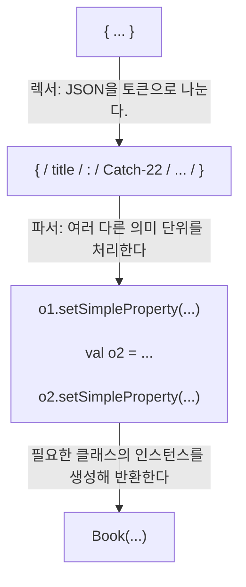

# 10장. 애노테이션과 리플렉션

## 입구
- 애노테이션 적용과 정의
- 리플렉션을 사용해 실행 시점에 객체 내부 관찰
- 코틀린 실전 프로젝트 예제

어떤 함수를 호출하려면 그 함수가 정의된 클래스의 이름과 함수 이름, 파라미터 이름 등을 알아야만 했다. 
애노테이션과 리플렉션을 사용하면 그런 제약을 벗어나서 미리 알지 못하는 임의의 클래스를 다룰 수 있다.
<span style="color:orange">애노테이션</span>을 사용하면 
라이브러리가 요구하는 의미를 클래스에게 부여할 수 있고,
<span style="color:orange">리플렉션</span>을 사용하면 실행 시점에 컴파일러 내부 구조를 분석할 수 있다.


<br/>
<br/>


## 10.1. 애노테이션 선언과 적용

메타데이터를 선언에 추가하면 애노테이션을 처리하는 도구가 컴파일 시점이나 실행 시점에 적절한 처리를 해준다.

<br/>

## 10.1.1. 애노테이션 적용

애노테이션을 적용하려면 적용하려는 대상(함수나 클래스) 앞에 애노테이션을 붙이면 된다.
@와 애노테이션 이름으로 이뤄진다.

```kotlin
import org.junit.*
class MyTest {
    // @Test 애노테이션을 사용해 제이유닛 프레임워크에게
    // 이 메소드를 테스트로 호출하라고 지시한다
    @Test fun testTrue() {
        Assert.assertTrue(true)
    }
}
```

@Depreacted 애노테이션을 예로 살펴보면, 자바와 코틀린에서 의미는 동일하다.
하지만 코틀린에서는 replaceWith 파라메터를 통해 이전 버전을 대신할 패턴을 제시할 수 있다.

```kotlin
@Deprecated("Use removeAt(index) instead.", ReplaceWith("removeAt(index)"))
fun remove(index: Int) { ... }
```

애노테이션에 인자를 넘 때는 일반 함수와 마찬가지로 괄호 안에 인자를 넣는다
애노테이션의 인자로는 ...
- 원시 타입의 값
- 문자열
- enum
- 클래스 참조
- 다른 애노테이션 클래스
- 위 요소들로 이뤄진 배열

어노테이션 인자를 지정하는 문법은 자바와 약간 다르다.
- 클래스를 어노테이션 인자로 지정할 때는 클래스 이름 뒤에 ::class를 넣는다.
- 다른 어노테이션을 인자로 지정할 때는 인자로 들어가는 어노테이션의 이름 앞에 @를 붙이지 않는다. 
  위의 Deprecated와 ReplaceWith의 예가 그러하다.
- 배열을 인자로 지정하려면 @RequestMapping(path=arrayOf(“/foo”, “/bar”)) 처럼 
  arrayOf 함수를 사용한다. 
  자바에서 지정한 애노테이션 클래스를 이용한다면, value라는 이름의 가변 길이 인자로 변환된다. 
  따라서 @JavaAnnotationWithArrayValue("abc", "foo", "bar")처럼 arrayOf함수를 안써도 된다.

어노테이션 인자를 컴파일 시점에 알 수 있어야 한다. 
따라서 임의의 프로퍼티를 인자로 지정할 수 없다.
프로퍼티를 어노테이션 인자로 사용하기 위해서는 앞에 const 를 붙여야 한다. 
컴파일러는 const가 붙은 프로퍼티를 컴파일 시점에 상수로 취급한다.

```kotlin
const val TEST_TIMEOUT = 100L
@Test(timeout = TEST_TIMEOUT) fun testMethod(){ ... }
```

const가 붙은 프로퍼티는 파일의 최상위나 object 안에 선언 해야 하며 
원시타입 또는 String으로만 초기화가 가능하다.,

<br/>

## 10.1.2. 애노테이션의 대상

코틀린에서의 선언(필자 : 애노테이션 사용 얘기인가?)을 컴파일한 결과가 여러 자바 선언과 대응하는 경우가 있다.
이때, 코틀린 선언과 대응하는 여러 자바 선언에 각각 어노테이션을 붙여야 할 때가 있다.

예를 들어...
코틀린 프로퍼티는 기본적으로 자바 필드와 게터 메소드 선언과 대응한다. 
프로퍼티가 변경 가능하면 세터에 대응하는 자바 세터 메소드와 세터 파라미터가 추가된다. 
이외에도 생성자와 관련해서도 존재하며, 어노테이션을 붙일 때, 
이런 요소 중 어떤 요소에 어노테이션을 붙일지 표시할 필요가 있다.

<span style="color:orange">사용 지점 대상</span> 선언으로 어노테이션 붙일 요소를 정할 수 있다. 
@ 기호와 어노테이션 이름 사이에 붙으며, 어노테이션 이름과는 콜론(:)으로 분리된다.


규칙을 지정하려면 공개 필드나 메소드 앞에 @Rule을 붙여야 한다. 
하지만 코틀린 테스트 클래스의 folder라는 프로퍼티 앞에 @Rule을 붙이면
"The @Rule ‘folder’ must be public"(@Rule을 지정한 folder는 public이어야 함)라는 
JUnit 예외가 발생한다. 

@Rule은 필드에 적용되었지만, 코틀린의 필드는 기본적으로 비공개이기 때문에 이런 예외가 발생한다. 

- 4장 참고
  - 디컴파일 시 필드는 private이 되지만, 
  - getter, setter는 public이기 때문에 프로퍼티 입장으로 볼 때는 public 이라고 할 수 있다.

@Rule 어노테이션을 정확한 대상에 적용하려면...

```kotlin
class HasTempFolder{
  @get:Rule
  val folder = TemporaryFolder()
  
  @Test
  fun testUsingTempFolder(){
    val createdFile = folder.newFile("myFile.txt")
    val createdFolder = folder.newFolder("subfolder")
    ...
  }
}
```


자바에 선언된 애노테이션을 사용해 프로퍼티(필드+get/set)에 애노테이션을 붙이면 
일반적으로 프로퍼티의 필드에 그 애노테이션이 붙는다.

코틀린으로 애노테이션을 선언하면 프로퍼티에 직접 적용할 수는 있는 애노테이션을 만들 수 있다.
사용 지점 대상을 지정할 때, 지원하는 대상 목록은 다음과 같다.
- property : 프로퍼티 전체. 자바에서 선언된 어노테이션에는 이 사용 지점 대상을 사용할 수 없다.
- field : 프로퍼티에 의해 생성되는 (뒷받침하는) 필드
- get : 프로퍼티 게터
- set : 프로퍼티 세터
- receiver : 확장 함수나 프로퍼티의 수신 객체 파라미터
- param : 생성자 파라미터
- setparam : 세터 파라미터
- delegate : 위임 프로퍼티의 위임 인스턴스를 담아둔 필드
- file : 파일 안에 선언된 최상위 함수와 프로퍼티를 담아두는 클래스

file 대상을 사용하는 애노테이션은 package 선언 앞에서 파일의 최상위 수준에만 적용할 수 있다.
자바와 달리 코틀린에서는 애노테이션 인자로 클래스나 함수 선언이나 타입 외에 임의의 식을 허용한다.
가장 흔히 쓰이는 예로는 컴파일러 경고를 무시하기 위한 @Suppress 애노테이션이 있다.

```kotlin
fun test(list: List<*>) {
    @Suppress("UNCHECKED_CAST")
    val strings = list as List<String>
    // ...
}
```

인텔리J 아이디어에서는 컴파일러 경고에서 Alt-Enter(필자 : MacOS - option + enter)를 누르거나
인텐션 옵션 메뉴(컴파일러 경고로 반전된 소스코드 영역에 커서를 가져가면 뜨는 전구 아이콘에 붙어 있는 메뉴)에서
Suppress를 선택하면 이 애노테이션을 추가해준다.

> ### ✅ 자바 API를 어노테이션으로 제어하기
> 코틀린은 코틀린으로 선언한 내용을 자바 바이트 코드로 컴파일하는 방법과 
> 코틀린 선언을 자바에 노출하는 방법을 제어하기 위한 어노테이션을 많이 제공한다. 
> 다음은 코틀린 선언을 자바에 노출시키는 방법을 변경할 수 있다.
> 
> - @JvmName : 코틀린 선언이 만들어내는 자바 필드나 메소드 이름을 변경한다. 
> - @JvmStatic : 메소드, 객체 선언, 동반 객체에 적용하면 그 요소가 자바 정적 메소드로 노출된다. 
> - @JvmOverloads : 디폴트 파라미터 값이 있는 함수에 대해 컴파일러가 자동으로 오버로딩한 함수를 생성해준다. 
> - @JvmField : 프로퍼티에 사용하면 게터나 세터가 없는 공개된 자바 필드로 프로퍼티를 노출시킨다.


<br/>

## 10.1.3. 어노테이션을 활용한 JSON 직렬화 제어

<span style="color:orange">직렬화</span>(serialization)는 객체를 저장장치에 저장하거나 
네트워크를 통해 전송하기 위해 텍스트나 이진 형식으로 변환하는 것이다.
반대로 <span style="color:orange">역직렬화</span>(deserialization)는 
텍스트나 이진 형식으로 저장된 데이터로부터 원래의 객체를 만들어낸다.

직렬화에 자주 쓰이는 형식에 JSON이 있다. 
자바와 JSON을 변환할 때 자주 쓰이는 라이브러리로 잭슨(Jackson)과 지슨(GSON)이 있다. 
이들 또한 다른 자바 라이브러리들처럼 코틀린과 완전 호환된다.

JSON에는 객체의 타입이 저장되지 않기 때문에 
JSON 데이터로부터 인스턴스를 만들려면 타입 인자로 클래스를 명시해야 한다.

JSON 직렬화를 위한 제이키드라는 순수 코틀린 라이브러리를 구현하는 과정을 알아보자.

> ### ✅ 제이키드 라이브러리 소스코드와 연습문제
> (필자 : 서적 내용 참고)
> - https://www.manning.com/books/kotlin-in-action
> - https://github.com/yole/jkid

```kotlin
class Person(val name: String, val age: Int)
>>> val person = Person("Alice", 29)
>>> println(serialize(person))

{"age": 29, "name": "Alice"}
```

객체 인스턴스의 JSON 표현은 키/값 쌍으로 이뤄진 객체를 표현. 
키/값쌍은 각 인스턴스의 프로퍼티 이름과 값을 표현한다.

```kotlin
>>> val json = """{"name":"Alice", "age":29}"""
>>> println(deserialize<Person>(json))

Person(name=Alice, age=29)
```

JSON에는 객체의 타입이 저장되지 않기 때문에 JSON 데이터로부터 인스턴스를 만들려면, 
타입인자로 클래스를 명시해야 한다. 여기서는 Person 클래스를 타입 인자로 넘겼다.

아래는 객체와 JSON 표현 사이의 동등성 관계를 보여준다.
원시 타입이나  String 타입의 프로퍼티만 직렬화하는 클래스에 안에 들어있지만, 
실제로는 다른 값 객체 클래스나 여러 값으로 이루어진 컬렉션 타입의 프로퍼티도 들어갈 수 있다.

애노테이션을 활용해 객체를 직렬화하거나 역직렬화하는 방법을 제어할 수 있다.
객체를 JSON으로 직렬화할 때 제이키드 라이브러리는 
기본적으로 모든 프로퍼티를 직렬화하며 프로퍼티 이름을 키로 사용한다. 
애노테이션을 사용하면 이런 동작을 변경할 수 있다.

- @JsonExclude 애노테이션을 사용하면 직렬화나 역직렬화 시 그 프로퍼티를 무시할 수 있다.
- @JsonName 애노테이션을 사용하면 프로퍼티를 표현하는 키/값 쌍의 키로 
  프로퍼티 이름 대신 애노테이션이 지정한 이름을 쓰게 할 수 있다.

```kotlin
data class Person(
    @JsonName("alias") val firstName: String,
    @JsonExclude val age: Int? = null
}
```

fisrtName 프로퍼티를 JSON으로 저장할 떄 사용하는 키를 변경하기 위해 @JsonName 애노테이션을 사용하고,
age 프로퍼티를 직렬화나 역직렬화에 사용하지 않기 위해 @JsonExclude 애노테이션을 사용한다.
직렬화 대상에서 제외할 age 프로퍼티에는 반드시 디폴트 값을 지정해야만 한다.
지정하지 않았다면 역직렬화 시 Person의 인스턴스를 새로 만들 수 없다.


<br/>

## 10.1.4. 애노테이션 선언

@JsonExclude 애노테이션은 아무 파라미터도 없는 가장 단순한 애노테이션이다.

```kotlin
annotation class JsonExclude
```

일반 클래스 선언처럼 보이기도 하지만, class 키워드 앞에 `annotation`이라는 변경자가 붙어있다는 차이점이 있다.
애노테이션 클래스는 오직 선언이나 식과 관련있는 메타데이터의 구조를 정의하기 때문에 
내부에 아무 코드도 들어있을 수 없다.
따라서 애노테이션 클래스에 본문을 정의하지 못하도록 컴파일러가 막는다.

파라미터가 있는 애노테이션을 정의하려면 애노테이션 클래스의 주 생성자에 파라미터를 선언해야 한다.

```kotlin
annotation class JsonName(val name: String)
```

일반 클래스의 주 생성자 선언 구문을 똑같이 사용하지만 
애노테이션 클래스에서는 모든 파라미터 앞에 val을 붙여야 한다.
자바 애노테이션 선언과 비교해보자.

```java
public @interface JsonName{
    String value();
}
```

자바 애노테이션 선언 value 메소드를 사용한 점을 유의하자. 자바의 value()는 특별하다.
애노테이션을 적용할때 value를 제외한 모든 애트리뷰트에는 이름을 명시해야된다.

반면 코틀린의 애노테이션 적용 문법은 일반적인 생성자 호출과 동일하다. 
따라서 인자에 이름을 명하기 위해 이름붙인 인자를 사용할 수도 있고 이름을 생략할 수도 있다.
`@Jsonname(name = "first_name")`과 `@Jsonname("first_name")`은 같다.

자바에서 선언한 어노테이션을 코틀린의 구성 요소에 적용할 때는 
value를 제외한 모든 인자에 대해 이름 붙은 인자 구문을 사용해야만 한다. 
코틀린도 자바 어노테이션에 정의된 value를 특별하게 취급한다.

<br/>


## 10.1.5. 메타애노테이션: 애노테이션을 처리하는 방법 제어

코틀린 어노테이션 클래스에도 어노테이션을 붙일 수 있다.
어노테이션 클래스에 적용할 수 있는 어노테이션을
<span style="color:orange">메타어노테이션</span>이라 한다.

표준 라이브러리에는 몇 가지 메타 어노테이션이 있으며, 
그런 메타 어노테이션들은 컴파일러가 어노테이션을 처리하는 방법을 제어한다.

가장 흔히 쓰이는 메타 어노테이션은 @Target이다. 
앞서 살펴본 제이키드의 JsonExclude, JsonName 어노테이션에도 
적용 가능 대상을 지정하기 위해 @Target을 사용한다.

```kotlin
@Target(AnnotationTarget.PROPERTY)
annotation class JsonExclude
```

@Target 메타 어노테이션은 어노테이션을 적용할 수 있는 요소의 유형을 지정한다. 
어노테이션 클래스에 대해 구체적인 @Target을 지정하지 않으면 
모든 선언에 적용할 수 있는 어노테이션이 된다. 
제이키드 라이브러리는 프로퍼티 어노테이션만을 사용하므로 어노테이션 클래스에 @Target을 꼭 지정해야 한다.

어노테이션이 붙을 수 있는 대상이 정의된 enum은 AnnotationTarget이다. 
이 안에는 클래스, 파일, 프로퍼티, 프로퍼티 접근자, 타입, 식 등에 대한 enum 정의가 들어있다.
둘 이상의 대상을 한꺼번에 선언할 수도 잇다.

메타 어노테이션을 직접 만들어야 한다면 ANNOTATION_CLASS를 대상으로 지정하면 된다.

```kotlin
@Target(AnnotationTarget.ANNOTATION_CLASS)
annotation class BindingAnnotation

@BindingAnnotation
annotation class MyBinding
```

대상을 PROPERTY로 지정한 어노테이션은 자바에서 사용할 수 없다. 
자바에서 사용하려면 AnnotationTarget.FIELD를 두번째 대상으로 추가해줘야 한다. 
그렇게 하면 어노테이션을 코틀린 프로퍼티와 자바 필드에 적용할 수 있다.

> ### ✅ @Retention 애노테이션
> @Retention은 정의 중인 어노테이션 클래스를 소스 수준에서만 유지할지, 
> .class 파일에 저장할지, 실행 시점에 리플렉션을 사용해 접근할 수 있게 할지를 지정하는 메타 어노테이션이다.
> 
> 자바 컴파일러는 기본적으로 어노테이션을 .class 파일에 저장하지만, 런타임에는 사용할 수 없다. 
> 하지만 대부분의 어노테이션은 런타임에도 사용할 수 있어야 하므로 
> 코틀린에서는 기본적으로 어노테이션의 @Retention을 RUNTIME으로 지정한다.

<br/>

## 10.1.6. 어노테이션 파라미터로 클래스 사용

클래스 참조를 파라미터로 하는 어노테이션 클래스를 선언하면 그런 기능을 사용할 수 있다.
제이키드의 `@DeserializeInterface`는 인터페이스 타입인 프로퍼티에 대한 
역직렬화를 제어할 때 쓰는 어노테이션이다.
인터페이스의 인스턴스를 직접 만들 수 없다. 
따라서 역직렬화 시 어떤 클래스를 사용해 인터페이스를 구현할 지를 지정할 수 있어야 한다.

```kotlin
interface Company{
  val name: String
}

data class CompanyImpl(override val name: String) : Company

data class Person{
  val name: String,
  @DeserializeInterface(CompanyImpl::class) val company: Company
}
```

직렬화된 Person 인스턴스를 역직렬화하는 과정에서 company 프로퍼티를 표현하는 JSON을 읽으면 
제이키드는 그 프로퍼티 값에 해당하는 JSON을 역직렬화하면서 CompanyImpl의 인스턴스를 만들어서 
Person 인스턴스의 company 프로퍼티에 설정한다.

@DeserializeInterface(CompanyImp1::class)와 같이 
클래스 참조를 인자로 받는 애노테이션을 어떻게 정의하는지 살펴보자.
```kotlin
annotation class DeserializeInterface(val targetClass: KClass<out Any>)
```

`KClass`는 자바 `java.lang.Class` 타입과 같은 역할을 하는 코틀린 타입이다.
코틀린 클래스에 대한 참조를 저장할 때 KClass 타입을 사용하며, 
KClass의 타입 파라미터는 이 KClass의 인스턴스가 가리키는 코틀린 타입을 지정한다.

CompanyImpl::class의 타입은 KClass<CompanyImpl>이며, 
이 타입은 DeserializeInterface의 파라미터 타입인 KClass<out Any>의 하위 타입이다.


KClass의 타입 파라미터를 쓸 떄 out 변경자 없이 KClass<Any>라고 쓰면 
Deserialize-Interface에게 CompanyImpl::class를 인자로 넘길 수 없고 
오직 Any::class 만 넘길 수 있다.

반면 out 키워드가 있으면 모든 코틀린 타입 T에 대해 
KClass<T>가 KClass<out Any>의 하위 타입이 된다.

따라서 Deserialize Interface의 인자로 Any뿐 아니라 
Any를 확장하는 모든 클래스에 대한 참조를 전달할 수 있다.

<br/>

## 10.1.7. 어노테이션 파라미터로 제네릭 클래스 받기

기본적으로 제이키드는 원시 타입이 아닌 프로퍼티를 중첩된 객체로 직렬화한다.
@CumstomSerializer 애노테이션은 커스텀 직렬화 클래스에 대한 참조를 인자로 받는다.
인자로 쓰이는 커스텀 직렬화 클래스는 ValueSerializer<T>인터페이스를 구현해야된다.

```kotlin
interface ValueSerializer<T> {
    fun toJsonValue(value: T): Any? // 직렬화 
    fun fromJsonValue(jsonValue:Any?):T // 역직렬화
}
```

날짜를 직렬화해보자.
ValueSerializer<Date>를 구현하는 DateSerializer를 사용하고 싶다.
이 직렬화 로직을 Person 클래스에 적용하는 방법을 보여준다.

```kotlin
data class Person(
    val name: String,
    @CustomSerializer(DateSerializer::class) val birthDate: Date
)
```

ValueSerializer 클래스는 제네릭 클래스이므로 타입 파라미터가 있다.
따라서 ValueSerializer 타입을 참조하려면 항상 타입 인자를 제공해야 한다.
하지만 이 애노테이션이 어떤 타입에 대해 쓰일지 알 수 없으므로 스타 프로젝션을 사용할 수 있다.

```kotlin
annotation class CustomSerializer(
    val serializerClass: KClass<out ValueSerializer<*>>
}
```

CustomSerializer는 ValueSerializer를 구현하는 클래스만 인자로 받아야 한다.

```
              DateSerializer::class는 올바른 인자로
              받아들이지만 Date::class는 거부산다.
                ------------------------
          KClass<out ValueSerializer<*>>
                 ---                ---
ValueSerializer::class뿐 아니라      ValueSerializer를 사용해
  ValueSerializer를 구현하는           어떤 타입의 값이든
    모든 클래스를 받아들인다.            직렬화할 수 있게 허용한다.
```

클래스를 애노테이션 인자로 받아야 할 때 같은 패턴을 사용할 수 있다.
클래스를 인자로 받을 때 애노테이션 파라미터 타입에 `KClass<out 허용할 클래스 이름>`을 쓴다.
제네릭 클래스를 인자로 받아야 하면 `KClass<out 허용할 클래스 이름<*>>`처럼 
허용할 클래스의 이름 뒤에 스타 프로젝션을 덧붙인다.


<br/>
<br/>

## 10.2. 리플렉션

<span style="color:orange">리플렉션</span>을 간단하게 말하면 
**실행 시점에 동적으로 객체의 프로퍼티와 메소드에 접근할 수 있게 해주는 방법**이다.

보통 객체의 메소드나 프로퍼티에 접근할 때, 컴파일러는 메소드나 프로퍼티의 이름이 
실제로 가리키는 선언을 컴파일 시점에 찾아내 해당하는 선언이 실제 존재함을 보장한다.

하지만 타입과 관계없이 객체를 다뤄야 하거나 
객체가 제공하는 메소드나 프로퍼티 이름을 오직 실행 시점에만 알 수 있는 경우라면 리플렉션을 사용해야 한다.
코틀린에서 리플렉션을 사용하기 위해선 두 가지의 다른 리플렉션 API를 다뤄야 한다.

- 첫 번째는 자바가 `java.lang.reflect` 패키지를 통해 제공하는 표준 리플렉션이다. 
  코틀린 클래스는 일반 자바 바이트코드로 컴파일되므로 자바 리플렉션 API도 
  코틀린 클래스를 컴파일한 바이트코드를 완벽히 지원한다. 
  따라서 리플렉션을 사용하는 자바 라이브러리와 코틀린 코드가 완전히 호환한다.
  

- 두 번째는 코틀린이 `kotlin.reflect` 패키지를 통해 제공하는 코틀린 리플렉션 API이다. 
  이 API는 자바에는 없는 프로퍼티나 널이 될 수 있는 타입과 같은 코틀린 고유 개념에 대한 리플렉션을 제공한다. 
  하지만 현재 코틀린 리플렉션 API는 자바 리플렉션 API를 완전히 대체할 수 있는 복잡한 기능을 제공하지는 않는다.

코틀린 리플렉션 API가 코틀린 클래스만 다룰 수 있는 것은 아니다. 
코틀린 리플렉션 API를 사용해도 다른 JVM 언어에서 생성한 바이트코드를 충분히 다룰 수 있다.

> 안드로이드와 같이 런타임 라이브러리 크기가 문제가 되는 플랫폼을 위해 
> 코틀린 리플렉션 API는 별도의 .jar 파일에 담겨 제공되며, 
> 새 프로젝트를 생성할 때, 리플렉션 패키지 .jar 파일에 대한 의존 관계가 자동으로 추가되는 일은 없다. 
> 따라서 사용이 필요하면 직접 추가해줘야 한다.

<br/>

## 10.2.1. 코틀린 리플렉션 API: KClass, KCallable, KFunction, KProperty

코틀린 리플렉션 API를 사용할 때 먼저 접하게 되는 것은 클래스를 표현하는 `KClass`다.
`java.lang.Class`에 해당하는 KClass를 사용하면 
클래스 안에 있는 모든 선언을 열거하고 각 선언에 접근하거나 클래스의 상위 클래스를 얻는 등의 작업이 가능하다.

실행 시점에 객체의 클래스를 얻으려면 
먼저 객체의 javaClass 프로퍼티를 사용해 객체의 자바 클래스를 얻어야 하며,
`javaClass`는 자바의 `java.lang.Object.getClass()`와 같다.

자바 클래스를 얻었다면 .kotlin 확장 프로퍼티를 통해 자바에서 코틀린 리플렉션 API로 옮겨올 수 있다.

```kotlin
class Person(val name: String, val age: Int)

>>> import kotlin.reflect.full.* // memberProperties 확장 함수 임포트
>>> val person = Person("Alice", 29)
>>> val KClass = person.javaClass.kotlin // KClass<Person>의 인스턴스를 반환
>>> println(KClass.simpleName)
Person
>>> KClass.memberProperties.forEach { println(it.Name) }
age
name
```

KClass 선언을 찾아보면 클래스의 내부를 살펴볼 때 사용할 수 있는 다양한 메소드를 볼 수 있다.

```kotlin
interface KClass<T: Any> {
    val simpleName: String?
    val qualifiedName: String?
    val members: Collection<KCallable<*>>
    val constructors: Collection<KFunction<T>>
    val nestedClasses: Collection<KClass<*>>
    ...
}
```

memberProperties를 비롯한 KClass에 대해 사용할 수 있는 다양한 기능은 
실제로는 kotlin-relfect 라이브러리를 통해 제공하는 확장 함수이다.
이러한 확장 함수를 사용하기 위해선 `import kotlin.reflect.full.*`로 확장 함수 선언을 임포트해야 한다.

클래스의 모든 멤버의 목록은 `KCallable` 인스턴스의 컬렉션이다.
KCallable은 함수와 프로퍼티를 아우르는 공통 상위 인터페이스이다.
Kcallable 안에 있는 call 메소드는 함수나 프로퍼티의 게터를 호출할 수 있다.

```kotlin
interface KCallable<out R> {
    fun call(vararg args: Any?): R
    ...
}
```

call을 사용할 땐 함수 인자를 vararg 리스트로 전달한다.
리플렉션이 제공하는 call을 사용해 함수를 호출하는 코드를 보자.

```kotlin
fun foo(x: Int) = println(x)
>>> val kFunction = ::foo
>>> kFunction.call(42)
42
```

::foo 식의 값 타입은 리플렉션 API에 있는 KFunction 클래스의 인스턴스이다.
이 함수 참조가 가리키는 함수를 호출하려면 KCallable.call 메소드를 호출한다.
위의 코드에서는 42라는 숫자 하나만 인자로 넘겼으나, 
call에 넘길 인자 개수는 원래 함수에 정의된 파라미터 개수가 맞아떨어져야 한다.

함수를 호출하기 위해 더 구체적인 메소드를 사용할 수도 있다.
::foo의 타입 KFunction1<Int, Unit>에는 파라미터와 반한 값 타입 정보가 들어있다.
KFunction1 인터페이스를 통해 함수를 호출하려면 `invoke` 메소드를 사용해야 한다.
invoke는 정해진 개수의 인자만을 받아들이며 
인자 타입은 KFunction1 제네릭 인터페이스의 첫 번째 타입 파라미터와 같다. 
게다가 kFunction을 직접 호출할 수도 있다.

```kotlin
fun sum(x: Int, y: Int) = x + y

>>> val kFunction2 = ::sum
>>> println(kFunction2.invoke(1, 2) + kFunction2(3, 4))
10
>>> kFunction(1)
ERROR: No value passed for parameter p2
```

kFunction의 invoke 메소드를 호출 할 때는 인자 개수나 타입이 맞아 떨어지지 않으면
컴파일이 되지 않아 모두 다 알 때 invoke 메소드를 호출하는게 낫다.
call 메소드는 모든 타입의 함수에 적용할 수 있는 일반적인 메소드지만
타입 안정성을 보장해주지는 않는다.

> ### ✅ 언제 그리고 어떻게 KFunctionN 인터페이스가 정의되는가?
> KFunction1과 같은 타입은 파라미터 개수가 다른 여러 함수를 포함한다. 
> 각 KFunctionN 타입은 KFunction을 확장하며, 
> N과 파라미터 개수가 같은 invoke를 추가로 포함한다.
> 
> KFunction2<P1, P2, R>에는 operator fun invoke(p1: P1, p2: P2) : R 선언이 들어 있다.
> 
> 이런 함수 타입들은 컴파일러가 생성한 합성 타입이다. 
> 따라서 kotlin.reflect 패키지에서는 찾을 수 없다. 
> 코틀린에서는 컴파일러가 생성한 합성 타입을 사용하기 때문에 
> 원하는 수만큼 많은 파라미터를 갖는 함수에 대한 인터페이스를 사용할 수 있다. 
> 합성 타입을 사용하기 때문에 코틀린은 kotlin-runtime.jar의 크기를 줄일 수 있고, 
> 함수 파라미터 개수에 대한 인위적인 제약을 피할 수 있다.

KProperty의 call 메소드를 호출할 수도 있다.
KProperty의 call은 프로퍼티의 게터를 호출한다. 
하지만 프로퍼티 인터페이스는 프로퍼티 값을 얻는 더 좋은 방법으로 `get` 메소드를 제공한다.

get 메소드에 접근하려면 프로퍼티가 선언된 방법에 따라 올바른 인터페이스를 사용해야 한다.
최상위 프로퍼티는 KProperty() 인터페이스의 인스턴스로 표현되며, 
그 안에는 인자가 없는 get 메소드가 있다.

```kotlin
var counter = 0
>>> val kProperty = ::counter
>>> KProperty.setter.call(21) // 리플렉션 기능을 통해 세터를 호출하면서 21을 인자로 넘긴다.
>>> println(kProperty.get()) // get을 호출해 프로퍼티 값을 가져온다.
21
```

멤버 프로퍼티는 KProperty1 인스턴스로 표현된다.
그 안에는 인자가 1개인 get 메소드가 들어있다.
멤버 프로퍼티는 아딴 객체에 속해 있는 프로퍼티이므로 멤버 프로퍼티의 값을 가져오려면 
get 메소드에게 프로퍼티를 얻고자 하는 객체 인스턴스를 넘겨야 한다.

다음 예제는 person 인스턴스의 프로퍼티 값을 가져온다.
memberProperty가 Person 클래스의 age 프로퍼티를 참조한다면
memberProperty.get(person)은 동적으로 person.age를 가져온다.

```kotlin
class Person(val name: String, val age: Int)
>>> val person = Person("Alice", 29)
>>> val memberProperty = Person::age
>>> println(memberProperty.get(person))
29
```

KProperty1은 제네릭 클래스이다.
memberProperty 변수는 KProperty<Person, Int> 타입으로 

- 첫 번째 타입 파라미터는 수신 객체 타입,
- 두 번째 타입 파라미터는 프로퍼티 타입을 표현한다.

따라서 수신 객체를 넘길 때 KProperty1의 타입 파라미터와 일치하는 타입의 객체만을 넘길 수 있다. 
(컴파일단에서 해결됨)

KClass, KFunction, KParameter는 모두 KAnnotatedElement를 확장한다
- KClass는 클래스와 객체를 표현할 때 쓰인다.
- KProperty는 모든 프로퍼티를 표현할 수 있다
- KProperty의 하위 클래스인 KMutableProperty는 var로 정의한 변경 가능한 프로퍼티를 표현한다.
- KProperty와 KMutableProperty에 선언된 Getter와 Setter 인터페이스로 
  프로퍼티 접근자를 함수처럼 다룰 수 있다.


<br/>

## 10.2.2. 리플렉션을 사용한 객체 직렬화 구현

제이키드의 직렬화 함수 선언을 살펴보자.

```kotlin
fun serialize(obj: Any): String
```

이 함수는 객체를 받아 그 객체에 대한 JSON 표현을 문자열로 돌려준다.
이 함수는 객체의 프로퍼티와 값을 직렬화하며 
StringBuilder 객체 뒤에 직렬화한 문자열을 추가한다.
append 호출을 더 간결하게 수행하기 위해 직렬화 기능을 StringBuilder의 확장 함수로 구현하여 
별도로 StringBuilder의 객체를 지정하지 않아도 append 메소드를 사용할 수 있게 해 준다.

```kotlin
private fun StringBuilder.serializedObject(x: Any) {
    append{...}
}
```

함수 파라미터를 확장 함수의 수신 객체로 바꾸는 방식은 코틀린에서 흔히 사용되는 패턴이다.
serializedObject는 StringBuilder API를 확장하지 않는 점에 유의하라.
serializedObject가 수행하는 연산은 설명하는 이 맥락을 벗어나면 전혀 쓸모가 없다.
따라서 private으로 가시성을 지정해서
다른 곳에서는 사용할 수 없게 만든다.
이 코드 블록에서 주로 사용하는 객체가 어떤 것인지 명확히 보여주고
그 객체를 더 쉽게 다루기 위함이다.

이렇게 확장 함수를 정의한 결과 serialized는 대부분의 작업을 serializeObject에 위임한다.

```kotlin
fun serialize(obj: Any): String = buildString { serializeObject(obj) }
```

이 코드는 람다 본문에서 serializeObject(obj)를 호출해서 
obj를 직렬화한 결과를 StringBuilder에 추가한다.

이제 직렬화 함수의 기능을 보겠다.
기본적으로 직렬화 함수는 객체의 모든 프로퍼티를 직렬화한다.
원시 타입이나 문자열은 적절히 JSON 수, boolean, 문자열 값 등으로 변환되고, 
컬렉션은 JSON 배열로 직렬화된다.
원시 타입이나 문자열, 컬렉션이 아닌 다른 타입인 프로퍼티는 중첩된 JSON 객체로 직렬화된다.

```kotlin
private fun StringBuilder.serializeObject(obj: Any) {
    val kClass = obj.javaClass.kotlin // 객체의 KClass를 얻는다.                  
    val properties = kClass.memberProperties // 클래스의 모든 프로퍼티를 얻는다.         
    properties.joinToStringBuilder(
            this, prefix = "{", postfix = "}") { prop ->
        serializeString(prop.name) // 프로퍼티 이름을 얻는다.                     
        append(": ")
        serializePropertyValue(prop.get(obj)) // 프로퍼티 값을 얻는다.         
    }
}
```

위 함수는 클래스의 각 프로퍼티를 차례로 직렬화한다. 
결과 JSON은 “{prop1: value1, prop2: value2}” 같은 형태다.

joinToStringBuilder 함수: 프로퍼티를 콤마로 구분해준다.
serializeString 함수는 JSON 명세에 따라 특수 문자를 이스케이프 해준다.
serializePropertyValue 함수는 어떤 값이 원시 타입, 문자열, 컬렉션, 중첩된 객체 중 
어떤 것인지 판단하고 그에 따라 값을 적절히 직렬화한다.

위의 코드에서는 어떤 객체의 클래스에 정의된 모든 프로퍼티를 열거하기 때문에 
정확히 각 프로퍼티가 어떤 타입인지 알 수 없다. 
따라서 prop 변수의 타입은 `KProperty1<Any, *>`이며, 
`prop.get(obj)` 메소드 호출은 Any 타입의 값을 반환한다. 
이는 Any 클래스의 어떤 프로퍼티가 들어오든 처리함을 뜻한다.

이 경우 수신 객체 타입을 컴파일 시점에 검사할 방법이 없다. 
하지만 이 코드에서는 어떤 프로퍼티의 get에 넘기는 객체가 바로 그 프로퍼티를 얻어온 객체이기 때문에 
항상 프로퍼티 값이 제대로 반환된다.


<br/>

## 10.2.3. 애노테이션을 활용한 직렬화 제어

어떤 프로퍼티를 직렬화에서 제외하고 싶을 때 @JsonExclude를 쓸 수 있다.
클래스의 모든 멤버 프로퍼티를 가져오기 위해 KClass 인스턴스의 memberProperties 프로퍼티를 사용했었다.
어떻게 특정 애노테이션이 붙은 프로퍼티를 제외할 수 있을까?

KAnnotatedElement 인터페이스에는 annotations 프로퍼티가 있다. 
annotations는 소스 코드 상에서 해당 요소에 적용된 모든 애노테이션 인스턴스의 컬렉션이다.
KPropery는 KAnnotatedElement를 확장하므로 
property, annotations를 통해 프로퍼티의 모든 애노테이션을 얻을 수 있다.
하지만 여기서는 모든 애노테이션을 사용하지 않고, 어떠 한 애노테이션을 찾기만 하면 된다.
이럴 때 findAnnotation이라는 함수를 사용한다.

```kotlin
inline fun <refied T> KAnnotatedElement.findAnnotation(): T? 
        = annotations.filterIsInstance<T>().firstOrNull()
```

findAnnotation 함수는 인자로 전달받은 타입에 해당하는 애노테이션이 있으면 그 애노테이션을 반환한다.
findAnnotation을 표준 라이브러리 함수인 filter와 함께 사용하면 
@JsonExclude로 애노테이션 된 프로퍼티를 없앨 수 있다.

```kotlin
val properties = kClass.memberProperties.filter{ 
  it.findAnnotation<JsonExclude>() == null 
}
```

```kotlin
annotation class JsonName(val name: String)

data class Person(
        @JsonName("alias") val firstName: String,
        val age: Int
)
```

@JsonName은 존재 여부뿐 아니라 애노테이션에 전달한 인자도 알아야 한다.
@JsonName의 인자는 프로퍼티를 직렬화해서 JSON에 넣을 때 사용할 이름이다.
이 경우에도 findAnnotation을 사용할 수 있다.

```kotlin
// @JsonName 애노테이션이 있으면 그 인스턴스를 찾는다
val jsonNameAnn = prop.findAnnotation<JsonName>()
// 애노테이션에서 name 인자를 찾고 그런 인자가 없으면 prop.name를 사용한다
val propName = jsonNameAnn?.name ?: prop.name
```

프로퍼티에 @JsonName 애노테이션이 없다면 jsonNameAnn이 널이다.
이 경우 여전히 prop.name을 JSON의 프로퍼티 이름으로 사용할 수 있다.
프로퍼티에 애노테이션이 있다면 애노테이션이 지정하는 이름을 대신 사용한다.

```kotlin
private fun StringBuilder.serializeObject(obj: Any) {
    obj.javaClass.kotlin.memberProperties
        .filter { it.findAnnotation<JsonExclude>() == null }
        .joinToString(this, prefix = "{", postfix = "}") {
            serializeProperty(it, obj)
        }
}
```

위 코드를 통해서 JsonExclude로 어노테이션한 프로퍼티를 제외시킨다. 
또한, 프로퍼티 직렬화와 관련된 로직을 serializeProperty 확장 함수로 분리해 호출한다.

```kotlin
private fun StringBuilder.serializeProperty(prop: KProperty1<Any, *>, obj: Any) {
    val jsonNameAnn = prop.findAnnotation<JsonName>()
    val propName = jsonNameAnn?.name ?: prop.name
    serializeString(propName)
    append(": ")
    serializePropertyValue(prop.get(obj))
}
```

serializeProperty는 JsonName에 따라 프로퍼티 이름을 처리한다.


나머지 애노테이션인 @CustomSerializer를 구현해보자.
이 구현은 getSerializer라는 함수에 기초한다. 
getSerializer는 @CustomSerializer를 통해 등록한 ValueSerializer 인스턴스를 반환한다.

```kotlin
data class Person {
    val name: String,
    @CustomSerializer(DateSerializer::class) val birthDate: Date
}
```

```kotlin
annotation class CustomSerializer (
    val serializerClass: KClass<out ValueSerializer<*>>
}
```

getSerializer 구현은 다음과 같다.

```kotlin
fun KProperty<*>.getSerializer(): ValueSerializer<Any?>? {
  val customSerializerAnn = findAnnotation<CustomSerializer>() ?: return null
  val serializerClass = customSerializerAnn.serializerClass
  val valueSerializer = serializerClass.objectInstance ?: serializerClass.createInstance()
  @Suppress("UNCHECKED_CAST")
  return valueSerializer as ValueSerializer<Any?>
}
```

getSerializer가 주로 다루는 객체가 KProperty 인스턴스이기 때문에 KProperty의 확장 함수로 정의한다.
getSerializer는 findAnnotation 함수를 호출해서 @CustomSerializer 애노테이션이 있는지 찾고, 
있다면 그 애노테이션의 serailizerClass가 직렬화기 인스턴스를 얻기 위해 사용해야 할 클래스이다.

@CustomSerializer의 값으로 클래스와 객체를 처리하는 방식에 있어 모두 KClass 클래스로 표현된다.
다만 객체에는 object 선언에 의해 생성된 
싱글턴을 가리키는 objectInstance라는 프로퍼티가 있다는 것이 클래스와 다르다.

또한 serializeProperty 구현 안에서 getSerializer를 사용할 수 있다.

```kotlin
private fun StringBuilder.serializeProperty(prop: KProperty<Any, *>, obj: Any) {
    val name = prop.findAnnotation<JsonName>()?.name ?: prop.name
    serializeString(name)
    append(": ")
    val value = prop.get(obj)
                    // 프로퍼티에 대해 정의된 커스텀 직렬화기가 있으면 그 커스텀 직렬화기를 사용한다
    val jsonValue = prop.getSerializer()?.to JsonValue(value) 
        ?: value // 커스텀 직렬화기가 없으면 일반적인 방법을 따라 프로퍼티를 직렬화한다
    serializePropertyValue(jsonValue)
}
```

serializeProperty는 커스텀 직렬화기의 toJsonValue 함수를 호출해서 프로퍼티 값을 JSON 형식으로 변환한다.
어떤 프로퍼티에 커스텀 직렬화기가 지정돼 있지 않다면 프로퍼티 값을 그냥 사용한다.

<br/>

## 10.2.4. JSON 파싱과 객체 역직렬화

제이키드 라이브러리의 나머지 절반인 역직렬화 로직에 대해 보자.
API를 다시 봐보면 직렬화와 마찬가지로 함수 하나로 이뤄져 있다.

```kotlin
inline fun <reified T: Any> deserialize(json: String): T
```

```kotlin
data class Author(val name: String)
data class Book(val title: String, val author: Author)

>>> val json = """{"title": "Catch-22", "author": {"name": "J. Heller"}}"""
>>> println(deserialize<Book>(json))
Book(title=Catch-22, author=Author(name=J. Heller))
```

역직렬화할 객체의 타입을 실체화한 타입 파라미터로 deserialize 함수에 넘겨서 새로운 객체 인스턴스를 얻는다. 

제이키드의 JSON 역직렬화기는 흔히 쓰는 방법을 따라 3단계로 구현돼 있다.

<span style="color:orange">첫 번째 단계는 
어휘 분석기(lexical analyzer)로 렉서(lexer)라고 부른다.</span>
어휘 분석기는 여러 문자로 이뤄진 입력 문자열을 토큰의 리스트로 변환한다.
토큰은 문자 토큰과 값 토큰으로 나뉜다.
문자 토큰은 문자로 표현하며 JSON 문법에서 중요한 의미가 있고, 
값 토큰은 운자열, 수, 불리언 값, null 상수를 말한다.


<span style="color:orange">두 번째 단계는 
문법 분석기(syntax analyzer)로 파서(parser)라고 부른다.</span>
파서는 토큰의 리스트를 구조화된 표현으로 변환한다.
제이키드에서 파서는 JSON의 상위 구조를 이해하고 토큰을 JSON에서 지원하는 의미 단위로 변환하는 일을 한다.
그런 의미 단위로는 키/값 쌍과 배열이 있다.


<span style="color:orange">마지막 단계는 
파싱 한 결과로 객체를 생성하는 역직렬화 컴포넌트다.</span>
JsonObject 인터페이스는 현재 역직렬화하는 중인 객체나 배열을 추적한다.
파서는 현재 객체의 새로운 프로퍼티를 발견할 때마다 그 프로퍼티의 유형에 해당하는 JsonObject 함수를 호출한다.

```kotlin
interface JsonObject {
    fun setSimpleProperty(propertyName: String, value: Any?)
    fun createObject(propertyName: String): JsonObject
    fun createArray(propertyName: String): JsonObject
}
```

각 메소드의 propertyName 파라미터는 JSON 키를 받는다. 
따라서 파서가 객체를 값으로 하는 author 프로퍼티를 만나면 
createObject("author") 메소드가 호출된다. 
간단한 프로퍼티 값은 setSimpleProperty를 호출하면서 실제 값을 value에 넘기는 방식으로 등록한다.

역직렬화기는 JsonObject에 상응하는 코틀린 타입의 인스턴스를 점차 만들어내는 JsonObject 구현을 제공한다. 
클래스 프로퍼티와 JSON 키 사이의 대응 관계를 찾아내고 
중첩된 객체 값(Author의 인스턴스)을 만들어 낸다. 
모든 중첩 객체를 만들고 난 뒤에는 필요한 클래스(Book)의 인스턴스를 새로 만든다.




제이키드는 데이터 클래스와 함께 사용하려는 의도로 만든 라이브러리다.
따라서 제이키드는 JSON에서 가져온 이름/값 쌍을 역직렬화하는 클래스의 생성자에 넘긴다.
제이키드는 객체를 생성한 다음 프로퍼티를 설정하는 것을 지원하지 않는다. 
따라서 제이키드 역직렬화기는 JSON에서 데이터를 읽는 과정에서 
중간에 만든 프로퍼티 객체들을 어딘가에 저장해 뒀다가 나중에 생성자를 호출할 때 써야 한다.

객체를 생성하기 전에 그 객체의 하위 요소를 저장해야 한다는 요구사항을 보면 전통적인 빌더 패턴이 생각난다.
빌더라는 용어를 쓰면 지겨우므로 여기서는 시드(seed)라는 단어를 사용한다.
JSON에서는 객체, 컬렉션, 맵과 같은 복합 구조를 만들 필요가 있다.

기본 Seed 인터페이스는 JsonObject를 확장하면서 객체 생성 과정이 끝난 후 결과 인스턴스를 얻기 위한
spawn 메소드를 추가 제공한다.
또한 Seed 안에는 중첩된 객체나 중첩된 리스트를 만들 때 사용할 
createCompositePoroperty 메소드 선언이 들어있다.


```kotlin
interface Seed : JsonObject {
    fun spawn(): Any?
    fun createCompositePoroperty(
        propertyName: String,
        isList: Boolean
    ): JsonObject

    override fun createObject(propertyName: String) = 
        createCompositePoroperty(propertyName, false)

    override fun createArray(propertyName: String) =
        createCompositePoroperty(propertyName, true)
    
    // ...
}
```

spawn을 build와 비슷하다고 생각할 수 있다. 객체를 돌려주는 메소드다. 
ObjectSeed의 경우 생성된 객체를 반환하고 ObjectListSeed나 
ValueListSeed의 경우 생성된 리스트를 반환한다.

시드를 사용한 객체 생성을 살펴보기 전에 값을 역직렬화하는 모든 과정을 처리하는 deserialize 함수를 살펴보자.

```kotlin
fun <T: Any> deserialize(json: Reader, targetClass: KClass<T>): T {
    val seed = ObjectSeed(targetClass, ClassInfoCache())
  Parser(json, seed).parse()
  return seed.spawn()
}
```

파싱을 시작하려면 직렬화할 객체의 프로퍼티를 담을 ObjectSeed를 하나 생성해야 한다.
그리고 파서를 호출하면서 입력 스트림 리더인 json과 시드를 인자로 전달해야 한다.
입력 데이터의 끝에 도달하면 spawn 함수를 호출, 결과 객체를 생성한다.

ObjectSeed는 결과 클래스에 대한 참조와 
결과 클래스 안의 프로퍼티에 대한 정보를 저장하는 캐시인 classInfoCache 객체를 인자로 받는다.

```kotlin
class ObjectSeed<out T: Any>(
        targetClass: KClass<T>,
        override val classInfoCache: ClassInfoCache
) : Seed {

    // targetClass의 인스턴스를 만들 때 필요한 정보를 캐시한다.
    private val classInfo: ClassInfo<T> = classInfoCache[targetClass]

    private val valueArguments = mutableMapOf<KParameter, Any?>()
    private val seedArguments = mutableMapOf<KParameter, Seed>()

    // 생성자 파라미터와 그 값을 연결하는 맵을 만든다.
    private val arguments: Map<KParameter, Any?>
        get() = valueArguments + seedArguments.mapValues { it.value.spawn() }

    override fun setSimpleProperty(propertyName: String, value: Any?) {
        val param = classInfo.getConstructorParameter(propertyName)
        // 널생성자 파라미터 값이 간다한 값인 경우 그 값을 기록한다.
        valueArguments[param] = classInfo.deserializeConstructorArgument(param, value)
    }

    override fun createCompositeProperty(propertyName: String, isList: Boolean): Seed {
        val param = classInfo.getConstructorParameter(propertyName)
        // 프로퍼티에 대한 DeserializeInterface 애노테이션이 있다면 그 값을 가져온다.
        val deserializeAs = classInfo.getDeserializeClass(propertyName)
        // 파라미터 타입에 따라 ObjectSeed나 CollectionSeed를 만든다 (1)
        val seed = createSeedForType(
                deserializeAs ?: param.type.javaType, isList)
        // (1)에서 만든 시드 객체를 seedArgument 맵에 기록한다
        return seed.apply { seedArguments[param] = this }
    }
    
    // 인자 맵을 넘겨서 targetClass 타입의 인스턴스를 만든다
    override fun spawn(): T = classInfo.createInstance(arguments)
}
```

ObjectSeed는 생성자 파라미터와 값을 연결해주는 맵을 만든다. 이를 위해 두 가지 변경 가능한 맵을 사용한다.

- valueArguments는 간단한 값 프로퍼티를 저장하고
- seedArguments는 복합 프로퍼티를 저장한다.

결과를 만들면서 setSimpleProperty를 호출해서 valueArguments는 맵에 새 인자를 추가하고
createCompositeProperty를 호출해서 seedArguments 맵에 새 인자를 추가한다.
초기 상태에서 새로운 복합 시드를 추가한 후 입력 스트림에서 들어오는 데이터로
그 복합 시드에 데이터를 채워 넣는다.
마지막으로 spawn 메소드는 내부에 중첩된 모든 시드의 spawn을 재귀적으로 호출해서
내부 객체 계층 구조를 만든다.

여기서 spawn 메소드 본문의 arguments가 재귀적으로 복합 인자를 만드는 과정을 살펴보라.
- arguments 프로퍼티의 커스텀 게터 안에서는 mapValues 메소드를 사용해 
  seedArguments의 각 원소에 대해 spawn 메소드를 호출한다.
- createSeedForType 함수는 파라미터의 타입을 부석해서 적절히 
  ObjectSeed, ObjectListSeed, VAlueListSeed 중 하나를 생성해준다.
  

<br/>

## 10.2.5. 최종 역직렬화 단계: callBy(), 리플렉션을 사용해 객체 만들기

... 생략함 ...

<br/>

## 10.3. 요약

- 코틀린에서 애노테이션을 적용할 때 사용하는 문법은 자바와 거의 같다.
- 코틀린에서는 자바보다 더 넓은 대상에 애노테이션을 적용할 수 있다. 
  그런 대상으로는 파일과 식을 들 수 있다.
- 애노테이션 인자로 원시 타입 값, 문자열, 이넘, 클래스 참조, 다른 애노테이션 클래스의 인스턴스, 
  그리고 지금까지 말한 여러 유형의 값으로 이뤄진 배열을 사용할 수 있다.
- @get:Rule을 사용해 애노테이션의 사용 대상을 명시하면 
  한 코틀린 선언이 여러 가지 바이트코드 요소를 만들어내는 경우 
  정확히 어떤 부분에 애노테이션을 적용할지 지정할 수 있다.
- 애노테이션 클래스를 정의할 때는 본문이 없고 
  주 생성자의 모든 파라미터를 val 프로퍼티로 표시한 코틀린 클래스를 사용한다.
- 메타애노테이션을 사용해 대상, 애노테이션 유지 방식 등 여러 애노테이션 특성을 지정할 수 있다.
- 리플렉션 API를 통해 실행 시점에 객체의 메소드와 프로퍼티를 열거하고 접근할 수 있다. 
  리플렉션 API에는 클래스(KClass), 함수(KFunction) 등 여러 종류의 선언을 표현하는 인터페이스가 들어있다.
- 클래스를 컴파일 시점에 알고 있다면 KClass 인스턴스를 얻기 위해 ClassName::class를 사용한다. 
  하지만 실행 시점에 obj 변수에 담긴 객체로부터 KClass 인스턴스를 얻기 위해서는 
  obj.javaClass.kotlin을 사용한다.
- KFunction과 KProperty 인터페이스는 모두 KCallable을 확장한다. 
  KClassable은 제네릭 call 메소드를 제공한다.
- KCallable.callBy 메소드를 사용하면 메소드를 호출하면서 디폴트 파라미터값을 사용할 수 있다.
- KFunction0, KFunction1 등의 인터페이스는 모두 파라미터 수가 다른 함수를 표현하며, 
  invoke 메소드를 사용해 함수를 호출할 수 있다.
- KProperty0는 최상위 프로퍼티나 변수, 
  KProperty1은 수신 객체가 있는 프로퍼티에 접근할 때 쓰는 인터페이스다. 
  두 인퍼테이스 모두 GET 메소드를 사용해 프로퍼티 값을 가져올 수 있다. 
  KMutableProperty0과 KMutableProperty1은 각각 KProperty0과 KProperty1을 확장하며, 
  set 메소드를 통해 프로퍼티값을 변경할 수 있게 해준다.


<br/>
<br/>
<br/>
<br/>